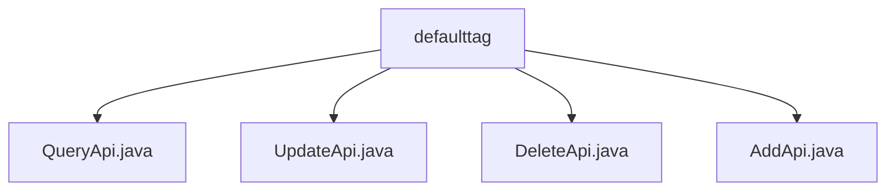

# 基础信息

|      |      |
|------|------|
| 名称 | defaulttag |
| 编码语言 | .java |
| 代码路径 | WeFe/manager/manager-service/src/main/java/com/welab/wefe/manager/service/api/defaulttag |
| 包名 | docs.manager.manager-service.src.main.java.com.welab.wefe.manager.service.api.defaulttag |
| 概述说明 | QueryApi类用于查询默认标签数据，路径为data_resource/default_tag/query，继承AbstractApi，通过MongoDB查询并转换结果。UpdateApi类处理标签更新请求，路径为data_resource/default_tag/update，检查标签存在性后更新。DeleteApi类处理标签删除请求，调用服务删除指定标签。AddApi类处理标签添加请求，检查存在性后创建新标签。 |

# 说明

## 概述  
该模块提供默认标签的CRUD操作API，包括查询、更新、删除和添加功能，通过MongoDB存储和ContractService实现数据管理。接口规范统一继承AbstractApi，输入输出使用特定DTO（如DataResourceDefaultTagAddInput/JObject），路径均以"data_resource/default_tag"为前缀。关键数据结构包含DataResourceType枚举和ApiDataResourceDefaultTagQueryOutput等转换对象。外部依赖包括MongoRepo持久层和ContractService业务服务。例如查询API通过convertDataResourceType处理类型转换，类似数据映射器模式。

## 主要业务场景  
模块支持标签全生命周期管理：查询时按DataResourceType过滤MongoDB结果；增删改操作通过ContractService校验并同步数据，类似事务脚本模式。典型流程为：添加前检查标签唯一性，更新/删除前验证存在性，异常统一转换为系统错误码。集成案例包括标签管理界面调用AddApi创建标签，或ETL服务使用QueryApi获取默认标签。所有API均无登录要求，适用于内部系统间自动化集成。

### 包内部结构视图

该流程图展示了defaulttag目录下的四个API文件：QueryApi、UpdateApi、DeleteApi和AddApi。这些文件都属于同一个层级，直接位于defaulttag文件夹中，没有更深层次的嵌套结构。每个文件代表一个独立的API功能模块，用于处理默认标签的不同操作请求。

# 文件列表

| 名称   | 类型  | 说明 |
|-------|------|-------------|
| [QueryApi.java](QueryApi.md) | file | 查询API类，通过MongoDB获取数据资源默认标签列表，支持按类型筛选并返回JSON格式结果。输入含资源类型参数，处理时进行类型转换。 |
| [UpdateApi.java](UpdateApi.md) | file | 更新默认标签的API类，检查标签是否存在后调用服务更新，处理异常并返回结果。 |
| [DeleteApi.java](DeleteApi.md) | file | DeleteApi类处理删除默认标签请求，调用dataResourceDefaultTagContractService的deleteByTagId方法，捕获异常并返回成功或错误状态。 |
| [AddApi.java](AddApi.md) | file | 这是一个Java类AddApi，用于添加默认标签。它检查标签是否存在，不存在则创建新标签，存在则抛出异常。使用MongoDB存储和验证数据。 |

