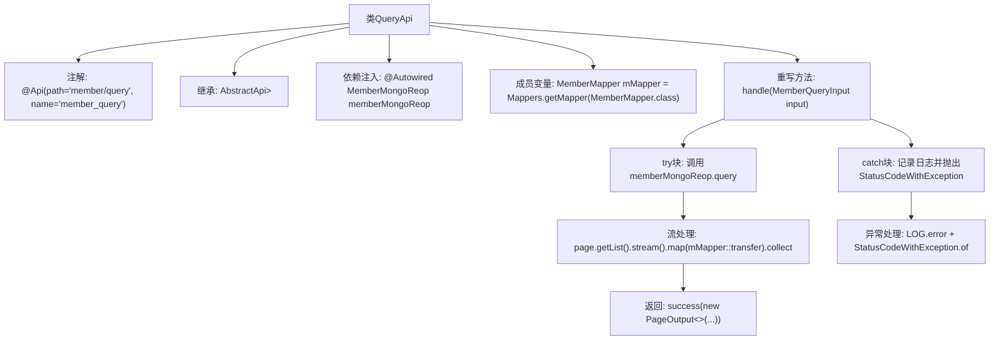

# 基础信息

|      |      |
|------|------|
| 名称 | QueryApi |
| 编码语言 | .java |
| 代码路径 | WeFe/manager/manager-service/src/main/java/com/welab/wefe/manager/service/api/member/QueryApi.java |
| 包名 | com.welab.wefe.manager.service.api.member |
| 依赖项 | ['com.welab.wefe.common.StatusCode', 'com.welab.wefe.common.data.mongodb.dto.PageOutput', 'com.welab.wefe.common.data.mongodb.entity.union.Member', 'com.welab.wefe.common.data.mongodb.repo.MemberMongoReop', 'com.welab.wefe.common.exception.StatusCodeWithException', 'com.welab.wefe.common.web.api.base.AbstractApi', 'com.welab.wefe.common.web.api.base.Api', 'com.welab.wefe.common.web.dto.ApiResult', 'com.welab.wefe.manager.service.dto.member.MemberQueryInput', 'com.welab.wefe.manager.service.dto.member.MemberQueryOutput', 'com.welab.wefe.manager.service.mapper.MemberMapper', 'org.mapstruct.factory.Mappers', 'org.springframework.beans.factory.annotation.Autowired', 'java.util.List', 'java.util.stream.Collectors'] |
| 概述说明 | QueryApi类处理分页查询成员信息，调用memberMongoReop查询数据，通过MemberMapper转换结果，成功返回分页数据，异常时记录日志并抛出系统错误。 |

# 说明

这是一个名为QueryApi的Java类，用于分页查询会员信息。它继承自AbstractApi，处理MemberQueryInput输入并返回PageOutput<MemberQueryOutput>结果。类中注入了MemberMongoReop用于数据库操作，并使用MemberMapper进行对象转换。主要逻辑在handle方法中：调用memberMongoReop.query进行分页查询，将结果转换为MemberQueryOutput列表，最后返回包含分页信息的成功结果。若发生异常，会记录错误日志并抛出系统错误状态码。

# 类列表 Class Summary

| 名称   | 类型  | 说明 |
|-------|------|-------------|
| QueryApi | class | QueryApi类处理分页查询成员信息，调用memberMongoReop查询数据，通过MemberMapper转换结果，返回分页输出或错误信息。 |


## 类 QueryApi

|      |      |
|------|------|
| 访问范围 | @Api(path = "member/query", name = "member_query");public |
| 类型 | class |
| 名称 | QueryApi |
| 说明 | QueryApi类处理分页查询成员信息，调用memberMongoReop查询数据，通过MemberMapper转换结果，返回分页输出或错误信息。 |


### UML类图

```mermaid
classDiagram
    class QueryApi {
        -MemberMongoReop memberMongoReop
        -MemberMapper mMapper
        +handle(MemberQueryInput input) ApiResult~PageOutput~MemberQueryOutput~~
    }
    class AbstractApi~T, R~ {
        <<Abstract>>
        +handle(T input) ApiResult~R~
    }
    class MemberQueryInput {
        +Integer getPageIndex()
        +Integer getPageSize()
        +String getId()
        +String getName()
        +Boolean getHidden()
        +Boolean getFreezed()
        +Boolean getLostContact()
        +Integer getStatus()
    }
    class PageOutput~T~ {
        +Integer pageIndex
        +Integer total
        +Integer pageSize
        +Integer totalPage
        +List~T~ list
    }
    class MemberQueryOutput
    class MemberMongoReop {
        +query(..) PageOutput~Member~
    }
    class MemberMapper {
        +transfer(Member) MemberQueryOutput
    }
    class Member
    class ApiResult~T~
    class StatusCodeWithException

    QueryApi --|> AbstractApi~MemberQueryInput, PageOutput~MemberQueryOutput~~ : 继承
    QueryApi --> MemberMongoReop : 依赖
    QueryApi --> MemberMapper : 依赖
    MemberMapper --> Member : 依赖
    MemberMapper --> MemberQueryOutput : 依赖
    MemberMongoReop --> Member : 依赖
    MemberMongoReop --> PageOutput~Member~ : 依赖
    AbstractApi ..> ApiResult : 依赖
    AbstractApi ..> StatusCodeWithException : 依赖
```

这段代码展示了一个查询会员信息的API实现类QueryApi，它继承自泛型抽象类AbstractApi。主要功能是通过MemberMongoReop从MongoDB分页查询会员数据，再通过MemberMapper将Member实体转换为MemberQueryOutputDTO。类图清晰地展示了各组件间的依赖关系，包括数据访问层、DTO转换层和异常处理机制，体现了清晰的分层架构设计。核心流程包含分页查询、数据转换和结果封装，同时处理了异常情况。


### 内部方法调用关系图



该流程图展示了QueryApi类的核心结构和工作流程。类通过继承AbstractApi实现分页查询功能，主要处理流程包括：通过MongoDB仓库查询数据、使用MapStruct转换实体、构建分页返回结果。异常时记录错误日志并返回系统错误状态码，体现了完整的请求处理链路和错误处理机制。

### 字段列表 Field List

| 名称  | 类型  | 说明 |
|-------|-------|------|
| mMapper = Mappers.getMapper(MemberMapper.class) | MemberMapper | 使用MapStruct的Mappers获取MemberMapper接口的实现类实例。 |
| memberMongoReop | MemberMongoReop | 自动注入MemberMongoReop成员库实例。 |

### 方法列表

| 名称  | 类型  | 说明 |
|-------|-------|------|
| handle | ApiResult<PageOutput<MemberQueryOutput>> | 该方法处理分页查询成员信息，调用memberMongoReop.query获取数据，转换后返回分页结果。异常时记录日志并抛出系统错误。 |


