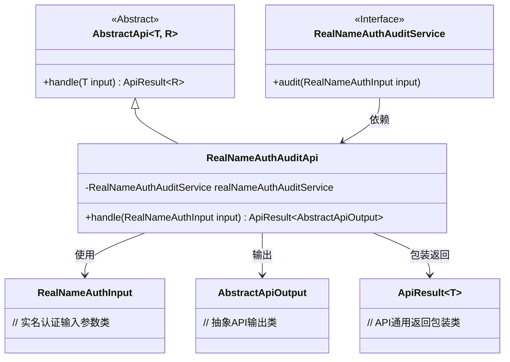
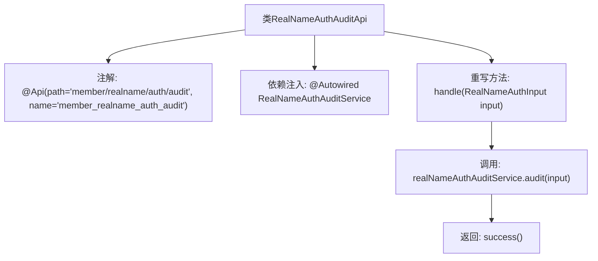

# 基础信息

|      |      |
|------|------|
| 名称 | RealNameAuthAuditApi |
| 编码语言 | .java |
| 代码路径 | WeFe/manager/manager-service/src/main/java/com/welab/wefe/manager/service/api/member/RealNameAuthAuditApi.java |
| 包名 | com.welab.wefe.manager.service.api.member |
| 依赖项 | ['org.springframework.beans.factory.annotation.Autowired', 'com.welab.wefe.common.exception.StatusCodeWithException', 'com.welab.wefe.common.web.api.base.AbstractApi', 'com.welab.wefe.common.web.api.base.Api', 'com.welab.wefe.common.web.dto.AbstractApiOutput', 'com.welab.wefe.common.web.dto.ApiResult', 'com.welab.wefe.manager.service.dto.member.RealNameAuthInput', 'com.welab.wefe.manager.service.service.RealNameAuthAuditService'] |
| 概述说明 | 实名认证审核API类，处理成员实名认证审核请求，调用审核服务并返回结果。 |

# 说明

这是一个名为RealNameAuthAuditApi的API类，路径为member/realname/auth/audit，用于处理会员实名认证审核。它继承自AbstractApi基类，泛型参数指定了输入类型RealNameAuthInput和输出类型AbstractApiOutput。类中注入了RealNameAuthAuditService服务，并通过重写handle方法调用该服务的audit方法完成审核逻辑，审核成功时返回成功结果。整个类专注于实现实名认证审核的核心功能。

# 类列表 Class Summary

| 名称   | 类型  | 说明 |
|-------|------|-------------|
| RealNameAuthAuditApi | class | 这是一个实名认证审核API类，路径为"member/realname/auth/audit"，继承自AbstractApi，使用RealNameAuthAuditService处理审核请求，返回成功结果。 |

## 类 RealNameAuthAuditApi

|      |      |
|------|------|
| 访问范围 | @Api(path = "member/realname/auth/audit", name = "member_realname_auth_audit");public |
| 类型 | class |
| 名称 | RealNameAuthAuditApi |
| 说明 | 这是一个实名认证审核API类，路径为"member/realname/auth/audit"，继承自AbstractApi，使用RealNameAuthAuditService处理审核请求，返回成功结果。 |

### UML类图

类图描述：该图展示了实名认证审核API的类结构，其中RealNameAuthAuditApi继承自泛型抽象类AbstractApi，依赖RealNameAuthAuditService接口实现审核逻辑。输入使用RealNameAuthInput参数，输出包装为ApiResult<AbstractApiOutput>。整体采用模板方法模式，通过抽象类规范处理流程，具体实现由子类完成。

### 内部方法调用关系图

这段代码展示了一个实名认证审核API类，继承自AbstractApi基类，通过@Api注解定义接口路径和名称。核心流程是handle方法调用realNameAuthAuditService的audit服务进行审核操作，最后返回成功结果。类结构清晰，通过Spring依赖注入实现服务调用，符合API层的基本设计模式。

### 字段列表 Field List

| 名称  | 类型  | 说明 |
|-------|-------|------|
| realNameAuthAuditService | RealNameAuthAuditService | 使用@Autowired自动注入RealNameAuthAuditService实例。 |

### 方法列表

| 名称  | 类型  | 说明 |
|-------|-------|------|
| handle | ApiResult<AbstractApiOutput> | 代码重写handle方法，调用realNameAuthAuditService审核输入参数，成功后返回ApiResult。 |

