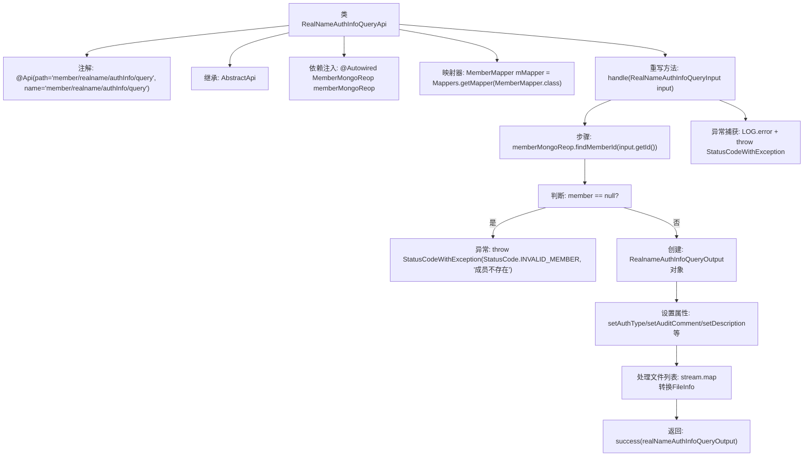

# 基础信息

|      |      |
|------|------|
| 名称 | RealNameAuthInfoQueryApi |
| 编码语言 | .java |
| 代码路径 | WeFe/manager/manager-service/src/main/java/com/welab/wefe/manager/service/api/member/RealNameAuthInfoQueryApi.java |
| 包名 | com.welab.wefe.manager.service.api.member |
| 依赖项 | ['com.welab.wefe.common.StatusCode', 'com.welab.wefe.common.data.mongodb.dto.member.RealnameAuthInfoQueryOutput', 'com.welab.wefe.common.data.mongodb.entity.union.Member', 'com.welab.wefe.common.data.mongodb.entity.union.ext.RealnameAuthFileInfo', 'com.welab.wefe.common.data.mongodb.repo.MemberMongoReop', 'com.welab.wefe.common.exception.StatusCodeWithException', 'com.welab.wefe.common.web.api.base.AbstractApi', 'com.welab.wefe.common.web.api.base.Api', 'com.welab.wefe.common.web.dto.ApiResult', 'com.welab.wefe.manager.service.dto.member.RealNameAuthInfoQueryInput', 'com.welab.wefe.manager.service.mapper.MemberMapper', 'org.mapstruct.factory.Mappers', 'org.springframework.beans.factory.annotation.Autowired', 'java.util.ArrayList', 'java.util.List', 'java.util.stream.Collectors'] |
| 概述说明 | RealNameAuthInfoQueryApi用于查询成员实名认证信息，包括认证类型、审核状态、证书内容及文件信息，若成员不存在则抛出异常。 |

# 说明

该代码定义了一个名为RealNameAuthInfoQueryApi的API类，用于查询成员实名认证信息。它继承自AbstractApi，接受RealNameAuthInfoQueryInput输入并返回RealnameAuthInfoQueryOutput输出。主要功能包括：通过成员ID从MongoDB中查询成员信息，若不存在则抛出异常；从成员扩展信息中提取实名认证相关字段（如认证类型、审核意见、状态等）和证书信息（如证书内容、序列号、状态等）；处理实名认证文件信息列表，转换为输出格式的文件信息列表；若出现异常则记录错误日志并返回系统错误。

# 类列表 Class Summary

| 名称   | 类型  | 说明 |
|-------|------|-------------|
| RealNameAuthInfoQueryApi | class | 查询成员实名认证信息的API，通过成员ID从MongoDB获取数据，返回认证类型、审核状态、证书及文件列表等信息。异常时抛出错误提示。 |


## 类 RealNameAuthInfoQueryApi

|      |      |
|------|------|
| 访问范围 | @Api(path = "member/realname/authInfo/query", name = "member/realname/authInfo/query");public |
| 类型 | class |
| 名称 | RealNameAuthInfoQueryApi |
| 说明 | 查询成员实名认证信息的API，通过成员ID从MongoDB获取数据，返回认证类型、审核状态、证书及文件列表等信息。异常时抛出错误提示。 |


### UML类图

```mermaid
classDiagram
    class AbstractApi~T, R~ {
        <<Abstract>>
        +handle(T input) ApiResult~R~
    }

    class RealNameAuthInfoQueryApi {
        -MemberMongoReop memberMongoReop
        -MemberMapper mMapper
        +handle(RealNameAuthInfoQueryInput input) ApiResult~RealnameAuthInfoQueryOutput~
    }

    class RealNameAuthInfoQueryInput {
        +String id
    }

    class RealnameAuthInfoQueryOutput {
        +String authType
        +String auditComment
        +String description
        +String principalName
        +String realNameAuthStatus
        +String certPemContent
        +String certRequestContent
        +String certRequestId
        +String certSerialNumber
        +String certStatus
        +Boolean memberGatewayTlsEnable
        +List~FileInfo~ fileInfoList
        +class FileInfo {
            +String filename
            +String fileId
        }
    }

    class Member {
        +ExtJson extJson
    }

    class ExtJson {
        +String authType
        +String auditComment
        +String description
        +String principalName
        +String realNameAuthStatus
        +String certPemContent
        +String certRequestContent
        +String certRequestId
        +String certSerialNumber
        +String certStatus
        +Boolean memberGatewayTlsEnable
        +List~RealnameAuthFileInfo~ realnameAuthFileInfoList
    }

    class RealnameAuthFileInfo {
        +String filename
        +String fileId
    }

    class MemberMongoReop {
        +findMemberId(String id) Member
    }

    class MemberMapper {
        <<Mapper>>
    }

    AbstractApi~T, R~ <|-- RealNameAuthInfoQueryApi
    RealNameAuthInfoQueryApi --> MemberMongoReop : 依赖
    RealNameAuthInfoQueryApi --> MemberMapper : 依赖
    RealNameAuthInfoQueryApi --> RealNameAuthInfoQueryInput : 处理输入
    RealNameAuthInfoQueryApi --> RealnameAuthInfoQueryOutput : 生成输出
    Member --> ExtJson : 包含
    ExtJson --> RealnameAuthFileInfo : 包含
    RealnameAuthInfoQueryOutput --> RealnameAuthInfoQueryOutput.FileInfo : 包含
```

这段代码展示了一个实名认证信息查询API的实现，继承自泛型抽象类AbstractApi。RealNameAuthInfoQueryApi通过MemberMongoReop查询成员信息，使用MemberMapper进行对象转换，处理RealNameAuthInfoQueryInput输入参数，最终返回包含认证状态、证书信息和文件列表的RealnameAuthInfoQueryOutput结果。整个流程包含异常处理和日志记录，涉及多个数据实体类的交互。


### 内部方法调用关系图



该流程图描述了RealNameAuthInfoQueryApi类的核心处理逻辑。类通过继承AbstractApi实现实名认证信息查询功能，主要流程包括：通过ID查询成员信息、校验成员是否存在、构建输出对象并填充认证相关数据（包含证书信息和文件列表处理）、最终返回结果或异常。整个过程体现了对MongoDB数据访问、DTO属性映射、集合流式处理以及异常状态码封装的完整处理链。

### 字段列表 Field List

| 名称  | 类型  | 说明 |
|-------|-------|------|
| memberMongoReop | MemberMongoReop | 使用@Autowired自动注入MemberMongoReop成员变量。 |
| mMapper = Mappers.getMapper(MemberMapper.class) | MemberMapper | 使用MapStruct的Mappers获取MemberMapper接口的实现类实例。 |

### 方法列表

| 名称  | 类型  | 说明 |
|-------|-------|------|
| handle | ApiResult<RealnameAuthInfoQueryOutput> | 方法处理实名认证信息查询，验证成员存在后提取认证类型、审核意见等数据，包括证书内容和文件信息列表，成功返回结果，异常时记录错误并抛出系统错误。 |


