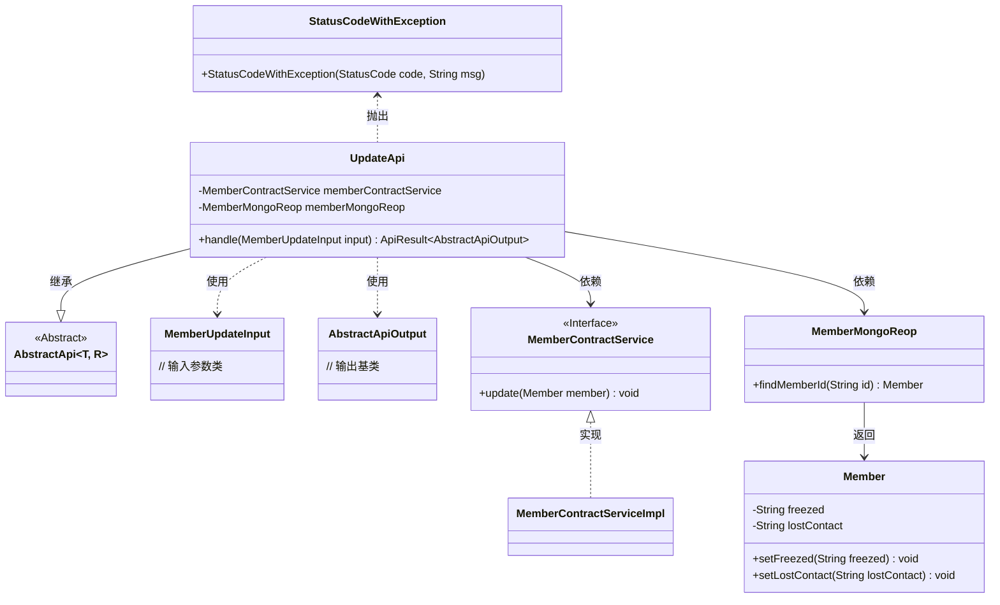
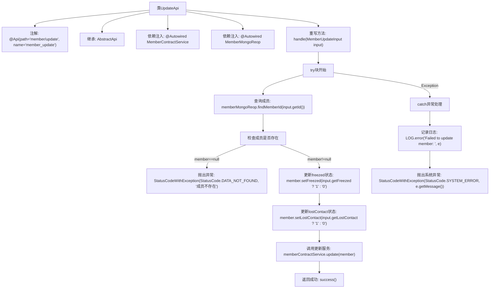

# 基础信息

|      |      |
|------|------|
| 名称 | UpdateApi |
| 编码语言 | .java |
| 代码路径 | WeFe/manager/manager-service/src/main/java/com/welab/wefe/manager/service/api/member/UpdateApi.java |
| 包名 | com.welab.wefe.manager.service.api.member |
| 依赖项 | ['com.welab.wefe.common.StatusCode', 'com.welab.wefe.common.data.mongodb.entity.union.Member', 'com.welab.wefe.common.data.mongodb.repo.MemberMongoReop', 'com.welab.wefe.common.exception.StatusCodeWithException', 'com.welab.wefe.common.web.api.base.AbstractApi', 'com.welab.wefe.common.web.api.base.Api', 'com.welab.wefe.common.web.dto.AbstractApiOutput', 'com.welab.wefe.common.web.dto.ApiResult', 'com.welab.wefe.manager.service.dto.member.MemberUpdateInput', 'com.welab.wefe.manager.service.service.MemberContractService', 'org.springframework.beans.factory.annotation.Autowired'] |
| 概述说明 | 成员更新API，通过ID查找成员并更新冻结和失联状态，处理异常返回相应状态码。 |

# 说明

该代码定义了一个名为UpdateApi的类，用于处理成员信息更新请求。类路径为member/update，依赖MemberContractService和MemberMongoReop服务。主要逻辑是通过输入参数MemberUpdateInput查找并更新成员信息，支持更新freezed和lostContact状态字段。若成员不存在则抛出DATA_NOT_FOUND异常，系统错误时抛出SYSTEM_ERROR异常。成功执行后返回抽象API输出结果。

# 类列表 Class Summary

| 名称   | 类型  | 说明 |
|-------|------|-------------|
| UpdateApi | class | 成员更新API类，处理成员信息更新。通过ID查找成员，更新冻结和失联状态，调用服务层保存。异常时返回错误状态码。 |

## 类 UpdateApi

|      |      |
|------|------|
| 访问范围 | @Api(path = "member/update", name = "member_update");public |
| 类型 | class |
| 名称 | UpdateApi |
| 说明 | 成员更新API类，处理成员信息更新。通过ID查找成员，更新冻结和失联状态，调用服务层保存。异常时返回错误状态码。 |

### UML类图

类图描述：该图展示了UpdateApi类继承自泛型抽象类AbstractApi，并依赖MemberContractService接口和MemberMongoReop类进行成员数据操作。MemberUpdateInput作为输入参数，AbstractApiOutput作为输出基类。Member类包含状态字段，StatusCodeWithException用于异常处理。整体结构体现了API处理流程中的数据流转和异常处理机制。

### 内部方法调用关系图

这段代码流程图展示了UpdateApi类的完整处理流程。该类是一个带有API注解的成员更新服务，继承自AbstractApi基类。主要流程包括：通过memberMongoReop查询成员信息，进行空值检查，根据输入参数更新成员状态字段(freezed和lostContact)，最后通过memberContractService执行更新操作。整个过程包含异常处理机制，当出现错误时会记录日志并抛出相应的状态码异常。成功执行后会返回一个成功的ApiResult对象。

### 字段列表 Field List

| 名称  | 类型  | 说明 |
|-------|-------|------|
| memberContractService | MemberContractService | 使用@Autowired自动注入MemberContractService实例。 |
| memberMongoReop | MemberMongoReop | 代码片段使用@Autowired注解自动注入MemberMongoReop类型的私有成员变量memberMongoReop。 |

### 方法列表

| 名称  | 类型  | 说明 |
|-------|-------|------|
| handle | ApiResult<AbstractApiOutput> | 处理成员更新请求，检查成员是否存在，更新冻结和失联状态，捕获异常并返回结果。 |

