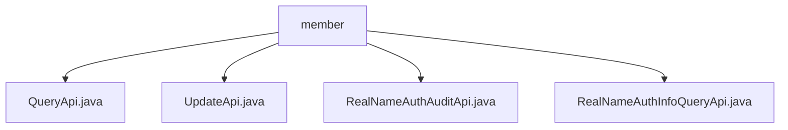

# 基础信息

|      |      |
|------|------|
| 名称 | member |
| 编码语言 | .java |
| 代码路径 | WeFe/manager/manager-service/src/main/java/com/welab/wefe/manager/service/api/member |
| 包名 | docs.manager.manager-service.src.main.java.com.welab.wefe.manager.service.api.member |
| 概述说明 | QueryApi处理会员分页查询，UpdateApi更新会员信息，RealNameAuthAuditApi处理实名认证审核，RealNameAuthInfoQueryApi查询实名认证信息。均继承AbstractApi，含数据库操作和异常处理。 |

# 说明

## 概述  
该模块核心职责为会员信息管理与实名认证服务，包括分页查询、状态更新及实名认证审核等功能。接口规范遵循统一模式：继承AbstractApi基类，接收特定Input参数并返回标准Output，异常时抛出系统错误码。关键数据结构涉及MemberQueryOutput、MemberUpdateInput及RealnameAuthInfoQueryOutput等。外部依赖包括MemberMongoReop（MongoDB操作）、MemberContractService（合约服务）及RealNameAuthAuditService（审核服务）。例如QueryApi通过MemberMapper转换查询结果，UpdateApi支持更新freezed状态字段。

## 主要业务场景  
模块主要处理会员全生命周期管理，类似CRM系统中的核心服务。业务流程包括：分页查询会员列表（QueryApi）、更新会员状态（UpdateApi）、实名认证审核（RealNameAuthAuditApi）及认证信息查询（RealNameAuthInfoQueryApi）。交互模式均为RESTful风格，例如RealNameAuthAuditApi通过handle方法调用审核服务。典型应用场景如会员管理系统后台操作，API类型涵盖查询类（如QueryApi）和变更类（如UpdateApi），集成案例包括从MongoDB提取数据并转换输出格式。

### 包内部结构视图

该流程图展示了manager-service项目中member目录下的API文件结构。根节点为member文件夹，包含四个Java接口文件：QueryApi、UpdateApi、RealNameAuthAuditApi和RealNameAuthInfoQueryApi，这些文件均直接隶属于member目录层级，没有更深层的嵌套关系。

# 文件列表

| 名称   | 类型  | 说明 |
|-------|------|-------------|
| [QueryApi.java](QueryApi.md) | file | QueryApi类处理分页查询成员信息，调用memberMongoReop查询数据，通过MemberMapper转换结果，成功返回分页数据，异常时记录日志并抛出系统错误。 |
| [UpdateApi.java](UpdateApi.md) | file | 成员更新API，通过ID查找成员并更新冻结和失联状态，处理异常返回相应状态码。 |
| [RealNameAuthAuditApi.java](RealNameAuthAuditApi.md) | file | 实名认证审核API类，处理成员实名认证审核请求，调用审核服务并返回结果。 |
| [RealNameAuthInfoQueryApi.java](RealNameAuthInfoQueryApi.md) | file | RealNameAuthInfoQueryApi用于查询成员实名认证信息，包括认证类型、审核状态、证书内容及文件信息，若成员不存在则抛出异常。 |

