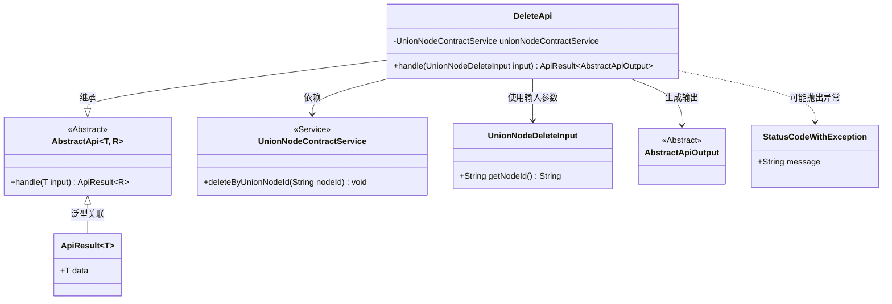
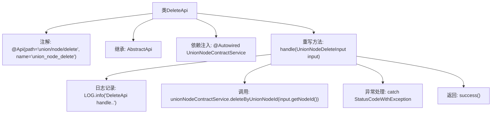

# 基础信息

|      |      |
|------|------|
| 名称 | DeleteApi |
| 编码语言 | .java |
| 代码路径 | WeFe/manager/manager-service/src/main/java/com/welab/wefe/manager/service/api/union/DeleteApi.java |
| 包名 | com.welab.wefe.manager.service.api.union |
| 依赖项 | ['com.welab.wefe.common.StatusCode', 'com.welab.wefe.common.exception.StatusCodeWithException', 'com.welab.wefe.common.web.api.base.AbstractApi', 'com.welab.wefe.common.web.api.base.Api', 'com.welab.wefe.common.web.dto.AbstractApiOutput', 'com.welab.wefe.common.web.dto.ApiResult', 'com.welab.wefe.manager.service.dto.union.UnionNodeDeleteInput', 'com.welab.wefe.manager.service.service.UnionNodeContractService', 'org.springframework.beans.factory.annotation.Autowired'] |
| 概述说明 | 这是一个删除联合节点的API类，路径为union/node/delete，通过调用unionNodeContractService的deleteByUnionNodeId方法删除指定节点ID的数据，处理异常并返回成功结果。 |

# 说明

这是一个名为DeleteApi的Java类，用于处理删除联合节点的API请求。该类继承自AbstractApi，接收UnionNodeDeleteInput作为输入参数，返回AbstractApiOutput类型结果。类中注入了UnionNodeContractService服务，通过调用其deleteByUnionNodeId方法实现节点删除功能。处理过程中会记录日志，并捕获可能抛出的StatusCodeWithException异常，将其转换为系统错误状态码后重新抛出。成功执行后会返回成功响应。

# 类列表 Class Summary

| 名称   | 类型  | 说明 |
|-------|------|-------------|
| DeleteApi | class | 删除API类，路径为union/node/delete，处理节点删除请求，调用UnionNodeContractService删除指定节点，捕获异常并返回系统错误状态码。 |

## 类 DeleteApi

|      |      |
|------|------|
| 访问范围 | @Api(path = "union/node/delete", name = "union_node_delete");public |
| 类型 | class |
| 名称 | DeleteApi |
| 说明 | 删除API类，路径为union/node/delete，处理节点删除请求，调用UnionNodeContractService删除指定节点，捕获异常并返回系统错误状态码。 |

### UML类图

这段代码展示了一个删除API的实现类DeleteApi，它继承自泛型抽象类AbstractApi，处理UnionNodeDeleteInput类型的输入并返回AbstractApiOutput类型的结果。类图清晰地呈现了继承关系、服务依赖和异常处理机制，其中UnionNodeContractService提供核心删除功能，StatusCodeWithException用于封装系统错误。整个结构体现了Spring Boot中典型的API层实现模式，通过泛型抽象类减少重复代码，同时保持类型安全性。

### 内部方法调用关系图

这段代码是一个基于Spring框架的API类，用于处理节点删除请求。流程图展示了类结构、依赖注入、核心方法调用链和异常处理流程。主要逻辑是通过UnionNodeContractService删除指定节点ID的数据，并封装了异常处理和成功响应的返回逻辑。注解定义了API路径和名称，继承的泛型类规范了输入输出类型。

### 字段列表 Field List

| 名称  | 类型  | 说明 |
|-------|-------|------|
| unionNodeContractService | UnionNodeContractService | 自动注入UnionNodeContractService服务实例。 |

### 方法列表

| 名称  | 类型  | 说明 |
|-------|-------|------|
| handle | ApiResult<AbstractApiOutput> | 该方法处理删除联合节点请求，调用服务删除指定节点ID，捕获异常并返回系统错误或成功结果。 |

