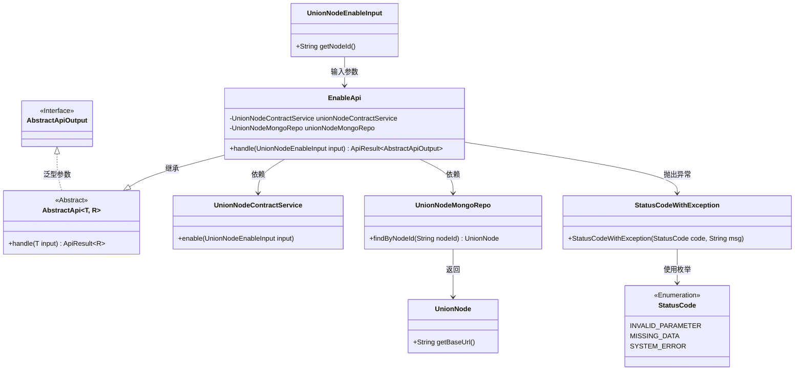
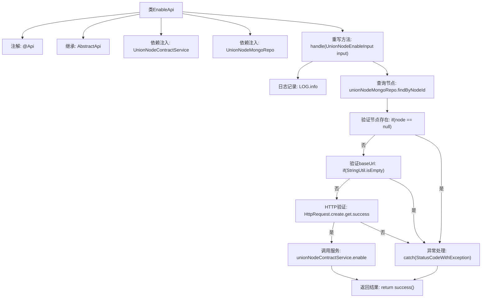

# 基础信息

|      |      |
|------|------|
| 名称 | EnableApi |
| 编码语言 | .java |
| 代码路径 | WeFe/manager/manager-service/src/main/java/com/welab/wefe/manager/service/api/union/EnableApi.java |
| 包名 | com.welab.wefe.manager.service.api.union |
| 依赖项 | ['com.welab.wefe.common.StatusCode', 'com.welab.wefe.common.data.mongodb.entity.union.UnionNode', 'com.welab.wefe.common.data.mongodb.repo.UnionNodeMongoRepo', 'com.welab.wefe.common.exception.StatusCodeWithException', 'com.welab.wefe.common.http.HttpRequest', 'com.welab.wefe.common.util.StringUtil', 'com.welab.wefe.common.web.api.base.AbstractApi', 'com.welab.wefe.common.web.api.base.Api', 'com.welab.wefe.common.web.dto.AbstractApiOutput', 'com.welab.wefe.common.web.dto.ApiResult', 'com.welab.wefe.manager.service.dto.union.UnionNodeEnableInput', 'com.welab.wefe.manager.service.service.UnionNodeContractService', 'org.springframework.beans.factory.annotation.Autowired'] |
| 概述说明 | EnableApi处理节点启用请求，检查节点存在性、baseUrl有效性，调用服务启用节点。异常时返回错误状态码。 |

# 说明

EnableApi类是一个处理节点启用请求的API，路径为union/node/enable。它继承自AbstractApi，接收UnionNodeEnableInput输入并返回AbstractApiOutput。类中注入了UnionNodeContractService和UnionNodeMongoRepo服务。handle方法首先通过nodeId从MongoDB查找节点，若不存在或baseUrl为空则抛出异常。接着验证baseUrl的有效性，无效则抛出异常。最后调用unionNodeContractService.enable方法启用节点。处理过程中捕获异常并转换为系统错误返回。

# 类列表 Class Summary

| 名称   | 类型  | 说明 |
|-------|------|-------------|
| EnableApi | class | EnableApi类处理节点启用请求，验证节点ID和baseUrl有效性，调用服务启用节点，捕获异常并返回结果。 |

## 类 EnableApi

|      |      |
|------|------|
| 访问范围 | @Api(path = "union/node/enable", name = "union_node_enable");public |
| 类型 | class |
| 名称 | EnableApi |
| 说明 | EnableApi类处理节点启用请求，验证节点ID和baseUrl有效性，调用服务启用节点，捕获异常并返回结果。 |

### UML类图

该类图展示了EnableApi的结构及其关联关系。EnableApi继承自泛型抽象类AbstractApi，处理UnionNodeEnableInput输入并返回ApiResult~AbstractApiOutput~。它依赖UnionNodeContractService和UnionNodeMongoRepo进行业务操作，其中MongoRepo返回UnionNode实体。过程中可能抛出StatusCodeWithException异常，该异常使用StatusCode枚举表示错误类型。整体实现了节点启用功能的业务逻辑，包含参数校验、数据验证和远程调用等关键步骤。

### 内部方法调用关系图

该流程图描述了EnableApi类的处理流程，从接收输入参数开始，通过MongoDB查询节点信息，依次验证节点存在性、baseUrl有效性和HTTP可达性，任一验证失败都会抛出异常。所有验证通过后调用合约服务启用节点，最终返回成功结果。流程包含完整的异常处理路径和主成功路径，体现了防御式编程思想。

### 字段列表 Field List

| 名称  | 类型  | 说明 |
|-------|-------|------|
| unionNodeMongoRepo | UnionNodeMongoRepo | 使用@Autowired自动注入UnionNodeMongoRepo实例。 |
| unionNodeContractService | UnionNodeContractService | 自动注入UnionNodeContractService服务实例。 |

### 方法列表

| 名称  | 类型  | 说明 |
|-------|-------|------|
| handle | ApiResult<AbstractApiOutput> | 处理联盟节点启用请求，检查节点ID和基础URL有效性，调用服务启用节点，捕获异常并返回结果。 |

