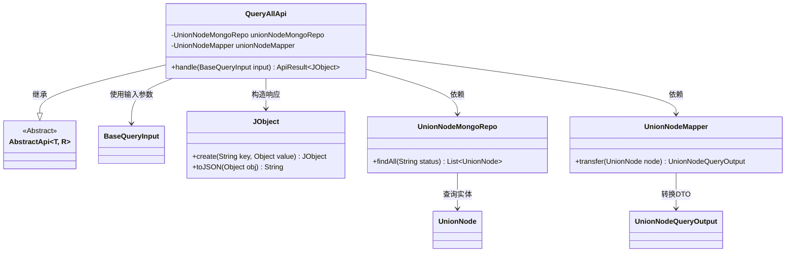
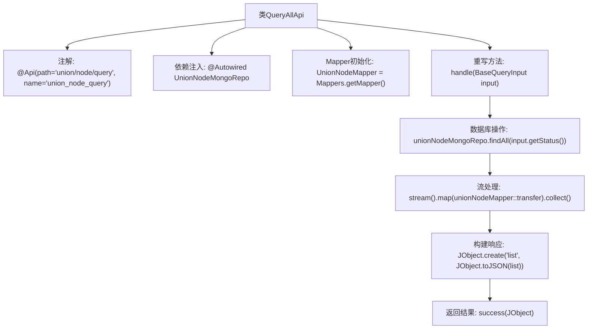

# 基础信息

|      |      |
|------|------|
| 名称 | QueryAllApi |
| 编码语言 | .java |
| 代码路径 | WeFe/manager/manager-service/src/main/java/com/welab/wefe/manager/service/api/union/QueryAllApi.java |
| 包名 | com.welab.wefe.manager.service.api.union |
| 依赖项 | ['com.welab.wefe.common.data.mongodb.repo.UnionNodeMongoRepo', 'com.welab.wefe.common.util.JObject', 'com.welab.wefe.common.web.api.base.AbstractApi', 'com.welab.wefe.common.web.api.base.Api', 'com.welab.wefe.common.web.dto.ApiResult', 'com.welab.wefe.manager.service.dto.base.BaseQueryInput', 'com.welab.wefe.manager.service.dto.union.UnionNodeQueryOutput', 'com.welab.wefe.manager.service.mapper.UnionNodeMapper', 'org.mapstruct.factory.Mappers', 'org.springframework.beans.factory.annotation.Autowired', 'java.util.List', 'java.util.stream.Collectors'] |
| 概述说明 | 定义了一个查询API类QueryAllApi，通过MongoDB仓库unionNodeMongoRepo获取数据，使用Mapper转换后返回JSON格式结果。路径为union/node/query。 |

# 说明

这是一个名为QueryAllApi的Java类，继承自AbstractApi，用于处理路径为union/node/query的API请求。类中注入了UnionNodeMongoRepo用于数据库操作，并使用UnionNodeMapper进行对象转换。主要功能是通过findAll方法查询指定状态的UnionNode数据，转换为UnionNodeQueryOutput对象列表后，封装为JSON格式返回。输入参数为BaseQueryInput，输出结果为包含列表数据的ApiResult<JObject>。

# 类列表 Class Summary

| 名称   | 类型  | 说明 |
|-------|------|-------------|
| QueryAllApi | class | 查询API类，路径为union/node/query，继承AbstractApi，使用MongoDB查询UnionNode数据，通过Mapper转换结果后返回JSON列表。 |

## 类 QueryAllApi

|      |      |
|------|------|
| 访问范围 | @Api(path = "union/node/query", name = "union_node_query");public |
| 类型 | class |
| 名称 | QueryAllApi |
| 说明 | 查询API类，路径为union/node/query，继承AbstractApi，使用MongoDB查询UnionNode数据，通过Mapper转换结果后返回JSON列表。 |

### UML类图

该代码实现了一个查询API，继承自泛型抽象类AbstractApi，通过MongoDB仓库获取数据后，使用Mapper转换为输出对象，最终包装为JSON格式返回。类图展示了核心依赖关系，包括数据访问层、对象映射层和输入输出类型，体现了分层架构和依赖注入的设计模式。QueryAllApi作为入口类，协调各组件完成查询-转换-响应的完整流程。

### 内部方法调用关系图

这段代码是一个Spring风格的API类，继承自AbstractApi，用于处理联合节点查询请求。主要流程包括：通过MongoDB仓库查询指定状态的节点数据，使用MapStruct映射器转换实体为DTO对象，最后将结果列表封装为JSON格式返回。注解定义了API路径和名称，依赖注入的MongoRepo负责数据访问，流式处理完成数据转换，最终通过JObject构建标准化响应结构。

### 字段列表 Field List

| 名称  | 类型  | 说明 |
|-------|-------|------|
| unionNodeMapper = Mappers.getMapper(UnionNodeMapper.class) | UnionNodeMapper | 声明一个受保护的UnionNodeMapper实例，通过Mappers.getMapper方法初始化。 |
| unionNodeMongoRepo | UnionNodeMongoRepo | 使用@Autowired自动注入UnionNodeMongoRepo依赖。 |

### 方法列表

| 名称  | 类型  | 说明 |
|-------|-------|------|
| handle | ApiResult<JObject> | 处理查询请求，从MongoDB获取指定状态的UnionNode数据，转换为JSON格式后返回成功结果。 |

