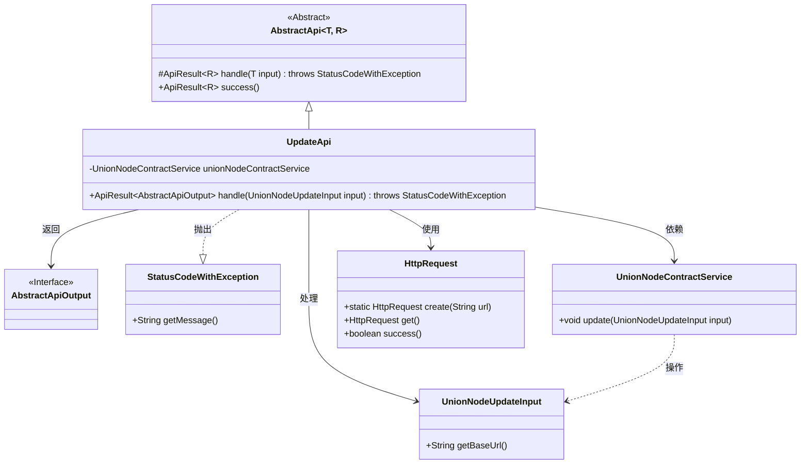
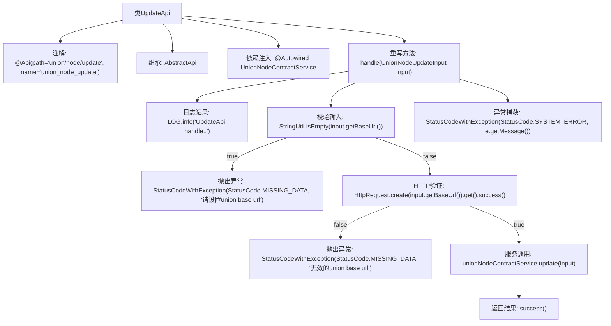

# 基础信息

|      |      |
|------|------|
| 名称 | UpdateApi |
| 编码语言 | .java |
| 代码路径 | WeFe/manager/manager-service/src/main/java/com/welab/wefe/manager/service/api/union/UpdateApi.java |
| 包名 | com.welab.wefe.manager.service.api.union |
| 依赖项 | ['com.welab.wefe.common.StatusCode', 'com.welab.wefe.common.exception.StatusCodeWithException', 'com.welab.wefe.common.http.HttpRequest', 'com.welab.wefe.common.util.StringUtil', 'com.welab.wefe.common.web.api.base.AbstractApi', 'com.welab.wefe.common.web.api.base.Api', 'com.welab.wefe.common.web.dto.AbstractApiOutput', 'com.welab.wefe.common.web.dto.ApiResult', 'com.welab.wefe.manager.service.dto.union.UnionNodeUpdateInput', 'com.welab.wefe.manager.service.service.UnionNodeContractService', 'org.springframework.beans.factory.annotation.Autowired'] |
| 概述说明 | UpdateApi处理节点更新请求，校验baseUrl有效性后调用服务更新数据，异常时返回系统错误。 |

# 说明

这是一个名为UpdateApi的Java类，用于处理节点更新请求。它继承自AbstractApi类，泛型参数指定了输入类型UnionNodeUpdateInput和输出类型AbstractApiOutput。类上标注了API路径和名称。主要逻辑在handle方法中：首先检查输入参数baseUrl是否为空，若为空则抛出异常；然后验证baseUrl的有效性，无效则抛出异常；最后调用unionNodeContractService的update方法完成更新操作。过程中捕获异常并重新抛出系统错误。成功时返回成功结果。类中注入了UnionNodeContractService服务。

# 类列表 Class Summary

| 名称   | 类型  | 说明 |
|-------|------|-------------|
| UpdateApi | class | 这是一个用于更新联合节点的API类，路径为union/node/update。它接收UnionNodeUpdateInput输入，调用UnionNodeContractService进行更新操作。会校验输入的baseUrl是否为空和有效，处理异常并返回结果。 |

## 类 UpdateApi

|      |      |
|------|------|
| 访问范围 | @Api(path = "union/node/update", name = "union_node_update");public |
| 类型 | class |
| 名称 | UpdateApi |
| 说明 | 这是一个用于更新联合节点的API类，路径为union/node/update。它接收UnionNodeUpdateInput输入，调用UnionNodeContractService进行更新操作。会校验输入的baseUrl是否为空和有效，处理异常并返回结果。 |

### UML类图

这段类图展示了UpdateApi继承自AbstractApi泛型类，处理UnionNodeUpdateInput输入并返回AbstractApiOutput。UpdateApi依赖UnionNodeContractService进行业务操作，使用HttpRequest验证URL有效性，可能抛出StatusCodeWithException异常。各组件通过清晰的依赖关系组织，体现了输入验证、业务处理和异常捕获的完整流程。

### 内部方法调用关系图

该流程图描述了UpdateApi类的核心处理逻辑。首先通过注解定义API路径，继承抽象基类并注入服务依赖。主要流程从handle方法开始，依次进行日志记录、输入校验、HTTP服务可用性验证，最后调用合约更新服务。异常处理贯穿整个过程，包括空值校验失败和HTTP验证失败的场景，最终返回统一格式的响应结果。

### 字段列表 Field List

| 名称  | 类型  | 说明 |
|-------|-------|------|
| unionNodeContractService | UnionNodeContractService | 自动注入UnionNodeContractService服务实例。 |

### 方法列表

| 名称  | 类型  | 说明 |
|-------|-------|------|
| handle | ApiResult<AbstractApiOutput> | 处理UnionNode更新请求，校验baseUrl有效性后调用服务更新数据，异常时返回错误信息。 |

