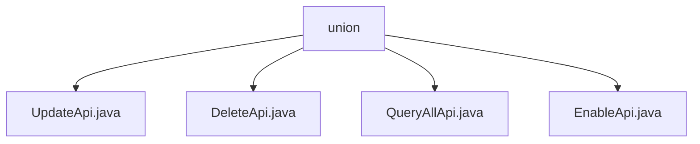

# 基础信息

|      |      |
|------|------|
| 名称 | union |
| 编码语言 | .java |
| 代码路径 | WeFe/manager/manager-service/src/main/java/com/welab/wefe/manager/service/api/union |
| 包名 | docs.manager.manager-service.src.main.java.com.welab.wefe.manager.service.api.union |
| 概述说明 | UpdateApi类处理节点更新，验证baseUrl后调用update方法。DeleteApi类处理节点删除，调用deleteByUnionNodeId方法。QueryAllApi类查询节点数据并返回列表。EnableApi类处理节点启用，验证后调用enable方法。 |

# 说明

## 概述  
该模块核心职责是管理联合节点的生命周期操作，包括更新、删除、查询和启用节点，类似节点管理中心。接口规范统一继承AbstractApi，输入输出使用特定DTO（如UnionNodeUpdateInput/AbstractApiOutput）。关键数据结构包括UnionNode（MongoDB实体）及其转换对象UnionNodeQueryOutput。外部依赖包括UnionNodeContractService（区块链合约操作）和UnionNodeMongoRepo（数据持久化）。例如UpdateApi验证baseUrl后调用合约服务，QueryAllApi通过MongoRepo查询节点列表。

## 主要业务场景  
模块支持节点全生命周期管理：更新节点信息（UpdateApi）、删除节点（DeleteApi）、查询节点列表（QueryAllApi）、启用节点（EnableApi）。交互模式均为RESTful风格，通过注入服务完成底层操作。典型应用如联盟成员管理场景，需先查询节点状态再执行启用操作。API类型涵盖CRUD操作，例如DeleteApi通过nodeId删除节点，EnableApi需验证baseUrl有效性后调用合约服务。

### 包内部结构视图

该流程图展示了union目录下的四个API文件：UpdateApi、DeleteApi、QueryAllApi和EnableApi。这些文件都直接隶属于union目录，没有更深层次的嵌套结构，呈现出一个简单的单层文件组织结构，适用于管理服务中联合操作的相关接口实现。

# 文件列表

| 名称   | 类型  | 说明 |
|-------|------|-------------|
| [UpdateApi.java](UpdateApi.md) | file | UpdateApi处理节点更新请求，校验baseUrl有效性后调用服务更新数据，异常时返回系统错误。 |
| [DeleteApi.java](DeleteApi.md) | file | 这是一个删除联合节点的API类，路径为union/node/delete，通过调用unionNodeContractService的deleteByUnionNodeId方法删除指定节点ID的数据，处理异常并返回成功结果。 |
| [QueryAllApi.java](QueryAllApi.md) | file | 定义了一个查询API类QueryAllApi，通过MongoDB仓库unionNodeMongoRepo获取数据，使用Mapper转换后返回JSON格式结果。路径为union/node/query。 |
| [EnableApi.java](EnableApi.md) | file | EnableApi处理节点启用请求，检查节点存在性、baseUrl有效性，调用服务启用节点。异常时返回错误状态码。 |

