# 基础信息

|      |      |
|------|------|
| 名称 | BlockChainConfig |
| 编码语言 | .java |
| 代码路径 | WeFe/manager/manager-service/src/main/java/com/welab/wefe/manager/service/config/BlockChainConfig.java |
| 包名 | com.welab.wefe.manager.service.config |
| 依赖项 | ['com.welab.wefe.common.StatusCode', 'com.welab.wefe.common.exception.StatusCodeWithException', 'com.welab.wefe.common.wefe.enums.ContractName', 'com.welab.wefe.manager.service.contract', 'io.netty.channel.ChannelHandlerContext', 'org.apache.commons.collections4.CollectionUtils', 'org.fisco.bcos.sdk.BcosSDK', 'org.fisco.bcos.sdk.client.Client', 'org.fisco.bcos.sdk.config.ConfigOption', 'org.fisco.bcos.sdk.config.model.ConfigProperty', 'org.fisco.bcos.sdk.contract.precompiled.cns.CnsInfo', 'org.fisco.bcos.sdk.contract.precompiled.cns.CnsService', 'org.fisco.bcos.sdk.crypto.CryptoSuite', 'org.fisco.bcos.sdk.crypto.keypair.CryptoKeyPair', 'org.fisco.bcos.sdk.model.Message', 'org.fisco.bcos.sdk.model.NodeVersion.ClientVersion', 'org.fisco.bcos.sdk.network.MsgHandler', 'org.slf4j.Logger', 'org.slf4j.LoggerFactory', 'org.springframework.boot.context.properties.ConfigurationProperties', 'org.springframework.context.annotation.Bean', 'org.springframework.context.annotation.Configuration', 'java.util.ArrayList', 'java.util.HashMap', 'java.util.List', 'java.util.Map'] |
| 概述说明 | BlockChainConfig类配置区块链SDK，包含证书路径、线程池、节点连接等参数，并初始化多个智能合约实例。 |

# 说明

该代码定义了一个名为BlockChainConfig的配置类，用于初始化区块链相关配置。类中包含证书路径、组ID、线程池参数、IP地址和通道端口等属性。通过@Bean注解创建了多个Bean，包括BcosSDK实例、客户端、加密套件、密钥对以及多个合约服务。BcosSDKChannelMsg内部类处理连接和断开事件。getLatestContractAddressByName方法根据合约名称获取最新合约地址。类提供了各属性的getter和setter方法，支持从配置文件注入属性。整体实现了区块链SDK的初始化和多个合约服务的加载功能。

# 类列表 Class Summary

| 名称   | 类型  | 说明 |
|-------|------|-------------|
| BlockChainConfig | class | BlockChainConfig类配置区块链SDK，包含证书路径、线程池、网络节点等参数，并通过多个Bean方法初始化各类合约实例。 |

## 类 BlockChainConfig

|      |      |
|------|------|
| 访问范围 | @Configuration;@ConfigurationProperties(prefix = "block.chain");public |
| 类型 | class |
| 名称 | BlockChainConfig |
| 说明 | BlockChainConfig类配置区块链SDK，包含证书路径、线程池、网络节点等参数，并通过多个Bean方法初始化各类合约实例。 |

### UML类图

```mermaid
classDiagram
    class BlockChainConfig {
        -String certPath
        -int groupId
        -String corePoolSize
        -String maxPoolSize
        -String queueCapacity
        -String ip
        -String channelPort
        +boolean PEER_CONNECTED
        +String getCertPath()
        +void setCertPath(String certPath)
        +int getGroupId()
        +void setGroupId(int groupId)
        +String getCorePoolSize()
        +void setCorePoolSize(String corePoolSize)
        +String getMaxPoolSize()
        +void setMaxPoolSize(String maxPoolSize)
        +String getQueueCapacity()
        +void setQueueCapacity(String queueCapacity)
        +String getIp()
        +void setIp(String ip)
        +String getChannelPort()
        +void setChannelPort(String channelPort)
        +BcosSDK getBcosSDK() throws Exception
        +Client getClient(BcosSDK bcosSDK)
        +CryptoSuite getCryptoSuite(Client client)
        +CryptoKeyPair getCryptoKeyPair(CryptoSuite cryptoSuite)
        +CnsService getCnsService(Client client, CryptoKeyPair cryptoKeyPair)
        +String getCurrentBlockchainNodeId(Client client)
        +MemberContract getLatestVersionMemberContract(CnsService cnsService, Client client, CryptoKeyPair cryptoKeyPair) throws StatusCodeWithException
        +DataSetContract getLatestVersionDataSetContract(CnsService cnsService, Client client, CryptoKeyPair cryptoKeyPair) throws StatusCodeWithException
        +DataSetMemberPermissionContract getLatestVersionDataSetMemberPermissionContract(CnsService cnsService, Client client, CryptoKeyPair cryptoKeyPair) throws StatusCodeWithException
        +DataSetDefaultTagContract getLatestVersionDataSetDefaultTagContract(CnsService cnsService, Client client, CryptoKeyPair cryptoKeyPair) throws StatusCodeWithException
        +MemberAuthTypeContract getLatestVersionMemberAuthTypeContract(CnsService cnsService, Client client, CryptoKeyPair cryptoKeyPair) throws StatusCodeWithException
        +UnionNodeContract getLatestVersionUnionNodeContract(CnsService cnsService, Client client, CryptoKeyPair cryptoKeyPair) throws StatusCodeWithException
        +RealnameAuthAgreementTemplateContract getLatestVersionRealnameAuthAgreementTemplateContract(CnsService cnsService, Client client, CryptoKeyPair cryptoKeyPair) throws StatusCodeWithException
        +DataResourceContract getLatestVersionDataResourceContract(CnsService cnsService, Client client, CryptoKeyPair cryptoKeyPair) throws StatusCodeWithException
        +DataResourceDefaultTagContract getLatestVersionDataResourceDefaultTagContract(CnsService cnsService, Client client, CryptoKeyPair cryptoKeyPair) throws StatusCodeWithException
        +TrustCertsContract getLatestVersionTrustCertsContract(CnsService cnsService, Client client, CryptoKeyPair cryptoKeyPair) throws StatusCodeWithException
        +String getLatestContractAddressByName(CnsService cnsService, String contractName) throws StatusCodeWithException
    }

    class BcosSDKChannelMsg {
        <<MsgHandler>>
        +void onConnect(ChannelHandlerContext ctx)
        +void onMessage(ChannelHandlerContext ctx, Message msg)
        +void onDisconnect(ChannelHandlerContext ctx)
    }

    BlockChainConfig --> BcosSDKChannelMsg : 包含
    BlockChainConfig --> ConfigProperty : 创建
    BlockChainConfig --> ConfigOption : 创建
    BlockChainConfig --> BcosSDK : 创建
    BlockChainConfig --> Client : 创建
    BlockChainConfig --> CryptoSuite : 创建
    BlockChainConfig --> CryptoKeyPair : 创建
    BlockChainConfig --> CnsService : 创建
    BlockChainConfig --> MemberContract : 创建
    BlockChainConfig --> DataSetContract : 创建
    BlockChainConfig --> DataSetMemberPermissionContract : 创建
    BlockChainConfig --> DataSetDefaultTagContract : 创建
    BlockChainConfig --> MemberAuthTypeContract : 创建
    BlockChainConfig --> UnionNodeContract : 创建
    BlockChainConfig --> RealnameAuthAgreementTemplateContract : 创建
    BlockChainConfig --> DataResourceContract : 创建
    BlockChainConfig --> DataResourceDefaultTagContract : 创建
    BlockChainConfig --> TrustCertsContract : 创建
```

类图描述：BlockChainConfig是一个配置类，用于初始化区块链相关的各种服务和合约。它包含多个私有属性用于配置区块链连接参数，以及多个公有方法用于创建和获取区块链服务实例（如BcosSDK、Client、CryptoSuite等）和各种智能合约（如MemberContract、DataSetContract等）。内部类BcosSDKChannelMsg实现了MsgHandler接口，用于处理网络连接事件。该类通过依赖多个外部类来实现完整的区块链功能。

### 内部方法调用关系图

```mermaid
graph TD
    A["类BlockChainConfig"]
    B["静态内部类: BcosSDKChannelMsg"]
    C["属性: String certPath"]
    D["属性: int groupId"]
    E["属性: String corePoolSize"]
    F["属性: String maxPoolSize"]
    G["属性: String queueCapacity"]
    H["属性: String ip"]
    I["属性: String channelPort"]
    J["静态属性: boolean PEER_CONNECTED"]
    K["方法: getBcosSDK()"]
    L["方法: getClient(BcosSDK)"]
    M["方法: getCryptoSuite(Client)"]
    N["方法: getCryptoKeyPair(CryptoSuite)"]
    O["方法: getCnsService(Client, CryptoKeyPair)"]
    P["方法: getCurrentBlockchainNodeId(Client)"]
    Q["方法: getLatestContractAddressByName(CnsService, String)"]
    R["方法: 各类getLatestVersion...Contract()"]
    S["Getter/Setter方法"]

    A --> B
    A --> C
    A --> D
    A --> E
    A --> F
    A --> G
    A --> H
    A --> I
    A --> J
    A --> K
    A --> L
    A --> M
    A --> N
    A --> O
    A --> P
    A --> Q
    A --> R
    A --> S

    B --> B1["onConnect(ChannelHandlerContext)"]
    B --> B2["onMessage(ChannelHandlerContext, Message)"]
    B --> B3["onDisconnect(ChannelHandlerContext)"]

    K --> K1["初始化cryptoMaterial"]
    K --> K2["初始化network"]
    K --> K3["初始化threadPool"]
    K --> K4["创建ConfigProperty"]
    K --> K5["创建ConfigOption"]
    K --> K6["创建BcosSDK实例"]
    K --> K7["获取Client版本"]
    K --> K8["添加连接/断开处理器"]

    Q --> Q1["查询CNS列表"]
    Q --> Q2["处理异常情况"]
    Q --> Q3["返回最新合约地址"]
```

这段代码是区块链配置类，主要功能包括：1) 通过@ConfigurationProperties加载区块链配置参数；2) 提供BcosSDK核心组件的初始化逻辑；3) 实现各类智能合约的加载功能；4) 包含连接状态管理的内部消息处理器。流程图展示了类结构、属性关系和方法调用链，特别是BcosSDK初始化流程和合约加载的依赖关系。所有智能合约加载方法都依赖getLatestContractAddressByName这个核心方法。

### 字段列表 Field List

| 名称  | 类型  | 说明 |
|-------|-------|------|
| queueCapacity | String | 私有字符串变量queueCapacity，用于表示队列容量。 |
| corePoolSize | String | 声明一个私有字符串变量corePoolSize。 |
| PEER_CONNECTED = true | boolean | 静态布尔变量PEER_CONNECTED，值为true，表示对等连接已建立。 |
| channelPort = "20200" | String | 私有字符串变量channelPort被初始化为"20200"。 |
| ip = "127.0.0.1" | String | 定义私有字符串变量ip，初始值为本地回环地址127.0.0.1。 |
| groupId | int | 私有整型变量groupId，用于标识组别。 |
| certPath = "conf" | String | 代码定义了一个公共字符串变量certPath，初始值为"conf"。 |
| maxPoolSize | String | 声明一个私有字符串变量maxPoolSize。 |
| log =            LoggerFactory.getLogger(BlockChainConfig.class) | Logger | 定义BlockChainConfig类的私有静态日志记录器实例，使用LoggerFactory创建。 |

### 方法列表

| 名称  | 类型  | 说明 |
|-------|-------|------|
| getCertPath | String | 方法返回证书路径字符串。 |
| setIp | void | 这是一个Java方法，用于设置类的ip属性值。方法接收一个字符串参数ip，并将其赋值给类的成员变量ip。 |
| getChannelPort | String | 获取channelPort值的公开方法。 |
| getLatestVersionDataSetContract | DataSetContract | 该方法通过CNS服务获取最新数据集合约地址，并使用客户端和密钥对加载合约实例。 |
| getLatestVersionUnionNodeContract | UnionNodeContract | 创建一个Bean方法，通过CNS服务获取最新UnionNode合约地址并加载合约实例。 |
| setGroupId | void | 这是一个Java方法，用于设置类的groupId属性值。方法接收一个整数参数groupId，并将其赋值给类的同名成员变量。 |
| getLatestVersionDataResourceContract | DataResourceContract | 该方法通过CNS服务获取最新版数据资源合约地址，并使用客户端和密钥对加载合约实例。 |
| getLatestContractAddressByName | String | 获取指定合约名称的最新地址。查询失败或结果为空时抛出异常并记录错误日志。 |
| setChannelPort | void | 设置通道端口的方法，将输入参数赋值给类的成员变量channelPort。 |
| getLatestVersionMemberAuthTypeContract | MemberAuthTypeContract | 该方法通过CNS服务获取最新版MemberAuthType合约地址，并加载合约实例。需传入CNS服务、客户端和密钥对参数，可能抛出异常。 |
| getCryptoKeyPair | CryptoKeyPair | 该方法通过CryptoSuite获取并返回CryptoKeyPair实例。 |
| getCorePoolSize | String | 获取线程池核心线程数的方法，返回字符串类型值corePoolSize。 |
| setCertPath | void | 设置证书路径的方法，将输入参数certPath赋值给类成员变量certPath。 |
| setMaxPoolSize | void | 设置最大连接池大小的方法，参数为字符串类型maxPoolSize。 |
| getCnsService | CnsService | 创建一个CnsService实例，依赖Client和CryptoKeyPair参数。 |
| getClient | Client | Java方法通过BcosSDK获取指定群组的客户端实例并返回。 |
| getLatestVersionTrustCertsContract | TrustCertsContract | 该方法通过CNS服务获取最新版TrustCerts合约地址，并加载合约实例。需传入CNS服务、客户端和密钥对参数，可能抛出异常。 |
| getGroupId | int | 方法返回整型变量groupId的值。 |
| getLatestVersionDataSetDefaultTagContract | DataSetDefaultTagContract | 该方法通过CNS服务获取最新数据集默认标签合约地址，并使用客户端和密钥对加载合约实例。 |
| getCryptoSuite | CryptoSuite | 这是一个Spring Bean方法，返回客户端配置的加密套件实例。 |
| getLatestVersionDataResourceDefaultTagContract | DataResourceDefaultTagContract | 定义一个Bean方法，加载最新版本的数据资源默认标签合约，需CnsService、Client和CryptoKeyPair参数，返回合约实例。 |
| getCurrentBlockchainNodeId | String | 获取客户端区块链节点的首个ID。方法返回节点ID字符串。 |
| getMaxPoolSize | String | 获取最大线程池大小的方法。 |
| getLatestVersionRealnameAuthAgreementTemplateContract | RealnameAuthAgreementTemplateContract | 该方法通过CNS服务获取最新版实名认证协议模板合约地址，并加载合约实例返回。需传入CNS服务、客户端和密钥对参数，可能抛出异常。 |
| setCorePoolSize | void | 设置线程池核心线程数的方法，参数为字符串类型。 |
| getQueueCapacity | String | 获取队列容量的方法，返回字符串类型的队列容量值。 |
| getLatestVersionMemberContract | MemberContract | 该方法通过CNS服务获取最新版MemberContract地址，并加载合约实例。需传入CNS服务、客户端和密钥对参数，可能抛出异常。 |
| getLatestVersionDataSetMemberPermissionContract | DataSetMemberPermissionContract | 该代码定义了一个Bean方法，用于加载最新版本的数据集成员权限合约。方法通过CNS服务获取合约地址，并使用客户端和密钥对加载合约实例。 |
| getBcosSDK | BcosSDK | 初始化BcosSDK实例，配置加密材料、网络节点和线程池参数，创建ConfigOption并设置连接处理器，返回SDK实例。 |
| setQueueCapacity | void | 设置队列容量的方法，将输入参数queueCapacity赋值给当前对象的同名属性。 |
| getIp | String | 方法返回字符串类型的ip值。 |

