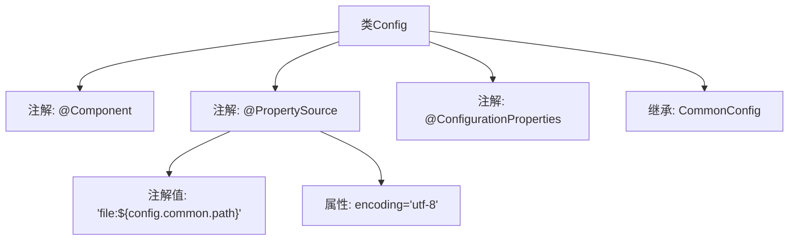

# 基础信息

|      |      |
|------|------|
| 名称 | Config |
| 编码语言 | .java |
| 代码路径 | WeFe/manager/manager-service/src/main/java/com/welab/wefe/manager/service/config/Config.java |
| 包名 | com.welab.wefe.manager.service.config |
| 依赖项 | ['com.welab.wefe.common.web.config.CommonConfig', 'org.springframework.beans.factory.annotation.Value', 'org.springframework.boot.context.properties.ConfigurationProperties', 'org.springframework.context.annotation.PropertySource', 'org.springframework.stereotype.Component'] |
| 概述说明 | Java配置类，继承CommonConfig，加载外部UTF-8编码配置文件。 |

# 说明

该内容描述了一个名为Config的Java类，该类通过@Component注解标记为Spring组件，并继承自CommonConfig类。使用@PropertySource注解指定外部配置文件路径，路径通过${config.common.path}动态获取，文件编码为UTF-8。@ConfigurationProperties注解表明该类用于绑定外部配置属性。整体设计用于集中管理应用配置，支持从指定位置加载属性文件。

# 类列表 Class Summary

| 名称   | 类型  | 说明 |
|-------|------|-------------|
| Config | class | Spring组件，加载外部UTF-8编码配置文件，继承通用配置类。 |


## 类 Config

|      |      |
|------|------|
| 访问范围 | @Component;@PropertySource(value = {"file:${config.common.path}"}, encoding = "utf-8");@ConfigurationProperties;public |
| 类型 | class |
| 名称 | Config |
| 说明 | Spring组件，加载外部UTF-8编码配置文件，继承通用配置类。 |


### UML类图

```mermaid
classDiagram
    class CommonConfig {
        <<abstract>>
    }
    
    class Config {
        +Config()
    }
    
    Config --|> CommonConfig : 继承
    Config ..> "@Component" : 标注
    Config ..> "@PropertySource" : 标注
    Config ..> "@ConfigurationProperties" : 标注
```

该类图展示了Spring Boot配置类的继承关系。Config类继承自抽象基类CommonConfig，并通过@Component标记为Spring组件，@PropertySource指定外部配置文件路径（支持动态占位符和编码），@ConfigurationProperties启用配置属性绑定。这种设计实现了配置信息的层级复用，基类可定义通用配置项，子类通过注解实现与Spring环境的集成。


### 内部方法调用关系图



该流程图展示了Config类的结构，它是一个Spring组件，通过@PropertySource注解加载外部配置文件，并继承CommonConfig基类。@PropertySource指定了文件路径和编码格式，@ConfigurationProperties用于绑定配置属性。整个设计体现了Spring Boot的配置管理机制，通过继承实现配置分层，同时保持UTF-8编码的统一处理能力。

### 字段列表 Field List

| 名称  | 类型  | 说明 |
|-------|-------|------|

### 方法列表

| 名称  | 类型  | 说明 |
|-------|-------|------|


