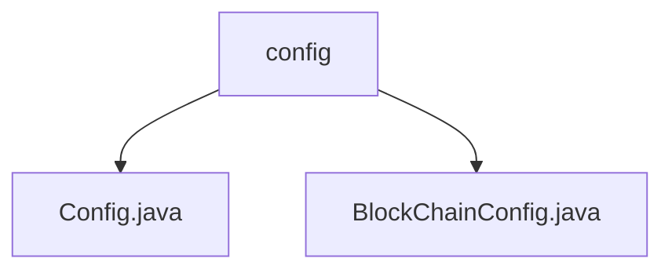

# 基础信息

|      |      |
|------|------|
| 名称 | config |
| 编码语言 | .java |
| 代码路径 | WeFe/manager/manager-service/src/main/java/com/welab/wefe/manager/service/config |
| 包名 | docs.manager.manager-service.src.main.java.com.welab.wefe.manager.service.config |
| 概述说明 | Config类为Spring组件，继承CommonConfig，加载外部UTF-8编码配置文件，管理应用配置。BlockChainConfig类初始化区块链配置，包含证书路径、组ID等属性，创建BcosSDK实例和合约服务，支持配置注入。 |

# 说明

## 概述  
该模块核心职责是集中管理应用配置，包括通用配置和区块链专用配置。通过Spring组件机制实现配置加载与绑定，支持动态路径解析和UTF-8编码文件读取。  

接口规范包含`@PropertySource`动态加载配置、`@ConfigurationProperties`属性绑定，以及`@Bean`方式初始化区块链SDK组件。关键数据结构包括证书路径、组ID、线程池参数等区块链配置项，类似微服务的连接池管理。  

外部依赖项包括Spring框架、BcosSDK区块链开发包。例如`Config`类继承`CommonConfig`基类，`BlockChainConfig`通过`BcosSDKChannelMsg`处理连接事件。  

## 主要业务场景  
模块适用于需要集中管理多环境配置的应用，特别是涉及区块链交互的系统。典型流程包括：加载外部配置文件、初始化SDK连接池、部署智能合约服务。例如`BlockChainConfig`通过`getLatestContractAddressByName`动态获取合约地址。  

交互模式采用"配置即服务"理念，类似事件总线模式，通过属性注入自动装配组件。完整功能涵盖从基础属性绑定到复杂区块链网络初始化，例如创建加密套件、密钥对等安全组件。API类型包含配置加载类与运行时Bean工厂两类集成点。

### 包内部结构视图

该流程图展示了manager-service项目中的配置模块结构。根节点为config文件夹，包含两个配置文件：Config.java作为基础配置类，BlockChainConfig.java专门处理区块链相关配置。这种层级关系清晰地体现了配置模块的代码组织方式，符合典型Java项目的目录规范。

# 文件列表

| 名称   | 类型  | 说明 |
|-------|------|-------------|
| [Config.java](Config.md) | file | Java配置类，继承CommonConfig，加载外部UTF-8编码配置文件。 |
| [BlockChainConfig.java](BlockChainConfig.md) | file | BlockChainConfig类配置区块链SDK，包含证书路径、线程池、节点连接等参数，并初始化多个智能合约实例。 |

