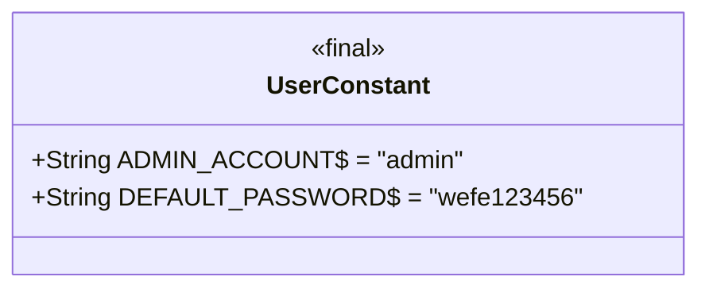
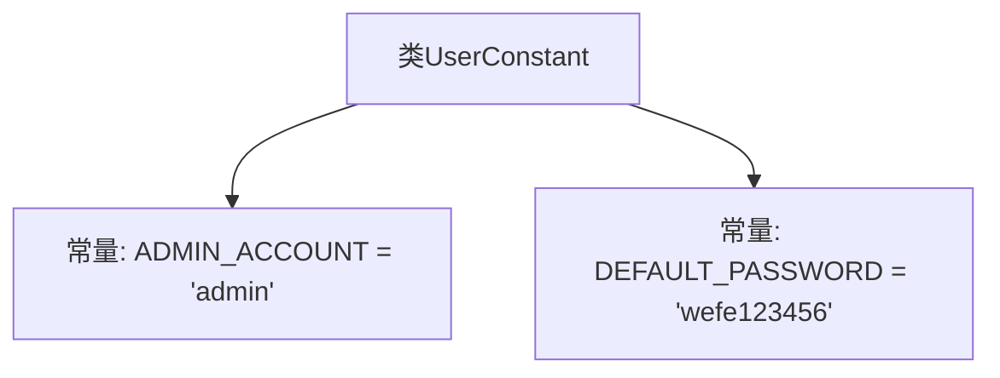

# 基础信息

|      |      |
|------|------|
| 名称 | UserConstant |
| 编码语言 | .java |
| 代码路径 | WeFe/manager/manager-service/src/main/java/com/welab/wefe/manager/service/constant/UserConstant.java |
| 包名 | com.welab.wefe.manager.service.constant |
| 依赖项 | [] |
| 概述说明 | 用户常量类包含管理员账户和默认密码的静态常量。 |

# 说明

UserConstant类定义了两个公共静态常量字符串字段。ADMIN_ACCOUNT字段值为"admin"，表示管理员账户名称。DEFAULT_PASSWORD字段值为"wefe123456"，表示默认密码设置。这两个常量用于在系统中统一管理用户相关的固定值。

# 类列表 Class Summary

| 名称   | 类型  | 说明 |
|-------|------|-------------|
| UserConstant | class | 用户常量类定义管理员账号为"admin"，默认密码为"wefe123456"。 |

## 类 UserConstant

|      |      |
|------|------|
| 访问范围 | public |
| 类型 | class |
| 名称 | UserConstant |
| 说明 | 用户常量类定义管理员账号为"admin"，默认密码为"wefe123456"。 |

### UML类图

这段代码定义了一个`UserConstant`类，包含两个静态常量字段：`ADMIN_ACCOUNT`和`DEFAULT_PASSWORD`，分别表示管理员账户名和默认密码。该类没有实例方法或构造器，仅作为常量容器使用。通过`final`修饰符确保字段不可修改，且所有成员均为公有静态属性，可直接通过类名访问。这种设计常用于集中管理全局配置参数或固定业务值。

### 内部方法调用关系图

这段代码定义了一个名为UserConstant的类，其中包含两个静态常量字段：ADMIN_ACCOUNT表示管理员账户名，值为"admin"；DEFAULT_PASSWORD表示默认密码，值为"wefe123456"。该类的作用是集中管理用户相关的常量值，便于在项目中统一引用和维护。由于所有字段都是public static final的，因此这些常量可以在其他类中直接通过类名访问，且不可修改。

### 字段列表 Field List

| 名称  | 类型  | 说明 |
|-------|-------|------|
| DEFAULT_PASSWORD = "wefe123456" | String | 默认密码设为"wefe123456"。 |
| ADMIN_ACCOUNT = "admin" | String | 定义了一个公共静态常量字符串ADMIN_ACCOUNT，值为"admin"。 |

### 方法列表

| 名称  | 类型  | 说明 |
|-------|-------|------|

