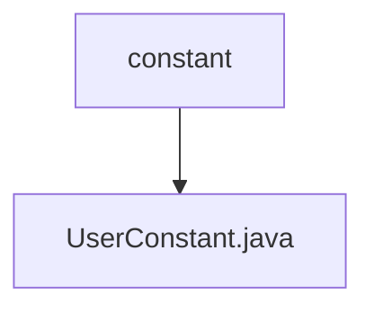

# 基础信息

|      |      |
|------|------|
| 名称 | constant |
| 编码语言 | .java |
| 代码路径 | WeFe/manager/manager-service/src/main/java/com/welab/wefe/manager/service/constant |
| 包名 | docs.manager.manager-service.src.main.java.com.welab.wefe.manager.service.constant |
| 概述说明 | 用户常量类包含管理员账户和默认密码的静态常量。 |

# 说明

UserConstant类定义了两个公共静态常量字符串字段。ADMIN_ACCOUNT字段值为"admin"，表示管理员账户名称。DEFAULT_PASSWORD字段值为"wefe123456"，表示默认密码设置。这两个常量用于在系统中统一管理用户相关的固定值。

### 包内部结构视图

该流程图展示了WeFe项目中manager-service模块下的常量包结构。顶层节点为constant目录，其下级包含一个具体的常量类文件UserConstant.java。这种结构符合Java项目标准目录布局，常量类集中存放便于统一管理，体现了模块化设计思想。整个结构简洁清晰，仅包含2个节点，准确反映了给定的2条路径信息。

# 文件列表

| 名称   | 类型  | 说明 |
|-------|------|-------------|
| [UserConstant.java](UserConstant.md) | file | 用户常量类包含管理员账户和默认密码的静态常量。 |

