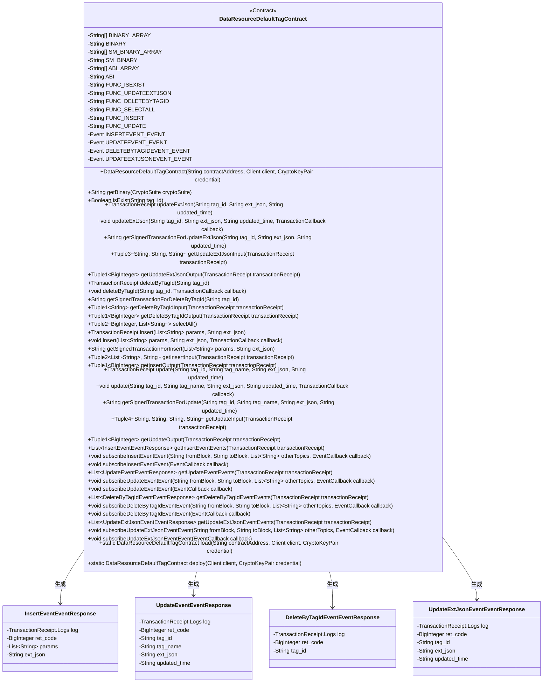
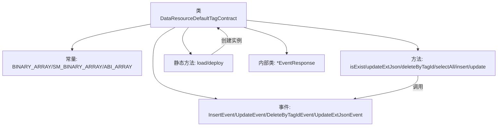
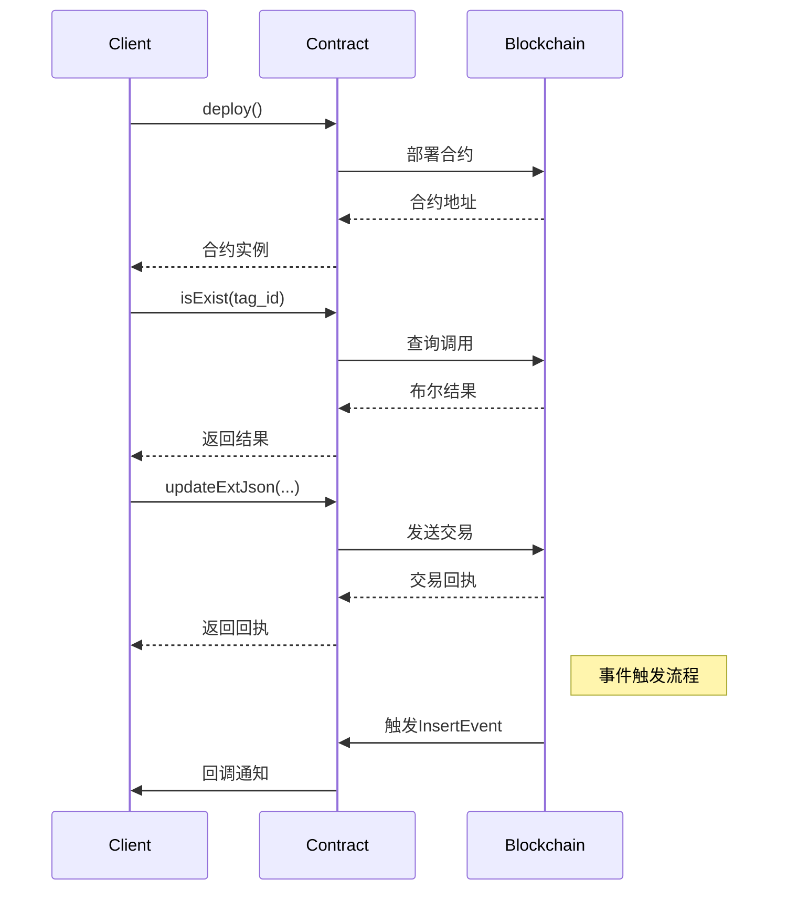

# 基础信息

|      |      |
|------|------|
| 名称 | DataResourceDefaultTagContract |
| 编码语言 | .java |
| 代码路径 | WeFe/manager/manager-service/src/main/java/com/welab/wefe/manager/service/contract/DataResourceDefaultTagContract.java |
| 包名 | com.welab.wefe.manager.service.contract |
| 依赖项 | ['java.math.BigInteger', 'java.util.ArrayList', 'java.util.Arrays', 'java.util.Collections', 'java.util.List', 'org.fisco.bcos.sdk.abi.FunctionReturnDecoder', 'org.fisco.bcos.sdk.abi.TypeReference', 'org.fisco.bcos.sdk.abi.datatypes.Bool', 'org.fisco.bcos.sdk.abi.datatypes.DynamicArray', 'org.fisco.bcos.sdk.abi.datatypes.Event', 'org.fisco.bcos.sdk.abi.datatypes.Function', 'org.fisco.bcos.sdk.abi.datatypes.Type', 'org.fisco.bcos.sdk.abi.datatypes.Utf8String', 'org.fisco.bcos.sdk.abi.datatypes.generated.Int256', 'org.fisco.bcos.sdk.abi.datatypes.generated.tuples.generated.Tuple1', 'org.fisco.bcos.sdk.abi.datatypes.generated.tuples.generated.Tuple2', 'org.fisco.bcos.sdk.abi.datatypes.generated.tuples.generated.Tuple3', 'org.fisco.bcos.sdk.abi.datatypes.generated.tuples.generated.Tuple4', 'org.fisco.bcos.sdk.client.Client', 'org.fisco.bcos.sdk.contract.Contract', 'org.fisco.bcos.sdk.crypto.CryptoSuite', 'org.fisco.bcos.sdk.crypto.keypair.CryptoKeyPair', 'org.fisco.bcos.sdk.eventsub.EventCallback', 'org.fisco.bcos.sdk.model.CryptoType', 'org.fisco.bcos.sdk.model.TransactionReceipt', 'org.fisco.bcos.sdk.model.callback.TransactionCallback', 'org.fisco.bcos.sdk.transaction.model.exception.ContractException'] |
| 概述说明 | DataResourceDefaultTagContract 是一个智能合约类，提供数据资源默认标签的管理功能，包括增删改查操作。主要功能有：检查标签是否存在、更新标签扩展JSON、删除标签、查询所有标签、插入新标签等。合约支持事件监听，如插入、更新、删除等操作的事件回调。适用于需要管理数据资源标签的场景。 |

# 说明

这是一个名为`DataResourceDefaultTagContract`的智能合约Java封装类，主要功能是与区块链上的同名合约进行交互。以下是对该类的全面总结：

1. **基础信息**
- 继承自`org.fisco.bcos.sdk.contract.Contract`基类
- 包含合约的二进制代码(普通/SM国密两种版本)、ABI接口定义
- 定义了6个合约函数和4个事件

2. **核心功能**
- 提供合约部署方法`deploy()`和加载方法`load()`
- 封装了合约所有可调用函数：
   * `isExist()` - 查询标签是否存在
   * `updateExtJson()` - 更新扩展JSON
   * `deleteByTagId()` - 删除标签
   * `selectAll()` - 查询所有标签
   * `insert()` - 插入新标签
   * `update()` - 更新标签

3. **事件处理**
- 定义了4个事件响应类：
   * `InsertEventEventResponse` - 插入事件
   * `UpdateEventEventResponse` - 更新事件  
   * `DeleteByTagIdEventEventResponse` - 删除事件
   * `UpdateExtJsonEventEventResponse` - 更新JSON事件
- 提供事件订阅方法`subscribeXxxEvent()`

4. **辅助功能**
- 支持同步/异步交易执行
- 提供交易输入/输出解析方法
- 支持生成已签名的交易数据

5. **技术特点**
- 使用FISCO BCOS Java SDK
- 支持国密和非国密两种算法
- 采用类型安全的参数封装
- 提供完整的事件监听机制

该类为Java应用提供了类型安全、易于使用的接口来与区块链上的`DataResourceDefaultTag`合约交互，封装了所有底层细节，使开发者可以专注于业务逻辑实现。

# 类列表 Class Summary

| 名称   | 类型  | 说明 |
|-------|------|-------------|
| DataResourceDefaultTagContract | class | 这是一个Java智能合约类，用于管理数据资源默认标签。主要功能包括：1. 检查标签是否存在(isExist)2. 更新标签扩展JSON(updateExtJson)3. 删除标签(deleteByTagId)4. 查询所有标签(selectAll)5. 插入新标签(insert)6. 更新标签信息(update)合约包含4个事件：- insertEvent: 插入标签事件- updateEvent: 更新标签事件- deleteByTagIdEvent: 删除标签事件- updateExtJsonEvent: 更新扩展JSON事件支持ECDSA和SM2两种加密算法，提供同步和异步交易执行方式，以及事件订阅功能。 |

## 类 DataResourceDefaultTagContract

|      |      |
|------|------|
| 访问范围 | @SuppressWarnings("unchecked");public |
| 类型 | class |
| 名称 | DataResourceDefaultTagContract |
| 说明 | 这是一个Java智能合约类，用于管理数据资源默认标签。主要功能包括：1. 检查标签是否存在(isExist)2. 更新标签扩展JSON(updateExtJson)3. 删除标签(deleteByTagId)4. 查询所有标签(selectAll)5. 插入新标签(insert)6. 更新标签信息(update)合约包含4个事件：- insertEvent: 插入标签事件- updateEvent: 更新标签事件- deleteByTagIdEvent: 删除标签事件- updateExtJsonEvent: 更新扩展JSON事件支持ECDSA和SM2两种加密算法，提供同步和异步交易执行方式，以及事件订阅功能。 |

### UML类图

这段代码是一个智能合约类`DataResourceDefaultTagContract`，用于管理数据资源的默认标签。它提供了多种功能方法如查询标签是否存在、更新标签、删除标签、插入新标签等，并定义了4种事件响应类来处理合约事件。合约支持ECDSA和SM两种加密算法，通过静态方法加载或部署合约实例。类图展示了合约与各事件响应类之间的关系，以及合约的主要方法和属性结构。

### 内部方法调用关系图

这段代码是一个完整的智能合约Java封装类，主要功能是与区块链上的DataResourceDefaultTag合约进行交互。流程图展示了类的结构组成，包括常量定义、合约方法、事件处理和静态工厂方法等。时序图则展示了典型的合约部署、查询和更新操作流程，以及事件监听机制。该合约提供了标签数据的CRUD操作，包含插入、更新、删除和查询功能，并通过事件机制通知调用方操作结果。

### 字段列表 Field List

| 名称  | 类型  | 说明 |
|-------|-------|------|
| FUNC_DELETEBYTAGID = "deleteByTagId" | String | 静态常量FUNC_DELETEBYTAGID，值为"deleteByTagId"。 |
| FUNC_ISEXIST = "isExist" | String | 静态常量字符串FUNC_ISEXIST，值为"isExist"。 |
| FUNC_INSERT = "insert" | String | 这是一个Java静态常量，名为FUNC_INSERT，值为"insert"，表示插入操作的功能标识。 |
| SM_BINARY_ARRAY = {"60806040523480156200001157600080fd5b506110016000806101000a81548173ffffffffffffffffffffffffffffffffffffffff021916908373ffffffffffffffffffffffffffffffffffffffff1602179055506000809054906101000a900473ffffffffffffffffffffffffffffffffffffffff1673ffffffffffffffffffffffffffffffffffffffff1663c92a78016040805190810160405280601981526020017f646174615f7265736f757263655f64656661756c745f746167000000000000008152506040518263ffffffff167c010000000000000000000000000000000000000000000000000000000002815260040162000101919062000296565b602060405180830381600087803b1580156200011c57600080fd5b505af115801562000131573d6000803e3d6000fd5b505050506040513d601f19601f8201168201806040525062000157919081019062000174565b5062000340565b60006200016c8251620002ef565b905092915050565b6000602082840312156200018757600080fd5b600062000197848285016200015e565b91505092915050565b6000620001ad82620002e4565b808452620001c3816020860160208601620002f9565b620001ce816200032f565b602085010191505092915050565b6000604582527f7461675f69642c7461675f6e616d652c646174615f7265736f757263655f747960208301527f70652c637265617465645f74696d652c757064617465645f74696d652c65787460408301527f5f6a736f6e0000000000000000000000000000000000000000000000000000006060830152608082019050919050565b6000600682527f6669785f696400000000000000000000000000000000000000000000000000006020830152604082019050919050565b60006060820190508181036000830152620002b28184620001a0565b90508181036020830152620002c7816200025f565b90508181036040830152620002dc81620001dc565b905092915050565b600081519050919050565b6000819050919050565b60005b8381101562000319578082015181840152602081019050620002fc565b8381111562000329576000848401525b50505050565b6000601f19601f8301169050919050565b613a4b80620003506000396000f300608060405260043610610078576000357c0100000000000000000000000000000000000000000000000000000000900463ffffffff16806315d0d6251461007d578063568fe885146100ba5780639eb03ade146100f7578063abfe57f414610134578063ac7c89a914610171578063c181ca36146101ae575b600080fd5b34801561008957600080fd5b506100a4600480360361009f9190810190612f03565b6101da565b6040516100b1919061330f565b60405180910390f35b3480156100c657600080fd5b506100e160048036036100dc9190810190612e81565b610794565b6040516100ee91906132f4565b60405180910390f35b34801561010357600080fd5b5061011e60048036036101199190810190612d48565b610b58565b60405161012b919061330f565b60405180910390f35b34801561014057600080fd5b5061015b60048036036101569190810190612e81565b611349565b604051610168919061330f565b60405180910390f35b34801561017d57600080fd5b5061019860048036036101939190810190612f9a565b611748565b6040516101a5919061330f565b60405180910390f35b3480156101ba57600080fd5b506101c3611d8e565b6040516101d192919061332a565b60405180910390f35b600080600080600080600094506101f089610794565b151561025e577ffffffffffffffffffffffffffffffffffffffffffffffffffffffffffffffffd94507fb36a4960db7128c065f905021bc6b7ab38c8106c359c6ac8dcd55ed9356c994c858a8a8a60405161024e94939291906133cf565b60405180910390a1849550610788565b6000809054906101000a900473ffffffffffffffffffffffffffffffffffffffff1673ffffffffffffffffffffffffffffffffffffffff166359a48b656040805190810160405280601981526020017f646174615f7265736f757263655f64656661756c745f746167000000000000008152506040518263ffffffff167c01000000000000000000000000000000000000000000000000000000000281526004016103099190613498565b602060405180830381600087803b15801561032357600080fd5b505af1158015610337573d6000803e3d6000fd5b505050506040513d601f19601f8201168201806040525061035b9190810190612e2f565b93508373ffffffffffffffffffffffffffffffffffffffff1663c74f8caf6040518163ffffffff167c0100000000000000000000000000000000000000000000000000000000028152600401602060405180830381600087803b1580156103c157600080fd5b505af11580156103d5573d6000803e3d6000fd5b505050506040513d601f19601f820116820180604052506103f99190810190612db4565b92508273ffffffffffffffffffffffffffffffffffffffff1663ae763db58a6040518263ffffffff167c0100000000000000000000000000000000000000000000000000000000028152600401610450919061376b565b600060405180830381600087803b15801561046a57600080fd5b505af115801561047e573d6000803e3d6000fd5b505050508373ffffffffffffffffffffffffffffffffffffffff16635887ab246040518163ffffffff167c0100000000000000000000000000000000000000000000000000000000028152600401602060405180830381600087803b1580156104e657600080fd5b505af11580156104fa573d6000803e3d6000fd5b505050506040513d601f19601f8201168201806040525061051e9190810190612e06565b91508173ffffffffffffffffffffffffffffffffffffffff16631a391cb4896040518263ffffffff167c010000000000000000000000000000000000000000000000000000000002815260040161057591906137f5565b600060405180830381600087803b15801561058f57600080fd5b505af11580156105a3573d6000803e3d6000fd5b505050508173ffffffffffffffffffffffffffffffffffffffff16631a391cb4886040518263ffffffff167c01000000000000000000000000000000000000000000000000000000000281526004016105fc91906135ad565b600060405180830381600087803b15801561061657600080fd5b505af115801561062a573d6000803e3d6000fd5b505050508373ffffffffffffffffffffffffffffffffffffffff1663664b37d66040805190810160405280601981526020017f646174615f7265736f757263655f64656661756c745f7461670000000000000081525084866040518463ffffffff167c01000000000000000000000000000000000000000000000000000000000281526004016106bc9392919061351a565b602060405180830381600087803b1580156106d657600080fd5b505af11580156106ea573d6000803e3d6000fd5b505050506040513d601f19601f8201168201806040525061070e9190810190612e58565b90506001811215156107235760009450610747565b7ffffffffffffffffffffffffffffffffffffffffffffffffffffffffffffffffe94505b7fb36a4960db7128c065f905021bc6b7ab38c8106c359c6ac8dcd55ed9356c994c858a8a8a60405161077c94939291906133cf565b60405180910390a18495505b50505050509392505050565b6000806000806000809054906101000a900473ffffffffffffffffffffffffffffffffffffffff1673ffffffffffffffffffffffffffffffffffffffff166359a48b656040805190810160405280601981526020017f646174615f7265736f757263655f64656661756c745f746167000000000000008152506040518263ffffffff167c01000000000000000000000000000000000000000000000000000000000281526004016108459190613498565b602060405180830381600087803b15801561085f57600080fd5b505af1158015610873573d6000803e3d6000fd5b505050506040513d601f19601f820116820180604052506108979190810190612e2f565b92508273ffffffffffffffffffffffffffffffffffffffff1663c74f8caf6040518163ffffffff167c0100000000000000000000000000000000000000000000000000000000028152600401602060405180830381600087803b1580156108fd57600080fd5b505af1158015610911573d6000803e3d6000fd5b505050506040513d601f19601f820116820180604052506109359190810190612db4565b91508173ffffffffffffffffffffffffffffffffffffffff1663ae763db5866040518263ffffffff167c010000000000000000000000000000000000000000000000000000000002815260040161098c919061376b565b600060405180830381600087803b1580156109a657600080fd5b505af11580156109ba573d6000803e3d6000fd5b505050508273ffffffffffffffffffffffffffffffffffffffff1663d8ac59576040805190810160405280601981526020017f646174615f7265736f757263655f64656661756c745f74616700000000000000815250846040518363ffffffff167c0100000000000000000000000000000000000000000000000000000000028152600401610a4a9291906134ba565b602060405180830381600087803b158015610a6457600080fd5b505af1158015610a78573d6000803e3d6000fd5b505050506040513d601f19601f82011682018060405250610a9c9190810190612ddd565b905060008173ffffffffffffffffffffffffffffffffffffffff1663d3e9af5a6040518163ffffffff167c0100000000000000000000000000000000000000000000000000000000028152600401602060405180830381600087803b158015610b0457600080fd5b505af1158015610b18573d6000803e3d6000fd5b505050506040513d601f19601f82011682018060405250610b3c9190810190612e58565b1115610b4b5760019350610b50565b600093505b505050919050565b6000806000806000809350610b84876000815181101515610b7557fe5b90602001906020020151610794565b15610bef577fffffffffffffffffffffffffffffffffffffffffffffffffffffffffffffffff93507fcb263a23d186eec891d55f1e0ba96ec8290af8c893d32d644c22dbff0953e51f848888604051610bdf9392919061335a565b60405180910390a183945061133f565b6000809054906101000a900473ffffffffffffffffffffffffffffffffffffffff1673ffffffffffffffffffffffffffffffffffffffff166359a48b656040805190810160405280601981526020017f646174615f7265736f757263655f64656661756c745f746167000000000000008152506040518263ffffffff167c0100000000000000000000000000000000000000000000000000000000028152600401610c9a9190613498565b602060405180830381600087803b158015610cb457","600080fd5b505af1158015610cc8573d6000803e3d6000fd5b505050506040513d601f19601f82011682018060405250610cec9190810190612e2f565b92508273ffffffffffffffffffffffffffffffffffffffff16635887ab246040518163ffffffff167c0100000000000000000000000000000000000000000000000000000000028152600401602060405180830381600087803b158015610d5257600080fd5b505af1158015610d66573d6000803e3d6000fd5b505050506040513d601f19601f82011682018060405250610d8a9190810190612e06565b91508173ffffffffffffffffffffffffffffffffffffffff16631a391cb46040805190810160405280601981526020017f646174615f7265736f757263655f64656661756c745f746167000000000000008152506040518263ffffffff167c0100000000000000000000000000000000000000000000000000000000028152600401610e1691906137a0565b600060405180830381600087803b158015610e3057600080fd5b505af1158015610e44573d6000803e3d6000fd5b505050508173ffffffffffffffffffffffffffffffffffffffff16631a391cb4886000815181101515610e7357fe5b906020019060200201516040518263ffffffff167c0100000000000000000000000000000000000000000000000000000000028152600401610eb59190613736565b600060405180830381600087803b158015610ecf57600080fd5b505af1158015610ee3573d6000803e3d6000fd5b505050508173ffffffffffffffffffffffffffffffffffffffff16631a391cb4886001815181101515610f1257fe5b906020019060200201516040518263ffffffff167c0100000000000000000000000000000000000000000000000000000000028152600401610f549190613602565b600060405180830381600087803b158015610f6e57600080fd5b505af1158015610f82573d6000803e3d6000fd5b505050508173ffffffffffffffffffffffffffffffffffffffff16631a391cb4886002815181101515610fb157fe5b906020019060200201516040518263ffffffff167c0100000000000000000000000000000000000000000000000000000000028152600401610ff391906136e1565b600060405180830381600087803b15801561100d57600080fd5b505af1158015611021573d6000803e3d6000fd5b505050508173ffffffffffffffffffffffffffffffffffffffff16631a391cb488600381518110151561105057fe5b906020019060200201516040518263ffffffff167c0100000000000000000000000000000000000000000000000000000000028152600401611092919061368c565b600060405180830381600087803b1580156110ac57600080fd5b505af11580156110c0573d6000803e3d6000fd5b505050508173ffffffffffffffffffffffffffffffffffffffff16631a391cb48860048151811015156110ef57fe5b906020019060200201516040518263ffffffff167c01000000000000000000000000000000000000000000000000000000000281526004016111319190613578565b600060405180830381600087803b15801561114b57600080fd5b505af115801561115f573d6000803e3d6000fd5b505050508173ffffffffffffffffffffffffffffffffffffffff16631a391cb4876040518263ffffffff167c01000000000000000000000000000000000000000000000000000000000281526004016111b891906137f5565b600060405180830381600087803b1580156111d257600080fd5b505af11580156111e6573d6000803e3d6000fd5b505050508273ffffffffffffffffffffffffffffffffffffffff16634c6f30c06040805190810160405280601981526020017f646174615f7265736f757263655f64656661756c745f74616700000000000000815250846040518363ffffffff167c01000000000000000000000000000000000000000000000000000000000281526004016112769291906134ea565b602060405180830381600087803b15801561129057600080fd5b505af11580156112a4573d6000803e3d6000fd5b505050506040513d601f19601f820116820180604052506112c89190810190612e58565b905060018114156112dc5760009350611300565b7ffffffffffffffffffffffffffffffffffffffffffffffffffffffffffffffffe93505b7fcb263a23d186eec891d55f1e0ba96ec8290af8c893d32d644c22dbff0953e51f8488886040516113339392919061335a565b60405180910390a18394505b5050505092915050565b600080600080600080935061135d86610794565b15156113c7577ffffffffffffffffffffffffffffffffffffffffffffffffffffffffffffffffd93507f5d528ae6f2f8bddbfc139090621683e2eaefebbd3654e1db601848d2581a193b84876040516113b792919061339f565b60405180910390a183945061173f565b6000809054906101000a900473ffffffffffffffffffffffffffffffffffffffff1673ffffffffffffffffffffffffffffffffffffffff166359a48b656040805190810160405280601981526020017f646174615f7265736f757263655f64656661756c745f746167000000000000008152506040518263ffffffff167c01000000000000000000000000000000000000000000000000000000000281526004016114729190613498565b602060405180830381600087803b15801561148c57600080fd5b505af11580156114a0573d6000803e3d6000fd5b505050506040513d601f19601f820116820180604052506114c49190810190612e2f565b92508273ffffffffffffffffffffffffffffffffffffffff1663c74f8caf6040518163ffffffff167c0100000000000000000000000000000000000000000000000000000000028152600401602060405180830381600087803b15801561152a57600080fd5b505af115801561153e573d6000803e3d6000fd5b505050506040513d601f19601f820116820180604052506115629190810190612db4565b91508173ffffffffffffffffffffffffffffffffffffffff1663ae763db5876040518263ffffffff167c01000000000000000000000000000000000000000000000000000000000281526004016115b9919061376b565b600060405180830381600087803b1580156115d357600080fd5b505af11580156115e7573d6000803e3d6000fd5b505050508273ffffffffffffffffffffffffffffffffffffffff166309ff42f06040805190810160405280601981526020017f646174615f7265736f757263655f64656661756c745f74616700000000000000815250846040518363ffffffff167c01000000000000000000000000000000000000000000000000000000000281526004016116779291906134ba565b602060405180830381600087803b15801561169157600080fd5b505af11580156116a5573d6000803e3d6000fd5b505050506040513d601f19601f820116820180604052506116c99190810190612e58565b90506001811215156116de5760009350611702565b7ffffffffffffffffffffffffffffffffffffffffffffffffffffffffffffffffe93505b7f5d528ae6f2f8bddbfc139090621683e2eaefebbd3654e1db601848d2581a193b848760405161173392919061339f565b60405180910390a18394505b50505050919050565b6000806000806000806000945061175e8a610794565b15156117ce577ffffffffffffffffffffffffffffffffffffffffffffffffffffffffffffffffd94507fcec28b4baf7cc2a7ed2fc9d09086089702d907240b080f609acb60309a914084858b8b8b8b6040516117be959493929190613429565b60405180910390a1849550611d81565b6000809054906101000a900473ffffffffffffffffffffffffffffffffffffffff1673ffffffffffffffffffffffffffffffffffffffff166359a48b656040805190810160405280601981526020017f646174615f7265736f757263655f64656661756c745f746167000000000000008152506040518263ffffffff167c01000000000000000000000000000000000000000000000000000000000281526004016118799190613498565b602060405180830381600087803b15801561189357600080fd5b505af11580156118a7573d6000803e3d6000fd5b505050506040513d601f19601f820116820180604052506118cb9190810190612e2f565b93508373ffffffffffffffffffffffffffffffffffffffff1663c74f8caf6040518163ffffffff167c0100000000000000000000000000000000000000000000000000000000028152600401602060405180830381600087803b15801561193157600080fd5b505af1158015611945573d6000803e3d6000fd5b505050506040513d601f19601f820116820180604052506119699190810190612db4565b92508273ffffffffffffffffffffffffffffffffffffffff1663ae763db58b6040518263ffffffff167c01000000000000000000000000000000000000000000000000000000000281526004016119c0919061376b565b600060405180830381600087803b1580156119da57600080fd5b505af11580156119ee573d6000803e3d6000fd5b505050508373ffffffffffffffffffffffffffffffffffffffff16635887ab246040518163ffffffff167c0100000000000000000000000000000000000000000000000000000000028152600401602060405180830381600087803b158015611a5657600080fd5b505af1158015611a6a573d6000803e3d6000fd5b505050506040513d601f19601f82011682018060405250611a8e9190810190612e06565b91508173ffffffffffffffffffffffffffffffffffffffff16631a391cb48a6040518263ffffffff167c0100000000000000000000000000000000000000000000000000000000028152600401611ae59190613637565b600060405180830381600087803b158015611aff57600080fd5b505af1158015611b13573d6000803e3d6000fd5b505050508173ffffffffffffffffffffffffffffffffffffffff16631a391cb4886040518263ffffffff167c0100000000000000000000000000000000000000000000000000000000028152600401611b6c91906135ad565b600060405180830381600087803b158015611b8657600080fd5b505af1158015611b9a573d6000803e3d6000fd5b505050508173ffffffffffffffffffffffffffffffffffffffff16631a391cb4896040518263ffffffff167c0100000000000000000000000000000000000000000000000000000000028152600401611bf391906137f5565b600060405180830381600087803b158015611c0d57600080fd5b505af1158015611c21573d6000803e3d6000fd5b505050508373ffffffffffffffffffffffffffffffffffffffff1663664b37d66040805190810160405280601981526020017f646174615f7265736f757263655f64656661756c745f7461670000000000000081525084866040518463ffffffff167c0100000000000000000000000000000000000000000000000000000000028152600401611cb39392919061","351a565b602060405180830381600087803b158015611ccd57600080fd5b505af1158015611ce1573d6000803e3d6000fd5b505050506040513d601f19601f82011682018060405250611d059190810190612e58565b9050600181121515611d1a5760009450611d3e565b7ffffffffffffffffffffffffffffffffffffffffffffffffffffffffffffffffe94505b7fcec28b4baf7cc2a7ed2fc9d09086089702d907240b080f609acb60309a914084858b8b8b8b604051611d75959493929190613429565b60405180910390a18495505b5050505050949350505050565b600060606000806000809054906101000a900473ffffffffffffffffffffffffffffffffffffffff1673ffffffffffffffffffffffffffffffffffffffff166359a48b656040805190810160405280601981526020017f646174615f7265736f757263655f64656661756c745f746167000000000000008152506040518263ffffffff167c0100000000000000000000000000000000000000000000000000000000028152600401611e409190613498565b602060405180830381600087803b158015611e5a57600080fd5b505af1158015611e6e573d6000803e3d6000fd5b505050506040513d601f19601f82011682018060405250611e929190810190612e2f565b91508173ffffffffffffffffffffffffffffffffffffffff1663d8ac59576040805190810160405280601981526020017f646174615f7265736f757263655f64656661756c745f746167000000000000008152508473ffffffffffffffffffffffffffffffffffffffff1663c74f8caf6040518163ffffffff167c0100000000000000000000000000000000000000000000000000000000028152600401602060405180830381600087803b158015611f4a57600080fd5b505af1158015611f5e573d6000803e3d6000fd5b505050506040513d601f19601f82011682018060405250611f829190810190612db4565b6040518363ffffffff167c0100000000000000000000000000000000000000000000000000000000028152600401611fbb9291906134ba565b602060405180830381600087803b158015611fd557600080fd5b505af1158015611fe9573d6000803e3d6000fd5b505050506040513d601f19601f8201168201806040525061200d9190810190612ddd565b90508073ffffffffffffffffffffffffffffffffffffffff1663d3e9af5a6040518163ffffffff167c0100000000000000000000000000000000000000000000000000000000028152600401602060405180830381600087803b15801561207357600080fd5b505af1158015612087573d6000803e3d6000fd5b505050506040513d601f19601f820116820180604052506120ab9190810190612e58565b60001415612119577ffffffffffffffffffffffffffffffffffffffffffffffffffffffffffffffffd600060405190808252806020026020018201604052801561210957816020015b60608152602001906001900390816120f45790505b508191508090509350935061212c565b600061212482612132565b819150935093505b50509091565b60608060008060608573ffffffffffffffffffffffffffffffffffffffff1663d3e9af5a6040518163ffffffff167c0100000000000000000000000000000000000000000000000000000000028152600401602060405180830381600087803b15801561219e57600080fd5b505af11580156121b2573d6000803e3d6000fd5b505050506040513d601f19601f820116820180604052506121d69190810190612e58565b60405190808252806020026020018201604052801561220957816020015b60608152602001906001900390816121f45790505b509350600092505b8573ffffffffffffffffffffffffffffffffffffffff1663d3e9af5a6040518163ffffffff167c0100000000000000000000000000000000000000000000000000000000028152600401602060405180830381600087803b15801561227557600080fd5b505af1158015612289573d6000803e3d6000fd5b505050506040513d601f19601f820116820180604052506122ad9190810190612e58565b83121561292b578573ffffffffffffffffffffffffffffffffffffffff16633dd2b614846040518263ffffffff167c0100000000000000000000000000000000000000000000000000000000028152600401612309919061330f565b602060405180830381600087803b15801561232357600080fd5b505af1158015612337573d6000803e3d6000fd5b505050506040513d601f19601f8201168201806040525061235b9190810190612e06565b915061244d6124128373ffffffffffffffffffffffffffffffffffffffff16639bca41e86040518163ffffffff167c01000000000000000000000000000000000000000000000000000000000281526004016123b690613716565b600060405180830381600087803b1580156123d057600080fd5b505af11580156123e4573d6000803e3d6000fd5b505050506040513d6000823e3d601f19601f8201168201806040525061240d9190810190612ec2565b612937565b6040805190810160405280600181526020017f7c00000000000000000000000000000000000000000000000000000000000000815250612990565b905061250a816125058473ffffffffffffffffffffffffffffffffffffffff16639bca41e86040518163ffffffff167c01000000000000000000000000000000000000000000000000000000000281526004016124a9906135e2565b600060405180830381600087803b1580156124c357600080fd5b505af11580156124d7573d6000803e3d6000fd5b505050506040513d6000823e3d601f19601f820116820180604052506125009190810190612ec2565b612937565b612990565b905061254b816040805190810160405280600181526020017f7c00000000000000000000000000000000000000000000000000000000000000815250612990565b9050612608816126038473ffffffffffffffffffffffffffffffffffffffff16639bca41e86040518163ffffffff167c01000000000000000000000000000000000000000000000000000000000281526004016125a7906136c1565b600060405180830381600087803b1580156125c157600080fd5b505af11580156125d5573d6000803e3d6000fd5b505050506040513d6000823e3d601f19601f820116820180604052506125fe9190810190612ec2565b612937565b612990565b9050612649816040805190810160405280600181526020017f7c00000000000000000000000000000000000000000000000000000000000000815250612990565b9050612706816127018473ffffffffffffffffffffffffffffffffffffffff16639bca41e86040518163ffffffff167c01000000000000000000000000000000000000000000000000000000000281526004016126a59061366c565b600060405180830381600087803b1580156126bf57600080fd5b505af11580156126d3573d6000803e3d6000fd5b505050506040513d6000823e3d601f19601f820116820180604052506126fc9190810190612ec2565b612937565b612990565b9050612747816040805190810160405280600181526020017f7c00000000000000000000000000000000000000000000000000000000000000815250612990565b9050612804816127ff8473ffffffffffffffffffffffffffffffffffffffff16639bca41e86040518163ffffffff167c01000000000000000000000000000000000000000000000000000000000281526004016127a390613558565b600060405180830381600087803b1580156127bd57600080fd5b505af11580156127d1573d6000803e3d6000fd5b505050506040513d6000823e3d601f19601f820116820180604052506127fa9190810190612ec2565b612937565b612990565b9050612845816040805190810160405280600181526020017f7c00000000000000000000000000000000000000000000000000000000000000815250612990565b9050612902816128fd8473ffffffffffffffffffffffffffffffffffffffff16639bca41e86040518163ffffffff167c01000000000000000000000000000000000000000000000000000000000281526004016128a1906137d5565b600060405180830381600087803b1580156128bb57600080fd5b505af11580156128cf573d6000803e3d6000fd5b505050506040513d6000823e3d601f19601f820116820180604052506128f89190810190612ec2565b612937565b612990565b905080848481518110151561291357fe5b90602001906020020181905250826001019250612211565b83945050505050919050565b6060600061294483612b61565b1415612987576040805190810160405280600181526020017f2000000000000000000000000000000000000000000000000000000000000000815250905061298b565b8190505b919050565b606080606080606060008088955087945084518651016040519080825280601f01601f1916602001820160405280156129d85781602001602082028038833980820191505090505b50935083925060009150600090505b8551811015612a9a5785818151811015156129fe57fe5b9060200101517f010000000000000000000000000000000000000000000000000000000000000090047f0100000000000000000000000000000000000000000000000000000000000000028383806001019450815181101515612a5d57fe5b9060200101907effffffffffffffffffffffffffffffffffffffffffffffffffffffffffffff1916908160001a90535080806001019150506129e7565b600090505b8451811015612b52578481815181101515612ab657fe5b9060200101517f010000000000000000000000000000000000000000000000000000000000000090047f0100000000000000000000000000000000000000000000000000000000000000028383806001019450815181101515612b1557fe5b9060200101907effffffffffffffffffffffffffffffffffffffffffffffffffffffffffffff1916908160001a9053508080600101915050612a9f565b83965050505050505092915050565b600081519050919050565b600082601f8301121515612b7f57600080fd5b8135612b92612b8d82613857565b61382a565b9150818183526020840193506020810190508360005b83811015612bd85781358601612bbe8882612c46565b845260208401935060208301925050600181019050612ba8565b5050505092915050565b6000612bee8251613948565b905092915050565b6000612c02825161395a565b905092915050565b6000612c16825161396c565b905092915050565b6000612c2a825161397e565b905092915050565b6000612c3e8251613990565b905092915050565b600082601f8301121515612c5957600080fd5b8135612c6c612c678261387f565b61382a565b91508082526020830160208301858383011115612c8857600080fd5b612c938382846139be565b50505092915050565b600082601f8301121515612caf57600080fd5b","8135612cc2612cbd826138ab565b61382a565b91508082526020830160208301858383011115612cde57600080fd5b612ce98382846139be565b50505092915050565b600082601f8301121515612d0557600080fd5b8151612d18612d13826138ab565b61382a565b91508082526020830160208301858383011115612d3457600080fd5b612d3f8382846139cd565b50505092915050565b60008060408385031215612d5b57600080fd5b600083013567ffffffffffffffff811115612d7557600080fd5b612d8185828601612b6c565b925050602083013567ffffffffffffffff811115612d9e57600080fd5b612daa85828601612c9c565b9150509250929050565b600060208284031215612dc657600080fd5b6000612dd484828501612be2565b91505092915050565b600060208284031215612def57600080fd5b6000612dfd84828501612bf6565b91505092915050565b600060208284031215612e1857600080fd5b6000612e2684828501612c0a565b91505092915050565b600060208284031215612e4157600080fd5b6000612e4f84828501612c1e565b91505092915050565b600060208284031215612e6a57600080fd5b6000612e7884828501612c32565b91505092915050565b600060208284031215612e9357600080fd5b600082013567ffffffffffffffff811115612ead57600080fd5b612eb984828501612c9c565b91505092915050565b600060208284031215612ed457600080fd5b600082015167ffffffffffffffff811115612eee57600080fd5b612efa84828501612cf2565b91505092915050565b600080600060608486031215612f1857600080fd5b600084013567ffffffffffffffff811115612f3257600080fd5b612f3e86828701612c9c565b935050602084013567ffffffffffffffff811115612f5b57600080fd5b612f6786828701612c9c565b925050604084013567ffffffffffffffff811115612f8457600080fd5b612f9086828701612c9c565b9150509250925092565b60008060008060808587031215612fb057600080fd5b600085013567ffffffffffffffff811115612fca57600080fd5b612fd687828801612c9c565b945050602085013567ffffffffffffffff811115612ff357600080fd5b612fff87828801612c9c565b935050604085013567ffffffffffffffff81111561301c57600080fd5b61302887828801612c9c565b925050606085013567ffffffffffffffff81111561304557600080fd5b61305187828801612c9c565b91505092959194509250565b6000613068826138e4565b80845260208401935083602082028501613081856138d7565b60005b848110156130ba57838303885261309c83835161313d565b92506130a782613905565b9150602088019750600181019050613084565b508196508694505050505092915050565b6130d481613932565b82525050565b6130e38161399a565b82525050565b6130f2816139ac565b82525050565b6131018161393e565b82525050565b6000613112826138fa565b8084526131268160208601602086016139cd565b61312f81613a00565b602085010191505092915050565b6000613148826138ef565b80845261315c8160208601602086016139cd565b61316581613a00565b602085010191505092915050565b6000600c82527f757064617465645f74696d6500000000000000000000000000000000000000006020830152604082019050919050565b6000600882527f7461675f6e616d650000000000000000000000000000000000000000000000006020830152604082019050919050565b6000600c82527f637265617465645f74696d6500000000000000000000000000000000000000006020830152604082019050919050565b6000601282527f646174615f7265736f757263655f7479706500000000000000000000000000006020830152604082019050919050565b6000600682527f7461675f696400000000000000000000000000000000000000000000000000006020830152604082019050919050565b6000600682527f6669785f696400000000000000000000000000000000000000000000000000006020830152604082019050919050565b6000600882527f6578745f6a736f6e0000000000000000000000000000000000000000000000006020830152604082019050919050565b600060208201905061330960008301846130cb565b92915050565b600060208201905061332460008301846130f8565b92915050565b600060408201905061333f60008301856130f8565b8181036020830152613351818461305d565b90509392505050565b600060608201905061336f60008301866130f8565b8181036020830152613381818561305d565b905081810360408301526133958184613107565b9050949350505050565b60006040820190506133b460008301856130f8565b81810360208301526133c68184613107565b90509392505050565b60006080820190506133e460008301876130f8565b81810360208301526133f68186613107565b9050818103604083015261340a8185613107565b9050818103606083015261341e8184613107565b905095945050505050565b600060a08201905061343e60008301886130f8565b81810360208301526134508187613107565b905081810360408301526134648186613107565b905081810360608301526134788185613107565b9050818103608083015261348c8184613107565b90509695505050505050565b600060208201905081810360008301526134b2818461313d565b905092915050565b600060408201905081810360008301526134d4818561313d565b90506134e360208301846130da565b9392505050565b60006040820190508181036000830152613504818561313d565b905061351360208301846130e9565b9392505050565b60006060820190508181036000830152613534818661313d565b905061354360208301856130e9565b61355060408301846130da565b949350505050565b6000602082019050818103600083015261357181613173565b9050919050565b6000604082019050818103600083015261359181613173565b905081810360208301526135a5818461313d565b905092915050565b600060408201905081810360008301526135c681613173565b905081810360208301526135da8184613107565b905092915050565b600060208201905081810360008301526135fb816131aa565b9050919050565b6000604082019050818103600083015261361b816131aa565b9050818103602083015261362f818461313d565b905092915050565b60006040820190508181036000830152613650816131aa565b905081810360208301526136648184613107565b905092915050565b60006020820190508181036000830152613685816131e1565b9050919050565b600060408201905081810360008301526136a5816131e1565b905081810360208301526136b9818461313d565b905092915050565b600060208201905081810360008301526136da81613218565b9050919050565b600060408201905081810360008301526136fa81613218565b9050818103602083015261370e818461313d565b905092915050565b6000602082019050818103600083015261372f8161324f565b9050919050565b6000604082019050818103600083015261374f8161324f565b90508181036020830152613763818461313d565b905092915050565b600060408201905081810360008301526137848161324f565b905081810360208301526137988184613107565b905092915050565b600060408201905081810360008301526137b981613286565b905081810360208301526137cd818461313d565b905092915050565b600060208201905081810360008301526137ee816132bd565b9050919050565b6000604082019050818103600083015261380e816132bd565b905081810360208301526138228184613107565b905092915050565b6000604051905081810181811067ffffffffffffffff8211171561384d57600080fd5b8060405250919050565b600067ffffffffffffffff82111561386e57600080fd5b602082029050602081019050919050565b600067ffffffffffffffff82111561389657600080fd5b601f19601f8301169050602081019050919050565b600067ffffffffffffffff8211156138c257600080fd5b601f19601f8301169050602081019050919050565b6000602082019050919050565b600081519050919050565b600081519050919050565b600081519050919050565b6000602082019050919050565b600073ffffffffffffffffffffffffffffffffffffffff82169050919050565b60008115159050919050565b6000819050919050565b600061395382613912565b9050919050565b600061396582613912565b9050919050565b600061397782613912565b9050919050565b600061398982613912565b9050919050565b6000819050919050565b60006139a582613912565b9050919050565b60006139b782613912565b9050919050565b82818337600083830152505050565b60005b838110156139eb5780820151818401526020810190506139d0565b838111156139fa576000848401525b50505050565b6000601f19601f83011690509190505600a265627a7a723058205e7854ccefd45a470f3d578afcfeed2313b2b2262d93a9d9f8208664e8d0c2626c6578706572696d656e74616cf50037"} | String[] | 这是一个名为SM_BINARY_ARRAY的公共静态最终字符串数组，包含智能合约的十六进制字节码。 |
| ABI_ARRAY = {"[{\"constant\":true,\"inputs\":[{\"name\":\"tag_id\",\"type\":\"string\"}],\"name\":\"isExist\",\"outputs\":[{\"name\":\"\",\"type\":\"bool\"}],\"payable\":false,\"stateMutability\":\"view\",\"type\":\"function\"},{\"constant\":false,\"inputs\":[{\"name\":\"tag_id\",\"type\":\"string\"},{\"name\":\"ext_json\",\"type\":\"string\"},{\"name\":\"updated_time\",\"type\":\"string\"}],\"name\":\"updateExtJson\",\"outputs\":[{\"name\":\"\",\"type\":\"int256\"}],\"payable\":false,\"stateMutability\":\"nonpayable\",\"type\":\"function\"},{\"constant\":false,\"inputs\":[{\"name\":\"tag_id\",\"type\":\"string\"}],\"name\":\"deleteByTagId\",\"outputs\":[{\"name\":\"\",\"type\":\"int256\"}],\"payable\":false,\"stateMutability\":\"nonpayable\",\"type\":\"function\"},{\"constant\":true,\"inputs\":[],\"name\":\"selectAll\",\"outputs\":[{\"name\":\"\",\"type\":\"int256\"},{\"name\":\"\",\"type\":\"string[]\"}],\"payable\":false,\"stateMutability\":\"view\",\"type\":\"function\"},{\"constant\":false,\"inputs\":[{\"name\":\"params\",\"type\":\"string[]\"},{\"name\":\"ext_json\",\"type\":\"string\"}],\"name\":\"insert\",\"outputs\":[{\"name\":\"\",\"type\":\"int256\"}],\"payable\":false,\"stateMutability\":\"nonpayable\",\"type\":\"function\"},{\"constant\":false,\"inputs\":[{\"name\":\"tag_id\",\"type\":\"string\"},{\"name\":\"tag_name\",\"type\":\"string\"},{\"name\":\"ext_json\",\"type\":\"string\"},{\"name\":\"updated_time\",\"type\":\"string\"}],\"name\":\"update\",\"outputs\":[{\"name\":\"\",\"type\":\"int256\"}],\"payable\":false,\"stateMutability\":\"nonpayable\",\"type\":\"function\"},{\"inputs\":[],\"payable\":false,\"stateMutability\":\"nonpayable\",\"type\":\"constructor\"},{\"anonymous\":false,\"inputs\":[{\"indexed\":false,\"name\":\"ret_code\",\"type\":\"int256\"},{\"indexed\":false,\"name\":\"params\",\"type\":\"string[]\"},{\"indexed\":false,\"name\":\"ext_json\",\"type\":\"string\"}],\"name\":\"insertEvent\",\"type\":\"event\"},{\"anonymous\":false,\"inputs\":[{\"indexed\":false,\"name\":\"ret_code\",\"type\":\"int256\"},{\"indexed\":false,\"name\":\"tag_id\",\"type\":\"string\"},{\"indexed\":false,\"name\":\"tag_name\",\"type\":\"string\"},{\"indexed\":false,\"name\":\"ext_json\",\"type\":\"string\"},{\"indexed\":false,\"name\":\"updated_time\",\"type\":\"string\"}],\"name\":\"updateEvent\",\"type\":\"event\"},{\"anonymous\":false,\"inputs\":[{\"indexed\":false,\"name\":\"ret_code\",\"type\":\"int256\"},{\"indexed\":false,\"name\":\"tag_id\",\"type\":\"string\"}],\"name\":\"deleteByTagIdEvent\",\"type\":\"event\"},{\"anonymous\":false,\"inputs\":[{\"indexed\":false,\"name\":\"ret_code\",\"type\":\"int256\"},{\"indexed\":false,\"name\":\"tag_id\",\"type\":\"string\"},{\"indexed\":false,\"name\":\"ext_json\",\"type\":\"string\"},{\"indexed\":false,\"name\":\"updated_time\",\"type\":\"string\"}],\"name\":\"updateExtJsonEvent\",\"type\":\"event\"}]"} | String[] | 智能合约ABI包含查询、增删改功能及事件，如isExist、updateExtJson、deleteByTagId、selectAll、insert等操作。 |
| FUNC_SELECTALL = "selectAll" | String | 定义公共静态常量FUNC_SELECTALL，值为"selectAll"。 |
| INSERTEVENT_EVENT = new Event("insertEvent",             Arrays.<TypeReference<?>>asList(new TypeReference<Int256>() {}, new TypeReference<DynamicArray<Utf8String>>() {}, new TypeReference<Utf8String>() {})) | Event | 定义静态常量INSERTEVENT_EVENT，类型为Event，包含事件名"insertEvent"及三个参数类型：Int256、DynamicArray<Utf8String>和Utf8String。 |
| UPDATEEVENT_EVENT = new Event("updateEvent",             Arrays.<TypeReference<?>>asList(new TypeReference<Int256>() {}, new TypeReference<Utf8String>() {}, new TypeReference<Utf8String>() {}, new TypeReference<Utf8String>() {}, new TypeReference<Utf8String>() {})) | Event | 定义了一个名为UPDATEEVENT_EVENT的公共静态常量事件，包含五个参数类型：Int256和四个Utf8String。 |
| FUNC_UPDATE = "update" | String | 静态常量字符串FUNC_UPDATE值为"update"。 |
| UPDATEEXTJSONEVENT_EVENT = new Event("updateExtJsonEvent",             Arrays.<TypeReference<?>>asList(new TypeReference<Int256>() {}, new TypeReference<Utf8String>() {}, new TypeReference<Utf8String>() {}, new TypeReference<Utf8String>() {})) | Event | 定义静态常量UPDATEEXTJSONEVENT_EVENT，类型为Event，包含四个参数：Int256和三个Utf8String。 |
| DELETEBYTAGIDEVENT_EVENT = new Event("deleteByTagIdEvent",             Arrays.<TypeReference<?>>asList(new TypeReference<Int256>() {}, new TypeReference<Utf8String>() {})) | Event | 定义静态常量DELETEBYTAGIDEVENT_EVENT，类型为Event，包含事件名"deleteByTagIdEvent"和两个参数类型Int256和Utf8String。 |
| BINARY = String.join("", BINARY_ARRAY) | String | 将BINARY_ARRAY拼接为字符串并赋值给常量BINARY。 |
| FUNC_UPDATEEXTJSON = "updateExtJson" | String | 定义静态常量字符串FUNC_UPDATEEXTJSON，值为"updateExtJson"。 |
| SM_BINARY = String.join("", SM_BINARY_ARRAY) | String | 定义静态常量SM_BINARY，其值为SM_BINARY_ARRAY数组拼接而成的字符串。 |
| BINARY_ARRAY = {"60806040523480156200001157600080fd5b506110016000806101000a81548173ffffffffffffffffffffffffffffffffffffffff021916908373ffffffffffffffffffffffffffffffffffffffff1602179055506000809054906101000a900473ffffffffffffffffffffffffffffffffffffffff1673ffffffffffffffffffffffffffffffffffffffff166356004b6a6040805190810160405280601981526020017f646174615f7265736f757263655f64656661756c745f746167000000000000008152506040518263ffffffff167c010000000000000000000000000000000000000000000000000000000002815260040162000101919062000296565b602060405180830381600087803b1580156200011c57600080fd5b505af115801562000131573d6000803e3d6000fd5b505050506040513d601f19601f8201168201806040525062000157919081019062000174565b5062000340565b60006200016c8251620002ef565b905092915050565b6000602082840312156200018757600080fd5b600062000197848285016200015e565b91505092915050565b6000620001ad82620002e4565b808452620001c3816020860160208601620002f9565b620001ce816200032f565b602085010191505092915050565b6000600682527f6669785f696400000000000000000000000000000000000000000000000000006020830152604082019050919050565b6000604582527f7461675f69642c7461675f6e616d652c646174615f7265736f757263655f747960208301527f70652c637265617465645f74696d652c757064617465645f74696d652c65787460408301527f5f6a736f6e0000000000000000000000000000000000000000000000000000006060830152608082019050919050565b60006060820190508181036000830152620002b28184620001a0565b90508181036020830152620002c781620001dc565b90508181036040830152620002dc8162000213565b905092915050565b600081519050919050565b6000819050919050565b60005b8381101562000319578082015181840152602081019050620002fc565b8381111562000329576000848401525b50505050565b6000601f19601f8301169050919050565b613a4b80620003506000396000f300608060405260043610610078576000357c0100000000000000000000000000000000000000000000000000000000900463ffffffff1680634d3d096b1461007d57806363964aa3146100ba5780637bf358ed146100f7578063857cb0eb146101345780639729115014610160578063b99c40791461019d575b600080fd5b34801561008957600080fd5b506100a4600480360361009f9190810190612e81565b6101da565b6040516100b191906132f4565b60405180910390f35b3480156100c657600080fd5b506100e160048036036100dc9190810190612f03565b61059e565b6040516100ee919061330f565b60405180910390f35b34801561010357600080fd5b5061011e60048036036101199190810190612e81565b610b58565b60405161012b919061330f565b60405180910390f35b34801561014057600080fd5b50610149610f57565b60405161015792919061332a565b60405180910390f35b34801561016c57600080fd5b5061018760048036036101829190810190612d48565b6112fb565b604051610194919061330f565b60405180910390f35b3480156101a957600080fd5b506101c460048036036101bf9190810190612f9a565b611aec565b6040516101d1919061330f565b60405180910390f35b6000806000806000809054906101000a900473ffffffffffffffffffffffffffffffffffffffff1673ffffffffffffffffffffffffffffffffffffffff1663f23f63c96040805190810160405280601981526020017f646174615f7265736f757263655f64656661756c745f746167000000000000008152506040518263ffffffff167c010000000000000000000000000000000000000000000000000000000002815260040161028b9190613498565b602060405180830381600087803b1580156102a557600080fd5b505af11580156102b9573d6000803e3d6000fd5b505050506040513d601f19601f820116820180604052506102dd9190810190612e2f565b92508273ffffffffffffffffffffffffffffffffffffffff16637857d7c96040518163ffffffff167c0100000000000000000000000000000000000000000000000000000000028152600401602060405180830381600087803b15801561034357600080fd5b505af1158015610357573d6000803e3d6000fd5b505050506040513d601f19601f8201168201806040525061037b9190810190612db4565b91508173ffffffffffffffffffffffffffffffffffffffff1663cd30a1d1866040518263ffffffff167c01000000000000000000000000000000000000000000000000000000000281526004016103d291906137f5565b600060405180830381600087803b1580156103ec57600080fd5b505af1158015610400573d6000803e3d6000fd5b505050508273ffffffffffffffffffffffffffffffffffffffff1663e8434e396040805190810160405280601981526020017f646174615f7265736f757263655f64656661756c745f74616700000000000000815250846040518363ffffffff167c01000000000000000000000000000000000000000000000000000000000281526004016104909291906134ba565b602060405180830381600087803b1580156104aa57600080fd5b505af11580156104be573d6000803e3d6000fd5b505050506040513d601f19601f820116820180604052506104e29190810190612ddd565b905060008173ffffffffffffffffffffffffffffffffffffffff1663949d225d6040518163ffffffff167c0100000000000000000000000000000000000000000000000000000000028152600401602060405180830381600087803b15801561054a57600080fd5b505af115801561055e573d6000803e3d6000fd5b505050506040513d601f19601f820116820180604052506105829190810190612e58565b11156105915760019350610596565b600093505b505050919050565b600080600080600080600094506105b4896101da565b1515610622577ffffffffffffffffffffffffffffffffffffffffffffffffffffffffffffffffd94507f91fa9d6109b9b8b47733f98f4b6858346683ebdf73ba3c2f98b90c0d352f83e1858a8a8a60405161061294939291906133cf565b60405180910390a1849550610b4c565b6000809054906101000a900473ffffffffffffffffffffffffffffffffffffffff1673ffffffffffffffffffffffffffffffffffffffff1663f23f63c96040805190810160405280601981526020017f646174615f7265736f757263655f64656661756c745f746167000000000000008152506040518263ffffffff167c01000000000000000000000000000000000000000000000000000000000281526004016106cd9190613498565b602060405180830381600087803b1580156106e757600080fd5b505af11580156106fb573d6000803e3d6000fd5b505050506040513d601f19601f8201168201806040525061071f9190810190612e2f565b93508373ffffffffffffffffffffffffffffffffffffffff16637857d7c96040518163ffffffff167c0100000000000000000000000000000000000000000000000000000000028152600401602060405180830381600087803b15801561078557600080fd5b505af1158015610799573d6000803e3d6000fd5b505050506040513d601f19601f820116820180604052506107bd9190810190612db4565b92508273ffffffffffffffffffffffffffffffffffffffff1663cd30a1d18a6040518263ffffffff167c010000000000000000000000000000000000000000000000000000000002815260040161081491906137f5565b600060405180830381600087803b15801561082e57600080fd5b505af1158015610842573d6000803e3d6000fd5b505050508373ffffffffffffffffffffffffffffffffffffffff166313db93466040518163ffffffff167c0100000000000000000000000000000000000000000000000000000000028152600401602060405180830381600087803b1580156108aa57600080fd5b505af11580156108be573d6000803e3d6000fd5b505050506040513d601f19601f820116820180604052506108e29190810190612e06565b91508173ffffffffffffffffffffffffffffffffffffffff1663e942b516896040518263ffffffff167c01000000000000000000000000000000000000000000000000000000000281526004016109399190613578565b600060405180830381600087803b15801561095357600080fd5b505af1158015610967573d6000803e3d6000fd5b505050508173ffffffffffffffffffffffffffffffffffffffff1663e942b516886040518263ffffffff167c01000000000000000000000000000000000000000000000000000000000281526004016109c091906136c1565b600060405180830381600087803b1580156109da57600080fd5b505af11580156109ee573d6000803e3d6000fd5b505050508373ffffffffffffffffffffffffffffffffffffffff1663bf2b70a16040805190810160405280601981526020017f646174615f7265736f757263655f64656661756c745f7461670000000000000081525084866040518463ffffffff167c0100000000000000000000000000000000000000000000000000000000028152600401610a809392919061351a565b602060405180830381600087803b158015610a9a57600080fd5b505af1158015610aae573d6000803e3d6000fd5b505050506040513d601f19601f82011682018060405250610ad29190810190612e58565b9050600181121515610ae75760009450610b0b565b7ffffffffffffffffffffffffffffffffffffffffffffffffffffffffffffffffe94505b7f91fa9d6109b9b8b47733f98f4b6858346683ebdf73ba3c2f98b90c0d352f83e1858a8a8a604051610b4094939291906133cf565b60405180910390a18495505b50505050509392505050565b6000806000806000809350610b6c866101da565b1515610bd6577ffffffffffffffffffffffffffffffffffffffffffffffffffffffffffffffffd93507f5b67fcfc52bf8293823b40863b3cf1890e73d0eae2e12fd2eada0bcc37ce68f38487604051610bc692919061339f565b60405180910390a1839450610f4e565b6000809054906101000a900473ffffffffffffffffffffffffffffffffffffffff1673ffffffffffffffffffffffffffffffffffffffff1663f23f63c96040805190810160405280601981526020017f646174615f7265736f757263655f64656661756c745f746167000000000000008152506040518263ffffffff167c0100000000000000000000000000000000000000000000000000000000028152600401610c819190613498565b602060405180830381600087803b158015610c9b57600080fd5b505af1158015610caf573d6000803e3d6000fd5b","505050506040513d601f19601f82011682018060405250610cd39190810190612e2f565b92508273ffffffffffffffffffffffffffffffffffffffff16637857d7c96040518163ffffffff167c0100000000000000000000000000000000000000000000000000000000028152600401602060405180830381600087803b158015610d3957600080fd5b505af1158015610d4d573d6000803e3d6000fd5b505050506040513d601f19601f82011682018060405250610d719190810190612db4565b91508173ffffffffffffffffffffffffffffffffffffffff1663cd30a1d1876040518263ffffffff167c0100000000000000000000000000000000000000000000000000000000028152600401610dc891906137f5565b600060405180830381600087803b158015610de257600080fd5b505af1158015610df6573d6000803e3d6000fd5b505050508273ffffffffffffffffffffffffffffffffffffffff166328bb21176040805190810160405280601981526020017f646174615f7265736f757263655f64656661756c745f74616700000000000000815250846040518363ffffffff167c0100000000000000000000000000000000000000000000000000000000028152600401610e869291906134ba565b602060405180830381600087803b158015610ea057600080fd5b505af1158015610eb4573d6000803e3d6000fd5b505050506040513d601f19601f82011682018060405250610ed89190810190612e58565b9050600181121515610eed5760009350610f11565b7ffffffffffffffffffffffffffffffffffffffffffffffffffffffffffffffffe93505b7f5b67fcfc52bf8293823b40863b3cf1890e73d0eae2e12fd2eada0bcc37ce68f38487604051610f4292919061339f565b60405180910390a18394505b50505050919050565b600060606000806000809054906101000a900473ffffffffffffffffffffffffffffffffffffffff1673ffffffffffffffffffffffffffffffffffffffff1663f23f63c96040805190810160405280601981526020017f646174615f7265736f757263655f64656661756c745f746167000000000000008152506040518263ffffffff167c01000000000000000000000000000000000000000000000000000000000281526004016110099190613498565b602060405180830381600087803b15801561102357600080fd5b505af1158015611037573d6000803e3d6000fd5b505050506040513d601f19601f8201168201806040525061105b9190810190612e2f565b91508173ffffffffffffffffffffffffffffffffffffffff1663e8434e396040805190810160405280601981526020017f646174615f7265736f757263655f64656661756c745f746167000000000000008152508473ffffffffffffffffffffffffffffffffffffffff16637857d7c96040518163ffffffff167c0100000000000000000000000000000000000000000000000000000000028152600401602060405180830381600087803b15801561111357600080fd5b505af1158015611127573d6000803e3d6000fd5b505050506040513d601f19601f8201168201806040525061114b9190810190612db4565b6040518363ffffffff167c01000000000000000000000000000000000000000000000000000000000281526004016111849291906134ba565b602060405180830381600087803b15801561119e57600080fd5b505af11580156111b2573d6000803e3d6000fd5b505050506040513d601f19601f820116820180604052506111d69190810190612ddd565b90508073ffffffffffffffffffffffffffffffffffffffff1663949d225d6040518163ffffffff167c0100000000000000000000000000000000000000000000000000000000028152600401602060405180830381600087803b15801561123c57600080fd5b505af1158015611250573d6000803e3d6000fd5b505050506040513d601f19601f820116820180604052506112749190810190612e58565b600014156112e2577ffffffffffffffffffffffffffffffffffffffffffffffffffffffffffffffffd60006040519080825280602002602001820160405280156112d257816020015b60608152602001906001900390816112bd5790505b50819150809050935093506112f5565b60006112ed82612132565b819150935093505b50509091565b600080600080600080935061132787600081518110151561131857fe5b906020019060200201516101da565b15611392577fffffffffffffffffffffffffffffffffffffffffffffffffffffffffffffffff93507f5157dc1ab0b55c7621be94a34b2ae4228f7d16e8271628060cc027b1a513b12f8488886040516113829392919061335a565b60405180910390a1839450611ae2565b6000809054906101000a900473ffffffffffffffffffffffffffffffffffffffff1673ffffffffffffffffffffffffffffffffffffffff1663f23f63c96040805190810160405280601981526020017f646174615f7265736f757263655f64656661756c745f746167000000000000008152506040518263ffffffff167c010000000000000000000000000000000000000000000000000000000002815260040161143d9190613498565b602060405180830381600087803b15801561145757600080fd5b505af115801561146b573d6000803e3d6000fd5b505050506040513d601f19601f8201168201806040525061148f9190810190612e2f565b92508273ffffffffffffffffffffffffffffffffffffffff166313db93466040518163ffffffff167c0100000000000000000000000000000000000000000000000000000000028152600401602060405180830381600087803b1580156114f557600080fd5b505af1158015611509573d6000803e3d6000fd5b505050506040513d601f19601f8201168201806040525061152d9190810190612e06565b91508173ffffffffffffffffffffffffffffffffffffffff1663e942b5166040805190810160405280601981526020017f646174615f7265736f757263655f64656661756c745f746167000000000000008152506040518263ffffffff167c01000000000000000000000000000000000000000000000000000000000281526004016115b991906135ad565b600060405180830381600087803b1580156115d357600080fd5b505af11580156115e7573d6000803e3d6000fd5b505050508173ffffffffffffffffffffffffffffffffffffffff1663e942b51688600081518110151561161657fe5b906020019060200201516040518263ffffffff167c010000000000000000000000000000000000000000000000000000000002815260040161165891906137c0565b600060405180830381600087803b15801561167257600080fd5b505af1158015611686573d6000803e3d6000fd5b505050508173ffffffffffffffffffffffffffffffffffffffff1663e942b5168860018151811015156116b557fe5b906020019060200201516040518263ffffffff167c01000000000000000000000000000000000000000000000000000000000281526004016116f79190613602565b600060405180830381600087803b15801561171157600080fd5b505af1158015611725573d6000803e3d6000fd5b505050508173ffffffffffffffffffffffffffffffffffffffff1663e942b51688600281518110151561175457fe5b906020019060200201516040518263ffffffff167c0100000000000000000000000000000000000000000000000000000000028152600401611796919061376b565b600060405180830381600087803b1580156117b057600080fd5b505af11580156117c4573d6000803e3d6000fd5b505050508173ffffffffffffffffffffffffffffffffffffffff1663e942b5168860038151811015156117f357fe5b906020019060200201516040518263ffffffff167c01000000000000000000000000000000000000000000000000000000000281526004016118359190613716565b600060405180830381600087803b15801561184f57600080fd5b505af1158015611863573d6000803e3d6000fd5b505050508173ffffffffffffffffffffffffffffffffffffffff1663e942b51688600481518110151561189257fe5b906020019060200201516040518263ffffffff167c01000000000000000000000000000000000000000000000000000000000281526004016118d4919061368c565b600060405180830381600087803b1580156118ee57600080fd5b505af1158015611902573d6000803e3d6000fd5b505050508173ffffffffffffffffffffffffffffffffffffffff1663e942b516876040518263ffffffff167c010000000000000000000000000000000000000000000000000000000002815260040161195b9190613578565b600060405180830381600087803b15801561197557600080fd5b505af1158015611989573d6000803e3d6000fd5b505050508273ffffffffffffffffffffffffffffffffffffffff166331afac366040805190810160405280601981526020017f646174615f7265736f757263655f64656661756c745f74616700000000000000815250846040518363ffffffff167c0100000000000000000000000000000000000000000000000000000000028152600401611a199291906134ea565b602060405180830381600087803b158015611a3357600080fd5b505af1158015611a47573d6000803e3d6000fd5b505050506040513d601f19601f82011682018060405250611a6b9190810190612e58565b90506001811415611a7f5760009350611aa3565b7ffffffffffffffffffffffffffffffffffffffffffffffffffffffffffffffffe93505b7f5157dc1ab0b55c7621be94a34b2ae4228f7d16e8271628060cc027b1a513b12f848888604051611ad69392919061335a565b60405180910390a18394505b5050505092915050565b60008060008060008060009450611b028a6101da565b1515611b72577ffffffffffffffffffffffffffffffffffffffffffffffffffffffffffffffffd94507f8718faa5c5c2bb075c6af3f223c80ed4c4632bd62204f0cbfdfb360b366ee20c858b8b8b8b604051611b62959493929190613429565b60405180910390a1849550612125565b6000809054906101000a900473ffffffffffffffffffffffffffffffffffffffff1673ffffffffffffffffffffffffffffffffffffffff1663f23f63c96040805190810160405280601981526020017f646174615f7265736f757263655f64656661756c745f746167000000000000008152506040518263ffffffff167c0100000000000000000000000000000000000000000000000000000000028152600401611c1d9190613498565b602060405180830381600087803b158015611c3757600080fd5b505af1158015611c4b573d6000803e3d6000fd5b505050506040513d601f19601f82011682018060405250611c6f9190810190612e2f565b93508373ffffffffffffffffffffffffffffffffffffffff16637857d7c96040518163ffffffff167c0100000000000000000000000000000000000000000000","000000000000028152600401602060405180830381600087803b158015611cd557600080fd5b505af1158015611ce9573d6000803e3d6000fd5b505050506040513d601f19601f82011682018060405250611d0d9190810190612db4565b92508273ffffffffffffffffffffffffffffffffffffffff1663cd30a1d18b6040518263ffffffff167c0100000000000000000000000000000000000000000000000000000000028152600401611d6491906137f5565b600060405180830381600087803b158015611d7e57600080fd5b505af1158015611d92573d6000803e3d6000fd5b505050508373ffffffffffffffffffffffffffffffffffffffff166313db93466040518163ffffffff167c0100000000000000000000000000000000000000000000000000000000028152600401602060405180830381600087803b158015611dfa57600080fd5b505af1158015611e0e573d6000803e3d6000fd5b505050506040513d601f19601f82011682018060405250611e329190810190612e06565b91508173ffffffffffffffffffffffffffffffffffffffff1663e942b5168a6040518263ffffffff167c0100000000000000000000000000000000000000000000000000000000028152600401611e899190613637565b600060405180830381600087803b158015611ea357600080fd5b505af1158015611eb7573d6000803e3d6000fd5b505050508173ffffffffffffffffffffffffffffffffffffffff1663e942b516886040518263ffffffff167c0100000000000000000000000000000000000000000000000000000000028152600401611f1091906136c1565b600060405180830381600087803b158015611f2a57600080fd5b505af1158015611f3e573d6000803e3d6000fd5b505050508173ffffffffffffffffffffffffffffffffffffffff1663e942b516896040518263ffffffff167c0100000000000000000000000000000000000000000000000000000000028152600401611f979190613578565b600060405180830381600087803b158015611fb157600080fd5b505af1158015611fc5573d6000803e3d6000fd5b505050508373ffffffffffffffffffffffffffffffffffffffff1663bf2b70a16040805190810160405280601981526020017f646174615f7265736f757263655f64656661756c745f7461670000000000000081525084866040518463ffffffff167c01000000000000000000000000000000000000000000000000000000000281526004016120579392919061351a565b602060405180830381600087803b15801561207157600080fd5b505af1158015612085573d6000803e3d6000fd5b505050506040513d601f19601f820116820180604052506120a99190810190612e58565b90506001811215156120be57600094506120e2565b7ffffffffffffffffffffffffffffffffffffffffffffffffffffffffffffffffe94505b7f8718faa5c5c2bb075c6af3f223c80ed4c4632bd62204f0cbfdfb360b366ee20c858b8b8b8b604051612119959493929190613429565b60405180910390a18495505b5050505050949350505050565b60608060008060608573ffffffffffffffffffffffffffffffffffffffff1663949d225d6040518163ffffffff167c0100000000000000000000000000000000000000000000000000000000028152600401602060405180830381600087803b15801561219e57600080fd5b505af11580156121b2573d6000803e3d6000fd5b505050506040513d601f19601f820116820180604052506121d69190810190612e58565b60405190808252806020026020018201604052801561220957816020015b60608152602001906001900390816121f45790505b509350600092505b8573ffffffffffffffffffffffffffffffffffffffff1663949d225d6040518163ffffffff167c0100000000000000000000000000000000000000000000000000000000028152600401602060405180830381600087803b15801561227557600080fd5b505af1158015612289573d6000803e3d6000fd5b505050506040513d601f19601f820116820180604052506122ad9190810190612e58565b83121561292b578573ffffffffffffffffffffffffffffffffffffffff1663846719e0846040518263ffffffff167c0100000000000000000000000000000000000000000000000000000000028152600401612309919061330f565b602060405180830381600087803b15801561232357600080fd5b505af1158015612337573d6000803e3d6000fd5b505050506040513d601f19601f8201168201806040525061235b9190810190612e06565b915061244d6124128373ffffffffffffffffffffffffffffffffffffffff16639c981fcb6040518163ffffffff167c01000000000000000000000000000000000000000000000000000000000281526004016123b6906137a0565b600060405180830381600087803b1580156123d057600080fd5b505af11580156123e4573d6000803e3d6000fd5b505050506040513d6000823e3d601f19601f8201168201806040525061240d9190810190612ec2565b612937565b6040805190810160405280600181526020017f7c00000000000000000000000000000000000000000000000000000000000000815250612990565b905061250a816125058473ffffffffffffffffffffffffffffffffffffffff16639c981fcb6040518163ffffffff167c01000000000000000000000000000000000000000000000000000000000281526004016124a9906135e2565b600060405180830381600087803b1580156124c357600080fd5b505af11580156124d7573d6000803e3d6000fd5b505050506040513d6000823e3d601f19601f820116820180604052506125009190810190612ec2565b612937565b612990565b905061254b816040805190810160405280600181526020017f7c00000000000000000000000000000000000000000000000000000000000000815250612990565b9050612608816126038473ffffffffffffffffffffffffffffffffffffffff16639c981fcb6040518163ffffffff167c01000000000000000000000000000000000000000000000000000000000281526004016125a79061374b565b600060405180830381600087803b1580156125c157600080fd5b505af11580156125d5573d6000803e3d6000fd5b505050506040513d6000823e3d601f19601f820116820180604052506125fe9190810190612ec2565b612937565b612990565b9050612649816040805190810160405280600181526020017f7c00000000000000000000000000000000000000000000000000000000000000815250612990565b9050612706816127018473ffffffffffffffffffffffffffffffffffffffff16639c981fcb6040518163ffffffff167c01000000000000000000000000000000000000000000000000000000000281526004016126a5906136f6565b600060405180830381600087803b1580156126bf57600080fd5b505af11580156126d3573d6000803e3d6000fd5b505050506040513d6000823e3d601f19601f820116820180604052506126fc9190810190612ec2565b612937565b612990565b9050612747816040805190810160405280600181526020017f7c00000000000000000000000000000000000000000000000000000000000000815250612990565b9050612804816127ff8473ffffffffffffffffffffffffffffffffffffffff16639c981fcb6040518163ffffffff167c01000000000000000000000000000000000000000000000000000000000281526004016127a39061366c565b600060405180830381600087803b1580156127bd57600080fd5b505af11580156127d1573d6000803e3d6000fd5b505050506040513d6000823e3d601f19601f820116820180604052506127fa9190810190612ec2565b612937565b612990565b9050612845816040805190810160405280600181526020017f7c00000000000000000000000000000000000000000000000000000000000000815250612990565b9050612902816128fd8473ffffffffffffffffffffffffffffffffffffffff16639c981fcb6040518163ffffffff167c01000000000000000000000000000000000000000000000000000000000281526004016128a190613558565b600060405180830381600087803b1580156128bb57600080fd5b505af11580156128cf573d6000803e3d6000fd5b505050506040513d6000823e3d601f19601f820116820180604052506128f89190810190612ec2565b612937565b612990565b905080848481518110151561291357fe5b90602001906020020181905250826001019250612211565b83945050505050919050565b6060600061294483612b61565b1415612987576040805190810160405280600181526020017f2000000000000000000000000000000000000000000000000000000000000000815250905061298b565b8190505b919050565b606080606080606060008088955087945084518651016040519080825280601f01601f1916602001820160405280156129d85781602001602082028038833980820191505090505b50935083925060009150600090505b8551811015612a9a5785818151811015156129fe57fe5b9060200101517f010000000000000000000000000000000000000000000000000000000000000090047f0100000000000000000000000000000000000000000000000000000000000000028383806001019450815181101515612a5d57fe5b9060200101907effffffffffffffffffffffffffffffffffffffffffffffffffffffffffffff1916908160001a90535080806001019150506129e7565b600090505b8451811015612b52578481815181101515612ab657fe5b9060200101517f010000000000000000000000000000000000000000000000000000000000000090047f0100000000000000000000000000000000000000000000000000000000000000028383806001019450815181101515612b1557fe5b9060200101907effffffffffffffffffffffffffffffffffffffffffffffffffffffffffffff1916908160001a9053508080600101915050612a9f565b83965050505050505092915050565b600081519050919050565b600082601f8301121515612b7f57600080fd5b8135612b92612b8d82613857565b61382a565b9150818183526020840193506020810190508360005b83811015612bd85781358601612bbe8882612c46565b845260208401935060208301925050600181019050612ba8565b5050505092915050565b6000612bee8251613948565b905092915050565b6000612c02825161395a565b905092915050565b6000612c16825161396c565b905092915050565b6000612c2a825161397e565b905092915050565b6000612c3e8251613990565b905092915050565b600082601f8301121515612c5957600080fd5b8135612c6c612c678261387f565b61382a565b91508082526020830160208301858383011115612c8857600080fd5b612c938382846139be565b50505092915050565b600082601f8301121515612caf57600080fd5b","8135612cc2612cbd826138ab565b61382a565b91508082526020830160208301858383011115612cde57600080fd5b612ce98382846139be565b50505092915050565b600082601f8301121515612d0557600080fd5b8151612d18612d13826138ab565b61382a565b91508082526020830160208301858383011115612d3457600080fd5b612d3f8382846139cd565b50505092915050565b60008060408385031215612d5b57600080fd5b600083013567ffffffffffffffff811115612d7557600080fd5b612d8185828601612b6c565b925050602083013567ffffffffffffffff811115612d9e57600080fd5b612daa85828601612c9c565b9150509250929050565b600060208284031215612dc657600080fd5b6000612dd484828501612be2565b91505092915050565b600060208284031215612def57600080fd5b6000612dfd84828501612bf6565b91505092915050565b600060208284031215612e1857600080fd5b6000612e2684828501612c0a565b91505092915050565b600060208284031215612e4157600080fd5b6000612e4f84828501612c1e565b91505092915050565b600060208284031215612e6a57600080fd5b6000612e7884828501612c32565b91505092915050565b600060208284031215612e9357600080fd5b600082013567ffffffffffffffff811115612ead57600080fd5b612eb984828501612c9c565b91505092915050565b600060208284031215612ed457600080fd5b600082015167ffffffffffffffff811115612eee57600080fd5b612efa84828501612cf2565b91505092915050565b600080600060608486031215612f1857600080fd5b600084013567ffffffffffffffff811115612f3257600080fd5b612f3e86828701612c9c565b935050602084013567ffffffffffffffff811115612f5b57600080fd5b612f6786828701612c9c565b925050604084013567ffffffffffffffff811115612f8457600080fd5b612f9086828701612c9c565b9150509250925092565b60008060008060808587031215612fb057600080fd5b600085013567ffffffffffffffff811115612fca57600080fd5b612fd687828801612c9c565b945050602085013567ffffffffffffffff811115612ff357600080fd5b612fff87828801612c9c565b935050604085013567ffffffffffffffff81111561301c57600080fd5b61302887828801612c9c565b925050606085013567ffffffffffffffff81111561304557600080fd5b61305187828801612c9c565b91505092959194509250565b6000613068826138e4565b80845260208401935083602082028501613081856138d7565b60005b848110156130ba57838303885261309c83835161313d565b92506130a782613905565b9150602088019750600181019050613084565b508196508694505050505092915050565b6130d481613932565b82525050565b6130e38161399a565b82525050565b6130f2816139ac565b82525050565b6131018161393e565b82525050565b6000613112826138fa565b8084526131268160208601602086016139cd565b61312f81613a00565b602085010191505092915050565b6000613148826138ef565b80845261315c8160208601602086016139cd565b61316581613a00565b602085010191505092915050565b6000600882527f6578745f6a736f6e0000000000000000000000000000000000000000000000006020830152604082019050919050565b6000600682527f6669785f696400000000000000000000000000000000000000000000000000006020830152604082019050919050565b6000600882527f7461675f6e616d650000000000000000000000000000000000000000000000006020830152604082019050919050565b6000600c82527f757064617465645f74696d6500000000000000000000000000000000000000006020830152604082019050919050565b6000600c82527f637265617465645f74696d6500000000000000000000000000000000000000006020830152604082019050919050565b6000601282527f646174615f7265736f757263655f7479706500000000000000000000000000006020830152604082019050919050565b6000600682527f7461675f696400000000000000000000000000000000000000000000000000006020830152604082019050919050565b600060208201905061330960008301846130cb565b92915050565b600060208201905061332460008301846130f8565b92915050565b600060408201905061333f60008301856130f8565b8181036020830152613351818461305d565b90509392505050565b600060608201905061336f60008301866130f8565b8181036020830152613381818561305d565b905081810360408301526133958184613107565b9050949350505050565b60006040820190506133b460008301856130f8565b81810360208301526133c68184613107565b90509392505050565b60006080820190506133e460008301876130f8565b81810360208301526133f68186613107565b9050818103604083015261340a8185613107565b9050818103606083015261341e8184613107565b905095945050505050565b600060a08201905061343e60008301886130f8565b81810360208301526134508187613107565b905081810360408301526134648186613107565b905081810360608301526134788185613107565b9050818103608083015261348c8184613107565b90509695505050505050565b600060208201905081810360008301526134b2818461313d565b905092915050565b600060408201905081810360008301526134d4818561313d565b90506134e360208301846130da565b9392505050565b60006040820190508181036000830152613504818561313d565b905061351360208301846130e9565b9392505050565b60006060820190508181036000830152613534818661313d565b905061354360208301856130e9565b61355060408301846130da565b949350505050565b6000602082019050818103600083015261357181613173565b9050919050565b6000604082019050818103600083015261359181613173565b905081810360208301526135a58184613107565b905092915050565b600060408201905081810360008301526135c6816131aa565b905081810360208301526135da818461313d565b905092915050565b600060208201905081810360008301526135fb816131e1565b9050919050565b6000604082019050818103600083015261361b816131e1565b9050818103602083015261362f818461313d565b905092915050565b60006040820190508181036000830152613650816131e1565b905081810360208301526136648184613107565b905092915050565b6000602082019050818103600083015261368581613218565b9050919050565b600060408201905081810360008301526136a581613218565b905081810360208301526136b9818461313d565b905092915050565b600060408201905081810360008301526136da81613218565b905081810360208301526136ee8184613107565b905092915050565b6000602082019050818103600083015261370f8161324f565b9050919050565b6000604082019050818103600083015261372f8161324f565b90508181036020830152613743818461313d565b905092915050565b6000602082019050818103600083015261376481613286565b9050919050565b6000604082019050818103600083015261378481613286565b90508181036020830152613798818461313d565b905092915050565b600060208201905081810360008301526137b9816132bd565b9050919050565b600060408201905081810360008301526137d9816132bd565b905081810360208301526137ed818461313d565b905092915050565b6000604082019050818103600083015261380e816132bd565b905081810360208301526138228184613107565b905092915050565b6000604051905081810181811067ffffffffffffffff8211171561384d57600080fd5b8060405250919050565b600067ffffffffffffffff82111561386e57600080fd5b602082029050602081019050919050565b600067ffffffffffffffff82111561389657600080fd5b601f19601f8301169050602081019050919050565b600067ffffffffffffffff8211156138c257600080fd5b601f19601f8301169050602081019050919050565b6000602082019050919050565b600081519050919050565b600081519050919050565b600081519050919050565b6000602082019050919050565b600073ffffffffffffffffffffffffffffffffffffffff82169050919050565b60008115159050919050565b6000819050919050565b600061395382613912565b9050919050565b600061396582613912565b9050919050565b600061397782613912565b9050919050565b600061398982613912565b9050919050565b6000819050919050565b60006139a582613912565b9050919050565b60006139b782613912565b9050919050565b82818337600083830152505050565b60005b838110156139eb5780820151818401526020810190506139d0565b838111156139fa576000848401525b50505050565b6000601f19601f83011690509190505600a265627a7a7230582006b92710a146f6f123b95dfb550ab32b337f48779f15a7599f93406a0dea09236c6578706572696d656e74616cf50037"} | String[] | 这是一个名为BINARY_ARRAY的公共静态最终字符串数组，包含智能合约的十六进制字节码。 |
| ABI = String.join("", ABI_ARRAY) | String | 将ABI_ARRAY数组合并为ABI字符串常量。 |

### 方法列表

| 名称  | 类型  | 说明 |
|-------|-------|------|
| subscribeInsertEventEvent | void | 订阅插入事件方法，通过编码主题和回调函数注册事件监听。 |
| subscribeUpdateEventEvent | void | 订阅更新事件方法，接收起始块、结束块、其他主题列表和回调函数，调用内部订阅事件方法。 |
| getSignedTransactionForDeleteByTagId | String | 该方法生成一个删除指定标签ID的签名交易，通过调用内部函数创建并返回签名后的交易数据。 |
| getSignedTransactionForInsert | String | 方法生成插入交易的签名，接收参数列表和JSON字符串，构建函数对象并返回签名交易。 |
| update | TransactionReceipt | 该方法用于更新标签信息，接收标签ID、名称、扩展JSON和更新时间参数，构造函数调用并执行交易，返回交易回执。 |
| deleteByTagId | void | 删除指定标签ID的数据，通过异步事务执行回调函数。 |
| getUpdateExtJsonOutput | Tuple1<BigInteger> | 方法`getUpdateExtJsonOutput`解析交易回执数据，解码并返回`BigInteger`类型结果。输入为交易回执，输出为包含解码结果的元组。 |
| getInsertOutput | Tuple1<BigInteger> | 该方法从交易回执中解码输出数据，使用FunctionReturnDecoder解析结果，返回包含BigInteger值的Tuple1对象。 |
| getUpdateExtJsonInput | Tuple3<String, String, String> | 该方法从交易回执中解码输入数据，返回包含三个字符串的元组。使用FunctionReturnDecoder解码数据，提取三个Utf8String类型的值并封装为Tuple3返回。 |
| update | void | 这是一个Java方法，用于异步更新标签信息。方法接收标签ID、名称、扩展JSON、更新时间和一个回调函数，构造交易后异步执行。 |
| getUpdateInput | Tuple4<String, String, String, String> | 该方法从交易收据中解码输入数据，返回包含四个字符串的元组。使用FunctionReturnDecoder解码数据并提取四个Utf8String类型的值。 |
| getSignedTransactionForUpdateExtJson | String | 该方法生成用于更新扩展JSON的签名交易，接收标签ID、扩展JSON和更新时间作为参数，通过调用智能合约函数并签名后返回交易字符串。 |
| deploy | DataResourceDefaultTagContract | 部署DataResourceDefaultTagContract合约的静态方法，需传入客户端、密钥对参数，可能抛出合约异常。内部调用重载方法，使用默认二进制数据和无参构造。 |
| getUpdateEventEvents | List<UpdateEventEventResponse> | 该方法从交易回执中提取UpdateEvent事件参数，创建响应对象列表，填充日志、返回码、标签ID、名称、扩展JSON和更新时间，最后返回响应列表。 |
| insert | TransactionReceipt | 该方法定义了一个插入函数，接收字符串列表和JSON字符串参数，构造交易请求并执行，返回交易回执。 |
| deleteByTagId | TransactionReceipt | 该方法通过传入标签ID调用智能合约函数删除对应数据，返回交易回执。 |
| isExist | Boolean | 检查指定标签是否存在，调用智能合约函数并返回布尔结果。 |
| subscribeInsertEventEvent | void | 订阅插入事件的方法，参数包括起始块、结束块、其他主题列表和回调函数，内部调用事件订阅功能。 |
| getSignedTransactionForUpdate | String | Java方法生成更新标签的签名交易，参数包括标签ID、名称、扩展JSON和更新时间。 |
| getDeleteByTagIdInput | Tuple1<String> | 方法`getDeleteByTagIdInput`从交易回执中提取输入数据，解码后返回包含字符串的元组。 |
| getBinary | String | 该方法根据加密套件类型返回对应的二进制字符串：若为ECDSA类型返回BINARY，否则返回SM_BINARY。 |
| insert | void | 该方法用于异步插入数据，接收参数列表、JSON字符串和回调函数，构造Function对象后执行异步交易。 |
| getInsertEventEvents | List<InsertEventEventResponse> | 该方法从交易回执中提取事件参数，生成包含返回码、参数列表和扩展JSON的响应对象列表。 |
| getUpdateOutput | Tuple1<BigInteger> | 该方法解码交易回执输出数据，提取并返回BigInteger类型的更新结果。 |
| updateExtJson | void | 该方法用于异步更新扩展JSON数据，接收标签ID、扩展JSON、更新时间及回调函数，通过交易执行。 |
| updateExtJson | TransactionReceipt | 该方法通过传入标签ID、扩展JSON和更新时间，构造一个函数调用并执行交易，返回交易回执。 |
| selectAll | Tuple2<BigInteger, List<String>> | 该方法定义了一个名为selectAll的函数，返回包含BigInteger和字符串列表的元组。通过调用智能合约函数FUNC_SELECTALL获取结果，并将返回的数据转换为原生类型。 |
| getDeleteByTagIdOutput | Tuple1<BigInteger> | 该方法解析交易回执数据，解码并返回删除操作的结果，输出为BigInteger类型的元组。 |
| getInsertInput | Tuple2<List<String>, String> | 方法getInsertInput解析交易输入数据，解码后返回字符串列表和字符串的元组。输入参数为TransactionReceipt，输出为Tuple2类型。 |
| subscribeUpdateEventEvent | void | 订阅更新事件的函数，通过编码主题调用subscribeEvent方法，传入ABI、二进制数据和回调函数。 |
| getDeleteByTagIdEventEvents | List<DeleteByTagIdEventEventResponse> | 该方法从交易收据中提取特定事件参数，生成包含返回码和标签ID的响应列表。 |
| subscribeDeleteByTagIdEventEvent | void | 订阅删除标签ID事件的方法，参数包括起始块、结束块、其他主题和回调函数，调用内部订阅事件功能。 |
| subscribeDeleteByTagIdEventEvent | void | 订阅删除标签ID事件，通过编码主题并调用订阅方法实现。 |
| getUpdateExtJsonEventEvents | List<UpdateExtJsonEventEventResponse> | 该方法从交易回执中提取UpdateExtJsonEvent事件参数，构建包含日志、返回码、标签ID、扩展JSON和更新时间的事件响应列表并返回。 |
| subscribeUpdateExtJsonEventEvent | void | 订阅更新外部JSON事件的方法，参数包括起始块、结束块、其他主题列表和回调函数，调用内部事件订阅功能。 |
| subscribeUpdateExtJsonEventEvent | void | 订阅更新扩展JSON事件的方法，通过编码主题并调用订阅事件函数实现。 |
| load | DataResourceDefaultTagContract | 加载数据资源默认标签合约，传入合约地址、客户端和密钥凭证，返回合约实例。 |

