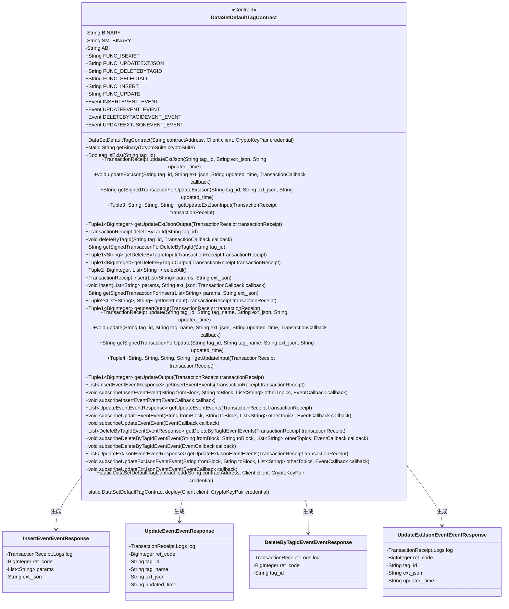
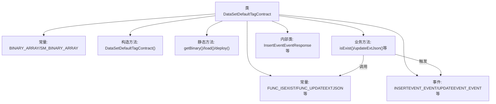
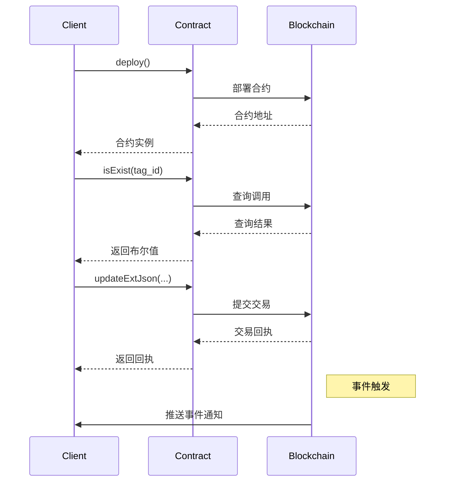

# 基础信息

|      |      |
|------|------|
| 名称 | DataSetDefaultTagContract |
| 编码语言 | .java |
| 代码路径 | WeFe/manager/manager-service/src/main/java/com/welab/wefe/manager/service/contract/DataSetDefaultTagContract.java |
| 包名 | com.welab.wefe.manager.service.contract |
| 依赖项 | ['org.fisco.bcos.sdk.abi.FunctionReturnDecoder', 'org.fisco.bcos.sdk.abi.TypeReference', 'org.fisco.bcos.sdk.abi.datatypes', 'org.fisco.bcos.sdk.abi.datatypes.generated.Int256', 'org.fisco.bcos.sdk.abi.datatypes.generated.tuples.generated.Tuple1', 'org.fisco.bcos.sdk.abi.datatypes.generated.tuples.generated.Tuple2', 'org.fisco.bcos.sdk.abi.datatypes.generated.tuples.generated.Tuple3', 'org.fisco.bcos.sdk.abi.datatypes.generated.tuples.generated.Tuple4', 'org.fisco.bcos.sdk.client.Client', 'org.fisco.bcos.sdk.contract.Contract', 'org.fisco.bcos.sdk.crypto.CryptoSuite', 'org.fisco.bcos.sdk.crypto.keypair.CryptoKeyPair', 'org.fisco.bcos.sdk.eventsub.EventCallback', 'org.fisco.bcos.sdk.model.CryptoType', 'org.fisco.bcos.sdk.model.TransactionReceipt', 'org.fisco.bcos.sdk.model.callback.TransactionCallback', 'org.fisco.bcos.sdk.transaction.model.exception.ContractException', 'java.math.BigInteger', 'java.util.ArrayList', 'java.util.Arrays', 'java.util.Collections', 'java.util.List'] |
| 概述说明 | DataSetDefaultTagContract是一个智能合约类，用于管理数据集默认标签。主要功能包括：检查标签是否存在、更新标签扩展JSON、删除标签、查询所有标签、插入新标签和更新标签信息。合约支持事件监听，如插入、更新、删除等操作的事件响应。适用于区块链环境，使用ECDSA或SM加密算法。 |

# 说明

这是一个名为`DataSetDefaultTagContract`的智能合约Java封装类，主要功能是与区块链上的数据集默认标签合约进行交互。以下是关键信息总结：

1. **合约基础信息**
- 包含ECDSA和SM2两种加密算法的合约二进制代码(BINARY/SM_BINARY)
- 提供完整的ABI接口定义(ABI)
- 定义了6个主要函数和4个事件

2. **核心功能方法**
- 查询类：`isExist()`检查标签是否存在，`selectAll()`查询所有标签
- 更新类：`update()`更新标签信息，`updateExtJson()`更新扩展JSON
- 操作类：`insert()`插入新标签，`deleteByTagId()`删除标签

3. **事件处理**
- 提供了4个事件的响应处理类和方法：
  * `InsertEvent` 插入事件
  * `UpdateEvent` 更新事件
  * `DeleteByTagIdEvent` 删除事件
  * `UpdateExtJsonEvent` 更新JSON事件
- 支持事件订阅和回调机制

4. **辅助功能**
- 支持交易回执的输入/输出参数解析
- 提供带回调的异步交易执行
- 支持生成已签名的交易数据

5. **技术特性**
- 继承自Contract基类，实现标准合约交互模式
- 使用泛型和反射处理不同类型参数
- 支持ECDSA和国密SM2两种加密算法
- 包含完整的JavaDoc风格注释

该类封装了与区块链合约交互的所有细节，为Java应用提供了简单易用的API接口，同时保持了类型安全和灵活性。

# 类列表 Class Summary

| 名称   | 类型  | 说明 |
|-------|------|-------------|
| DataSetDefaultTagContract | class | DataSetDefaultTagContract是一个智能合约类，用于管理数据集默认标签。主要功能包括：1. 检查标签是否存在(isExist)2. 更新标签扩展JSON(updateExtJson)3. 删除标签(deleteByTagId)4. 查询所有标签(selectAll)5. 插入新标签(insert)6. 更新标签信息(update)合约包含4个事件：插入事件、更新事件、删除事件和更新JSON事件。支持ECDSA和SM2两种加密算法，提供同步和异步交易执行方式。 |

## 类 DataSetDefaultTagContract

|      |      |
|------|------|
| 访问范围 | @SuppressWarnings("unchecked");public |
| 类型 | class |
| 名称 | DataSetDefaultTagContract |
| 说明 | DataSetDefaultTagContract是一个智能合约类，用于管理数据集默认标签。主要功能包括：1. 检查标签是否存在(isExist)2. 更新标签扩展JSON(updateExtJson)3. 删除标签(deleteByTagId)4. 查询所有标签(selectAll)5. 插入新标签(insert)6. 更新标签信息(update)合约包含4个事件：插入事件、更新事件、删除事件和更新JSON事件。支持ECDSA和SM2两种加密算法，提供同步和异步交易执行方式。 |

### UML类图

这段代码定义了一个名为DataSetDefaultTagContract的智能合约类，它继承自Contract基类。该合约提供了对数据集默认标签的CRUD操作，包括查询是否存在(isExist)、更新扩展JSON(updateExtJson)、按标签ID删除(deleteByTagId)、查询所有标签(selectAll)、插入新标签(insert)和更新标签(update)等功能。合约还定义了四个事件类型用于记录操作日志：InsertEvent、UpdateEvent、DeleteByTagIdEvent和UpdateExtJsonEvent。每个功能方法都提供了同步和异步调用方式，以及获取签名交易和解析交易结果的方法。

### 内部方法调用关系图

这段代码是FISCO BCOS区块链平台的智能合约Java封装类，主要功能包括：

1. 封装了合约的二进制代码和ABI定义
2. 提供了合约部署(load/deploy)和基础查询功能
3. 实现了6个核心业务方法：标签存在检查、更新扩展JSON、删除标签、查询所有标签、插入新标签和更新标签
4. 定义了4种事件监听结构，用于处理合约事件回调
5. 包含完整的交易输入输出解析功能
6. 支持普通交易和异步交易两种调用方式

该封装类遵循标准的Java合约封装规范，通过静态类型检查确保方法调用的安全性，同时提供完整的事务生命周期管理能力。代码结构清晰，将区块链底层细节与业务接口分离，是典型的区块链中间件实现模式。

### 字段列表 Field List

| 名称  | 类型  | 说明 |
|-------|-------|------|
| UPDATEEXTJSONEVENT_EVENT = new Event("updateExtJsonEvent",             Arrays.<TypeReference<?>>asList(new TypeReference<Int256>() {}, new TypeReference<Utf8String>() {}, new TypeReference<Utf8String>() {}, new TypeReference<Utf8String>() {})) | Event | 定义静态常量UPDATEEXTJSONEVENT_EVENT，类型为Event，包含事件名updateExtJsonEvent及四个参数类型：Int256和三个Utf8String。 |
| BINARY_ARRAY = {"60806040523480156200001157600080fd5b506110016000806101000a81548173ffffffffffffffffffffffffffffffffffffffff021916908373ffffffffffffffffffffffffffffffffffffffff1602179055506000809054906101000a900473ffffffffffffffffffffffffffffffffffffffff1673ffffffffffffffffffffffffffffffffffffffff166356004b6a6040805190810160405280601481526020017f646174615f7365745f64656661756c745f7461670000000000000000000000008152506040518263ffffffff167c010000000000000000000000000000000000000000000000000000000002815260040162000101919062000270565b602060405180830381600087803b1580156200011c57600080fd5b505af115801562000131573d6000803e3d6000fd5b505050506040513d601f19601f8201168201806040525062000157919081019062000174565b506200031a565b60006200016c8251620002c9565b905092915050565b6000602082840312156200018757600080fd5b600062000197848285016200015e565b91505092915050565b6000620001ad82620002be565b808452620001c3816020860160208601620002d3565b620001ce8162000309565b602085010191505092915050565b6000603282527f7461675f69642c7461675f6e616d652c637265617465645f74696d652c75706460208301527f617465645f74696d652c6578745f6a736f6e00000000000000000000000000006040830152606082019050919050565b6000600682527f6669785f696400000000000000000000000000000000000000000000000000006020830152604082019050919050565b600060608201905081810360008301526200028c8184620001a0565b90508181036020830152620002a18162000239565b90508181036040830152620002b681620001dc565b905092915050565b600081519050919050565b6000819050919050565b60005b83811015620002f3578082015181840152602081019050620002d6565b8381111562000303576000848401525b50505050565b6000601f19601f8301169050919050565b613756806200032a6000396000f300608060405260043610610078576000357c0100000000000000000000000000000000000000000000000000000000900463ffffffff1680634d3d096b1461007d57806363964aa3146100ba5780637bf358ed146100f7578063857cb0eb146101345780639729115014610160578063b99c40791461019d575b600080fd5b34801561008957600080fd5b506100a4600480360361009f9190810190612c18565b6101da565b6040516100b19190613054565b60405180910390f35b3480156100c657600080fd5b506100e160048036036100dc9190810190612c9a565b61059e565b6040516100ee919061306f565b60405180910390f35b34801561010357600080fd5b5061011e60048036036101199190810190612c18565b610ae0565b60405161012b919061306f565b60405180910390f35b34801561014057600080fd5b50610149610e6b565b60405161015792919061308a565b60405180910390f35b34801561016c57600080fd5b5061018760048036036101829190810190612adf565b61120f565b604051610194919061306f565b60405180910390f35b3480156101a957600080fd5b506101c460048036036101bf9190810190612d31565b611981565b6040516101d1919061306f565b60405180910390f35b6000806000806000809054906101000a900473ffffffffffffffffffffffffffffffffffffffff1673ffffffffffffffffffffffffffffffffffffffff1663f23f63c96040805190810160405280601481526020017f646174615f7365745f64656661756c745f7461670000000000000000000000008152506040518263ffffffff167c010000000000000000000000000000000000000000000000000000000002815260040161028b91906131f8565b602060405180830381600087803b1580156102a557600080fd5b505af11580156102b9573d6000803e3d6000fd5b505050506040513d601f19601f820116820180604052506102dd9190810190612bc6565b92508273ffffffffffffffffffffffffffffffffffffffff16637857d7c96040518163ffffffff167c0100000000000000000000000000000000000000000000000000000000028152600401602060405180830381600087803b15801561034357600080fd5b505af1158015610357573d6000803e3d6000fd5b505050506040513d601f19601f8201168201806040525061037b9190810190612b4b565b91508173ffffffffffffffffffffffffffffffffffffffff1663cd30a1d1866040518263ffffffff167c01000000000000000000000000000000000000000000000000000000000281526004016103d29190613500565b600060405180830381600087803b1580156103ec57600080fd5b505af1158015610400573d6000803e3d6000fd5b505050508273ffffffffffffffffffffffffffffffffffffffff1663e8434e396040805190810160405280600a81526020017f6669785f69645f30303400000000000000000000000000000000000000000000815250846040518363ffffffff167c010000000000000000000000000000000000000000000000000000000002815260040161049092919061321a565b602060405180830381600087803b1580156104aa57600080fd5b505af11580156104be573d6000803e3d6000fd5b505050506040513d601f19601f820116820180604052506104e29190810190612b74565b905060008173ffffffffffffffffffffffffffffffffffffffff1663949d225d6040518163ffffffff167c0100000000000000000000000000000000000000000000000000000000028152600401602060405180830381600087803b15801561054a57600080fd5b505af115801561055e573d6000803e3d6000fd5b505050506040513d601f19601f820116820180604052506105829190810190612bef565b11156105915760019350610596565b600093505b505050919050565b6000806000806000806000809054906101000a900473ffffffffffffffffffffffffffffffffffffffff1673ffffffffffffffffffffffffffffffffffffffff1663f23f63c96040805190810160405280601481526020017f646174615f7365745f64656661756c745f7461670000000000000000000000008152506040518263ffffffff167c010000000000000000000000000000000000000000000000000000000002815260040161065291906131f8565b602060405180830381600087803b15801561066c57600080fd5b505af1158015610680573d6000803e3d6000fd5b505050506040513d601f19601f820116820180604052506106a49190810190612bc6565b94508473ffffffffffffffffffffffffffffffffffffffff16637857d7c96040518163ffffffff167c0100000000000000000000000000000000000000000000000000000000028152600401602060405180830381600087803b15801561070a57600080fd5b505af115801561071e573d6000803e3d6000fd5b505050506040513d601f19601f820116820180604052506107429190810190612b4b565b93508373ffffffffffffffffffffffffffffffffffffffff1663cd30a1d18a6040518263ffffffff167c01000000000000000000000000000000000000000000000000000000000281526004016107999190613500565b600060405180830381600087803b1580156107b357600080fd5b505af11580156107c7573d6000803e3d6000fd5b505050508473ffffffffffffffffffffffffffffffffffffffff166313db93466040518163ffffffff167c0100000000000000000000000000000000000000000000000000000000028152600401602060405180830381600087803b15801561082f57600080fd5b505af1158015610843573d6000803e3d6000fd5b505050506040513d601f19601f820116820180604052506108679190810190612b9d565b92508273ffffffffffffffffffffffffffffffffffffffff1663e942b516896040518263ffffffff167c01000000000000000000000000000000000000000000000000000000000281526004016108be91906132d8565b600060405180830381600087803b1580156108d857600080fd5b505af11580156108ec573d6000803e3d6000fd5b505050508273ffffffffffffffffffffffffffffffffffffffff1663e942b516886040518263ffffffff167c01000000000000000000000000000000000000000000000000000000000281526004016109459190613421565b600060405180830381600087803b15801561095f57600080fd5b505af1158015610973573d6000803e3d6000fd5b505050508473ffffffffffffffffffffffffffffffffffffffff1663bf2b70a16040805190810160405280600a81526020017f6669785f69645f3030340000000000000000000000000000000000000000000081525085876040518463ffffffff167c0100000000000000000000000000000000000000000000000000000000028152600401610a059392919061327a565b602060405180830381600087803b158015610a1f57600080fd5b505af1158015610a33573d6000803e3d6000fd5b505050506040513d601f19601f82011682018060405250610a579190810190612bef565b915060009050600182121515610a705760009050610a94565b7ffffffffffffffffffffffffffffffffffffffffffffffffffffffffffffffffe90505b7f91fa9d6109b9b8b47733f98f4b6858346683ebdf73ba3c2f98b90c0d352f83e1818a8a8a604051610ac9949392919061312f565b60405180910390a180955050505050509392505050565b60008060008060008093506000809054906101000a900473ffffffffffffffffffffffffffffffffffffffff1673ffffffffffffffffffffffffffffffffffffffff1663f23f63c96040805190810160405280601481526020017f646174615f7365745f64656661756c745f7461670000000000000000000000008152506040518263ffffffff167c0100000000000000000000000000000000000000000000000000000000028152600401610b9691906131f8565b602060405180830381600087803b158015610bb057600080fd5b505af1158015610bc4573d6000803e3d6000fd5b505050506040513d601f19601f82011682018060405250610be89190810190612bc6565b92508273ffffffffffffffffffffffffffffffffffffffff16637857d7c96040518163ffffffff167c0100000000000000000000000000000000000000000000000000000000028152600401602060405180830381600087803b158015610c4e57600080fd5b505af1158015610c62573d6000803e3d6000fd5b505050506040513d601f19601f82011682018060405250610c869190810190612b4b565b91508173ffffffffffffffffffffffffffffffffffffffff1663cd30a1d1876040518263ffffffff167c0100000000000000000000000000000000000000000000000000000000028152600401610c", "dd9190613500565b600060405180830381600087803b158015610cf757600080fd5b505af1158015610d0b573d6000803e3d6000fd5b505050508273ffffffffffffffffffffffffffffffffffffffff166328bb21176040805190810160405280600a81526020017f6669785f69645f30303400000000000000000000000000000000000000000000815250846040518363ffffffff167c0100000000000000000000000000000000000000000000000000000000028152600401610d9b92919061321a565b602060405180830381600087803b158015610db557600080fd5b505af1158015610dc9573d6000803e3d6000fd5b505050506040513d601f19601f82011682018060405250610ded9190810190612bef565b9050600181121515610e025760009350610e26565b7ffffffffffffffffffffffffffffffffffffffffffffffffffffffffffffffffe93505b7f5b67fcfc52bf8293823b40863b3cf1890e73d0eae2e12fd2eada0bcc37ce68f38487604051610e579291906130ff565b60405180910390a180945050505050919050565b600060606000806000809054906101000a900473ffffffffffffffffffffffffffffffffffffffff1673ffffffffffffffffffffffffffffffffffffffff1663f23f63c96040805190810160405280601481526020017f646174615f7365745f64656661756c745f7461670000000000000000000000008152506040518263ffffffff167c0100000000000000000000000000000000000000000000000000000000028152600401610f1d91906131f8565b602060405180830381600087803b158015610f3757600080fd5b505af1158015610f4b573d6000803e3d6000fd5b505050506040513d601f19601f82011682018060405250610f6f9190810190612bc6565b91508173ffffffffffffffffffffffffffffffffffffffff1663e8434e396040805190810160405280600a81526020017f6669785f69645f303034000000000000000000000000000000000000000000008152508473ffffffffffffffffffffffffffffffffffffffff16637857d7c96040518163ffffffff167c0100000000000000000000000000000000000000000000000000000000028152600401602060405180830381600087803b15801561102757600080fd5b505af115801561103b573d6000803e3d6000fd5b505050506040513d601f19601f8201168201806040525061105f9190810190612b4b565b6040518363ffffffff167c010000000000000000000000000000000000000000000000000000000002815260040161109892919061321a565b602060405180830381600087803b1580156110b257600080fd5b505af11580156110c6573d6000803e3d6000fd5b505050506040513d601f19601f820116820180604052506110ea9190810190612b74565b90508073ffffffffffffffffffffffffffffffffffffffff1663949d225d6040518163ffffffff167c0100000000000000000000000000000000000000000000000000000000028152600401602060405180830381600087803b15801561115057600080fd5b505af1158015611164573d6000803e3d6000fd5b505050506040513d601f19601f820116820180604052506111889190810190612bef565b600014156111f6577ffffffffffffffffffffffffffffffffffffffffffffffffffffffffffffffffd60006040519080825280602002602001820160405280156111e657816020015b60608152602001906001900390816111d15790505b5081915080905093509350611209565b600061120182611fc7565b819150935093505b50509091565b600080600080600080935061123b87600081518110151561122c57fe5b906020019060200201516101da565b156112c6577fffffffffffffffffffffffffffffffffffffffffffffffffffffffffffffffff93507f5157dc1ab0b55c7621be94a34b2ae4228f7d16e8271628060cc027b1a513b12f848888604051611296939291906130ba565b60405180910390a17fffffffffffffffffffffffffffffffffffffffffffffffffffffffffffffffff9450611977565b6000809054906101000a900473ffffffffffffffffffffffffffffffffffffffff1673ffffffffffffffffffffffffffffffffffffffff1663f23f63c96040805190810160405280601481526020017f646174615f7365745f64656661756c745f7461670000000000000000000000008152506040518263ffffffff167c010000000000000000000000000000000000000000000000000000000002815260040161137191906131f8565b602060405180830381600087803b15801561138b57600080fd5b505af115801561139f573d6000803e3d6000fd5b505050506040513d601f19601f820116820180604052506113c39190810190612bc6565b92508273ffffffffffffffffffffffffffffffffffffffff166313db93466040518163ffffffff167c0100000000000000000000000000000000000000000000000000000000028152600401602060405180830381600087803b15801561142957600080fd5b505af115801561143d573d6000803e3d6000fd5b505050506040513d601f19601f820116820180604052506114619190810190612b9d565b91508173ffffffffffffffffffffffffffffffffffffffff1663e942b5166040805190810160405280600a81526020017f6669785f69645f303034000000000000000000000000000000000000000000008152506040518263ffffffff167c01000000000000000000000000000000000000000000000000000000000281526004016114ed919061330d565b600060405180830381600087803b15801561150757600080fd5b505af115801561151b573d6000803e3d6000fd5b505050508173ffffffffffffffffffffffffffffffffffffffff1663e942b51688600081518110151561154a57fe5b906020019060200201516040518263ffffffff167c010000000000000000000000000000000000000000000000000000000002815260040161158c91906134cb565b600060405180830381600087803b1580156115a657600080fd5b505af11580156115ba573d6000803e3d6000fd5b505050508173ffffffffffffffffffffffffffffffffffffffff1663e942b5168860018151811015156115e957fe5b906020019060200201516040518263ffffffff167c010000000000000000000000000000000000000000000000000000000002815260040161162b9190613362565b600060405180830381600087803b15801561164557600080fd5b505af1158015611659573d6000803e3d6000fd5b505050508173ffffffffffffffffffffffffffffffffffffffff1663e942b51688600281518110151561168857fe5b906020019060200201516040518263ffffffff167c01000000000000000000000000000000000000000000000000000000000281526004016116ca9190613476565b600060405180830381600087803b1580156116e457600080fd5b505af11580156116f8573d6000803e3d6000fd5b505050508173ffffffffffffffffffffffffffffffffffffffff1663e942b51688600381518110151561172757fe5b906020019060200201516040518263ffffffff167c010000000000000000000000000000000000000000000000000000000002815260040161176991906133ec565b600060405180830381600087803b15801561178357600080fd5b505af1158015611797573d6000803e3d6000fd5b505050508173ffffffffffffffffffffffffffffffffffffffff1663e942b516876040518263ffffffff167c01000000000000000000000000000000000000000000000000000000000281526004016117f091906132d8565b600060405180830381600087803b15801561180a57600080fd5b505af115801561181e573d6000803e3d6000fd5b505050508273ffffffffffffffffffffffffffffffffffffffff166331afac366040805190810160405280600a81526020017f6669785f69645f30303400000000000000000000000000000000000000000000815250846040518363ffffffff167c01000000000000000000000000000000000000000000000000000000000281526004016118ae92919061324a565b602060405180830381600087803b1580156118c857600080fd5b505af11580156118dc573d6000803e3d6000fd5b505050506040513d601f19601f820116820180604052506119009190810190612bef565b905060018114156119145760009350611938565b7ffffffffffffffffffffffffffffffffffffffffffffffffffffffffffffffffe93505b7f5157dc1ab0b55c7621be94a34b2ae4228f7d16e8271628060cc027b1a513b12f84888860405161196b939291906130ba565b60405180910390a18094505b5050505092915050565b600080600080600080600094506119978a6101da565b1515611a07577fffffffffffffffffffffffffffffffffffffffffffffffffffffffffffffffff94507f8718faa5c5c2bb075c6af3f223c80ed4c4632bd62204f0cbfdfb360b366ee20c858b8b8b8b6040516119f7959493929190613189565b60405180910390a1849550611fba565b6000809054906101000a900473ffffffffffffffffffffffffffffffffffffffff1673ffffffffffffffffffffffffffffffffffffffff1663f23f63c96040805190810160405280601481526020017f646174615f7365745f64656661756c745f7461670000000000000000000000008152506040518263ffffffff167c0100000000000000000000000000000000000000000000000000000000028152600401611ab291906131f8565b602060405180830381600087803b158015611acc57600080fd5b505af1158015611ae0573d6000803e3d6000fd5b505050506040513d601f19601f82011682018060405250611b049190810190612bc6565b93508373ffffffffffffffffffffffffffffffffffffffff16637857d7c96040518163ffffffff167c0100000000000000000000000000000000000000000000000000000000028152600401602060405180830381600087803b158015611b6a57600080fd5b505af1158015611b7e573d6000803e3d6000fd5b505050506040513d601f19601f82011682018060405250611ba29190810190612b4b565b92508273ffffffffffffffffffffffffffffffffffffffff1663cd30a1d18b6040518263ffffffff167c0100000000000000000000000000000000000000000000000000000000028152600401611bf99190613500565b600060405180830381600087803b158015611c1357600080fd5b505af1158015611c27573d6000803e3d6000fd5b505050508373ffffffffffffffffffffffffffffffffffffffff166313db93466040518163ffffffff167c0100000000000000000000000000000000000000000000000000000000028152600401602060405180830381600087803b158015611c8f57600080fd5b505af1158015611ca3573d6000803e3d6000fd5b505050506040513d601f19601f82011682018060405250611cc79190810190612b9d565b91508173ffffffffffffffffffff", "ffffffffffffffffffff1663e942b5168a6040518263ffffffff167c0100000000000000000000000000000000000000000000000000000000028152600401611d1e9190613397565b600060405180830381600087803b158015611d3857600080fd5b505af1158015611d4c573d6000803e3d6000fd5b505050508173ffffffffffffffffffffffffffffffffffffffff1663e942b516886040518263ffffffff167c0100000000000000000000000000000000000000000000000000000000028152600401611da59190613421565b600060405180830381600087803b158015611dbf57600080fd5b505af1158015611dd3573d6000803e3d6000fd5b505050508173ffffffffffffffffffffffffffffffffffffffff1663e942b516896040518263ffffffff167c0100000000000000000000000000000000000000000000000000000000028152600401611e2c91906132d8565b600060405180830381600087803b158015611e4657600080fd5b505af1158015611e5a573d6000803e3d6000fd5b505050508373ffffffffffffffffffffffffffffffffffffffff1663bf2b70a16040805190810160405280600a81526020017f6669785f69645f3030340000000000000000000000000000000000000000000081525084866040518463ffffffff167c0100000000000000000000000000000000000000000000000000000000028152600401611eec9392919061327a565b602060405180830381600087803b158015611f0657600080fd5b505af1158015611f1a573d6000803e3d6000fd5b505050506040513d601f19601f82011682018060405250611f3e9190810190612bef565b9050600181121515611f535760009450611f77565b7ffffffffffffffffffffffffffffffffffffffffffffffffffffffffffffffffe94505b7f8718faa5c5c2bb075c6af3f223c80ed4c4632bd62204f0cbfdfb360b366ee20c858b8b8b8b604051611fae959493929190613189565b60405180910390a18095505b5050505050949350505050565b60608060008060608573ffffffffffffffffffffffffffffffffffffffff1663949d225d6040518163ffffffff167c0100000000000000000000000000000000000000000000000000000000028152600401602060405180830381600087803b15801561203357600080fd5b505af1158015612047573d6000803e3d6000fd5b505050506040513d601f19601f8201168201806040525061206b9190810190612bef565b60405190808252806020026020018201604052801561209e57816020015b60608152602001906001900390816120895790505b509350600092505b8573ffffffffffffffffffffffffffffffffffffffff1663949d225d6040518163ffffffff167c0100000000000000000000000000000000000000000000000000000000028152600401602060405180830381600087803b15801561210a57600080fd5b505af115801561211e573d6000803e3d6000fd5b505050506040513d601f19601f820116820180604052506121429190810190612bef565b8312156126c2578573ffffffffffffffffffffffffffffffffffffffff1663846719e0846040518263ffffffff167c010000000000000000000000000000000000000000000000000000000002815260040161219e919061306f565b602060405180830381600087803b1580156121b857600080fd5b505af11580156121cc573d6000803e3d6000fd5b505050506040513d601f19601f820116820180604052506121f09190810190612b9d565b91506122e26122a78373ffffffffffffffffffffffffffffffffffffffff16639c981fcb6040518163ffffffff167c010000000000000000000000000000000000000000000000000000000002815260040161224b906134ab565b600060405180830381600087803b15801561226557600080fd5b505af1158015612279573d6000803e3d6000fd5b505050506040513d6000823e3d601f19601f820116820180604052506122a29190810190612c59565b6126ce565b6040805190810160405280600181526020017f7c00000000000000000000000000000000000000000000000000000000000000815250612727565b905061239f8161239a8473ffffffffffffffffffffffffffffffffffffffff16639c981fcb6040518163ffffffff167c010000000000000000000000000000000000000000000000000000000002815260040161233e90613342565b600060405180830381600087803b15801561235857600080fd5b505af115801561236c573d6000803e3d6000fd5b505050506040513d6000823e3d601f19601f820116820180604052506123959190810190612c59565b6126ce565b612727565b90506123e0816040805190810160405280600181526020017f7c00000000000000000000000000000000000000000000000000000000000000815250612727565b905061249d816124988473ffffffffffffffffffffffffffffffffffffffff16639c981fcb6040518163ffffffff167c010000000000000000000000000000000000000000000000000000000002815260040161243c90613456565b600060405180830381600087803b15801561245657600080fd5b505af115801561246a573d6000803e3d6000fd5b505050506040513d6000823e3d601f19601f820116820180604052506124939190810190612c59565b6126ce565b612727565b90506124de816040805190810160405280600181526020017f7c00000000000000000000000000000000000000000000000000000000000000815250612727565b905061259b816125968473ffffffffffffffffffffffffffffffffffffffff16639c981fcb6040518163ffffffff167c010000000000000000000000000000000000000000000000000000000002815260040161253a906133cc565b600060405180830381600087803b15801561255457600080fd5b505af1158015612568573d6000803e3d6000fd5b505050506040513d6000823e3d601f19601f820116820180604052506125919190810190612c59565b6126ce565b612727565b90506125dc816040805190810160405280600181526020017f7c00000000000000000000000000000000000000000000000000000000000000815250612727565b9050612699816126948473ffffffffffffffffffffffffffffffffffffffff16639c981fcb6040518163ffffffff167c0100000000000000000000000000000000000000000000000000000000028152600401612638906132b8565b600060405180830381600087803b15801561265257600080fd5b505af1158015612666573d6000803e3d6000fd5b505050506040513d6000823e3d601f19601f8201168201806040525061268f9190810190612c59565b6126ce565b612727565b90508084848151811015156126aa57fe5b906020019060200201819052508260010192506120a6565b83945050505050919050565b606060006126db836128f8565b141561271e576040805190810160405280600181526020017f20000000000000000000000000000000000000000000000000000000000000008152509050612722565b8190505b919050565b606080606080606060008088955087945084518651016040519080825280601f01601f19166020018201604052801561276f5781602001602082028038833980820191505090505b50935083925060009150600090505b855181101561283157858181518110151561279557fe5b9060200101517f010000000000000000000000000000000000000000000000000000000000000090047f01000000000000000000000000000000000000000000000000000000000000000283838060010194508151811015156127f457fe5b9060200101907effffffffffffffffffffffffffffffffffffffffffffffffffffffffffffff1916908160001a905350808060010191505061277e565b600090505b84518110156128e957848181518110151561284d57fe5b9060200101517f010000000000000000000000000000000000000000000000000000000000000090047f01000000000000000000000000000000000000000000000000000000000000000283838060010194508151811015156128ac57fe5b9060200101907effffffffffffffffffffffffffffffffffffffffffffffffffffffffffffff1916908160001a9053508080600101915050612836565b83965050505050505092915050565b600081519050919050565b600082601f830112151561291657600080fd5b813561292961292482613562565b613535565b9150818183526020840193506020810190508360005b8381101561296f578135860161295588826129dd565b84526020840193506020830192505060018101905061293f565b5050505092915050565b60006129858251613653565b905092915050565b60006129998251613665565b905092915050565b60006129ad8251613677565b905092915050565b60006129c18251613689565b905092915050565b60006129d5825161369b565b905092915050565b600082601f83011215156129f057600080fd5b8135612a036129fe8261358a565b613535565b91508082526020830160208301858383011115612a1f57600080fd5b612a2a8382846136c9565b50505092915050565b600082601f8301121515612a4657600080fd5b8135612a59612a54826135b6565b613535565b91508082526020830160208301858383011115612a7557600080fd5b612a808382846136c9565b50505092915050565b600082601f8301121515612a9c57600080fd5b8151612aaf612aaa826135b6565b613535565b91508082526020830160208301858383011115612acb57600080fd5b612ad68382846136d8565b50505092915050565b60008060408385031215612af257600080fd5b600083013567ffffffffffffffff811115612b0c57600080fd5b612b1885828601612903565b925050602083013567ffffffffffffffff811115612b3557600080fd5b612b4185828601612a33565b9150509250929050565b600060208284031215612b5d57600080fd5b6000612b6b84828501612979565b91505092915050565b600060208284031215612b8657600080fd5b6000612b948482850161298d565b91505092915050565b600060208284031215612baf57600080fd5b6000612bbd848285016129a1565b91505092915050565b600060208284031215612bd857600080fd5b6000612be6848285016129b5565b91505092915050565b600060208284031215612c0157600080fd5b6000612c0f848285016129c9565b91505092915050565b600060208284031215612c2a57600080fd5b600082013567ffffffffffffffff811115612c4457600080fd5b612c5084828501612a33565b91505092915050565b600060208284031215612c6b57600080fd5b600082015167ffffffffffffffff811115612c8557600080fd5b612c9184828501612a89565b91505092915050565b600080600060608486031215612caf57600080fd5b600084013567ffffffffffffffff811115612cc957600080fd5b612cd586828701612a33565b", "935050602084013567ffffffffffffffff811115612cf257600080fd5b612cfe86828701612a33565b925050604084013567ffffffffffffffff811115612d1b57600080fd5b612d2786828701612a33565b9150509250925092565b60008060008060808587031215612d4757600080fd5b600085013567ffffffffffffffff811115612d6157600080fd5b612d6d87828801612a33565b945050602085013567ffffffffffffffff811115612d8a57600080fd5b612d9687828801612a33565b935050604085013567ffffffffffffffff811115612db357600080fd5b612dbf87828801612a33565b925050606085013567ffffffffffffffff811115612ddc57600080fd5b612de887828801612a33565b91505092959194509250565b6000612dff826135ef565b80845260208401935083602082028501612e18856135e2565b60005b84811015612e51578383038852612e33838351612ed4565b9250612e3e82613610565b9150602088019750600181019050612e1b565b508196508694505050505092915050565b612e6b8161363d565b82525050565b612e7a816136a5565b82525050565b612e89816136b7565b82525050565b612e9881613649565b82525050565b6000612ea982613605565b808452612ebd8160208601602086016136d8565b612ec68161370b565b602085010191505092915050565b6000612edf826135fa565b808452612ef38160208601602086016136d8565b612efc8161370b565b602085010191505092915050565b6000600882527f6578745f6a736f6e0000000000000000000000000000000000000000000000006020830152604082019050919050565b6000600682527f6669785f696400000000000000000000000000000000000000000000000000006020830152604082019050919050565b6000600882527f7461675f6e616d650000000000000000000000000000000000000000000000006020830152604082019050919050565b6000600c82527f757064617465645f74696d6500000000000000000000000000000000000000006020830152604082019050919050565b6000600c82527f637265617465645f74696d6500000000000000000000000000000000000000006020830152604082019050919050565b6000600682527f7461675f696400000000000000000000000000000000000000000000000000006020830152604082019050919050565b60006020820190506130696000830184612e62565b92915050565b60006020820190506130846000830184612e8f565b92915050565b600060408201905061309f6000830185612e8f565b81810360208301526130b18184612df4565b90509392505050565b60006060820190506130cf6000830186612e8f565b81810360208301526130e18185612df4565b905081810360408301526130f58184612e9e565b9050949350505050565b60006040820190506131146000830185612e8f565b81810360208301526131268184612e9e565b90509392505050565b60006080820190506131446000830187612e8f565b81810360208301526131568186612e9e565b9050818103604083015261316a8185612e9e565b9050818103606083015261317e8184612e9e565b905095945050505050565b600060a08201905061319e6000830188612e8f565b81810360208301526131b08187612e9e565b905081810360408301526131c48186612e9e565b905081810360608301526131d88185612e9e565b905081810360808301526131ec8184612e9e565b90509695505050505050565b600060208201905081810360008301526132128184612ed4565b905092915050565b600060408201905081810360008301526132348185612ed4565b90506132436020830184612e71565b9392505050565b600060408201905081810360008301526132648185612ed4565b90506132736020830184612e80565b9392505050565b600060608201905081810360008301526132948186612ed4565b90506132a36020830185612e80565b6132b06040830184612e71565b949350505050565b600060208201905081810360008301526132d181612f0a565b9050919050565b600060408201905081810360008301526132f181612f0a565b905081810360208301526133058184612e9e565b905092915050565b6000604082019050818103600083015261332681612f41565b9050818103602083015261333a8184612ed4565b905092915050565b6000602082019050818103600083015261335b81612f78565b9050919050565b6000604082019050818103600083015261337b81612f78565b9050818103602083015261338f8184612ed4565b905092915050565b600060408201905081810360008301526133b081612f78565b905081810360208301526133c48184612e9e565b905092915050565b600060208201905081810360008301526133e581612faf565b9050919050565b6000604082019050818103600083015261340581612faf565b905081810360208301526134198184612ed4565b905092915050565b6000604082019050818103600083015261343a81612faf565b9050818103602083015261344e8184612e9e565b905092915050565b6000602082019050818103600083015261346f81612fe6565b9050919050565b6000604082019050818103600083015261348f81612fe6565b905081810360208301526134a38184612ed4565b905092915050565b600060208201905081810360008301526134c48161301d565b9050919050565b600060408201905081810360008301526134e48161301d565b905081810360208301526134f88184612ed4565b905092915050565b600060408201905081810360008301526135198161301d565b9050818103602083015261352d8184612e9e565b905092915050565b6000604051905081810181811067ffffffffffffffff8211171561355857600080fd5b8060405250919050565b600067ffffffffffffffff82111561357957600080fd5b602082029050602081019050919050565b600067ffffffffffffffff8211156135a157600080fd5b601f19601f8301169050602081019050919050565b600067ffffffffffffffff8211156135cd57600080fd5b601f19601f8301169050602081019050919050565b6000602082019050919050565b600081519050919050565b600081519050919050565b600081519050919050565b6000602082019050919050565b600073ffffffffffffffffffffffffffffffffffffffff82169050919050565b60008115159050919050565b6000819050919050565b600061365e8261361d565b9050919050565b60006136708261361d565b9050919050565b60006136828261361d565b9050919050565b60006136948261361d565b9050919050565b6000819050919050565b60006136b08261361d565b9050919050565b60006136c28261361d565b9050919050565b82818337600083830152505050565b60005b838110156136f65780820151818401526020810190506136db565b83811115613705576000848401525b50505050565b6000601f19601f83011690509190505600a265627a7a72305820ec412e7a93ab136d11ebcdf9068f86866ed15e3560e756c0e98f091d24c4aa7d6c6578706572696d656e74616cf50037"} | String[] | 这是一个包含两个十六进制字符串的数组，可能代表智能合约的字节码或二进制数据。 |
| BINARY = String.join("", BINARY_ARRAY) | String | 将BINARY_ARRAY拼接为字符串并赋值给常量BINARY。 |
| INSERTEVENT_EVENT = new Event("insertEvent",             Arrays.<TypeReference<?>>asList(new TypeReference<Int256>() {}, new TypeReference<DynamicArray<Utf8String>>() {}, new TypeReference<Utf8String>() {})) | Event | 定义静态常量INSERTEVENT_EVENT，类型为Event，包含事件名"insertEvent"及三个参数类型：Int256、DynamicArray<Utf8String>和Utf8String。 |
| FUNC_ISEXIST = "isExist" | String | 静态常量字符串FUNC_ISEXIST，值为"isExist"。 |
| UPDATEEVENT_EVENT = new Event("updateEvent",             Arrays.<TypeReference<?>>asList(new TypeReference<Int256>() {}, new TypeReference<Utf8String>() {}, new TypeReference<Utf8String>() {}, new TypeReference<Utf8String>() {}, new TypeReference<Utf8String>() {})) | Event | 定义名为UPDATEEVENT_EVENT的公共静态常量事件，包含Int256和四个Utf8String类型参数。 |
| ABI = String.join("", ABI_ARRAY) | String | 将ABI_ARRAY数组拼接为ABI字符串常量。 |
| ABI_ARRAY = {"[{\"constant\":true,\"inputs\":[{\"name\":\"tag_id\",\"type\":\"string\"}],\"name\":\"isExist\",\"outputs\":[{\"name\":\"\",\"type\":\"bool\"}],\"payable\":false,\"stateMutability\":\"view\",\"type\":\"function\"},{\"constant\":false,\"inputs\":[{\"name\":\"tag_id\",\"type\":\"string\"},{\"name\":\"ext_json\",\"type\":\"string\"},{\"name\":\"updated_time\",\"type\":\"string\"}],\"name\":\"updateExtJson\",\"outputs\":[{\"name\":\"\",\"type\":\"int256\"}],\"payable\":false,\"stateMutability\":\"nonpayable\",\"type\":\"function\"},{\"constant\":false,\"inputs\":[{\"name\":\"tag_id\",\"type\":\"string\"}],\"name\":\"deleteByTagId\",\"outputs\":[{\"name\":\"\",\"type\":\"int256\"}],\"payable\":false,\"stateMutability\":\"nonpayable\",\"type\":\"function\"},{\"constant\":true,\"inputs\":[],\"name\":\"selectAll\",\"outputs\":[{\"name\":\"\",\"type\":\"int256\"},{\"name\":\"\",\"type\":\"string[]\"}],\"payable\":false,\"stateMutability\":\"view\",\"type\":\"function\"},{\"constant\":false,\"inputs\":[{\"name\":\"params\",\"type\":\"string[]\"},{\"name\":\"ext_json\",\"type\":\"string\"}],\"name\":\"insert\",\"outputs\":[{\"name\":\"\",\"type\":\"int256\"}],\"payable\":false,\"stateMutability\":\"nonpayable\",\"type\":\"function\"},{\"constant\":false,\"inputs\":[{\"name\":\"tag_id\",\"type\":\"string\"},{\"name\":\"tag_name\",\"type\":\"string\"},{\"name\":\"ext_json\",\"type\":\"string\"},{\"name\":\"updated_time\",\"type\":\"string\"}],\"name\":\"update\",\"outputs\":[{\"name\":\"\",\"type\":\"int256\"}],\"payable\":false,\"stateMutability\":\"nonpayable\",\"type\":\"function\"},{\"inputs\":[],\"payable\":false,\"stateMutability\":\"nonpayable\",\"type\":\"constructor\"},{\"anonymous\":false,\"inputs\":[{\"indexed\":false,\"name\":\"ret_code\",\"type\":\"int256\"},{\"indexed\":false,\"name\":\"params\",\"type\":\"string[]\"},{\"indexed\":false,\"name\":\"ext_json\",\"type\":\"string\"}],\"name\":\"insertEvent\",\"type\":\"event\"},{\"anonymous\":false,\"inputs\":[{\"indexed\":false,\"name\":\"ret_code\",\"type\":\"int256\"},{\"indexed\":false,\"name\":\"tag_id\",\"type\":\"string\"},{\"indexed\":false,\"name\":\"tag_name\",\"type\":\"string\"},{\"indexed\":false,\"name\":\"ext_json\",\"type\":\"string\"},{\"indexed\":false,\"name\":\"updated_time\",\"type\":\"string\"}],\"name\":\"updateEvent\",\"type\":\"event\"},{\"anonymous\":false,\"inputs\":[{\"indexed\":false,\"name\":\"ret_code\",\"type\":\"int256\"},{\"indexed\":false,\"name\":\"tag_id\",\"type\":\"string\"}],\"name\":\"deleteByTagIdEvent\",\"type\":\"event\"},{\"anonymous\":false,\"inputs\":[{\"indexed\":false,\"name\":\"ret_code\",\"type\":\"int256\"},{\"indexed\":false,\"name\":\"tag_id\",\"type\":\"string\"},{\"indexed\":false,\"name\":\"ext_json\",\"type\":\"string\"},{\"indexed\":false,\"name\":\"updated_time\",\"type\":\"string\"}],\"name\":\"updateExtJsonEvent\",\"type\":\"event\"}]"} | String[] | ABI数组包含智能合约的函数和事件定义，涉及查询、更新、删除和插入操作，以及相关事件。 |
| FUNC_INSERT = "insert" | String | 静态常量FUNC_INSERT定义为字符串"insert"。 |
| DELETEBYTAGIDEVENT_EVENT = new Event("deleteByTagIdEvent",             Arrays.<TypeReference<?>>asList(new TypeReference<Int256>() {}, new TypeReference<Utf8String>() {})) | Event | 定义静态常量DELETEBYTAGIDEVENT_EVENT，类型为Event，包含事件名"deleteByTagIdEvent"和两个参数类型Int256与Utf8String。 |
| SM_BINARY_ARRAY = {"60806040523480156200001157600080fd5b506110016000806101000a81548173ffffffffffffffffffffffffffffffffffffffff021916908373ffffffffffffffffffffffffffffffffffffffff1602179055506000809054906101000a900473ffffffffffffffffffffffffffffffffffffffff1673ffffffffffffffffffffffffffffffffffffffff1663c92a78016040805190810160405280601481526020017f646174615f7365745f64656661756c745f7461670000000000000000000000008152506040518263ffffffff167c010000000000000000000000000000000000000000000000000000000002815260040162000101919062000270565b602060405180830381600087803b1580156200011c57600080fd5b505af115801562000131573d6000803e3d6000fd5b505050506040513d601f19601f8201168201806040525062000157919081019062000174565b506200031a565b60006200016c8251620002c9565b905092915050565b6000602082840312156200018757600080fd5b600062000197848285016200015e565b91505092915050565b6000620001ad82620002be565b808452620001c3816020860160208601620002d3565b620001ce8162000309565b602085010191505092915050565b6000600682527f6669785f696400000000000000000000000000000000000000000000000000006020830152604082019050919050565b6000603282527f7461675f69642c7461675f6e616d652c637265617465645f74696d652c75706460208301527f617465645f74696d652c6578745f6a736f6e00000000000000000000000000006040830152606082019050919050565b600060608201905081810360008301526200028c8184620001a0565b90508181036020830152620002a181620001dc565b90508181036040830152620002b68162000213565b905092915050565b600081519050919050565b6000819050919050565b60005b83811015620002f3578082015181840152602081019050620002d6565b8381111562000303576000848401525b50505050565b6000601f19601f8301169050919050565b613756806200032a6000396000f300608060405260043610610078576000357c0100000000000000000000000000000000000000000000000000000000900463ffffffff16806315d0d6251461007d578063568fe885146100ba5780639eb03ade146100f7578063abfe57f414610134578063ac7c89a914610171578063c181ca36146101ae575b600080fd5b34801561008957600080fd5b506100a4600480360361009f9190810190612c9a565b6101da565b6040516100b1919061306f565b60405180910390f35b3480156100c657600080fd5b506100e160048036036100dc9190810190612c18565b61071c565b6040516100ee9190613054565b60405180910390f35b34801561010357600080fd5b5061011e60048036036101199190810190612adf565b610ae0565b60405161012b919061306f565b60405180910390f35b34801561014057600080fd5b5061015b60048036036101569190810190612c18565b611252565b604051610168919061306f565b60405180910390f35b34801561017d57600080fd5b5061019860048036036101939190810190612d31565b6115dd565b6040516101a5919061306f565b60405180910390f35b3480156101ba57600080fd5b506101c3611c23565b6040516101d192919061308a565b60405180910390f35b6000806000806000806000809054906101000a900473ffffffffffffffffffffffffffffffffffffffff1673ffffffffffffffffffffffffffffffffffffffff166359a48b656040805190810160405280601481526020017f646174615f7365745f64656661756c745f7461670000000000000000000000008152506040518263ffffffff167c010000000000000000000000000000000000000000000000000000000002815260040161028e91906131f8565b602060405180830381600087803b1580156102a857600080fd5b505af11580156102bc573d6000803e3d6000fd5b505050506040513d601f19601f820116820180604052506102e09190810190612bc6565b94508473ffffffffffffffffffffffffffffffffffffffff1663c74f8caf6040518163ffffffff167c0100000000000000000000000000000000000000000000000000000000028152600401602060405180830381600087803b15801561034657600080fd5b505af115801561035a573d6000803e3d6000fd5b505050506040513d601f19601f8201168201806040525061037e9190810190612b4b565b93508373ffffffffffffffffffffffffffffffffffffffff1663ae763db58a6040518263ffffffff167c01000000000000000000000000000000000000000000000000000000000281526004016103d59190613476565b600060405180830381600087803b1580156103ef57600080fd5b505af1158015610403573d6000803e3d6000fd5b505050508473ffffffffffffffffffffffffffffffffffffffff16635887ab246040518163ffffffff167c0100000000000000000000000000000000000000000000000000000000028152600401602060405180830381600087803b15801561046b57600080fd5b505af115801561047f573d6000803e3d6000fd5b505050506040513d601f19601f820116820180604052506104a39190810190612b9d565b92508273ffffffffffffffffffffffffffffffffffffffff16631a391cb4896040518263ffffffff167c01000000000000000000000000000000000000000000000000000000000281526004016104fa9190613500565b600060405180830381600087803b15801561051457600080fd5b505af1158015610528573d6000803e3d6000fd5b505050508273ffffffffffffffffffffffffffffffffffffffff16631a391cb4886040518263ffffffff167c0100000000000000000000000000000000000000000000000000000000028152600401610581919061330d565b600060405180830381600087803b15801561059b57600080fd5b505af11580156105af573d6000803e3d6000fd5b505050508473ffffffffffffffffffffffffffffffffffffffff1663664b37d66040805190810160405280600a81526020017f6669785f69645f3030340000000000000000000000000000000000000000000081525085876040518463ffffffff167c01000000000000000000000000000000000000000000000000000000000281526004016106419392919061327a565b602060405180830381600087803b15801561065b57600080fd5b505af115801561066f573d6000803e3d6000fd5b505050506040513d601f19601f820116820180604052506106939190810190612bef565b9150600090506001821215156106ac57600090506106d0565b7ffffffffffffffffffffffffffffffffffffffffffffffffffffffffffffffffe90505b7fb36a4960db7128c065f905021bc6b7ab38c8106c359c6ac8dcd55ed9356c994c818a8a8a604051610705949392919061312f565b60405180910390a180955050505050509392505050565b6000806000806000809054906101000a900473ffffffffffffffffffffffffffffffffffffffff1673ffffffffffffffffffffffffffffffffffffffff166359a48b656040805190810160405280601481526020017f646174615f7365745f64656661756c745f7461670000000000000000000000008152506040518263ffffffff167c01000000000000000000000000000000000000000000000000000000000281526004016107cd91906131f8565b602060405180830381600087803b1580156107e757600080fd5b505af11580156107fb573d6000803e3d6000fd5b505050506040513d601f19601f8201168201806040525061081f9190810190612bc6565b92508273ffffffffffffffffffffffffffffffffffffffff1663c74f8caf6040518163ffffffff167c0100000000000000000000000000000000000000000000000000000000028152600401602060405180830381600087803b15801561088557600080fd5b505af1158015610899573d6000803e3d6000fd5b505050506040513d601f19601f820116820180604052506108bd9190810190612b4b565b91508173ffffffffffffffffffffffffffffffffffffffff1663ae763db5866040518263ffffffff167c01000000000000000000000000000000000000000000000000000000000281526004016109149190613476565b600060405180830381600087803b15801561092e57600080fd5b505af1158015610942573d6000803e3d6000fd5b505050508273ffffffffffffffffffffffffffffffffffffffff1663d8ac59576040805190810160405280600a81526020017f6669785f69645f30303400000000000000000000000000000000000000000000815250846040518363ffffffff167c01000000000000000000000000000000000000000000000000000000000281526004016109d292919061321a565b602060405180830381600087803b1580156109ec57600080fd5b505af1158015610a00573d6000803e3d6000fd5b505050506040513d601f19601f82011682018060405250610a249190810190612b74565b905060008173ffffffffffffffffffffffffffffffffffffffff1663d3e9af5a6040518163ffffffff167c0100000000000000000000000000000000000000000000000000000000028152600401602060405180830381600087803b158015610a8c57600080fd5b505af1158015610aa0573d6000803e3d6000fd5b505050506040513d601f19601f82011682018060405250610ac49190810190612bef565b1115610ad35760019350610ad8565b600093505b505050919050565b6000806000806000809350610b0c876000815181101515610afd57fe5b9060200190602002015161071c565b15610b97577fffffffffffffffffffffffffffffffffffffffffffffffffffffffffffffffff93507fcb263a23d186eec891d55f1e0ba96ec8290af8c893d32d644c22dbff0953e51f848888604051610b67939291906130ba565b60405180910390a17fffffffffffffffffffffffffffffffffffffffffffffffffffffffffffffffff9450611248565b6000809054906101000a900473ffffffffffffffffffffffffffffffffffffffff1673ffffffffffffffffffffffffffffffffffffffff166359a48b656040805190810160405280601481526020017f646174615f7365745f64656661756c745f7461670000000000000000000000008152506040518263ffffffff167c0100000000000000000000000000000000000000000000000000000000028152600401610c4291906131f8565b602060405180830381600087803b158015610c5c57600080fd5b505af1158015610c70573d6000803e3d6000fd5b505050506040513d601f19601f82011682018060405250610c949190810190612bc6565b92508273ffffffffffffffffffffffffffffffffffffffff16635887ab246040518163ffffffff167c010000000000000000000000000000000000000000000000", "0000000000028152600401602060405180830381600087803b158015610cfa57600080fd5b505af1158015610d0e573d6000803e3d6000fd5b505050506040513d601f19601f82011682018060405250610d329190810190612b9d565b91508173ffffffffffffffffffffffffffffffffffffffff16631a391cb46040805190810160405280600a81526020017f6669785f69645f303034000000000000000000000000000000000000000000008152506040518263ffffffff167c0100000000000000000000000000000000000000000000000000000000028152600401610dbe91906134ab565b600060405180830381600087803b158015610dd857600080fd5b505af1158015610dec573d6000803e3d6000fd5b505050508173ffffffffffffffffffffffffffffffffffffffff16631a391cb4886000815181101515610e1b57fe5b906020019060200201516040518263ffffffff167c0100000000000000000000000000000000000000000000000000000000028152600401610e5d9190613441565b600060405180830381600087803b158015610e7757600080fd5b505af1158015610e8b573d6000803e3d6000fd5b505050508173ffffffffffffffffffffffffffffffffffffffff16631a391cb4886001815181101515610eba57fe5b906020019060200201516040518263ffffffff167c0100000000000000000000000000000000000000000000000000000000028152600401610efc9190613362565b600060405180830381600087803b158015610f1657600080fd5b505af1158015610f2a573d6000803e3d6000fd5b505050508173ffffffffffffffffffffffffffffffffffffffff16631a391cb4886002815181101515610f5957fe5b906020019060200201516040518263ffffffff167c0100000000000000000000000000000000000000000000000000000000028152600401610f9b91906133ec565b600060405180830381600087803b158015610fb557600080fd5b505af1158015610fc9573d6000803e3d6000fd5b505050508173ffffffffffffffffffffffffffffffffffffffff16631a391cb4886003815181101515610ff857fe5b906020019060200201516040518263ffffffff167c010000000000000000000000000000000000000000000000000000000002815260040161103a91906132d8565b600060405180830381600087803b15801561105457600080fd5b505af1158015611068573d6000803e3d6000fd5b505050508173ffffffffffffffffffffffffffffffffffffffff16631a391cb4876040518263ffffffff167c01000000000000000000000000000000000000000000000000000000000281526004016110c19190613500565b600060405180830381600087803b1580156110db57600080fd5b505af11580156110ef573d6000803e3d6000fd5b505050508273ffffffffffffffffffffffffffffffffffffffff16634c6f30c06040805190810160405280600a81526020017f6669785f69645f30303400000000000000000000000000000000000000000000815250846040518363ffffffff167c010000000000000000000000000000000000000000000000000000000002815260040161117f92919061324a565b602060405180830381600087803b15801561119957600080fd5b505af11580156111ad573d6000803e3d6000fd5b505050506040513d601f19601f820116820180604052506111d19190810190612bef565b905060018114156111e55760009350611209565b7ffffffffffffffffffffffffffffffffffffffffffffffffffffffffffffffffe93505b7fcb263a23d186eec891d55f1e0ba96ec8290af8c893d32d644c22dbff0953e51f84888860405161123c939291906130ba565b60405180910390a18094505b5050505092915050565b60008060008060008093506000809054906101000a900473ffffffffffffffffffffffffffffffffffffffff1673ffffffffffffffffffffffffffffffffffffffff166359a48b656040805190810160405280601481526020017f646174615f7365745f64656661756c745f7461670000000000000000000000008152506040518263ffffffff167c010000000000000000000000000000000000000000000000000000000002815260040161130891906131f8565b602060405180830381600087803b15801561132257600080fd5b505af1158015611336573d6000803e3d6000fd5b505050506040513d601f19601f8201168201806040525061135a9190810190612bc6565b92508273ffffffffffffffffffffffffffffffffffffffff1663c74f8caf6040518163ffffffff167c0100000000000000000000000000000000000000000000000000000000028152600401602060405180830381600087803b1580156113c057600080fd5b505af11580156113d4573d6000803e3d6000fd5b505050506040513d601f19601f820116820180604052506113f89190810190612b4b565b91508173ffffffffffffffffffffffffffffffffffffffff1663ae763db5876040518263ffffffff167c010000000000000000000000000000000000000000000000000000000002815260040161144f9190613476565b600060405180830381600087803b15801561146957600080fd5b505af115801561147d573d6000803e3d6000fd5b505050508273ffffffffffffffffffffffffffffffffffffffff166309ff42f06040805190810160405280600a81526020017f6669785f69645f30303400000000000000000000000000000000000000000000815250846040518363ffffffff167c010000000000000000000000000000000000000000000000000000000002815260040161150d92919061321a565b602060405180830381600087803b15801561152757600080fd5b505af115801561153b573d6000803e3d6000fd5b505050506040513d601f19601f8201168201806040525061155f9190810190612bef565b90506001811215156115745760009350611598565b7ffffffffffffffffffffffffffffffffffffffffffffffffffffffffffffffffe93505b7f5d528ae6f2f8bddbfc139090621683e2eaefebbd3654e1db601848d2581a193b84876040516115c99291906130ff565b60405180910390a180945050505050919050565b600080600080600080600094506115f38a61071c565b1515611663577fffffffffffffffffffffffffffffffffffffffffffffffffffffffffffffffff94507fcec28b4baf7cc2a7ed2fc9d09086089702d907240b080f609acb60309a914084858b8b8b8b604051611653959493929190613189565b60405180910390a1849550611c16565b6000809054906101000a900473ffffffffffffffffffffffffffffffffffffffff1673ffffffffffffffffffffffffffffffffffffffff166359a48b656040805190810160405280601481526020017f646174615f7365745f64656661756c745f7461670000000000000000000000008152506040518263ffffffff167c010000000000000000000000000000000000000000000000000000000002815260040161170e91906131f8565b602060405180830381600087803b15801561172857600080fd5b505af115801561173c573d6000803e3d6000fd5b505050506040513d601f19601f820116820180604052506117609190810190612bc6565b93508373ffffffffffffffffffffffffffffffffffffffff1663c74f8caf6040518163ffffffff167c0100000000000000000000000000000000000000000000000000000000028152600401602060405180830381600087803b1580156117c657600080fd5b505af11580156117da573d6000803e3d6000fd5b505050506040513d601f19601f820116820180604052506117fe9190810190612b4b565b92508273ffffffffffffffffffffffffffffffffffffffff1663ae763db58b6040518263ffffffff167c01000000000000000000000000000000000000000000000000000000000281526004016118559190613476565b600060405180830381600087803b15801561186f57600080fd5b505af1158015611883573d6000803e3d6000fd5b505050508373ffffffffffffffffffffffffffffffffffffffff16635887ab246040518163ffffffff167c0100000000000000000000000000000000000000000000000000000000028152600401602060405180830381600087803b1580156118eb57600080fd5b505af11580156118ff573d6000803e3d6000fd5b505050506040513d601f19601f820116820180604052506119239190810190612b9d565b91508173ffffffffffffffffffffffffffffffffffffffff16631a391cb48a6040518263ffffffff167c010000000000000000000000000000000000000000000000000000000002815260040161197a9190613397565b600060405180830381600087803b15801561199457600080fd5b505af11580156119a8573d6000803e3d6000fd5b505050508173ffffffffffffffffffffffffffffffffffffffff16631a391cb4886040518263ffffffff167c0100000000000000000000000000000000000000000000000000000000028152600401611a01919061330d565b600060405180830381600087803b158015611a1b57600080fd5b505af1158015611a2f573d6000803e3d6000fd5b505050508173ffffffffffffffffffffffffffffffffffffffff16631a391cb4896040518263ffffffff167c0100000000000000000000000000000000000000000000000000000000028152600401611a889190613500565b600060405180830381600087803b158015611aa257600080fd5b505af1158015611ab6573d6000803e3d6000fd5b505050508373ffffffffffffffffffffffffffffffffffffffff1663664b37d66040805190810160405280600a81526020017f6669785f69645f3030340000000000000000000000000000000000000000000081525084866040518463ffffffff167c0100000000000000000000000000000000000000000000000000000000028152600401611b489392919061327a565b602060405180830381600087803b158015611b6257600080fd5b505af1158015611b76573d6000803e3d6000fd5b505050506040513d601f19601f82011682018060405250611b9a9190810190612bef565b9050600181121515611baf5760009450611bd3565b7ffffffffffffffffffffffffffffffffffffffffffffffffffffffffffffffffe94505b7fcec28b4baf7cc2a7ed2fc9d09086089702d907240b080f609acb60309a914084858b8b8b8b604051611c0a959493929190613189565b60405180910390a18095505b5050505050949350505050565b600060606000806000809054906101000a900473ffffffffffffffffffffffffffffffffffffffff1673ffffffffffffffffffffffffffffffffffffffff166359a48b656040805190810160405280601481526020017f646174615f7365745f64656661756c745f7461670000000000000000000000008152506040518263ffffffff167c0100000000000000000000000000000000000000000000000000000000028152600401611cd591906131f8565b", "602060405180830381600087803b158015611cef57600080fd5b505af1158015611d03573d6000803e3d6000fd5b505050506040513d601f19601f82011682018060405250611d279190810190612bc6565b91508173ffffffffffffffffffffffffffffffffffffffff1663d8ac59576040805190810160405280600a81526020017f6669785f69645f303034000000000000000000000000000000000000000000008152508473ffffffffffffffffffffffffffffffffffffffff1663c74f8caf6040518163ffffffff167c0100000000000000000000000000000000000000000000000000000000028152600401602060405180830381600087803b158015611ddf57600080fd5b505af1158015611df3573d6000803e3d6000fd5b505050506040513d601f19601f82011682018060405250611e179190810190612b4b565b6040518363ffffffff167c0100000000000000000000000000000000000000000000000000000000028152600401611e5092919061321a565b602060405180830381600087803b158015611e6a57600080fd5b505af1158015611e7e573d6000803e3d6000fd5b505050506040513d601f19601f82011682018060405250611ea29190810190612b74565b90508073ffffffffffffffffffffffffffffffffffffffff1663d3e9af5a6040518163ffffffff167c0100000000000000000000000000000000000000000000000000000000028152600401602060405180830381600087803b158015611f0857600080fd5b505af1158015611f1c573d6000803e3d6000fd5b505050506040513d601f19601f82011682018060405250611f409190810190612bef565b60001415611fae577ffffffffffffffffffffffffffffffffffffffffffffffffffffffffffffffffd6000604051908082528060200260200182016040528015611f9e57816020015b6060815260200190600190039081611f895790505b5081915080905093509350611fc1565b6000611fb982611fc7565b819150935093505b50509091565b60608060008060608573ffffffffffffffffffffffffffffffffffffffff1663d3e9af5a6040518163ffffffff167c0100000000000000000000000000000000000000000000000000000000028152600401602060405180830381600087803b15801561203357600080fd5b505af1158015612047573d6000803e3d6000fd5b505050506040513d601f19601f8201168201806040525061206b9190810190612bef565b60405190808252806020026020018201604052801561209e57816020015b60608152602001906001900390816120895790505b509350600092505b8573ffffffffffffffffffffffffffffffffffffffff1663d3e9af5a6040518163ffffffff167c0100000000000000000000000000000000000000000000000000000000028152600401602060405180830381600087803b15801561210a57600080fd5b505af115801561211e573d6000803e3d6000fd5b505050506040513d601f19601f820116820180604052506121429190810190612bef565b8312156126c2578573ffffffffffffffffffffffffffffffffffffffff16633dd2b614846040518263ffffffff167c010000000000000000000000000000000000000000000000000000000002815260040161219e919061306f565b602060405180830381600087803b1580156121b857600080fd5b505af11580156121cc573d6000803e3d6000fd5b505050506040513d601f19601f820116820180604052506121f09190810190612b9d565b91506122e26122a78373ffffffffffffffffffffffffffffffffffffffff16639bca41e86040518163ffffffff167c010000000000000000000000000000000000000000000000000000000002815260040161224b90613421565b600060405180830381600087803b15801561226557600080fd5b505af1158015612279573d6000803e3d6000fd5b505050506040513d6000823e3d601f19601f820116820180604052506122a29190810190612c59565b6126ce565b6040805190810160405280600181526020017f7c00000000000000000000000000000000000000000000000000000000000000815250612727565b905061239f8161239a8473ffffffffffffffffffffffffffffffffffffffff16639bca41e86040518163ffffffff167c010000000000000000000000000000000000000000000000000000000002815260040161233e90613342565b600060405180830381600087803b15801561235857600080fd5b505af115801561236c573d6000803e3d6000fd5b505050506040513d6000823e3d601f19601f820116820180604052506123959190810190612c59565b6126ce565b612727565b90506123e0816040805190810160405280600181526020017f7c00000000000000000000000000000000000000000000000000000000000000815250612727565b905061249d816124988473ffffffffffffffffffffffffffffffffffffffff16639bca41e86040518163ffffffff167c010000000000000000000000000000000000000000000000000000000002815260040161243c906133cc565b600060405180830381600087803b15801561245657600080fd5b505af115801561246a573d6000803e3d6000fd5b505050506040513d6000823e3d601f19601f820116820180604052506124939190810190612c59565b6126ce565b612727565b90506124de816040805190810160405280600181526020017f7c00000000000000000000000000000000000000000000000000000000000000815250612727565b905061259b816125968473ffffffffffffffffffffffffffffffffffffffff16639bca41e86040518163ffffffff167c010000000000000000000000000000000000000000000000000000000002815260040161253a906132b8565b600060405180830381600087803b15801561255457600080fd5b505af1158015612568573d6000803e3d6000fd5b505050506040513d6000823e3d601f19601f820116820180604052506125919190810190612c59565b6126ce565b612727565b90506125dc816040805190810160405280600181526020017f7c00000000000000000000000000000000000000000000000000000000000000815250612727565b9050612699816126948473ffffffffffffffffffffffffffffffffffffffff16639bca41e86040518163ffffffff167c0100000000000000000000000000000000000000000000000000000000028152600401612638906134e0565b600060405180830381600087803b15801561265257600080fd5b505af1158015612666573d6000803e3d6000fd5b505050506040513d6000823e3d601f19601f8201168201806040525061268f9190810190612c59565b6126ce565b612727565b90508084848151811015156126aa57fe5b906020019060200201819052508260010192506120a6565b83945050505050919050565b606060006126db836128f8565b141561271e576040805190810160405280600181526020017f20000000000000000000000000000000000000000000000000000000000000008152509050612722565b8190505b919050565b606080606080606060008088955087945084518651016040519080825280601f01601f19166020018201604052801561276f5781602001602082028038833980820191505090505b50935083925060009150600090505b855181101561283157858181518110151561279557fe5b9060200101517f010000000000000000000000000000000000000000000000000000000000000090047f01000000000000000000000000000000000000000000000000000000000000000283838060010194508151811015156127f457fe5b9060200101907effffffffffffffffffffffffffffffffffffffffffffffffffffffffffffff1916908160001a905350808060010191505061277e565b600090505b84518110156128e957848181518110151561284d57fe5b9060200101517f010000000000000000000000000000000000000000000000000000000000000090047f01000000000000000000000000000000000000000000000000000000000000000283838060010194508151811015156128ac57fe5b9060200101907effffffffffffffffffffffffffffffffffffffffffffffffffffffffffffff1916908160001a9053508080600101915050612836565b83965050505050505092915050565b600081519050919050565b600082601f830112151561291657600080fd5b813561292961292482613562565b613535565b9150818183526020840193506020810190508360005b8381101561296f578135860161295588826129dd565b84526020840193506020830192505060018101905061293f565b5050505092915050565b60006129858251613653565b905092915050565b60006129998251613665565b905092915050565b60006129ad8251613677565b905092915050565b60006129c18251613689565b905092915050565b60006129d5825161369b565b905092915050565b600082601f83011215156129f057600080fd5b8135612a036129fe8261358a565b613535565b91508082526020830160208301858383011115612a1f57600080fd5b612a2a8382846136c9565b50505092915050565b600082601f8301121515612a4657600080fd5b8135612a59612a54826135b6565b613535565b91508082526020830160208301858383011115612a7557600080fd5b612a808382846136c9565b50505092915050565b600082601f8301121515612a9c57600080fd5b8151612aaf612aaa826135b6565b613535565b91508082526020830160208301858383011115612acb57600080fd5b612ad68382846136d8565b50505092915050565b60008060408385031215612af257600080fd5b600083013567ffffffffffffffff811115612b0c57600080fd5b612b1885828601612903565b925050602083013567ffffffffffffffff811115612b3557600080fd5b612b4185828601612a33565b9150509250929050565b600060208284031215612b5d57600080fd5b6000612b6b84828501612979565b91505092915050565b600060208284031215612b8657600080fd5b6000612b948482850161298d565b91505092915050565b600060208284031215612baf57600080fd5b6000612bbd848285016129a1565b91505092915050565b600060208284031215612bd857600080fd5b6000612be6848285016129b5565b91505092915050565b600060208284031215612c0157600080fd5b6000612c0f848285016129c9565b91505092915050565b600060208284031215612c2a57600080fd5b600082013567ffffffffffffffff811115612c4457600080fd5b612c5084828501612a33565b91505092915050565b600060208284031215612c6b57600080fd5b600082015167ffffffffffffffff811115612c8557600080fd5b612c9184828501612a89565b91505092915050565b600080600060608486031215612caf57600080fd5b600084013567ffffffffffffffff811115612cc957600080fd5b612cd586828701612a33565b", "935050602084013567ffffffffffffffff811115612cf257600080fd5b612cfe86828701612a33565b925050604084013567ffffffffffffffff811115612d1b57600080fd5b612d2786828701612a33565b9150509250925092565b60008060008060808587031215612d4757600080fd5b600085013567ffffffffffffffff811115612d6157600080fd5b612d6d87828801612a33565b945050602085013567ffffffffffffffff811115612d8a57600080fd5b612d9687828801612a33565b935050604085013567ffffffffffffffff811115612db357600080fd5b612dbf87828801612a33565b925050606085013567ffffffffffffffff811115612ddc57600080fd5b612de887828801612a33565b91505092959194509250565b6000612dff826135ef565b80845260208401935083602082028501612e18856135e2565b60005b84811015612e51578383038852612e33838351612ed4565b9250612e3e82613610565b9150602088019750600181019050612e1b565b508196508694505050505092915050565b612e6b8161363d565b82525050565b612e7a816136a5565b82525050565b612e89816136b7565b82525050565b612e9881613649565b82525050565b6000612ea982613605565b808452612ebd8160208601602086016136d8565b612ec68161370b565b602085010191505092915050565b6000612edf826135fa565b808452612ef38160208601602086016136d8565b612efc8161370b565b602085010191505092915050565b6000600c82527f757064617465645f74696d6500000000000000000000000000000000000000006020830152604082019050919050565b6000600882527f7461675f6e616d650000000000000000000000000000000000000000000000006020830152604082019050919050565b6000600c82527f637265617465645f74696d6500000000000000000000000000000000000000006020830152604082019050919050565b6000600682527f7461675f696400000000000000000000000000000000000000000000000000006020830152604082019050919050565b6000600682527f6669785f696400000000000000000000000000000000000000000000000000006020830152604082019050919050565b6000600882527f6578745f6a736f6e0000000000000000000000000000000000000000000000006020830152604082019050919050565b60006020820190506130696000830184612e62565b92915050565b60006020820190506130846000830184612e8f565b92915050565b600060408201905061309f6000830185612e8f565b81810360208301526130b18184612df4565b90509392505050565b60006060820190506130cf6000830186612e8f565b81810360208301526130e18185612df4565b905081810360408301526130f58184612e9e565b9050949350505050565b60006040820190506131146000830185612e8f565b81810360208301526131268184612e9e565b90509392505050565b60006080820190506131446000830187612e8f565b81810360208301526131568186612e9e565b9050818103604083015261316a8185612e9e565b9050818103606083015261317e8184612e9e565b905095945050505050565b600060a08201905061319e6000830188612e8f565b81810360208301526131b08187612e9e565b905081810360408301526131c48186612e9e565b905081810360608301526131d88185612e9e565b905081810360808301526131ec8184612e9e565b90509695505050505050565b600060208201905081810360008301526132128184612ed4565b905092915050565b600060408201905081810360008301526132348185612ed4565b90506132436020830184612e71565b9392505050565b600060408201905081810360008301526132648185612ed4565b90506132736020830184612e80565b9392505050565b600060608201905081810360008301526132948186612ed4565b90506132a36020830185612e80565b6132b06040830184612e71565b949350505050565b600060208201905081810360008301526132d181612f0a565b9050919050565b600060408201905081810360008301526132f181612f0a565b905081810360208301526133058184612ed4565b905092915050565b6000604082019050818103600083015261332681612f0a565b9050818103602083015261333a8184612e9e565b905092915050565b6000602082019050818103600083015261335b81612f41565b9050919050565b6000604082019050818103600083015261337b81612f41565b9050818103602083015261338f8184612ed4565b905092915050565b600060408201905081810360008301526133b081612f41565b905081810360208301526133c48184612e9e565b905092915050565b600060208201905081810360008301526133e581612f78565b9050919050565b6000604082019050818103600083015261340581612f78565b905081810360208301526134198184612ed4565b905092915050565b6000602082019050818103600083015261343a81612faf565b9050919050565b6000604082019050818103600083015261345a81612faf565b9050818103602083015261346e8184612ed4565b905092915050565b6000604082019050818103600083015261348f81612faf565b905081810360208301526134a38184612e9e565b905092915050565b600060408201905081810360008301526134c481612fe6565b905081810360208301526134d88184612ed4565b905092915050565b600060208201905081810360008301526134f98161301d565b9050919050565b600060408201905081810360008301526135198161301d565b9050818103602083015261352d8184612e9e565b905092915050565b6000604051905081810181811067ffffffffffffffff8211171561355857600080fd5b8060405250919050565b600067ffffffffffffffff82111561357957600080fd5b602082029050602081019050919050565b600067ffffffffffffffff8211156135a157600080fd5b601f19601f8301169050602081019050919050565b600067ffffffffffffffff8211156135cd57600080fd5b601f19601f8301169050602081019050919050565b6000602082019050919050565b600081519050919050565b600081519050919050565b600081519050919050565b6000602082019050919050565b600073ffffffffffffffffffffffffffffffffffffffff82169050919050565b60008115159050919050565b6000819050919050565b600061365e8261361d565b9050919050565b60006136708261361d565b9050919050565b60006136828261361d565b9050919050565b60006136948261361d565b9050919050565b6000819050919050565b60006136b08261361d565b9050919050565b60006136c28261361d565b9050919050565b82818337600083830152505050565b60005b838110156136f65780820151818401526020810190506136db565b83811115613705576000848401525b50505050565b6000601f19601f83011690509190505600a265627a7a723058200b27d3212664270031df1d6e10b2ffab9eb52f4065d79f678ecd85ae4e2c5cdb6c6578706572696d656e74616cf50037"} | String[] | 包含智能合约字节码和ABI的字符串数组，用于区块链开发。 |
| SM_BINARY = String.join("", SM_BINARY_ARRAY) | String | 将字符串数组SM_BINARY_ARRAY拼接为静态常量字符串SM_BINARY。 |
| FUNC_UPDATEEXTJSON = "updateExtJson" | String | 这是一个Java静态常量字符串，定义名为FUNC_UPDATEEXTJSON，值为"updateExtJson"。 |
| FUNC_UPDATE = "update" | String | 静态常量FUNC_UPDATE定义为字符串"update"。 |
| FUNC_DELETEBYTAGID = "deleteByTagId" | String | 静态常量FUNC_DELETEBYTAGID，值为"deleteByTagId"。 |
| FUNC_SELECTALL = "selectAll" | String | 定义静态常量FUNC_SELECTALL，值为"selectAll"。 |

### 方法列表

| 名称  | 类型  | 说明 |
|-------|-------|------|
| load | DataSetDefaultTagContract | 加载数据集默认标签合约，需提供合约地址、客户端和密钥凭证。 |
| deploy | DataSetDefaultTagContract | 部署DataSetDefaultTagContract合约的静态方法，需传入客户端和密钥对，调用内部部署逻辑并返回合约实例。 |
| getInsertInput | Tuple2<List<String>, String> | 该方法解析交易回执数据，解码并返回动态字符串列表和单个字符串。输入参数为交易回执，输出为包含字符串列表和字符串的元组。 |
| getSignedTransactionForInsert | String | 该方法生成并返回一个用于插入操作的签名交易。接收参数列表和JSON字符串，构造函数对象后调用签名交易创建方法。 |
| subscribeInsertEventEvent | void | 订阅插入事件的方法，通过编码主题并调用订阅事件函数，传入ABI、二进制数据和回调函数。 |
| isExist | Boolean | 检查标签是否存在：通过调用智能合约函数，传入标签ID，返回布尔值表示是否存在。方法抛出ContractException异常。 |
| getSignedTransactionForUpdate | String | 该方法生成更新标签的签名交易，接收标签ID、名称、扩展JSON和更新时间参数，调用智能合约的更新函数并返回签名交易。 |
| getSignedTransactionForDeleteByTagId | String | 该方法生成一个用于按标签ID删除数据的签名交易，接收标签ID参数，调用内部函数创建并返回签名交易。 |
| updateExtJson | TransactionReceipt | 方法updateExtJson接收tag_id、ext_json和updated_time参数，构建Function对象调用FUNC_UPDATEEXTJSON函数，返回交易回执。 |
| getUpdateExtJsonInput | Tuple3<String, String, String> | 该方法从交易回执中提取输入数据，解码后返回包含三个字符串的元组。 |
| update | TransactionReceipt | Java方法update通过传入标签ID、名称、扩展JSON和更新时间，构造Function对象并执行交易，返回交易回执。 |
| getUpdateOutput | Tuple1<BigInteger> | 方法getUpdateOutput解析交易回执数据，解码并返回BigInteger类型结果。 |
| insert | void | Java方法：插入数据到区块链。参数：字符串列表、JSON字符串、回调函数。若无参数则用空数组，否则映射为Utf8String数组。异步执行交易。 |
| getDeleteByTagIdInput | Tuple1<String> | 方法`getDeleteByTagIdInput`解析交易回执，提取并解码输入数据，返回包含字符串的元组。输入参数为`transactionReceipt`，使用`FunctionReturnDecoder`解码数据，最终返回解码后的字符串结果。 |
| getUpdateExtJsonOutput | Tuple1<BigInteger> | 方法解码交易收据输出，返回包含BigInteger的元组。 |
| updateExtJson | void | 该方法通过异步事务更新扩展JSON数据，接收标签ID、JSON字符串、更新时间及回调函数作为参数，构造Function对象后执行异步调用。 |
| getSignedTransactionForUpdateExtJson | String | 该方法生成用于更新扩展JSON的签名交易，接收标签ID、扩展JSON和更新时间作为参数，构建函数对象后调用创建签名交易的方法。 |
| getDeleteByTagIdOutput | Tuple1<BigInteger> | 该方法解析交易回执数据，解码并返回与标签ID删除操作相关的BigInteger类型结果。 |
| deleteByTagId | TransactionReceipt | 该方法通过传入标签ID调用智能合约函数删除对应数据，返回交易回执。 |
| subscribeInsertEventEvent | void | 订阅插入事件的方法，参数包括起始块、结束块、其他主题列表和回调函数，内部调用订阅事件功能。 |
| getBinary | String | 根据加密套件类型返回对应二进制字符串，ECDSA类型返回BINARY，否则返回SM_BINARY。 |
| update | void | 该方法用于异步更新标签信息，接收标签ID、名称、扩展JSON和更新时间，通过回调函数处理交易结果。 |
| deleteByTagId | void | 该方法通过异步事务删除指定标签ID的数据，使用Function封装操作并调用asyncExecuteTransaction执行。 |
| getUpdateInput | Tuple4<String, String, String, String> | 方法getUpdateInput解析交易收据输入数据，解码后返回包含四个字符串的元组。 |
| selectAll | Tuple2<BigInteger, List<String>> | 该方法定义了一个名为selectAll的函数，返回包含BigInteger和字符串列表的元组。通过调用智能合约函数FUNC_SELECTALL获取结果，并将结果转换为原生类型后返回。 |
| getInsertOutput | Tuple1<BigInteger> | 解析交易回执输出，解码并返回BigInteger类型结果。 |
| subscribeUpdateEventEvent | void | 订阅更新事件的方法，接收起始块、结束块、其他主题列表和回调函数，调用内部订阅事件功能。 |
| getInsertEventEvents | List<InsertEventEventResponse> | 该方法从交易收据中提取INSERTEVENT_EVENT事件参数，创建并填充InsertEventEventResponse对象列表，包含日志、返回码、参数列表和扩展JSON，最后返回响应列表。 |
| insert | TransactionReceipt | Java方法：插入交易数据，接收字符串列表和JSON参数，构造函数对象后执行交易并返回回执。 |
| getUpdateEventEvents | List<UpdateEventEventResponse> | 该方法从交易回执中提取事件参数，生成UpdateEventEventResponse对象列表，包含日志、返回码、标签ID、名称、扩展JSON和更新时间，最后返回响应列表。 |
| subscribeUpdateEventEvent | void | 订阅更新事件的方法，通过编码主题并调用订阅事件函数实现回调。 |
| getDeleteByTagIdEventEvents | List<DeleteByTagIdEventEventResponse> | 该方法从交易收据中提取DeleteByTagIdEvent事件参数，生成包含返回码和标签ID的响应列表。 |
| subscribeDeleteByTagIdEventEvent | void | 订阅删除标签ID事件的函数，参数包括起始块、结束块、其他主题和回调函数，调用内部订阅事件方法。 |
| subscribeDeleteByTagIdEventEvent | void | 订阅删除标签ID事件的回调方法，编码事件主题并调用订阅事件函数。 |
| getUpdateExtJsonEventEvents | List<UpdateExtJsonEventEventResponse> | 方法从交易收据提取事件参数，生成包含日志、返回码、标签ID、扩展JSON和更新时间的事件响应列表。 |
| subscribeUpdateExtJsonEventEvent | void | 订阅更新外部JSON事件的方法，参数包括起始块、结束块、其他主题列表和回调函数，调用内部订阅事件功能。 |
| subscribeUpdateExtJsonEventEvent | void | 订阅更新扩展JSON事件的方法，通过编码主题并调用订阅事件函数实现。 |

