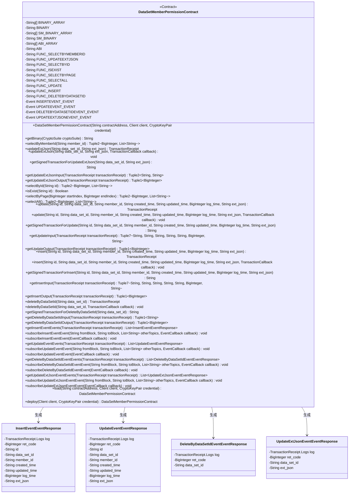
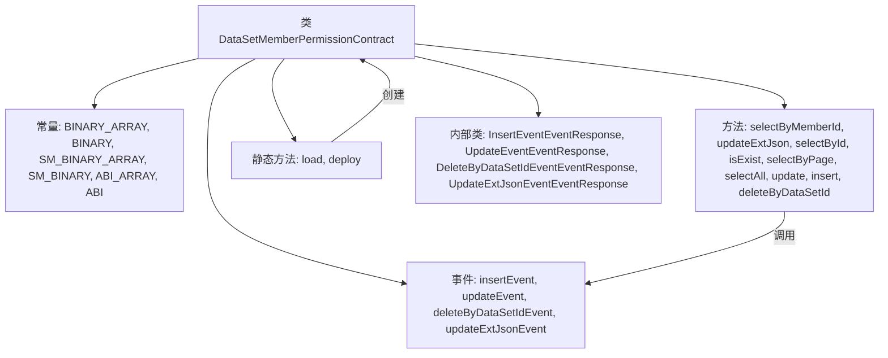
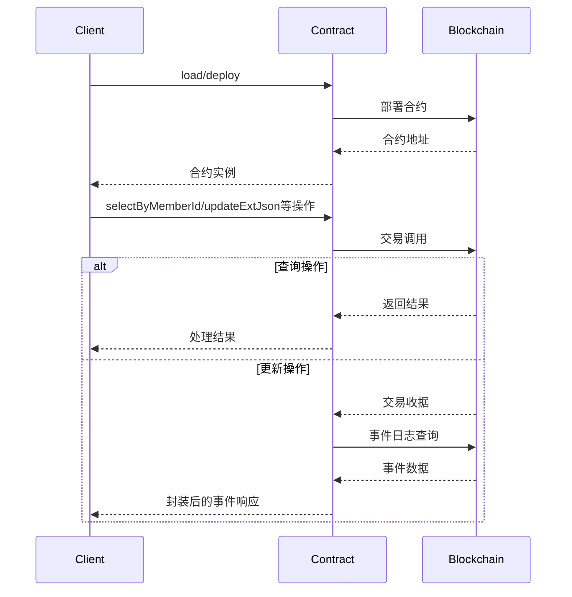

# 基础信息

|      |      |
|------|------|
| 名称 | DataSetMemberPermissionContract |
| 编码语言 | .java |
| 代码路径 | WeFe/manager/manager-service/src/main/java/com/welab/wefe/manager/service/contract/DataSetMemberPermissionContract.java |
| 包名 | com.welab.wefe.manager.service.contract |
| 依赖项 | ['org.fisco.bcos.sdk.abi.FunctionReturnDecoder', 'org.fisco.bcos.sdk.abi.TypeReference', 'org.fisco.bcos.sdk.abi.datatypes', 'org.fisco.bcos.sdk.abi.datatypes.generated.Int256', 'org.fisco.bcos.sdk.abi.datatypes.generated.tuples.generated.Tuple1', 'org.fisco.bcos.sdk.abi.datatypes.generated.tuples.generated.Tuple2', 'org.fisco.bcos.sdk.abi.datatypes.generated.tuples.generated.Tuple7', 'org.fisco.bcos.sdk.client.Client', 'org.fisco.bcos.sdk.contract.Contract', 'org.fisco.bcos.sdk.crypto.CryptoSuite', 'org.fisco.bcos.sdk.crypto.keypair.CryptoKeyPair', 'org.fisco.bcos.sdk.eventsub.EventCallback', 'org.fisco.bcos.sdk.model.CryptoType', 'org.fisco.bcos.sdk.model.TransactionReceipt', 'org.fisco.bcos.sdk.model.callback.TransactionCallback', 'org.fisco.bcos.sdk.transaction.model.exception.ContractException', 'java.math.BigInteger', 'java.util.ArrayList', 'java.util.Arrays', 'java.util.Collections', 'java.util.List'] |
| 概述说明 | DataSetMemberPermissionContract是一个智能合约类，用于管理数据集成员权限。主要功能包括：查询成员权限、更新扩展JSON、检查权限存在性、分页查询、插入和更新权限记录、删除数据集权限等。合约包含多个事件如插入、更新、删除事件，支持权限记录的增删改查操作。通过ABI和二进制代码定义合约接口，提供Java封装方法调用。 |

# 说明

这是一个名为DataSetMemberPermissionContract的智能合约Java封装类，主要功能是与区块链上的数据集成员权限合约进行交互。合约提供了以下核心功能：

1. 成员权限管理：
   - 通过成员ID查询权限(selectByMemberId)
   - 通过ID查询权限(selectById)
   - 检查权限是否存在(isExist)
   - 分页查询权限(selectByPage)
   - 查询所有权限(selectAll)

2. 数据操作：
   - 更新扩展JSON数据(updateExtJson)
   - 更新成员权限信息(update)
   - 插入新成员权限(insert)
   - 根据数据集ID删除权限(deleteByDataSetId)

3. 事件监听：
   - 插入事件(insertEvent)
   - 更新事件(updateEvent)
   - 删除事件(deleteByDataSetIdEvent)
   - 更新JSON事件(updateExtJsonEvent)

合约支持ECDSA和SM2两种加密算法，提供了同步和异步两种调用方式，并包含输入输出参数解析功能。所有交易操作都会返回交易回执，查询操作直接返回结果数据。

# 类列表 Class Summary

| 名称   | 类型  | 说明 |
|-------|------|-------------|
| DataSetMemberPermissionContract | class | 这是一个名为DataSetMemberPermissionContract的智能合约Java封装类，主要功能包括：1. 提供数据集成员权限的增删改查功能，如insert、update、deleteByDataSetId等2. 包含多个查询方法：selectByMemberId、selectById、selectByPage等3. 定义了4个事件：insertEvent、updateEvent、deleteByDataSetIdEvent、updateExtJsonEvent4. 支持ECDSA和SM2两种加密算法5. 提供了完整的ABI接口定义和二进制代码关键点：- 继承自Contract基类，实现了标准的合约调用封装- 包含完整的交易发送和事件监听功能- 使用Tuple类型处理多返回值- 支持同步和异步交易发送- 提供交易输入/输出参数的解析方法这个封装类主要用于在Java应用中与区块链上的DataSetMemberPermissionContract智能合约进行交互。 |

## 类 DataSetMemberPermissionContract

|      |      |
|------|------|
| 访问范围 | @SuppressWarnings("unchecked");public |
| 类型 | class |
| 名称 | DataSetMemberPermissionContract |
| 说明 | 这是一个名为DataSetMemberPermissionContract的智能合约Java封装类，主要功能包括：1. 提供数据集成员权限的增删改查功能，如insert、update、deleteByDataSetId等2. 包含多个查询方法：selectByMemberId、selectById、selectByPage等3. 定义了4个事件：insertEvent、updateEvent、deleteByDataSetIdEvent、updateExtJsonEvent4. 支持ECDSA和SM2两种加密算法5. 提供了完整的ABI接口定义和二进制代码关键点：- 继承自Contract基类，实现了标准的合约调用封装- 包含完整的交易发送和事件监听功能- 使用Tuple类型处理多返回值- 支持同步和异步交易发送- 提供交易输入/输出参数的解析方法这个封装类主要用于在Java应用中与区块链上的DataSetMemberPermissionContract智能合约进行交互。 |

### UML类图

这段代码定义了一个名为`DataSetMemberPermissionContract`的智能合约类，继承自`Contract`基类。该类包含了合约的ABI、二进制代码、函数定义和事件定义。主要功能包括数据集的成员权限管理，如查询、更新、插入和删除操作，以及相关的事件订阅功能。类图中展示了合约的主要结构、事件响应类以及它们之间的关系。合约提供了多种方法来与区块链交互，包括同步/异步交易执行、事件订阅和响应处理等。

### 内部方法调用关系图

该代码是一个智能合约的Java封装类，主要功能包括：
1. 提供与区块链交互的CRUD操作（增删改查）
2. 处理数据集成员权限相关的业务逻辑
3. 支持普通和国密两种加密算法
4. 提供交易事件监听和回调机制
5. 封装了合约的ABI和二进制代码
流程图展示了类结构和主要方法调用关系，时序图描述了合约部署和调用的完整流程。代码结构清晰，包含完整的异常处理和类型转换机制。

### 字段列表 Field List

| 名称  | 类型  | 说明 |
|-------|-------|------|
| FUNC_UPDATE = "update" | String | 静态常量FUNC_UPDATE值为"update"。 |
| UPDATEEVENT_EVENT = new Event("updateEvent",             Arrays.<TypeReference<?>>asList(new TypeReference<Int256>() {}, new TypeReference<Utf8String>() {}, new TypeReference<Utf8String>() {}, new TypeReference<Utf8String>() {}, new TypeReference<Utf8String>() {}, new TypeReference<Utf8String>() {}, new TypeReference<Int256>() {}, new TypeReference<Utf8String>() {})) | Event | 定义了一个名为UPDATEEVENT_EVENT的公共静态常量事件，包含8个参数类型：Int256和多个Utf8String。 |
| INSERTEVENT_EVENT = new Event("insertEvent",             Arrays.<TypeReference<?>>asList(new TypeReference<Int256>() {}, new TypeReference<Utf8String>() {}, new TypeReference<Utf8String>() {}, new TypeReference<Utf8String>() {}, new TypeReference<Utf8String>() {}, new TypeReference<Utf8String>() {}, new TypeReference<Int256>() {}, new TypeReference<Utf8String>() {})) | Event | 定义静态常量INSERTEVENT_EVENT，类型为Event，包含8个参数：Int256、5个Utf8String和Int256。 |
| FUNC_ISEXIST = "isExist" | String | 定义静态常量FUNC_ISEXIST，值为"isExist"。 |
| BINARY_ARRAY = {"60806040523480156200001157600080fd5b506110016000806101000a81548173ffffffffffffffffffffffffffffffffffffffff021916908373ffffffffffffffffffffffffffffffffffffffff1602179055506000809054906101000a900473ffffffffffffffffffffffffffffffffffffffff1673ffffffffffffffffffffffffffffffffffffffff166356004b6a6040805190810160405280601a81526020017f646174615f7365745f6d656d6265725f7065726d697373696f6e0000000000008152506040518263ffffffff167c010000000000000000000000000000000000000000000000000000000002815260040162000101919062000296565b602060405180830381600087803b1580156200011c57600080fd5b505af115801562000131573d6000803e3d6000fd5b505050506040513d601f19601f8201168201806040525062000157919081019062000174565b5062000340565b60006200016c8251620002ef565b905092915050565b6000602082840312156200018757600080fd5b600062000197848285016200015e565b91505092915050565b6000620001ad82620002e4565b808452620001c3816020860160208601620002f9565b620001ce816200032f565b602085010191505092915050565b6000600682527f6669785f696400000000000000000000000000000000000000000000000000006020830152604082019050919050565b6000604482527f69642c646174615f7365745f69642c6d656d6265725f69642c6372656174656460208301527f5f74696d652c757064617465645f74696d652c6c6f675f74696d652c6578745f60408301527f6a736f6e000000000000000000000000000000000000000000000000000000006060830152608082019050919050565b60006060820190508181036000830152620002b28184620001a0565b90508181036020830152620002c781620001dc565b90508181036040830152620002dc8162000213565b905092915050565b600081519050919050565b6000819050919050565b60005b8381101562000319578082015181840152602081019050620002fc565b8381111562000329576000848401525b50505050565b6000601f19601f8301169050919050565b61482d80620003506000396000f300608060405260043610610098576000357c0100000000000000000000000000000000000000000000000000000000900463ffffffff1680629740861461009d5780630f964d0b146100db57806326b477fd146101185780634d3d096b1461015657806353befd7a14610193578063857cb0eb146101d1578063a1db3508146101fd578063c843e4d71461023a578063f716d9e514610277575b600080fd5b3480156100a957600080fd5b506100c460048036036100bf9190810190613c89565b6102b4565b6040516100d29291906141a9565b60405180910390f35b3480156100e757600080fd5b5061010260048036036100fd9190810190613d0b565b6106e6565b60405161010f919061418e565b60405180910390f35b34801561012457600080fd5b5061013f600480360361013a9190810190613c89565b610b9e565b60405161014d9291906141a9565b60405180910390f35b34801561016257600080fd5b5061017d60048036036101789190810190613c89565b610fd0565b60405161018a9190614173565b60405180910390f35b34801561019f57600080fd5b506101ba60048036036101b59190810190613c4d565b611394565b6040516101c89291906141a9565b60405180910390f35b3480156101dd57600080fd5b506101e66117ca565b6040516101f49291906141a9565b60405180910390f35b34801561020957600080fd5b50610224600480360361021f9190810190613d77565b611b6e565b604051610231919061418e565b60405180910390f35b34801561024657600080fd5b50610261600480360361025c9190810190613d77565b612378565b60405161026e919061418e565b60405180910390f35b34801561028357600080fd5b5061029e60048036036102999190810190613c89565b612b99565b6040516102ab919061418e565b60405180910390f35b6000606060008060008060009054906101000a900473ffffffffffffffffffffffffffffffffffffffff1673ffffffffffffffffffffffffffffffffffffffff1663f23f63c96040805190810160405280601a81526020017f646174615f7365745f6d656d6265725f7065726d697373696f6e0000000000008152506040518263ffffffff167c0100000000000000000000000000000000000000000000000000000000028152600401610368919061431f565b602060405180830381600087803b15801561038257600080fd5b505af1158015610396573d6000803e3d6000fd5b505050506040513d601f19601f820116820180604052506103ba9190810190613bfb565b92508273ffffffffffffffffffffffffffffffffffffffff16637857d7c96040518163ffffffff167c0100000000000000000000000000000000000000000000000000000000028152600401602060405180830381600087803b15801561042057600080fd5b505af1158015610434573d6000803e3d6000fd5b505050506040513d601f19601f820116820180604052506104589190810190613b80565b91508173ffffffffffffffffffffffffffffffffffffffff1663cd30a1d1876040518263ffffffff167c01000000000000000000000000000000000000000000000000000000000281526004016104af91906143ff565b600060405180830381600087803b1580156104c957600080fd5b505af11580156104dd573d6000803e3d6000fd5b505050508273ffffffffffffffffffffffffffffffffffffffff1663e8434e396040805190810160405280600a81526020017f6669785f69645f30303300000000000000000000000000000000000000000000815250846040518363ffffffff167c010000000000000000000000000000000000000000000000000000000002815260040161056d929190614341565b602060405180830381600087803b15801561058757600080fd5b505af115801561059b573d6000803e3d6000fd5b505050506040513d601f19601f820116820180604052506105bf9190810190613ba9565b90508073ffffffffffffffffffffffffffffffffffffffff1663949d225d6040518163ffffffff167c0100000000000000000000000000000000000000000000000000000000028152600401602060405180830381600087803b15801561062557600080fd5b505af1158015610639573d6000803e3d6000fd5b505050506040513d601f19601f8201168201806040525061065d9190810190613c24565b600014156106cb577ffffffffffffffffffffffffffffffffffffffffffffffffffffffffffffffffd60006040519080825280602002602001820160405280156106bb57816020015b60608152602001906001900390816106a65790505b50819150809050945094506106de565b60006106d682612f24565b819150945094505b505050915091565b6000806000806000806000809054906101000a900473ffffffffffffffffffffffffffffffffffffffff1673ffffffffffffffffffffffffffffffffffffffff1663f23f63c96040805190810160405280601a81526020017f646174615f7365745f6d656d6265725f7065726d697373696f6e0000000000008152506040518263ffffffff167c010000000000000000000000000000000000000000000000000000000002815260040161079a919061431f565b602060405180830381600087803b1580156107b457600080fd5b505af11580156107c8573d6000803e3d6000fd5b505050506040513d601f19601f820116820180604052506107ec9190810190613bfb565b94508473ffffffffffffffffffffffffffffffffffffffff16637857d7c96040518163ffffffff167c0100000000000000000000000000000000000000000000000000000000028152600401602060405180830381600087803b15801561085257600080fd5b505af1158015610866573d6000803e3d6000fd5b505050506040513d601f19601f8201168201806040525061088a9190810190613b80565b93508373ffffffffffffffffffffffffffffffffffffffff1663cd30a1d1896040518263ffffffff167c01000000000000000000000000000000000000000000000000000000000281526004016108e19190614454565b600060405180830381600087803b1580156108fb57600080fd5b505af115801561090f573d6000803e3d6000fd5b505050508473ffffffffffffffffffffffffffffffffffffffff166313db93466040518163ffffffff167c0100000000000000000000000000000000000000000000000000000000028152600401602060405180830381600087803b15801561097757600080fd5b505af115801561098b573d6000803e3d6000fd5b505050506040513d601f19601f820116820180604052506109af9190810190613bd2565b92508273ffffffffffffffffffffffffffffffffffffffff1663e942b516886040518263ffffffff167c0100000000000000000000000000000000000000000000000000000000028152600401610a0691906144a9565b600060405180830381600087803b158015610a2057600080fd5b505af1158015610a34573d6000803e3d6000fd5b505050508473ffffffffffffffffffffffffffffffffffffffff1663bf2b70a16040805190810160405280600a81526020017f6669785f69645f3030330000000000000000000000000000000000000000000081525085876040518463ffffffff167c0100000000000000000000000000000000000000000000000000000000028152600401610ac6939291906143a1565b602060405180830381600087803b158015610ae057600080fd5b505af1158015610af4573d6000803e3d6000fd5b505050506040513d601f19601f82011682018060405250610b189190810190613c24565b915060009050600182121515610b315760009050610b55565b7ffffffffffffffffffffffffffffffffffffffffffffffffffffffffffffffffe90505b7fecd7e44c82f6933ff1918746a0b82905272e99aee75c80430b6a6b77d237da4c818989604051610b8893929190614232565b60405180910390a1809550505050505092915050565b6000606060008060008060009054906101000a900473ffffffffffffffffffffffffffffffffffffffff1673ffffffffffffffffffffffffffffffffffffffff1663f23f63c96040805190810160405280601a81526020017f646174615f7365745f6d656d6265725f7065726d697373696f6e0000000000008152506040518263ffffffff167c0100000000000000000000000000000000000000000000000000000000028152600401610c52919061431f565b602060405180830381600087803b158015610c6c57600080fd5b505af1158015610c80573d6000803e3d6000fd5b505050506040513d601f19601f82011682018060405250610ca49190810190613bfb565b92508273ffffffffffffff", "ffffffffffffffffffffffffff16637857d7c96040518163ffffffff167c0100000000000000000000000000000000000000000000000000000000028152600401602060405180830381600087803b158015610d0a57600080fd5b505af1158015610d1e573d6000803e3d6000fd5b505050506040513d601f19601f82011682018060405250610d429190810190613b80565b91508173ffffffffffffffffffffffffffffffffffffffff1663cd30a1d1876040518263ffffffff167c0100000000000000000000000000000000000000000000000000000000028152600401610d9991906145d6565b600060405180830381600087803b158015610db357600080fd5b505af1158015610dc7573d6000803e3d6000fd5b505050508273ffffffffffffffffffffffffffffffffffffffff1663e8434e396040805190810160405280600a81526020017f6669785f69645f30303300000000000000000000000000000000000000000000815250846040518363ffffffff167c0100000000000000000000000000000000000000000000000000000000028152600401610e57929190614341565b602060405180830381600087803b158015610e7157600080fd5b505af1158015610e85573d6000803e3d6000fd5b505050506040513d601f19601f82011682018060405250610ea99190810190613ba9565b90508073ffffffffffffffffffffffffffffffffffffffff1663949d225d6040518163ffffffff167c0100000000000000000000000000000000000000000000000000000000028152600401602060405180830381600087803b158015610f0f57600080fd5b505af1158015610f23573d6000803e3d6000fd5b505050506040513d601f19601f82011682018060405250610f479190810190613c24565b60001415610fb5577ffffffffffffffffffffffffffffffffffffffffffffffffffffffffffffffffd6000604051908082528060200260200182016040528015610fa557816020015b6060815260200190600190039081610f905790505b5081915080905094509450610fc8565b6000610fc082612f24565b819150945094505b505050915091565b6000806000806000809054906101000a900473ffffffffffffffffffffffffffffffffffffffff1673ffffffffffffffffffffffffffffffffffffffff1663f23f63c96040805190810160405280601a81526020017f646174615f7365745f6d656d6265725f7065726d697373696f6e0000000000008152506040518263ffffffff167c0100000000000000000000000000000000000000000000000000000000028152600401611081919061431f565b602060405180830381600087803b15801561109b57600080fd5b505af11580156110af573d6000803e3d6000fd5b505050506040513d601f19601f820116820180604052506110d39190810190613bfb565b92508273ffffffffffffffffffffffffffffffffffffffff16637857d7c96040518163ffffffff167c0100000000000000000000000000000000000000000000000000000000028152600401602060405180830381600087803b15801561113957600080fd5b505af115801561114d573d6000803e3d6000fd5b505050506040513d601f19601f820116820180604052506111719190810190613b80565b91508173ffffffffffffffffffffffffffffffffffffffff1663cd30a1d1866040518263ffffffff167c01000000000000000000000000000000000000000000000000000000000281526004016111c891906145d6565b600060405180830381600087803b1580156111e257600080fd5b505af11580156111f6573d6000803e3d6000fd5b505050508273ffffffffffffffffffffffffffffffffffffffff1663e8434e396040805190810160405280600a81526020017f6669785f69645f30303300000000000000000000000000000000000000000000815250846040518363ffffffff167c0100000000000000000000000000000000000000000000000000000000028152600401611286929190614341565b602060405180830381600087803b1580156112a057600080fd5b505af11580156112b4573d6000803e3d6000fd5b505050506040513d601f19601f820116820180604052506112d89190810190613ba9565b905060008173ffffffffffffffffffffffffffffffffffffffff1663949d225d6040518163ffffffff167c0100000000000000000000000000000000000000000000000000000000028152600401602060405180830381600087803b15801561134057600080fd5b505af1158015611354573d6000803e3d6000fd5b505050506040513d601f19601f820116820180604052506113789190810190613c24565b1115611387576001935061138c565b600093505b505050919050565b6000606060008060008060009054906101000a900473ffffffffffffffffffffffffffffffffffffffff1673ffffffffffffffffffffffffffffffffffffffff1663f23f63c96040805190810160405280601a81526020017f646174615f7365745f6d656d6265725f7065726d697373696f6e0000000000008152506040518263ffffffff167c0100000000000000000000000000000000000000000000000000000000028152600401611448919061431f565b602060405180830381600087803b15801561146257600080fd5b505af1158015611476573d6000803e3d6000fd5b505050506040513d601f19601f8201168201806040525061149a9190810190613bfb565b92508273ffffffffffffffffffffffffffffffffffffffff16637857d7c96040518163ffffffff167c0100000000000000000000000000000000000000000000000000000000028152600401602060405180830381600087803b15801561150057600080fd5b505af1158015611514573d6000803e3d6000fd5b505050506040513d601f19601f820116820180604052506115389190810190613b80565b91508173ffffffffffffffffffffffffffffffffffffffff16637ec1cc6588886040518363ffffffff167c01000000000000000000000000000000000000000000000000000000000281526004016115919291906141d9565b600060405180830381600087803b1580156115ab57600080fd5b505af11580156115bf573d6000803e3d6000fd5b505050508273ffffffffffffffffffffffffffffffffffffffff1663e8434e396040805190810160405280600a81526020017f6669785f69645f30303300000000000000000000000000000000000000000000815250846040518363ffffffff167c010000000000000000000000000000000000000000000000000000000002815260040161164f929190614341565b602060405180830381600087803b15801561166957600080fd5b505af115801561167d573d6000803e3d6000fd5b505050506040513d601f19601f820116820180604052506116a19190810190613ba9565b90508073ffffffffffffffffffffffffffffffffffffffff1663949d225d6040518163ffffffff167c0100000000000000000000000000000000000000000000000000000000028152600401602060405180830381600087803b15801561170757600080fd5b505af115801561171b573d6000803e3d6000fd5b505050506040513d601f19601f8201168201806040525061173f9190810190613c24565b600014156117ad577ffffffffffffffffffffffffffffffffffffffffffffffffffffffffffffffffd600060405190808252806020026020018201604052801561179d57816020015b60608152602001906001900390816117885790505b50819150809050945094506117c0565b60006117b882612f24565b819150945094505b5050509250929050565b600060606000806000809054906101000a900473ffffffffffffffffffffffffffffffffffffffff1673ffffffffffffffffffffffffffffffffffffffff1663f23f63c96040805190810160405280601a81526020017f646174615f7365745f6d656d6265725f7065726d697373696f6e0000000000008152506040518263ffffffff167c010000000000000000000000000000000000000000000000000000000002815260040161187c919061431f565b602060405180830381600087803b15801561189657600080fd5b505af11580156118aa573d6000803e3d6000fd5b505050506040513d601f19601f820116820180604052506118ce9190810190613bfb565b91508173ffffffffffffffffffffffffffffffffffffffff1663e8434e396040805190810160405280600a81526020017f6669785f69645f303033000000000000000000000000000000000000000000008152508473ffffffffffffffffffffffffffffffffffffffff16637857d7c96040518163ffffffff167c0100000000000000000000000000000000000000000000000000000000028152600401602060405180830381600087803b15801561198657600080fd5b505af115801561199a573d6000803e3d6000fd5b505050506040513d601f19601f820116820180604052506119be9190810190613b80565b6040518363ffffffff167c01000000000000000000000000000000000000000000000000000000000281526004016119f7929190614341565b602060405180830381600087803b158015611a1157600080fd5b505af1158015611a25573d6000803e3d6000fd5b505050506040513d601f19601f82011682018060405250611a499190810190613ba9565b90508073ffffffffffffffffffffffffffffffffffffffff1663949d225d6040518163ffffffff167c0100000000000000000000000000000000000000000000000000000000028152600401602060405180830381600087803b158015611aaf57600080fd5b505af1158015611ac3573d6000803e3d6000fd5b505050506040513d601f19601f82011682018060405250611ae79190810190613c24565b60001415611b55577ffffffffffffffffffffffffffffffffffffffffffffffffffffffffffffffffd6000604051908082528060200260200182016040528015611b4557816020015b6060815260200190600190039081611b305790505b5081915080905093509350611b68565b6000611b6082612f24565b819150935093505b50509091565b60008060008060008060009450611b848d610fd0565b1515611c1a577fffffffffffffffffffffffffffffffffffffffffffffffffffffffffffffffff94507fc14b935603e398b2024d314b5155b8507ec77056d2195ab98fa7e18af0a67e20858e8e8e8e8e8e8e604051611bea989796959493929190614277565b60405180910390a17fffffffffffffffffffffffffffffffffffffffffffffffffffffffffffffffff9550612368565b6000809054906101000a900473ffffffffffffffffffffffffffffffffffffffff1673ffffffffffffffffffffffffffffffffffffffff1663f23f63c96040805190810160405280601a81526020017f646174615f7365745f6d656d6265725f7065726d697373696f6e0000000000008152506040518263ffffffff167c0100000000000000000000000000000000000000000000", "000000000000028152600401611cc5919061431f565b602060405180830381600087803b158015611cdf57600080fd5b505af1158015611cf3573d6000803e3d6000fd5b505050506040513d601f19601f82011682018060405250611d179190810190613bfb565b93508373ffffffffffffffffffffffffffffffffffffffff16637857d7c96040518163ffffffff167c0100000000000000000000000000000000000000000000000000000000028152600401602060405180830381600087803b158015611d7d57600080fd5b505af1158015611d91573d6000803e3d6000fd5b505050506040513d601f19601f82011682018060405250611db59190810190613b80565b92508273ffffffffffffffffffffffffffffffffffffffff1663cd30a1d18e6040518263ffffffff167c0100000000000000000000000000000000000000000000000000000000028152600401611e0c91906145d6565b600060405180830381600087803b158015611e2657600080fd5b505af1158015611e3a573d6000803e3d6000fd5b505050508373ffffffffffffffffffffffffffffffffffffffff166313db93466040518163ffffffff167c0100000000000000000000000000000000000000000000000000000000028152600401602060405180830381600087803b158015611ea257600080fd5b505af1158015611eb6573d6000803e3d6000fd5b505050506040513d601f19601f82011682018060405250611eda9190810190613bd2565b91508173ffffffffffffffffffffffffffffffffffffffff1663e942b5168d6040518263ffffffff167c0100000000000000000000000000000000000000000000000000000000028152600401611f319190614454565b600060405180830381600087803b158015611f4b57600080fd5b505af1158015611f5f573d6000803e3d6000fd5b505050508173ffffffffffffffffffffffffffffffffffffffff1663e942b5168c6040518263ffffffff167c0100000000000000000000000000000000000000000000000000000000028152600401611fb891906143ff565b600060405180830381600087803b158015611fd257600080fd5b505af1158015611fe6573d6000803e3d6000fd5b505050508173ffffffffffffffffffffffffffffffffffffffff1663e942b5168b6040518263ffffffff167c010000000000000000000000000000000000000000000000000000000002815260040161203f919061462b565b600060405180830381600087803b15801561205957600080fd5b505af115801561206d573d6000803e3d6000fd5b505050508173ffffffffffffffffffffffffffffffffffffffff1663e942b5168a6040518263ffffffff167c01000000000000000000000000000000000000000000000000000000000281526004016120c69190614581565b600060405180830381600087803b1580156120e057600080fd5b505af11580156120f4573d6000803e3d6000fd5b505050508173ffffffffffffffffffffffffffffffffffffffff16632ef8ba74896040518263ffffffff167c010000000000000000000000000000000000000000000000000000000002815260040161214d9190614533565b600060405180830381600087803b15801561216757600080fd5b505af115801561217b573d6000803e3d6000fd5b505050508173ffffffffffffffffffffffffffffffffffffffff1663e942b516886040518263ffffffff167c01000000000000000000000000000000000000000000000000000000000281526004016121d491906144a9565b600060405180830381600087803b1580156121ee57600080fd5b505af1158015612202573d6000803e3d6000fd5b505050508373ffffffffffffffffffffffffffffffffffffffff1663bf2b70a16040805190810160405280600a81526020017f6669785f69645f3030330000000000000000000000000000000000000000000081525084866040518463ffffffff167c0100000000000000000000000000000000000000000000000000000000028152600401612294939291906143a1565b602060405180830381600087803b1580156122ae57600080fd5b505af11580156122c2573d6000803e3d6000fd5b505050506040513d601f19601f820116820180604052506122e69190810190613c24565b90506001811215156122fb576000945061231f565b7ffffffffffffffffffffffffffffffffffffffffffffffffffffffffffffffffe94505b7fc14b935603e398b2024d314b5155b8507ec77056d2195ab98fa7e18af0a67e20858e8e8e8e8e8e8e60405161235c989796959493929190614277565b60405180910390a18095505b5050505050979650505050505050565b600080600080600080935061238c8c610fd0565b15612421577fffffffffffffffffffffffffffffffffffffffffffffffffffffffffffffffff93507fc0d844becfcc141ed1bcf48131982727784ed6435ca8f53352fd7f9b89b951c9848d8d8d8d8d8d8d6040516123f1989796959493929190614277565b60405180910390a17fffffffffffffffffffffffffffffffffffffffffffffffffffffffffffffffff9450612b8a565b6000809054906101000a900473ffffffffffffffffffffffffffffffffffffffff1673ffffffffffffffffffffffffffffffffffffffff1663f23f63c96040805190810160405280601a81526020017f646174615f7365745f6d656d6265725f7065726d697373696f6e0000000000008152506040518263ffffffff167c01000000000000000000000000000000000000000000000000000000000281526004016124cc919061431f565b602060405180830381600087803b1580156124e657600080fd5b505af11580156124fa573d6000803e3d6000fd5b505050506040513d601f19601f8201168201806040525061251e9190810190613bfb565b92508273ffffffffffffffffffffffffffffffffffffffff166313db93466040518163ffffffff167c0100000000000000000000000000000000000000000000000000000000028152600401602060405180830381600087803b15801561258457600080fd5b505af1158015612598573d6000803e3d6000fd5b505050506040513d601f19601f820116820180604052506125bc9190810190613bd2565b91508173ffffffffffffffffffffffffffffffffffffffff1663e942b5166040805190810160405280600a81526020017f6669785f69645f303033000000000000000000000000000000000000000000008152506040518263ffffffff167c010000000000000000000000000000000000000000000000000000000002815260040161264891906144de565b600060405180830381600087803b15801561266257600080fd5b505af1158015612676573d6000803e3d6000fd5b505050508173ffffffffffffffffffffffffffffffffffffffff1663e942b5168d6040518263ffffffff167c01000000000000000000000000000000000000000000000000000000000281526004016126cf91906145d6565b600060405180830381600087803b1580156126e957600080fd5b505af11580156126fd573d6000803e3d6000fd5b505050508173ffffffffffffffffffffffffffffffffffffffff1663e942b5168c6040518263ffffffff167c01000000000000000000000000000000000000000000000000000000000281526004016127569190614454565b600060405180830381600087803b15801561277057600080fd5b505af1158015612784573d6000803e3d6000fd5b505050508173ffffffffffffffffffffffffffffffffffffffff1663e942b5168b6040518263ffffffff167c01000000000000000000000000000000000000000000000000000000000281526004016127dd91906143ff565b600060405180830381600087803b1580156127f757600080fd5b505af115801561280b573d6000803e3d6000fd5b505050508173ffffffffffffffffffffffffffffffffffffffff1663e942b5168a6040518263ffffffff167c0100000000000000000000000000000000000000000000000000000000028152600401612864919061462b565b600060405180830381600087803b15801561287e57600080fd5b505af1158015612892573d6000803e3d6000fd5b505050508173ffffffffffffffffffffffffffffffffffffffff1663e942b516896040518263ffffffff167c01000000000000000000000000000000000000000000000000000000000281526004016128eb9190614581565b600060405180830381600087803b15801561290557600080fd5b505af1158015612919573d6000803e3d6000fd5b505050508173ffffffffffffffffffffffffffffffffffffffff16632ef8ba74886040518263ffffffff167c01000000000000000000000000000000000000000000000000000000000281526004016129729190614533565b600060405180830381600087803b15801561298c57600080fd5b505af11580156129a0573d6000803e3d6000fd5b505050508173ffffffffffffffffffffffffffffffffffffffff1663e942b516876040518263ffffffff167c01000000000000000000000000000000000000000000000000000000000281526004016129f991906144a9565b600060405180830381600087803b158015612a1357600080fd5b505af1158015612a27573d6000803e3d6000fd5b505050508273ffffffffffffffffffffffffffffffffffffffff166331afac366040805190810160405280600a81526020017f6669785f69645f30303300000000000000000000000000000000000000000000815250846040518363ffffffff167c0100000000000000000000000000000000000000000000000000000000028152600401612ab7929190614371565b602060405180830381600087803b158015612ad157600080fd5b505af1158015612ae5573d6000803e3d6000fd5b505050506040513d601f19601f82011682018060405250612b099190810190613c24565b90506001811415612b1d5760009350612b41565b7ffffffffffffffffffffffffffffffffffffffffffffffffffffffffffffffffe93505b7fc0d844becfcc141ed1bcf48131982727784ed6435ca8f53352fd7f9b89b951c9848d8d8d8d8d8d8d604051612b7e989796959493929190614277565b60405180910390a18094505b50505050979650505050505050565b60008060008060008093506000809054906101000a900473ffffffffffffffffffffffffffffffffffffffff1673ffffffffffffffffffffffffffffffffffffffff1663f23f63c96040805190810160405280601a81526020017f646174615f7365745f6d656d6265725f7065726d697373696f6e0000000000008152506040518263ffffffff167c0100000000000000000000000000000000000000000000000000000000028152600401612c4f919061431f565b602060405180830381600087803b158015612c6957600080fd5b505af1158015612c7d573d6000803e3d6000fd5b505050506040513d601f19601f82011682018060405250612ca19190810190613bfb565b92508273ffffffffffffffffffff", "ffffffffffffffffffff16637857d7c96040518163ffffffff167c0100000000000000000000000000000000000000000000000000000000028152600401602060405180830381600087803b158015612d0757600080fd5b505af1158015612d1b573d6000803e3d6000fd5b505050506040513d601f19601f82011682018060405250612d3f9190810190613b80565b91508173ffffffffffffffffffffffffffffffffffffffff1663cd30a1d1876040518263ffffffff167c0100000000000000000000000000000000000000000000000000000000028152600401612d969190614454565b600060405180830381600087803b158015612db057600080fd5b505af1158015612dc4573d6000803e3d6000fd5b505050508273ffffffffffffffffffffffffffffffffffffffff166328bb21176040805190810160405280600a81526020017f6669785f69645f30303300000000000000000000000000000000000000000000815250846040518363ffffffff167c0100000000000000000000000000000000000000000000000000000000028152600401612e54929190614341565b602060405180830381600087803b158015612e6e57600080fd5b505af1158015612e82573d6000803e3d6000fd5b505050506040513d601f19601f82011682018060405250612ea69190810190613c24565b9050600181121515612ebb5760009350612edf565b7ffffffffffffffffffffffffffffffffffffffffffffffffffffffffffffffffe93505b7fe09f4966609778cce39c8e76b023c6fdcfdc04aec687aabf43f58e8084ddb9528487604051612f10929190614202565b60405180910390a180945050505050919050565b60608060008060608573ffffffffffffffffffffffffffffffffffffffff1663949d225d6040518163ffffffff167c0100000000000000000000000000000000000000000000000000000000028152600401602060405180830381600087803b158015612f9057600080fd5b505af1158015612fa4573d6000803e3d6000fd5b505050506040513d601f19601f82011682018060405250612fc89190810190613c24565b604051908082528060200260200182016040528015612ffb57816020015b6060815260200190600190039081612fe65790505b509350600092505b8573ffffffffffffffffffffffffffffffffffffffff1663949d225d6040518163ffffffff167c0100000000000000000000000000000000000000000000000000000000028152600401602060405180830381600087803b15801561306757600080fd5b505af115801561307b573d6000803e3d6000fd5b505050506040513d601f19601f8201168201806040525061309f9190810190613c24565b83121561381b578573ffffffffffffffffffffffffffffffffffffffff1663846719e0846040518263ffffffff167c01000000000000000000000000000000000000000000000000000000000281526004016130fb919061418e565b602060405180830381600087803b15801561311557600080fd5b505af1158015613129573d6000803e3d6000fd5b505050506040513d601f19601f8201168201806040525061314d9190810190613bd2565b915061323f6132048373ffffffffffffffffffffffffffffffffffffffff16639c981fcb6040518163ffffffff167c01000000000000000000000000000000000000000000000000000000000281526004016131a8906145b6565b600060405180830381600087803b1580156131c257600080fd5b505af11580156131d6573d6000803e3d6000fd5b505050506040513d6000823e3d601f19601f820116820180604052506131ff9190810190613cca565b613827565b6040805190810160405280600181526020017f7c00000000000000000000000000000000000000000000000000000000000000815250613880565b90506132fc816132f78473ffffffffffffffffffffffffffffffffffffffff16639c981fcb6040518163ffffffff167c010000000000000000000000000000000000000000000000000000000002815260040161329b90614434565b600060405180830381600087803b1580156132b557600080fd5b505af11580156132c9573d6000803e3d6000fd5b505050506040513d6000823e3d601f19601f820116820180604052506132f29190810190613cca565b613827565b613880565b905061333d816040805190810160405280600181526020017f7c00000000000000000000000000000000000000000000000000000000000000815250613880565b90506133fa816133f58473ffffffffffffffffffffffffffffffffffffffff16639c981fcb6040518163ffffffff167c0100000000000000000000000000000000000000000000000000000000028152600401613399906143df565b600060405180830381600087803b1580156133b357600080fd5b505af11580156133c7573d6000803e3d6000fd5b505050506040513d6000823e3d601f19601f820116820180604052506133f09190810190613cca565b613827565b613880565b905061343b816040805190810160405280600181526020017f7c00000000000000000000000000000000000000000000000000000000000000815250613880565b90506134f8816134f38473ffffffffffffffffffffffffffffffffffffffff16639c981fcb6040518163ffffffff167c01000000000000000000000000000000000000000000000000000000000281526004016134979061460b565b600060405180830381600087803b1580156134b157600080fd5b505af11580156134c5573d6000803e3d6000fd5b505050506040513d6000823e3d601f19601f820116820180604052506134ee9190810190613cca565b613827565b613880565b9050613539816040805190810160405280600181526020017f7c00000000000000000000000000000000000000000000000000000000000000815250613880565b90506135f6816135f18473ffffffffffffffffffffffffffffffffffffffff16639c981fcb6040518163ffffffff167c010000000000000000000000000000000000000000000000000000000002815260040161359590614561565b600060405180830381600087803b1580156135af57600080fd5b505af11580156135c3573d6000803e3d6000fd5b505050506040513d6000823e3d601f19601f820116820180604052506135ec9190810190613cca565b613827565b613880565b9050613637816040805190810160405280600181526020017f7c00000000000000000000000000000000000000000000000000000000000000815250613880565b90506136f4816136ef8473ffffffffffffffffffffffffffffffffffffffff16639c981fcb6040518163ffffffff167c010000000000000000000000000000000000000000000000000000000002815260040161369390614513565b600060405180830381600087803b1580156136ad57600080fd5b505af11580156136c1573d6000803e3d6000fd5b505050506040513d6000823e3d601f19601f820116820180604052506136ea9190810190613cca565b613827565b613880565b9050613735816040805190810160405280600181526020017f7c00000000000000000000000000000000000000000000000000000000000000815250613880565b90506137f2816137ed8473ffffffffffffffffffffffffffffffffffffffff16639c981fcb6040518163ffffffff167c010000000000000000000000000000000000000000000000000000000002815260040161379190614489565b600060405180830381600087803b1580156137ab57600080fd5b505af11580156137bf573d6000803e3d6000fd5b505050506040513d6000823e3d601f19601f820116820180604052506137e89190810190613cca565b613827565b613880565b905080848481518110151561380357fe5b90602001906020020181905250826001019250613003565b83945050505050919050565b6060600061383483613a51565b1415613877576040805190810160405280600181526020017f2000000000000000000000000000000000000000000000000000000000000000815250905061387b565b8190505b919050565b606080606080606060008088955087945084518651016040519080825280601f01601f1916602001820160405280156138c85781602001602082028038833980820191505090505b50935083925060009150600090505b855181101561398a5785818151811015156138ee57fe5b9060200101517f010000000000000000000000000000000000000000000000000000000000000090047f010000000000000000000000000000000000000000000000000000000000000002838380600101945081518110151561394d57fe5b9060200101907effffffffffffffffffffffffffffffffffffffffffffffffffffffffffffff1916908160001a90535080806001019150506138d7565b600090505b8451811015613a425784818151811015156139a657fe5b9060200101517f010000000000000000000000000000000000000000000000000000000000000090047f0100000000000000000000000000000000000000000000000000000000000000028383806001019450815181101515613a0557fe5b9060200101907effffffffffffffffffffffffffffffffffffffffffffffffffffffffffffff1916908160001a905350808060010191505061398f565b83965050505050505092915050565b600081519050919050565b6000613a68825161472a565b905092915050565b6000613a7c825161473c565b905092915050565b6000613a90825161474e565b905092915050565b6000613aa48251614760565b905092915050565b6000613ab88235614772565b905092915050565b6000613acc8251614772565b905092915050565b600082601f8301121515613ae757600080fd5b8135613afa613af58261468d565b614660565b91508082526020830160208301858383011115613b1657600080fd5b613b218382846147a0565b50505092915050565b600082601f8301121515613b3d57600080fd5b8151613b50613b4b8261468d565b614660565b91508082526020830160208301858383011115613b6c57600080fd5b613b778382846147af565b50505092915050565b600060208284031215613b9257600080fd5b6000613ba084828501613a5c565b91505092915050565b600060208284031215613bbb57600080fd5b6000613bc984828501613a70565b91505092915050565b600060208284031215613be457600080fd5b6000613bf284828501613a84565b91505092915050565b600060208284031215613c0d57600080fd5b6000613c1b84828501613a98565b91505092915050565b600060208284031215613c3657600080fd5b6000613c4484828501613ac0565b91505092915050565b60008060408385031215613c6057600080fd5b6000613c6e85828601613aac565b9250506020613c7f85828601613aac565b9150509250929050565b600060208284031215613c9b57600080fd5b600082013567ffffffffffffffff811115613cb5", "57600080fd5b613cc184828501613ad4565b91505092915050565b600060208284031215613cdc57600080fd5b600082015167ffffffffffffffff811115613cf657600080fd5b613d0284828501613b2a565b91505092915050565b60008060408385031215613d1e57600080fd5b600083013567ffffffffffffffff811115613d3857600080fd5b613d4485828601613ad4565b925050602083013567ffffffffffffffff811115613d6157600080fd5b613d6d85828601613ad4565b9150509250929050565b600080600080600080600060e0888a031215613d9257600080fd5b600088013567ffffffffffffffff811115613dac57600080fd5b613db88a828b01613ad4565b975050602088013567ffffffffffffffff811115613dd557600080fd5b613de18a828b01613ad4565b965050604088013567ffffffffffffffff811115613dfe57600080fd5b613e0a8a828b01613ad4565b955050606088013567ffffffffffffffff811115613e2757600080fd5b613e338a828b01613ad4565b945050608088013567ffffffffffffffff811115613e5057600080fd5b613e5c8a828b01613ad4565b93505060a0613e6d8a828b01613aac565b92505060c088013567ffffffffffffffff811115613e8a57600080fd5b613e968a828b01613ad4565b91505092959891949750929550565b6000613eb0826146c6565b80845260208401935083602082028501613ec9856146b9565b60005b84811015613f02578383038852613ee4838351613f85565b9250613eef826146e7565b9150602088019750600181019050613ecc565b508196508694505050505092915050565b613f1c81614714565b82525050565b613f2b8161477c565b82525050565b613f3a8161478e565b82525050565b613f4981614720565b82525050565b6000613f5a826146dc565b808452613f6e8160208601602086016147af565b613f77816147e2565b602085010191505092915050565b6000613f90826146d1565b808452613fa48160208601602086016147af565b613fad816147e2565b602085010191505092915050565b6000600982527f6d656d6265725f696400000000000000000000000000000000000000000000006020830152604082019050919050565b6000600b82527f646174615f7365745f69640000000000000000000000000000000000000000006020830152604082019050919050565b6000600882527f6578745f6a736f6e0000000000000000000000000000000000000000000000006020830152604082019050919050565b6000600682527f6669785f696400000000000000000000000000000000000000000000000000006020830152604082019050919050565b6000600882527f6c6f675f74696d650000000000000000000000000000000000000000000000006020830152604082019050919050565b6000600c82527f757064617465645f74696d6500000000000000000000000000000000000000006020830152604082019050919050565b6000600282527f69640000000000000000000000000000000000000000000000000000000000006020830152604082019050919050565b6000600c82527f637265617465645f74696d6500000000000000000000000000000000000000006020830152604082019050919050565b60006020820190506141886000830184613f13565b92915050565b60006020820190506141a36000830184613f40565b92915050565b60006040820190506141be6000830185613f40565b81810360208301526141d08184613ea5565b90509392505050565b60006040820190506141ee6000830185613f40565b6141fb6020830184613f40565b9392505050565b60006040820190506142176000830185613f40565b81810360208301526142298184613f4f565b90509392505050565b60006060820190506142476000830186613f40565b81810360208301526142598185613f4f565b9050818103604083015261426d8184613f4f565b9050949350505050565b60006101008201905061428d600083018b613f40565b818103602083015261429f818a613f4f565b905081810360408301526142b38189613f4f565b905081810360608301526142c78188613f4f565b905081810360808301526142db8187613f4f565b905081810360a08301526142ef8186613f4f565b90506142fe60c0830185613f40565b81810360e08301526143108184613f4f565b90509998505050505050505050565b600060208201905081810360008301526143398184613f85565b905092915050565b6000604082019050818103600083015261435b8185613f85565b905061436a6020830184613f22565b9392505050565b6000604082019050818103600083015261438b8185613f85565b905061439a6020830184613f31565b9392505050565b600060608201905081810360008301526143bb8186613f85565b90506143ca6020830185613f31565b6143d76040830184613f22565b949350505050565b600060208201905081810360008301526143f881613fbb565b9050919050565b6000604082019050818103600083015261441881613fbb565b9050818103602083015261442c8184613f4f565b905092915050565b6000602082019050818103600083015261444d81613ff2565b9050919050565b6000604082019050818103600083015261446d81613ff2565b905081810360208301526144818184613f4f565b905092915050565b600060208201905081810360008301526144a281614029565b9050919050565b600060408201905081810360008301526144c281614029565b905081810360208301526144d68184613f4f565b905092915050565b600060408201905081810360008301526144f781614060565b9050818103602083015261450b8184613f85565b905092915050565b6000602082019050818103600083015261452c81614097565b9050919050565b6000604082019050818103600083015261454c81614097565b905061455b6020830184613f40565b92915050565b6000602082019050818103600083015261457a816140ce565b9050919050565b6000604082019050818103600083015261459a816140ce565b905081810360208301526145ae8184613f4f565b905092915050565b600060208201905081810360008301526145cf81614105565b9050919050565b600060408201905081810360008301526145ef81614105565b905081810360208301526146038184613f4f565b905092915050565b600060208201905081810360008301526146248161413c565b9050919050565b600060408201905081810360008301526146448161413c565b905081810360208301526146588184613f4f565b905092915050565b6000604051905081810181811067ffffffffffffffff8211171561468357600080fd5b8060405250919050565b600067ffffffffffffffff8211156146a457600080fd5b601f19601f8301169050602081019050919050565b6000602082019050919050565b600081519050919050565b600081519050919050565b600081519050919050565b6000602082019050919050565b600073ffffffffffffffffffffffffffffffffffffffff82169050919050565b60008115159050919050565b6000819050919050565b6000614735826146f4565b9050919050565b6000614747826146f4565b9050919050565b6000614759826146f4565b9050919050565b600061476b826146f4565b9050919050565b6000819050919050565b6000614787826146f4565b9050919050565b6000614799826146f4565b9050919050565b82818337600083830152505050565b60005b838110156147cd5780820151818401526020810190506147b2565b838111156147dc576000848401525b50505050565b6000601f19601f83011690509190505600a265627a7a723058203d09fabc605b0a8fbc01534b73a69eeab5a14362996f6c81df20aa27c4b1256a6c6578706572696d656e74616cf50037"} | String[] | 这是一个包含智能合约字节码和ABI定义的Java字符串数组，用于区块链开发。 |
| FUNC_SELECTALL = "selectAll" | String | 定义公共静态常量FUNC_SELECTALL，值为"selectAll"。 |
| FUNC_UPDATEEXTJSON = "updateExtJson" | String | 静态常量字符串，功能为更新扩展JSON数据。 |
| FUNC_DELETEBYDATASETID = "deleteByDataSetId" | String | Java静态常量FUNC_DELETEBYDATASETID，值为"deleteByDataSetId"，用于按数据集ID删除操作。 |
| DELETEBYDATASETIDEVENT_EVENT = new Event("deleteByDataSetIdEvent",             Arrays.<TypeReference<?>>asList(new TypeReference<Int256>() {}, new TypeReference<Utf8String>() {})) | Event | 定义静态常量DELETEBYDATASETIDEVENT_EVENT，类型为Event，包含事件名deleteByDataSetIdEvent和两个参数类型Int256与Utf8String。 |
| ABI = String.join("", ABI_ARRAY) | String | 将字符串数组ABI_ARRAY拼接成静态常量字符串ABI。 |
| FUNC_SELECTBYPAGE = "selectByPage" | String | 这是一个Java静态常量，名为FUNC_SELECTBYPAGE，值为"selectByPage"，表示分页查询功能。 |
| SM_BINARY = String.join("", SM_BINARY_ARRAY) | String | 将字符串数组SM_BINARY_ARRAY拼接为静态常量字符串SM_BINARY。 |
| ABI_ARRAY = {"[{\"constant\":true,\"inputs\":[{\"name\":\"member_id\",\"type\":\"string\"}],\"name\":\"selectByMemberId\",\"outputs\":[{\"name\":\"\",\"type\":\"int256\"},{\"name\":\"\",\"type\":\"string[]\"}],\"payable\":false,\"stateMutability\":\"view\",\"type\":\"function\"},{\"constant\":false,\"inputs\":[{\"name\":\"data_set_id\",\"type\":\"string\"},{\"name\":\"ext_json\",\"type\":\"string\"}],\"name\":\"updateExtJson\",\"outputs\":[{\"name\":\"\",\"type\":\"int256\"}],\"payable\":false,\"stateMutability\":\"nonpayable\",\"type\":\"function\"},{\"constant\":true,\"inputs\":[{\"name\":\"id\",\"type\":\"string\"}],\"name\":\"selectById\",\"outputs\":[{\"name\":\"\",\"type\":\"int256\"},{\"name\":\"\",\"type\":\"string[]\"}],\"payable\":false,\"stateMutability\":\"view\",\"type\":\"function\"},{\"constant\":true,\"inputs\":[{\"name\":\"id\",\"type\":\"string\"}],\"name\":\"isExist\",\"outputs\":[{\"name\":\"\",\"type\":\"bool\"}],\"payable\":false,\"stateMutability\":\"view\",\"type\":\"function\"},{\"constant\":true,\"inputs\":[{\"name\":\"startIndex\",\"type\":\"int256\"},{\"name\":\"endIndex\",\"type\":\"int256\"}],\"name\":\"selectByPage\",\"outputs\":[{\"name\":\"\",\"type\":\"int256\"},{\"name\":\"\",\"type\":\"string[]\"}],\"payable\":false,\"stateMutability\":\"view\",\"type\":\"function\"},{\"constant\":true,\"inputs\":[],\"name\":\"selectAll\",\"outputs\":[{\"name\":\"\",\"type\":\"int256\"},{\"name\":\"\",\"type\":\"string[]\"}],\"payable\":false,\"stateMutability\":\"view\",\"type\":\"function\"},{\"constant\":false,\"inputs\":[{\"name\":\"id\",\"type\":\"string\"},{\"name\":\"data_set_id\",\"type\":\"string\"},{\"name\":\"member_id\",\"type\":\"string\"},{\"name\":\"created_time\",\"type\":\"string\"},{\"name\":\"updated_time\",\"type\":\"string\"},{\"name\":\"log_time\",\"type\":\"int256\"},{\"name\":\"ext_json\",\"type\":\"string\"}],\"name\":\"update\",\"outputs\":[{\"name\":\"\",\"type\":\"int256\"}],\"payable\":false,\"stateMutability\":\"nonpayable\",\"type\":\"function\"},{\"constant\":false,\"inputs\":[{\"name\":\"id\",\"type\":\"string\"},{\"name\":\"data_set_id\",\"type\":\"string\"},{\"name\":\"member_id\",\"type\":\"string\"},{\"name\":\"created_time\",\"type\":\"string\"},{\"name\":\"updated_time\",\"type\":\"string\"},{\"name\":\"log_time\",\"type\":\"int256\"},{\"name\":\"ext_json\",\"type\":\"string\"}],\"name\":\"insert\",\"outputs\":[{\"name\":\"\",\"type\":\"int256\"}],\"payable\":false,\"stateMutability\":\"nonpayable\",\"type\":\"function\"},{\"constant\":false,\"inputs\":[{\"name\":\"data_set_id\",\"type\":\"string\"}],\"name\":\"deleteByDataSetId\",\"outputs\":[{\"name\":\"\",\"type\":\"int256\"}],\"payable\":false,\"stateMutability\":\"nonpayable\",\"type\":\"function\"},{\"inputs\":[],\"payable\":false,\"stateMutability\":\"nonpayable\",\"type\":\"constructor\"},{\"anonymous\":false,\"inputs\":[{\"indexed\":false,\"name\":\"ret_code\",\"type\":\"int256\"},{\"indexed\":false,\"name\":\"id\",\"type\":\"string\"},{\"indexed\":false,\"name\":\"data_set_id\",\"type\":\"string\"},{\"indexed\":false,\"name\":\"member_id\",\"type\":\"string\"},{\"indexed\":false,\"name\":\"created_time\",\"type\":\"string\"},{\"indexed\":false,\"name\":\"updated_time\",\"type\":\"string\"},{\"indexed\":false,\"name\":\"log_time\",\"type\":\"int256\"},{\"indexed\":false,\"name\":\"ext_json\",\"type\":\"string\"}],\"name\":\"insertEvent\",\"type\":\"event\"},{\"anonymous\":false,\"inputs\":[{\"indexed\":false,\"name\":\"ret_code\",\"type\":\"int256\"},{\"indexed\":false,\"name\":\"id\",\"type\":\"string\"},{\"indexed\":false,\"name\":\"data_set_id\",\"type\":\"string\"},{\"indexed\":false,\"name\":\"member_id\",\"type\":\"string\"},{\"indexed\":false,\"name\":\"created_time\",\"type\":\"string\"},{\"indexed\":false,\"name\":\"updated_time\",\"type\":\"string\"},{\"indexed\":false,\"name\":\"log_time\",\"type\":\"int256\"},{\"indexed\":false,\"name\":\"ext_json\",\"type\":\"string\"}],\"name\":\"updateEvent\",\"type\":\"event\"},{\"anonymous\":false,\"inputs\":[{\"indexed\":false,\"name\":\"ret_code\",\"type\":\"int256\"},{\"indexed\":false,\"name\":\"data_set_id\",\"type\":\"string\"}],\"name\":\"deleteByDataSetIdEvent\",\"type\":\"event\"},{\"anonymous\":false,\"inputs\":[{\"indexed\":false,\"name\":\"ret_code\",\"type\":\"int256\"},{\"indexed\":false,\"name\":\"data_set_id\",\"type\":\"string\"},{\"indexed\":false,\"name\":\"ext_json\",\"type\":\"string\"}],\"name\":\"updateExtJsonEvent\",\"type\":\"event\"}]"} | String[] | 智能合约ABI，包含查询、更新、插入、删除功能及对应事件，涉及成员ID、数据集ID等参数操作。 |
| FUNC_SELECTBYID = "selectById" | String | 静态常量FUNC_SELECTBYID定义为"selectById"。 |
| FUNC_INSERT = "insert" | String | 定义字符串常量FUNC_INSERT，值为"insert"。 |
| BINARY = String.join("", BINARY_ARRAY) | String | 将BINARY_ARRAY拼接为字符串并赋值给常量BINARY。 |
| SM_BINARY_ARRAY = {"60806040523480156200001157600080fd5b506110016000806101000a81548173ffffffffffffffffffffffffffffffffffffffff021916908373ffffffffffffffffffffffffffffffffffffffff1602179055506000809054906101000a900473ffffffffffffffffffffffffffffffffffffffff1673ffffffffffffffffffffffffffffffffffffffff1663c92a78016040805190810160405280601a81526020017f646174615f7365745f6d656d6265725f7065726d697373696f6e0000000000008152506040518263ffffffff167c010000000000000000000000000000000000000000000000000000000002815260040162000101919062000296565b602060405180830381600087803b1580156200011c57600080fd5b505af115801562000131573d6000803e3d6000fd5b505050506040513d601f19601f8201168201806040525062000157919081019062000174565b5062000340565b60006200016c8251620002ef565b905092915050565b6000602082840312156200018757600080fd5b600062000197848285016200015e565b91505092915050565b6000620001ad82620002e4565b808452620001c3816020860160208601620002f9565b620001ce816200032f565b602085010191505092915050565b6000604482527f69642c646174615f7365745f69642c6d656d6265725f69642c6372656174656460208301527f5f74696d652c757064617465645f74696d652c6c6f675f74696d652c6578745f60408301527f6a736f6e000000000000000000000000000000000000000000000000000000006060830152608082019050919050565b6000600682527f6669785f696400000000000000000000000000000000000000000000000000006020830152604082019050919050565b60006060820190508181036000830152620002b28184620001a0565b90508181036020830152620002c7816200025f565b90508181036040830152620002dc81620001dc565b905092915050565b600081519050919050565b6000819050919050565b60005b8381101562000319578082015181840152602081019050620002fc565b8381111562000329576000848401525b50505050565b6000601f19601f8301169050919050565b61482e80620003506000396000f300608060405260043610610099576000357c0100000000000000000000000000000000000000000000000000000000900463ffffffff1680630e2f659d1461009e5780631228fe19146100db5780632a5f68ed146101185780634f37e6e514610155578063568fe88514610193578063583f9478146101d05780636342fe7b1461020d578063c181ca361461024b578063e5dc357014610277575b600080fd5b3480156100aa57600080fd5b506100c560048036036100c09190810190613c8a565b6102b5565b6040516100d2919061418f565b60405180910390f35b3480156100e757600080fd5b5061010260048036036100fd9190810190613d78565b610640565b60405161010f919061418f565b60405180910390f35b34801561012457600080fd5b5061013f600480360361013a9190810190613d78565b610e4a565b60405161014c919061418f565b60405180910390f35b34801561016157600080fd5b5061017c60048036036101779190810190613c8a565b61166b565b60405161018a9291906141aa565b60405180910390f35b34801561019f57600080fd5b506101ba60048036036101b59190810190613c8a565b611a9d565b6040516101c79190614174565b60405180910390f35b3480156101dc57600080fd5b506101f760048036036101f29190810190613d0c565b611e61565b604051610204919061418f565b60405180910390f35b34801561021957600080fd5b50610234600480360361022f9190810190613c4e565b612319565b6040516102429291906141aa565b60405180910390f35b34801561025757600080fd5b5061026061274f565b60405161026e9291906141aa565b60405180910390f35b34801561028357600080fd5b5061029e60048036036102999190810190613c8a565b612af3565b6040516102ac9291906141aa565b60405180910390f35b60008060008060008093506000809054906101000a900473ffffffffffffffffffffffffffffffffffffffff1673ffffffffffffffffffffffffffffffffffffffff166359a48b656040805190810160405280601a81526020017f646174615f7365745f6d656d6265725f7065726d697373696f6e0000000000008152506040518263ffffffff167c010000000000000000000000000000000000000000000000000000000002815260040161036b9190614320565b602060405180830381600087803b15801561038557600080fd5b505af1158015610399573d6000803e3d6000fd5b505050506040513d601f19601f820116820180604052506103bd9190810190613bfc565b92508273ffffffffffffffffffffffffffffffffffffffff1663c74f8caf6040518163ffffffff167c0100000000000000000000000000000000000000000000000000000000028152600401602060405180830381600087803b15801561042357600080fd5b505af1158015610437573d6000803e3d6000fd5b505050506040513d601f19601f8201168201806040525061045b9190810190613b81565b91508173ffffffffffffffffffffffffffffffffffffffff1663ae763db5876040518263ffffffff167c01000000000000000000000000000000000000000000000000000000000281526004016104b29190614400565b600060405180830381600087803b1580156104cc57600080fd5b505af11580156104e0573d6000803e3d6000fd5b505050508273ffffffffffffffffffffffffffffffffffffffff166309ff42f06040805190810160405280600a81526020017f6669785f69645f30303300000000000000000000000000000000000000000000815250846040518363ffffffff167c0100000000000000000000000000000000000000000000000000000000028152600401610570929190614342565b602060405180830381600087803b15801561058a57600080fd5b505af115801561059e573d6000803e3d6000fd5b505050506040513d601f19601f820116820180604052506105c29190810190613c25565b90506001811215156105d757600093506105fb565b7ffffffffffffffffffffffffffffffffffffffffffffffffffffffffffffffffe93505b7f20f837690ca1f35aa07d230609a95259b44ca770389085fd818685c0d16a8e95848760405161062c929190614203565b60405180910390a180945050505050919050565b600080600080600080600094506106568d611a9d565b15156106ec577fffffffffffffffffffffffffffffffffffffffffffffffffffffffffffffffff94507f8ef7162f3a3dcb46a71eec69908d5a8530aa63dda24b5dfa23c20f704e01b72c858e8e8e8e8e8e8e6040516106bc989796959493929190614278565b60405180910390a17fffffffffffffffffffffffffffffffffffffffffffffffffffffffffffffffff9550610e3a565b6000809054906101000a900473ffffffffffffffffffffffffffffffffffffffff1673ffffffffffffffffffffffffffffffffffffffff166359a48b656040805190810160405280601a81526020017f646174615f7365745f6d656d6265725f7065726d697373696f6e0000000000008152506040518263ffffffff167c01000000000000000000000000000000000000000000000000000000000281526004016107979190614320565b602060405180830381600087803b1580156107b157600080fd5b505af11580156107c5573d6000803e3d6000fd5b505050506040513d601f19601f820116820180604052506107e99190810190613bfc565b93508373ffffffffffffffffffffffffffffffffffffffff1663c74f8caf6040518163ffffffff167c0100000000000000000000000000000000000000000000000000000000028152600401602060405180830381600087803b15801561084f57600080fd5b505af1158015610863573d6000803e3d6000fd5b505050506040513d601f19601f820116820180604052506108879190810190613b81565b92508273ffffffffffffffffffffffffffffffffffffffff1663ae763db58e6040518263ffffffff167c01000000000000000000000000000000000000000000000000000000000281526004016108de91906145a2565b600060405180830381600087803b1580156108f857600080fd5b505af115801561090c573d6000803e3d6000fd5b505050508373ffffffffffffffffffffffffffffffffffffffff16635887ab246040518163ffffffff167c0100000000000000000000000000000000000000000000000000000000028152600401602060405180830381600087803b15801561097457600080fd5b505af1158015610988573d6000803e3d6000fd5b505050506040513d601f19601f820116820180604052506109ac9190810190613bd3565b91508173ffffffffffffffffffffffffffffffffffffffff16631a391cb48d6040518263ffffffff167c0100000000000000000000000000000000000000000000000000000000028152600401610a039190614400565b600060405180830381600087803b158015610a1d57600080fd5b505af1158015610a31573d6000803e3d6000fd5b505050508173ffffffffffffffffffffffffffffffffffffffff16631a391cb48c6040518263ffffffff167c0100000000000000000000000000000000000000000000000000000000028152600401610a8a91906144aa565b600060405180830381600087803b158015610aa457600080fd5b505af1158015610ab8573d6000803e3d6000fd5b505050508173ffffffffffffffffffffffffffffffffffffffff16631a391cb48b6040518263ffffffff167c0100000000000000000000000000000000000000000000000000000000028152600401610b1191906144ff565b600060405180830381600087803b158015610b2b57600080fd5b505af1158015610b3f573d6000803e3d6000fd5b505050508173ffffffffffffffffffffffffffffffffffffffff16631a391cb48a6040518263ffffffff167c0100000000000000000000000000000000000000000000000000000000028152600401610b989190614455565b600060405180830381600087803b158015610bb257600080fd5b505af1158015610bc6573d6000803e3d6000fd5b505050508173ffffffffffffffffffffffffffffffffffffffff1663def42698896040518263ffffffff167c0100000000000000000000000000000000000000000000000000000000028152600401610c1f9190614554565b600060405180830381600087803b158015610c3957600080fd5b505af1158015610c4d573d6000803e3d6000fd5b505050508173ffffffffffffffffffffffffffffffffffffffff16631a391cb4886040518263ffffffff167c0100000000000000000000000000000000000000000000000000000000028152600401610ca6919061462c565b600060405180830381", "600087803b158015610cc057600080fd5b505af1158015610cd4573d6000803e3d6000fd5b505050508373ffffffffffffffffffffffffffffffffffffffff1663664b37d66040805190810160405280600a81526020017f6669785f69645f3030330000000000000000000000000000000000000000000081525084866040518463ffffffff167c0100000000000000000000000000000000000000000000000000000000028152600401610d66939291906143a2565b602060405180830381600087803b158015610d8057600080fd5b505af1158015610d94573d6000803e3d6000fd5b505050506040513d601f19601f82011682018060405250610db89190810190613c25565b9050600181121515610dcd5760009450610df1565b7ffffffffffffffffffffffffffffffffffffffffffffffffffffffffffffffffe94505b7f8ef7162f3a3dcb46a71eec69908d5a8530aa63dda24b5dfa23c20f704e01b72c858e8e8e8e8e8e8e604051610e2e989796959493929190614278565b60405180910390a18095505b5050505050979650505050505050565b6000806000806000809350610e5e8c611a9d565b15610ef3577fffffffffffffffffffffffffffffffffffffffffffffffffffffffffffffffff93507f0541655c3d49a0dd0d71384602057b81c0c3233fa1a59e45789fbea68e500cb7848d8d8d8d8d8d8d604051610ec3989796959493929190614278565b60405180910390a17fffffffffffffffffffffffffffffffffffffffffffffffffffffffffffffffff945061165c565b6000809054906101000a900473ffffffffffffffffffffffffffffffffffffffff1673ffffffffffffffffffffffffffffffffffffffff166359a48b656040805190810160405280601a81526020017f646174615f7365745f6d656d6265725f7065726d697373696f6e0000000000008152506040518263ffffffff167c0100000000000000000000000000000000000000000000000000000000028152600401610f9e9190614320565b602060405180830381600087803b158015610fb857600080fd5b505af1158015610fcc573d6000803e3d6000fd5b505050506040513d601f19601f82011682018060405250610ff09190810190613bfc565b92508273ffffffffffffffffffffffffffffffffffffffff16635887ab246040518163ffffffff167c0100000000000000000000000000000000000000000000000000000000028152600401602060405180830381600087803b15801561105657600080fd5b505af115801561106a573d6000803e3d6000fd5b505050506040513d601f19601f8201168201806040525061108e9190810190613bd3565b91508173ffffffffffffffffffffffffffffffffffffffff16631a391cb46040805190810160405280600a81526020017f6669785f69645f303033000000000000000000000000000000000000000000008152506040518263ffffffff167c010000000000000000000000000000000000000000000000000000000002815260040161111a91906145d7565b600060405180830381600087803b15801561113457600080fd5b505af1158015611148573d6000803e3d6000fd5b505050508173ffffffffffffffffffffffffffffffffffffffff16631a391cb48d6040518263ffffffff167c01000000000000000000000000000000000000000000000000000000000281526004016111a191906145a2565b600060405180830381600087803b1580156111bb57600080fd5b505af11580156111cf573d6000803e3d6000fd5b505050508173ffffffffffffffffffffffffffffffffffffffff16631a391cb48c6040518263ffffffff167c01000000000000000000000000000000000000000000000000000000000281526004016112289190614400565b600060405180830381600087803b15801561124257600080fd5b505af1158015611256573d6000803e3d6000fd5b505050508173ffffffffffffffffffffffffffffffffffffffff16631a391cb48b6040518263ffffffff167c01000000000000000000000000000000000000000000000000000000000281526004016112af91906144aa565b600060405180830381600087803b1580156112c957600080fd5b505af11580156112dd573d6000803e3d6000fd5b505050508173ffffffffffffffffffffffffffffffffffffffff16631a391cb48a6040518263ffffffff167c010000000000000000000000000000000000000000000000000000000002815260040161133691906144ff565b600060405180830381600087803b15801561135057600080fd5b505af1158015611364573d6000803e3d6000fd5b505050508173ffffffffffffffffffffffffffffffffffffffff16631a391cb4896040518263ffffffff167c01000000000000000000000000000000000000000000000000000000000281526004016113bd9190614455565b600060405180830381600087803b1580156113d757600080fd5b505af11580156113eb573d6000803e3d6000fd5b505050508173ffffffffffffffffffffffffffffffffffffffff1663def42698886040518263ffffffff167c01000000000000000000000000000000000000000000000000000000000281526004016114449190614554565b600060405180830381600087803b15801561145e57600080fd5b505af1158015611472573d6000803e3d6000fd5b505050508173ffffffffffffffffffffffffffffffffffffffff16631a391cb4876040518263ffffffff167c01000000000000000000000000000000000000000000000000000000000281526004016114cb919061462c565b600060405180830381600087803b1580156114e557600080fd5b505af11580156114f9573d6000803e3d6000fd5b505050508273ffffffffffffffffffffffffffffffffffffffff16634c6f30c06040805190810160405280600a81526020017f6669785f69645f30303300000000000000000000000000000000000000000000815250846040518363ffffffff167c0100000000000000000000000000000000000000000000000000000000028152600401611589929190614372565b602060405180830381600087803b1580156115a357600080fd5b505af11580156115b7573d6000803e3d6000fd5b505050506040513d601f19601f820116820180604052506115db9190810190613c25565b905060018114156115ef5760009350611613565b7ffffffffffffffffffffffffffffffffffffffffffffffffffffffffffffffffe93505b7f0541655c3d49a0dd0d71384602057b81c0c3233fa1a59e45789fbea68e500cb7848d8d8d8d8d8d8d604051611650989796959493929190614278565b60405180910390a18094505b50505050979650505050505050565b6000606060008060008060009054906101000a900473ffffffffffffffffffffffffffffffffffffffff1673ffffffffffffffffffffffffffffffffffffffff166359a48b656040805190810160405280601a81526020017f646174615f7365745f6d656d6265725f7065726d697373696f6e0000000000008152506040518263ffffffff167c010000000000000000000000000000000000000000000000000000000002815260040161171f9190614320565b602060405180830381600087803b15801561173957600080fd5b505af115801561174d573d6000803e3d6000fd5b505050506040513d601f19601f820116820180604052506117719190810190613bfc565b92508273ffffffffffffffffffffffffffffffffffffffff1663c74f8caf6040518163ffffffff167c0100000000000000000000000000000000000000000000000000000000028152600401602060405180830381600087803b1580156117d757600080fd5b505af11580156117eb573d6000803e3d6000fd5b505050506040513d601f19601f8201168201806040525061180f9190810190613b81565b91508173ffffffffffffffffffffffffffffffffffffffff1663ae763db5876040518263ffffffff167c010000000000000000000000000000000000000000000000000000000002815260040161186691906144aa565b600060405180830381600087803b15801561188057600080fd5b505af1158015611894573d6000803e3d6000fd5b505050508273ffffffffffffffffffffffffffffffffffffffff1663d8ac59576040805190810160405280600a81526020017f6669785f69645f30303300000000000000000000000000000000000000000000815250846040518363ffffffff167c0100000000000000000000000000000000000000000000000000000000028152600401611924929190614342565b602060405180830381600087803b15801561193e57600080fd5b505af1158015611952573d6000803e3d6000fd5b505050506040513d601f19601f820116820180604052506119769190810190613baa565b90508073ffffffffffffffffffffffffffffffffffffffff1663d3e9af5a6040518163ffffffff167c0100000000000000000000000000000000000000000000000000000000028152600401602060405180830381600087803b1580156119dc57600080fd5b505af11580156119f0573d6000803e3d6000fd5b505050506040513d601f19601f82011682018060405250611a149190810190613c25565b60001415611a82577ffffffffffffffffffffffffffffffffffffffffffffffffffffffffffffffffd6000604051908082528060200260200182016040528015611a7257816020015b6060815260200190600190039081611a5d5790505b5081915080905094509450611a95565b6000611a8d82612f25565b819150945094505b505050915091565b6000806000806000809054906101000a900473ffffffffffffffffffffffffffffffffffffffff1673ffffffffffffffffffffffffffffffffffffffff166359a48b656040805190810160405280601a81526020017f646174615f7365745f6d656d6265725f7065726d697373696f6e0000000000008152506040518263ffffffff167c0100000000000000000000000000000000000000000000000000000000028152600401611b4e9190614320565b602060405180830381600087803b158015611b6857600080fd5b505af1158015611b7c573d6000803e3d6000fd5b505050506040513d601f19601f82011682018060405250611ba09190810190613bfc565b92508273ffffffffffffffffffffffffffffffffffffffff1663c74f8caf6040518163ffffffff167c0100000000000000000000000000000000000000000000000000000000028152600401602060405180830381600087803b158015611c0657600080fd5b505af1158015611c1a573d6000803e3d6000fd5b505050506040513d601f19601f82011682018060405250611c3e9190810190613b81565b91508173ffffffffffffffffffffffffffffffffffffffff1663ae763db5866040518263ffffffff167c0100000000000000000000000000000000000000000000000000000000028152600401611c9591906145a2565b600060405180830381600087803b158015611caf57600080fd5b", "505af1158015611cc3573d6000803e3d6000fd5b505050508273ffffffffffffffffffffffffffffffffffffffff1663d8ac59576040805190810160405280600a81526020017f6669785f69645f30303300000000000000000000000000000000000000000000815250846040518363ffffffff167c0100000000000000000000000000000000000000000000000000000000028152600401611d53929190614342565b602060405180830381600087803b158015611d6d57600080fd5b505af1158015611d81573d6000803e3d6000fd5b505050506040513d601f19601f82011682018060405250611da59190810190613baa565b905060008173ffffffffffffffffffffffffffffffffffffffff1663d3e9af5a6040518163ffffffff167c0100000000000000000000000000000000000000000000000000000000028152600401602060405180830381600087803b158015611e0d57600080fd5b505af1158015611e21573d6000803e3d6000fd5b505050506040513d601f19601f82011682018060405250611e459190810190613c25565b1115611e545760019350611e59565b600093505b505050919050565b6000806000806000806000809054906101000a900473ffffffffffffffffffffffffffffffffffffffff1673ffffffffffffffffffffffffffffffffffffffff166359a48b656040805190810160405280601a81526020017f646174615f7365745f6d656d6265725f7065726d697373696f6e0000000000008152506040518263ffffffff167c0100000000000000000000000000000000000000000000000000000000028152600401611f159190614320565b602060405180830381600087803b158015611f2f57600080fd5b505af1158015611f43573d6000803e3d6000fd5b505050506040513d601f19601f82011682018060405250611f679190810190613bfc565b94508473ffffffffffffffffffffffffffffffffffffffff1663c74f8caf6040518163ffffffff167c0100000000000000000000000000000000000000000000000000000000028152600401602060405180830381600087803b158015611fcd57600080fd5b505af1158015611fe1573d6000803e3d6000fd5b505050506040513d601f19601f820116820180604052506120059190810190613b81565b93508373ffffffffffffffffffffffffffffffffffffffff1663ae763db5896040518263ffffffff167c010000000000000000000000000000000000000000000000000000000002815260040161205c9190614400565b600060405180830381600087803b15801561207657600080fd5b505af115801561208a573d6000803e3d6000fd5b505050508473ffffffffffffffffffffffffffffffffffffffff16635887ab246040518163ffffffff167c0100000000000000000000000000000000000000000000000000000000028152600401602060405180830381600087803b1580156120f257600080fd5b505af1158015612106573d6000803e3d6000fd5b505050506040513d601f19601f8201168201806040525061212a9190810190613bd3565b92508273ffffffffffffffffffffffffffffffffffffffff16631a391cb4886040518263ffffffff167c0100000000000000000000000000000000000000000000000000000000028152600401612181919061462c565b600060405180830381600087803b15801561219b57600080fd5b505af11580156121af573d6000803e3d6000fd5b505050508473ffffffffffffffffffffffffffffffffffffffff1663664b37d66040805190810160405280600a81526020017f6669785f69645f3030330000000000000000000000000000000000000000000081525085876040518463ffffffff167c0100000000000000000000000000000000000000000000000000000000028152600401612241939291906143a2565b602060405180830381600087803b15801561225b57600080fd5b505af115801561226f573d6000803e3d6000fd5b505050506040513d601f19601f820116820180604052506122939190810190613c25565b9150600090506001821215156122ac57600090506122d0565b7ffffffffffffffffffffffffffffffffffffffffffffffffffffffffffffffffe90505b7f0e1e3faa5d548368037d4312f850b81148f6d5cb74e841160325d7ea9066007581898960405161230393929190614233565b60405180910390a1809550505050505092915050565b6000606060008060008060009054906101000a900473ffffffffffffffffffffffffffffffffffffffff1673ffffffffffffffffffffffffffffffffffffffff166359a48b656040805190810160405280601a81526020017f646174615f7365745f6d656d6265725f7065726d697373696f6e0000000000008152506040518263ffffffff167c01000000000000000000000000000000000000000000000000000000000281526004016123cd9190614320565b602060405180830381600087803b1580156123e757600080fd5b505af11580156123fb573d6000803e3d6000fd5b505050506040513d601f19601f8201168201806040525061241f9190810190613bfc565b92508273ffffffffffffffffffffffffffffffffffffffff1663c74f8caf6040518163ffffffff167c0100000000000000000000000000000000000000000000000000000000028152600401602060405180830381600087803b15801561248557600080fd5b505af1158015612499573d6000803e3d6000fd5b505050506040513d601f19601f820116820180604052506124bd9190810190613b81565b91508173ffffffffffffffffffffffffffffffffffffffff16633249273788886040518363ffffffff167c01000000000000000000000000000000000000000000000000000000000281526004016125169291906141da565b600060405180830381600087803b15801561253057600080fd5b505af1158015612544573d6000803e3d6000fd5b505050508273ffffffffffffffffffffffffffffffffffffffff1663d8ac59576040805190810160405280600a81526020017f6669785f69645f30303300000000000000000000000000000000000000000000815250846040518363ffffffff167c01000000000000000000000000000000000000000000000000000000000281526004016125d4929190614342565b602060405180830381600087803b1580156125ee57600080fd5b505af1158015612602573d6000803e3d6000fd5b505050506040513d601f19601f820116820180604052506126269190810190613baa565b90508073ffffffffffffffffffffffffffffffffffffffff1663d3e9af5a6040518163ffffffff167c0100000000000000000000000000000000000000000000000000000000028152600401602060405180830381600087803b15801561268c57600080fd5b505af11580156126a0573d6000803e3d6000fd5b505050506040513d601f19601f820116820180604052506126c49190810190613c25565b60001415612732577ffffffffffffffffffffffffffffffffffffffffffffffffffffffffffffffffd600060405190808252806020026020018201604052801561272257816020015b606081526020019060019003908161270d5790505b5081915080905094509450612745565b600061273d82612f25565b819150945094505b5050509250929050565b600060606000806000809054906101000a900473ffffffffffffffffffffffffffffffffffffffff1673ffffffffffffffffffffffffffffffffffffffff166359a48b656040805190810160405280601a81526020017f646174615f7365745f6d656d6265725f7065726d697373696f6e0000000000008152506040518263ffffffff167c01000000000000000000000000000000000000000000000000000000000281526004016128019190614320565b602060405180830381600087803b15801561281b57600080fd5b505af115801561282f573d6000803e3d6000fd5b505050506040513d601f19601f820116820180604052506128539190810190613bfc565b91508173ffffffffffffffffffffffffffffffffffffffff1663d8ac59576040805190810160405280600a81526020017f6669785f69645f303033000000000000000000000000000000000000000000008152508473ffffffffffffffffffffffffffffffffffffffff1663c74f8caf6040518163ffffffff167c0100000000000000000000000000000000000000000000000000000000028152600401602060405180830381600087803b15801561290b57600080fd5b505af115801561291f573d6000803e3d6000fd5b505050506040513d601f19601f820116820180604052506129439190810190613b81565b6040518363ffffffff167c010000000000000000000000000000000000000000000000000000000002815260040161297c929190614342565b602060405180830381600087803b15801561299657600080fd5b505af11580156129aa573d6000803e3d6000fd5b505050506040513d601f19601f820116820180604052506129ce9190810190613baa565b90508073ffffffffffffffffffffffffffffffffffffffff1663d3e9af5a6040518163ffffffff167c0100000000000000000000000000000000000000000000000000000000028152600401602060405180830381600087803b158015612a3457600080fd5b505af1158015612a48573d6000803e3d6000fd5b505050506040513d601f19601f82011682018060405250612a6c9190810190613c25565b60001415612ada577ffffffffffffffffffffffffffffffffffffffffffffffffffffffffffffffffd6000604051908082528060200260200182016040528015612aca57816020015b6060815260200190600190039081612ab55790505b5081915080905093509350612aed565b6000612ae582612f25565b819150935093505b50509091565b6000606060008060008060009054906101000a900473ffffffffffffffffffffffffffffffffffffffff1673ffffffffffffffffffffffffffffffffffffffff166359a48b656040805190810160405280601a81526020017f646174615f7365745f6d656d6265725f7065726d697373696f6e0000000000008152506040518263ffffffff167c0100000000000000000000000000000000000000000000000000000000028152600401612ba79190614320565b602060405180830381600087803b158015612bc157600080fd5b505af1158015612bd5573d6000803e3d6000fd5b505050506040513d601f19601f82011682018060405250612bf99190810190613bfc565b92508273ffffffffffffffffffffffffffffffffffffffff1663c74f8caf6040518163ffffffff167c0100000000000000000000000000000000000000000000000000000000028152600401602060405180830381600087803b158015612c5f57600080fd5b505af1158015612c73573d6000803e3d6000fd5b505050506040513d601f19601f82011682018060405250612c979190810190613b81565b91508173ffffffffffffffffffffffffffffffffffffffff", "1663ae763db5876040518263ffffffff167c0100000000000000000000000000000000000000000000000000000000028152600401612cee91906145a2565b600060405180830381600087803b158015612d0857600080fd5b505af1158015612d1c573d6000803e3d6000fd5b505050508273ffffffffffffffffffffffffffffffffffffffff1663d8ac59576040805190810160405280600a81526020017f6669785f69645f30303300000000000000000000000000000000000000000000815250846040518363ffffffff167c0100000000000000000000000000000000000000000000000000000000028152600401612dac929190614342565b602060405180830381600087803b158015612dc657600080fd5b505af1158015612dda573d6000803e3d6000fd5b505050506040513d601f19601f82011682018060405250612dfe9190810190613baa565b90508073ffffffffffffffffffffffffffffffffffffffff1663d3e9af5a6040518163ffffffff167c0100000000000000000000000000000000000000000000000000000000028152600401602060405180830381600087803b158015612e6457600080fd5b505af1158015612e78573d6000803e3d6000fd5b505050506040513d601f19601f82011682018060405250612e9c9190810190613c25565b60001415612f0a577ffffffffffffffffffffffffffffffffffffffffffffffffffffffffffffffffd6000604051908082528060200260200182016040528015612efa57816020015b6060815260200190600190039081612ee55790505b5081915080905094509450612f1d565b6000612f1582612f25565b819150945094505b505050915091565b60608060008060608573ffffffffffffffffffffffffffffffffffffffff1663d3e9af5a6040518163ffffffff167c0100000000000000000000000000000000000000000000000000000000028152600401602060405180830381600087803b158015612f9157600080fd5b505af1158015612fa5573d6000803e3d6000fd5b505050506040513d601f19601f82011682018060405250612fc99190810190613c25565b604051908082528060200260200182016040528015612ffc57816020015b6060815260200190600190039081612fe75790505b509350600092505b8573ffffffffffffffffffffffffffffffffffffffff1663d3e9af5a6040518163ffffffff167c0100000000000000000000000000000000000000000000000000000000028152600401602060405180830381600087803b15801561306857600080fd5b505af115801561307c573d6000803e3d6000fd5b505050506040513d601f19601f820116820180604052506130a09190810190613c25565b83121561381c578573ffffffffffffffffffffffffffffffffffffffff16633dd2b614846040518263ffffffff167c01000000000000000000000000000000000000000000000000000000000281526004016130fc919061418f565b602060405180830381600087803b15801561311657600080fd5b505af115801561312a573d6000803e3d6000fd5b505050506040513d601f19601f8201168201806040525061314e9190810190613bd3565b91506132406132058373ffffffffffffffffffffffffffffffffffffffff16639bca41e86040518163ffffffff167c01000000000000000000000000000000000000000000000000000000000281526004016131a990614582565b600060405180830381600087803b1580156131c357600080fd5b505af11580156131d7573d6000803e3d6000fd5b505050506040513d6000823e3d601f19601f820116820180604052506132009190810190613ccb565b613828565b6040805190810160405280600181526020017f7c00000000000000000000000000000000000000000000000000000000000000815250613881565b90506132fd816132f88473ffffffffffffffffffffffffffffffffffffffff16639bca41e86040518163ffffffff167c010000000000000000000000000000000000000000000000000000000002815260040161329c906143e0565b600060405180830381600087803b1580156132b657600080fd5b505af11580156132ca573d6000803e3d6000fd5b505050506040513d6000823e3d601f19601f820116820180604052506132f39190810190613ccb565b613828565b613881565b905061333e816040805190810160405280600181526020017f7c00000000000000000000000000000000000000000000000000000000000000815250613881565b90506133fb816133f68473ffffffffffffffffffffffffffffffffffffffff16639bca41e86040518163ffffffff167c010000000000000000000000000000000000000000000000000000000002815260040161339a9061448a565b600060405180830381600087803b1580156133b457600080fd5b505af11580156133c8573d6000803e3d6000fd5b505050506040513d6000823e3d601f19601f820116820180604052506133f19190810190613ccb565b613828565b613881565b905061343c816040805190810160405280600181526020017f7c00000000000000000000000000000000000000000000000000000000000000815250613881565b90506134f9816134f48473ffffffffffffffffffffffffffffffffffffffff16639bca41e86040518163ffffffff167c0100000000000000000000000000000000000000000000000000000000028152600401613498906144df565b600060405180830381600087803b1580156134b257600080fd5b505af11580156134c6573d6000803e3d6000fd5b505050506040513d6000823e3d601f19601f820116820180604052506134ef9190810190613ccb565b613828565b613881565b905061353a816040805190810160405280600181526020017f7c00000000000000000000000000000000000000000000000000000000000000815250613881565b90506135f7816135f28473ffffffffffffffffffffffffffffffffffffffff16639bca41e86040518163ffffffff167c010000000000000000000000000000000000000000000000000000000002815260040161359690614435565b600060405180830381600087803b1580156135b057600080fd5b505af11580156135c4573d6000803e3d6000fd5b505050506040513d6000823e3d601f19601f820116820180604052506135ed9190810190613ccb565b613828565b613881565b9050613638816040805190810160405280600181526020017f7c00000000000000000000000000000000000000000000000000000000000000815250613881565b90506136f5816136f08473ffffffffffffffffffffffffffffffffffffffff16639bca41e86040518163ffffffff167c010000000000000000000000000000000000000000000000000000000002815260040161369490614534565b600060405180830381600087803b1580156136ae57600080fd5b505af11580156136c2573d6000803e3d6000fd5b505050506040513d6000823e3d601f19601f820116820180604052506136eb9190810190613ccb565b613828565b613881565b9050613736816040805190810160405280600181526020017f7c00000000000000000000000000000000000000000000000000000000000000815250613881565b90506137f3816137ee8473ffffffffffffffffffffffffffffffffffffffff16639bca41e86040518163ffffffff167c01000000000000000000000000000000000000000000000000000000000281526004016137929061460c565b600060405180830381600087803b1580156137ac57600080fd5b505af11580156137c0573d6000803e3d6000fd5b505050506040513d6000823e3d601f19601f820116820180604052506137e99190810190613ccb565b613828565b613881565b905080848481518110151561380457fe5b90602001906020020181905250826001019250613004565b83945050505050919050565b6060600061383583613a52565b1415613878576040805190810160405280600181526020017f2000000000000000000000000000000000000000000000000000000000000000815250905061387c565b8190505b919050565b606080606080606060008088955087945084518651016040519080825280601f01601f1916602001820160405280156138c95781602001602082028038833980820191505090505b50935083925060009150600090505b855181101561398b5785818151811015156138ef57fe5b9060200101517f010000000000000000000000000000000000000000000000000000000000000090047f010000000000000000000000000000000000000000000000000000000000000002838380600101945081518110151561394e57fe5b9060200101907effffffffffffffffffffffffffffffffffffffffffffffffffffffffffffff1916908160001a90535080806001019150506138d8565b600090505b8451811015613a435784818151811015156139a757fe5b9060200101517f010000000000000000000000000000000000000000000000000000000000000090047f0100000000000000000000000000000000000000000000000000000000000000028383806001019450815181101515613a0657fe5b9060200101907effffffffffffffffffffffffffffffffffffffffffffffffffffffffffffff1916908160001a9053508080600101915050613990565b83965050505050505092915050565b600081519050919050565b6000613a69825161472b565b905092915050565b6000613a7d825161473d565b905092915050565b6000613a91825161474f565b905092915050565b6000613aa58251614761565b905092915050565b6000613ab98235614773565b905092915050565b6000613acd8251614773565b905092915050565b600082601f8301121515613ae857600080fd5b8135613afb613af68261468e565b614661565b91508082526020830160208301858383011115613b1757600080fd5b613b228382846147a1565b50505092915050565b600082601f8301121515613b3e57600080fd5b8151613b51613b4c8261468e565b614661565b91508082526020830160208301858383011115613b6d57600080fd5b613b788382846147b0565b50505092915050565b600060208284031215613b9357600080fd5b6000613ba184828501613a5d565b91505092915050565b600060208284031215613bbc57600080fd5b6000613bca84828501613a71565b91505092915050565b600060208284031215613be557600080fd5b6000613bf384828501613a85565b91505092915050565b600060208284031215613c0e57600080fd5b6000613c1c84828501613a99565b91505092915050565b600060208284031215613c3757600080fd5b6000613c4584828501613ac1565b91505092915050565b60008060408385031215613c6157600080fd5b6000613c6f85828601613aad565b9250506020613c8085828601613aad565b9150509250929050565b600060208284031215613c9c57600080fd5b600082013567ffffffffffffffff811115613c", "b657600080fd5b613cc284828501613ad5565b91505092915050565b600060208284031215613cdd57600080fd5b600082015167ffffffffffffffff811115613cf757600080fd5b613d0384828501613b2b565b91505092915050565b60008060408385031215613d1f57600080fd5b600083013567ffffffffffffffff811115613d3957600080fd5b613d4585828601613ad5565b925050602083013567ffffffffffffffff811115613d6257600080fd5b613d6e85828601613ad5565b9150509250929050565b600080600080600080600060e0888a031215613d9357600080fd5b600088013567ffffffffffffffff811115613dad57600080fd5b613db98a828b01613ad5565b975050602088013567ffffffffffffffff811115613dd657600080fd5b613de28a828b01613ad5565b965050604088013567ffffffffffffffff811115613dff57600080fd5b613e0b8a828b01613ad5565b955050606088013567ffffffffffffffff811115613e2857600080fd5b613e348a828b01613ad5565b945050608088013567ffffffffffffffff811115613e5157600080fd5b613e5d8a828b01613ad5565b93505060a0613e6e8a828b01613aad565b92505060c088013567ffffffffffffffff811115613e8b57600080fd5b613e978a828b01613ad5565b91505092959891949750929550565b6000613eb1826146c7565b80845260208401935083602082028501613eca856146ba565b60005b84811015613f03578383038852613ee5838351613f86565b9250613ef0826146e8565b9150602088019750600181019050613ecd565b508196508694505050505092915050565b613f1d81614715565b82525050565b613f2c8161477d565b82525050565b613f3b8161478f565b82525050565b613f4a81614721565b82525050565b6000613f5b826146dd565b808452613f6f8160208601602086016147b0565b613f78816147e3565b602085010191505092915050565b6000613f91826146d2565b808452613fa58160208601602086016147b0565b613fae816147e3565b602085010191505092915050565b6000600b82527f646174615f7365745f69640000000000000000000000000000000000000000006020830152604082019050919050565b6000600c82527f757064617465645f74696d6500000000000000000000000000000000000000006020830152604082019050919050565b6000600982527f6d656d6265725f696400000000000000000000000000000000000000000000006020830152604082019050919050565b6000600c82527f637265617465645f74696d6500000000000000000000000000000000000000006020830152604082019050919050565b6000600882527f6c6f675f74696d650000000000000000000000000000000000000000000000006020830152604082019050919050565b6000600282527f69640000000000000000000000000000000000000000000000000000000000006020830152604082019050919050565b6000600682527f6669785f696400000000000000000000000000000000000000000000000000006020830152604082019050919050565b6000600882527f6578745f6a736f6e0000000000000000000000000000000000000000000000006020830152604082019050919050565b60006020820190506141896000830184613f14565b92915050565b60006020820190506141a46000830184613f41565b92915050565b60006040820190506141bf6000830185613f41565b81810360208301526141d18184613ea6565b90509392505050565b60006040820190506141ef6000830185613f41565b6141fc6020830184613f41565b9392505050565b60006040820190506142186000830185613f41565b818103602083015261422a8184613f50565b90509392505050565b60006060820190506142486000830186613f41565b818103602083015261425a8185613f50565b9050818103604083015261426e8184613f50565b9050949350505050565b60006101008201905061428e600083018b613f41565b81810360208301526142a0818a613f50565b905081810360408301526142b48189613f50565b905081810360608301526142c88188613f50565b905081810360808301526142dc8187613f50565b905081810360a08301526142f08186613f50565b90506142ff60c0830185613f41565b81810360e08301526143118184613f50565b90509998505050505050505050565b6000602082019050818103600083015261433a8184613f86565b905092915050565b6000604082019050818103600083015261435c8185613f86565b905061436b6020830184613f23565b9392505050565b6000604082019050818103600083015261438c8185613f86565b905061439b6020830184613f32565b9392505050565b600060608201905081810360008301526143bc8186613f86565b90506143cb6020830185613f32565b6143d86040830184613f23565b949350505050565b600060208201905081810360008301526143f981613fbc565b9050919050565b6000604082019050818103600083015261441981613fbc565b9050818103602083015261442d8184613f50565b905092915050565b6000602082019050818103600083015261444e81613ff3565b9050919050565b6000604082019050818103600083015261446e81613ff3565b905081810360208301526144828184613f50565b905092915050565b600060208201905081810360008301526144a38161402a565b9050919050565b600060408201905081810360008301526144c38161402a565b905081810360208301526144d78184613f50565b905092915050565b600060208201905081810360008301526144f881614061565b9050919050565b6000604082019050818103600083015261451881614061565b9050818103602083015261452c8184613f50565b905092915050565b6000602082019050818103600083015261454d81614098565b9050919050565b6000604082019050818103600083015261456d81614098565b905061457c6020830184613f41565b92915050565b6000602082019050818103600083015261459b816140cf565b9050919050565b600060408201905081810360008301526145bb816140cf565b905081810360208301526145cf8184613f50565b905092915050565b600060408201905081810360008301526145f081614106565b905081810360208301526146048184613f86565b905092915050565b600060208201905081810360008301526146258161413d565b9050919050565b600060408201905081810360008301526146458161413d565b905081810360208301526146598184613f50565b905092915050565b6000604051905081810181811067ffffffffffffffff8211171561468457600080fd5b8060405250919050565b600067ffffffffffffffff8211156146a557600080fd5b601f19601f8301169050602081019050919050565b6000602082019050919050565b600081519050919050565b600081519050919050565b600081519050919050565b6000602082019050919050565b600073ffffffffffffffffffffffffffffffffffffffff82169050919050565b60008115159050919050565b6000819050919050565b6000614736826146f5565b9050919050565b6000614748826146f5565b9050919050565b600061475a826146f5565b9050919050565b600061476c826146f5565b9050919050565b6000819050919050565b6000614788826146f5565b9050919050565b600061479a826146f5565b9050919050565b82818337600083830152505050565b60005b838110156147ce5780820151818401526020810190506147b3565b838111156147dd576000848401525b50505050565b6000601f19601f83011690509190505600a265627a7a72305820c3c3927ebcbb2a713ca5ea5b5d30e1efaee9e8e0f2be894309c16fde8175f9506c6578706572696d656e74616cf50037"} | String[] | 这是一个名为SM_BINARY_ARRAY的公共静态最终字符串数组，包含两个长十六进制字符串，可能是智能合约的字节码或相关数据。 |
| FUNC_SELECTBYMEMBERID = "selectByMemberId" | String | 定义静态常量FUNC_SELECTBYMEMBERID，值为"selectByMemberId"。 |
| UPDATEEXTJSONEVENT_EVENT = new Event("updateExtJsonEvent",             Arrays.<TypeReference<?>>asList(new TypeReference<Int256>() {}, new TypeReference<Utf8String>() {}, new TypeReference<Utf8String>() {})) | Event | 定义静态常量UPDATEEXTJSONEVENT_EVENT，类型为Event，包含三个参数类型：Int256和两个Utf8String。 |

### 方法列表

| 名称  | 类型  | 说明 |
|-------|-------|------|
| subscribeUpdateExtJsonEventEvent | void | 订阅更新扩展JSON事件的方法，参数包括起始块、结束块、其他主题列表和回调函数，调用内部订阅事件功能。 |
| subscribeUpdateExtJsonEventEvent | void | 订阅更新扩展JSON事件的方法，通过编码主题并调用订阅事件函数实现。 |
| load | DataSetMemberPermissionContract | 加载数据集成员权限合约，需提供合约地址、客户端和密钥凭证。 |
| subscribeInsertEventEvent | void | 订阅插入事件的方法，通过编码主题并调用订阅事件函数实现回调。 |
| selectByMemberId | Tuple2<BigInteger, List<String>> | 方法selectByMemberId根据member_id查询，返回包含BigInteger和字符串列表的元组。使用智能合约函数调用，处理类型转换后返回结果。 |
| updateExtJson | TransactionReceipt | 更新数据集扩展JSON的方法，接收数据集ID和JSON字符串，调用智能合约函数执行交易并返回收据。 |
| getSignedTransactionForUpdate | String | 方法getSignedTransactionForUpdate生成签名交易，用于更新操作，接收ID、数据集ID等参数，返回签名后的交易字符串。 |
| getUpdateOutput | Tuple1<BigInteger> | 该方法解码交易回执输出数据，提取并返回一个BigInteger值。输入为TransactionReceipt，输出为包含解码结果的Tuple1<BigInteger>。 |
| deploy | DataSetMemberPermissionContract | 这是一个Java方法，用于部署DataSetMemberPermissionContract合约。它接收客户端和密钥对参数，调用内部部署方法并返回合约实例。 |
| getDeleteByDataSetIdInput | Tuple1<String> | 该方法通过交易回执解析输入数据，解码后返回包含字符串的元组。 |
| getUpdateExtJsonInput | Tuple2<String, String> | 该方法解码交易收据输入数据，提取并返回两个字符串值。输入数据截取后通过函数解码，结果转换为字符串元组输出。 |
| getInsertInput | Tuple7<String, String, String, String, String, BigInteger, String> | 方法getInsertInput解析交易回执输入数据，返回包含7个字段的元组：5个字符串、1个大整数和1个字符串。 |
| getUpdateEventEvents | List<UpdateEventEventResponse> | 该方法从交易回执中提取事件参数，生成包含返回码、ID、数据集ID、成员ID、创建时间、更新时间、日志时间和扩展JSON的响应列表。 |
| update | TransactionReceipt | 方法update接收多个参数，构造Function对象并调用executeTransaction执行交易，返回TransactionReceipt。参数包括ID、数据集ID、成员ID、时间戳和扩展JSON。 |
| subscribeDeleteByDataSetIdEventEvent | void | 订阅删除数据集ID事件的回调方法，编码主题后调用事件订阅函数。 |
| subscribeUpdateEventEvent | void | 订阅更新事件的方法，参数包括起始块、结束块、其他主题列表和回调函数，内部调用订阅事件功能。 |
| getSignedTransactionForDeleteByDataSetId | String | 该方法生成一个用于按数据集ID删除数据的签名交易，接收数据集ID参数，调用内部函数创建并返回签名交易。 |
| deleteByDataSetId | void | 该方法根据数据集ID异步删除数据，通过调用函数`FUNC_DELETEBYDATASETID`并传入数据集ID，使用事务回调处理结果。 |
| insert | void | Java方法insert通过异步事务插入数据，参数包括ID、数据集ID、成员ID、时间戳和JSON，使用Function封装后调用asyncExecuteTransaction执行。 |
| getSignedTransactionForInsert | String | 方法生成带签名的插入交易，参数包括ID、数据集ID、成员ID、创建时间、更新时间、日志时间和扩展JSON，调用智能合约函数并返回签名交易。 |
| selectAll | Tuple2<BigInteger, List<String>> | 该方法定义了一个名为selectAll的函数，返回包含BigInteger和字符串列表的元组。通过调用智能合约函数FUNC_SELECTALL获取结果，并将返回的类型转换为原生类型后返回。 |
| getUpdateInput | Tuple7<String, String, String, String, String, BigInteger, String> | 方法getUpdateInput解析交易回执数据，返回包含7个字段的元组：5个字符串、1个大整数和1个字符串。 |
| selectByPage | Tuple2<BigInteger, List<String>> | 方法selectByPage根据起始和结束索引分页查询数据，返回包含BigInteger和字符串列表的元组。通过智能合约调用实现，处理类型转换后返回结果。 |
| subscribeInsertEventEvent | void | 订阅插入事件方法，参数包括起始块、结束块、其他主题列表和回调函数，调用内部订阅事件功能。 |
| isExist | Boolean | 检查指定ID是否存在，返回布尔值。调用智能合约函数，处理字符串ID输入，返回执行结果。 |
| subscribeDeleteByDataSetIdEventEvent | void | 订阅删除数据集ID事件的函数，参数包括区块范围、其他主题和回调函数，调用内部订阅方法。 |
| getInsertEventEvents | List<InsertEventEventResponse> | 该方法从交易回执中提取INSERTEVENT事件参数，生成包含返回码、ID、数据集ID、成员ID、创建时间、更新时间、日志时间和扩展JSON的响应列表。 |
| subscribeUpdateEventEvent | void | 订阅更新事件的方法，通过编码主题并调用订阅事件函数实现回调注册。 |
| insert | TransactionReceipt | 方法insert接收多个参数，构造包含这些参数的Function对象，调用executeTransaction执行交易并返回结果。 |
| updateExtJson | void | 更新数据集扩展JSON的异步方法，接收数据集ID、JSON数据和回调函数，通过交易执行。 |
| getDeleteByDataSetIdEventEvents | List<DeleteByDataSetIdEventEventResponse> | 该方法从交易回执中提取事件参数，生成包含返回码和数据集ID的响应列表。 |
| getDeleteByDataSetIdOutput | Tuple1<BigInteger> | 方法解析交易回执，解码并返回数据集ID删除操作的输出结果，结果为BigInteger类型。 |
| getBinary | String | 该Java方法根据加密套件类型返回对应的二进制字符串：若为ECDSA类型返回BINARY，否则返回SM_BINARY。 |
| deleteByDataSetId | TransactionReceipt | 该方法通过数据集ID删除记录，调用智能合约函数FUNC_DELETEBYDATASETID并返回交易回执。 |
| selectById | Tuple2<BigInteger, List<String>> | 方法selectById通过ID查询数据，返回包含BigInteger和字符串列表的元组。使用智能合约函数调用并转换结果类型。 |
| update | void | Java方法update通过异步交易更新数据，参数包括ID、数据集ID、成员ID、时间戳、扩展JSON和回调函数。 |
| getSignedTransactionForUpdateExtJson | String | 该方法生成用于更新外部JSON数据的签名交易，接收数据集ID和JSON字符串作为参数，调用内部方法创建签名交易。 |
| getInsertOutput | Tuple1<BigInteger> | 该方法解码交易回执输出数据，提取并返回BigInteger类型的插入操作结果。 |
| getUpdateExtJsonOutput | Tuple1<BigInteger> | 方法getUpdateExtJsonOutput解析交易收据数据，解码并返回Int256类型的BigInteger结果。 |
| getUpdateExtJsonEventEvents | List<UpdateExtJsonEventEventResponse> | 该方法从交易收据中提取UPDATEEXTJSONEVENT事件参数，生成包含日志、返回码、数据集ID和扩展JSON的响应列表。 |

