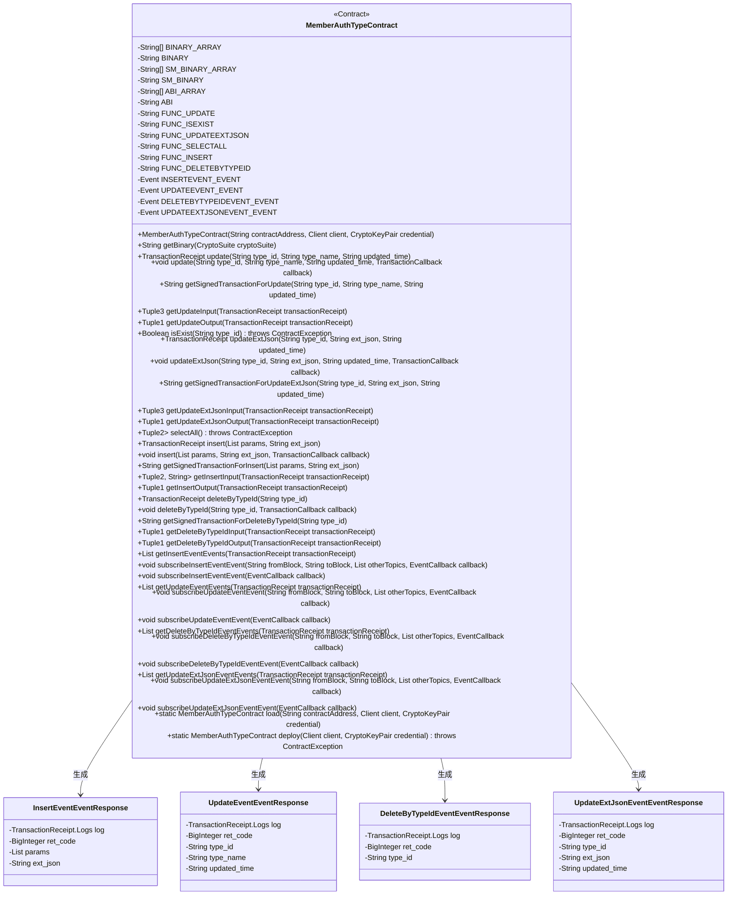
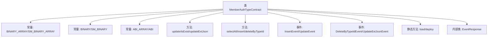
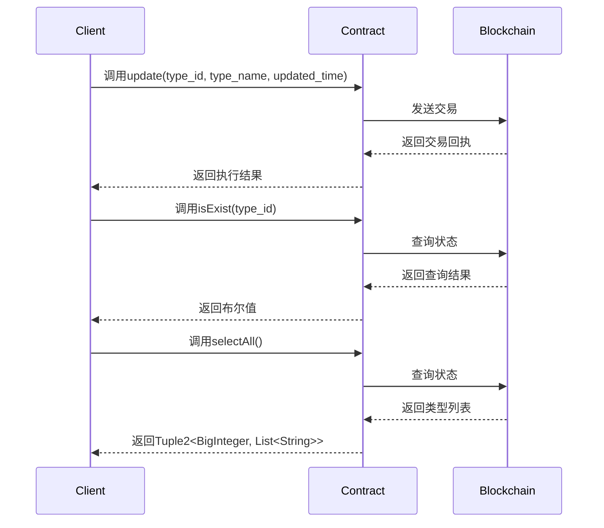

# 基础信息

|      |      |
|------|------|
| 名称 | MemberAuthTypeContract |
| 编码语言 | .java |
| 代码路径 | WeFe/manager/manager-service/src/main/java/com/welab/wefe/manager/service/contract/MemberAuthTypeContract.java |
| 包名 | com.welab.wefe.manager.service.contract |
| 依赖项 | ['org.fisco.bcos.sdk.abi.FunctionReturnDecoder', 'org.fisco.bcos.sdk.abi.TypeReference', 'org.fisco.bcos.sdk.abi.datatypes', 'org.fisco.bcos.sdk.abi.datatypes.generated.Int256', 'org.fisco.bcos.sdk.abi.datatypes.generated.tuples.generated.Tuple1', 'org.fisco.bcos.sdk.abi.datatypes.generated.tuples.generated.Tuple2', 'org.fisco.bcos.sdk.abi.datatypes.generated.tuples.generated.Tuple3', 'org.fisco.bcos.sdk.client.Client', 'org.fisco.bcos.sdk.contract.Contract', 'org.fisco.bcos.sdk.crypto.CryptoSuite', 'org.fisco.bcos.sdk.crypto.keypair.CryptoKeyPair', 'org.fisco.bcos.sdk.eventsub.EventCallback', 'org.fisco.bcos.sdk.model.CryptoType', 'org.fisco.bcos.sdk.model.TransactionReceipt', 'org.fisco.bcos.sdk.model.callback.TransactionCallback', 'org.fisco.bcos.sdk.transaction.model.exception.ContractException', 'java.math.BigInteger', 'java.util.ArrayList', 'java.util.Arrays', 'java.util.Collections', 'java.util.List'] |
| 概述说明 | MemberAuthTypeContract是一个智能合约类，用于管理成员认证类型。主要功能包括：1. 合约核心功能：- 更新认证类型信息(update)- 检查类型是否存在(isExist)- 更新扩展JSON数据(updateExtJson) - 查询所有类型(selectAll)- 添加新类型(insert)- 删除类型(deleteByTypeId)2. 事件监听：- 插入事件(InsertEvent)- 更新事件(UpdateEvent)- 删除事件(DeleteByTypeIdEvent)- 更新JSON事件(UpdateExtJsonEvent)3. 技术特性：- 支持ECDSA和SM2加密算法- 提供同步/异步交易方式- 支持事件订阅功能- 包含完整的ABI和二进制代码4. 数据结构：- 使用字符串存储类型ID、名称和时间- 支持动态数组和JSON扩展数据该合约适用于需要管理多种认证类型的区块链应用场景。 |

# 说明

MemberAuthTypeContract是一个智能合约类，用于管理成员认证类型。它继承自Contract基类，提供了与区块链交互的功能。合约包含以下主要功能：

1. 核心功能方法：
- update(): 更新认证类型信息
- isExist(): 检查类型是否存在
- updateExtJson(): 更新扩展JSON信息
- selectAll(): 查询所有类型
- insert(): 插入新认证类型
- deleteByTypeId(): 删除指定类型

2. 事件监听：
- insertEvent: 插入事件
- updateEvent: 更新事件
- deleteByTypeIdEvent: 删除事件
- updateExtJsonEvent: 更新JSON事件

3. 辅助功能：
- 提供ABI和二进制代码
- 支持ECDSA和SM2两种加密算法
- 包含输入/输出参数解析方法
- 支持同步和异步交易
- 提供事件订阅功能

合约使用Solidity编写，支持字符串、数组等复杂数据类型，并通过事件机制实现链下通知。每个方法都提供了完整的交易处理流程，包括交易发送、回执获取和结果解析。

# 类列表 Class Summary

| 名称   | 类型  | 说明 |
|-------|------|-------------|
| MemberAuthTypeContract | class | MemberAuthTypeContract 是一个智能合约类，用于管理成员认证类型。主要功能包括：1. 提供更新、查询、插入和删除认证类型的操作2. 包含4个事件：insertEvent、updateEvent、deleteByTypeIdEvent和updateExtJsonEvent3. 支持ECDSA和SM2两种加密算法4. 提供同步和异步交易执行方式5. 包含完整的ABI和二进制代码关键点：- 继承自Contract基类- 包含6个主要函数：update、isExist、updateExtJson、selectAll、insert和deleteByTypeId- 每个函数都有对应的输入输出解析方法- 支持事件订阅功能- 提供合约部署和加载方法这是一个完整的智能合约封装类，用于与区块链上的合约交互。 |

## 类 MemberAuthTypeContract

|      |      |
|------|------|
| 访问范围 | @SuppressWarnings("unchecked");public |
| 类型 | class |
| 名称 | MemberAuthTypeContract |
| 说明 | MemberAuthTypeContract 是一个智能合约类，用于管理成员认证类型。主要功能包括：1. 提供更新、查询、插入和删除认证类型的操作2. 包含4个事件：insertEvent、updateEvent、deleteByTypeIdEvent和updateExtJsonEvent3. 支持ECDSA和SM2两种加密算法4. 提供同步和异步交易执行方式5. 包含完整的ABI和二进制代码关键点：- 继承自Contract基类- 包含6个主要函数：update、isExist、updateExtJson、selectAll、insert和deleteByTypeId- 每个函数都有对应的输入输出解析方法- 支持事件订阅功能- 提供合约部署和加载方法这是一个完整的智能合约封装类，用于与区块链上的合约交互。 |

### UML类图

这段代码定义了一个名为`MemberAuthTypeContract`的智能合约类，主要用于成员认证类型的管理。合约包含多个功能方法如更新、查询、插入和删除认证类型，以及相应的事件响应类。合约支持两种加密方式（ECDSA和SM），通过`getBinary`方法根据加密套件类型返回对应的合约二进制代码。类图中展示了主合约类与四个事件响应类之间的关系，主合约会生成这些事件响应对象来处理不同类型的事件。合约提供了完整的CRUD操作和事件订阅功能，适用于区块链上的成员认证类型管理场景。

### 内部方法调用关系图

这段代码是一个智能合约的Java封装类，主要功能包括：
1. 提供了成员认证类型的管理功能，包含增删改查等操作
2. 定义了4个事件用于记录合约操作日志
3. 支持普通交易和查询调用两种交互方式
4. 包含完整的ABI和二进制代码，支持合约部署和加载
5. 使用泛型和Tuple结构处理复杂返回值
6. 提供了事件监听的订阅功能
7. 同时支持国密和非国密两种加密算法

### 字段列表 Field List

| 名称  | 类型  | 说明 |
|-------|-------|------|
| INSERTEVENT_EVENT = new Event("insertEvent",             Arrays.<TypeReference<?>>asList(new TypeReference<Int256>() {}, new TypeReference<DynamicArray<Utf8String>>() {}, new TypeReference<Utf8String>() {})) | Event | 定义静态常量INSERTEVENT_EVENT，类型为Event，包含事件名"insertEvent"及三个参数类型：Int256、DynamicArray<Utf8String>和Utf8String。 |
| FUNC_DELETEBYTYPEID = "deleteByTypeId" | String | 静态常量FUNC_DELETEBYTYPEID定义为"deleteByTypeId"。 |
| FUNC_SELECTALL = "selectAll" | String | 定义公共静态常量FUNC_SELECTALL，值为"selectAll"。 |
| FUNC_UPDATEEXTJSON = "updateExtJson" | String | 静态常量字符串，功能为更新扩展JSON数据。 |
| SM_BINARY_ARRAY = {"60806040523480156200001157600080fd5b506110016000806101000a81548173ffffffffffffffffffffffffffffffffffffffff021916908373ffffffffffffffffffffffffffffffffffffffff1602179055506000809054906101000a900473ffffffffffffffffffffffffffffffffffffffff1673ffffffffffffffffffffffffffffffffffffffff1663c92a78016040805190810160405280601081526020017f6d656d6265725f617574685f74797065000000000000000000000000000000008152506040518263ffffffff167c010000000000000000000000000000000000000000000000000000000002815260040162000101919062000270565b602060405180830381600087803b1580156200011c57600080fd5b505af115801562000131573d6000803e3d6000fd5b505050506040513d601f19601f8201168201806040525062000157919081019062000174565b506200031a565b60006200016c8251620002c9565b905092915050565b6000602082840312156200018757600080fd5b600062000197848285016200015e565b91505092915050565b6000620001ad82620002be565b808452620001c3816020860160208601620002d3565b620001ce8162000309565b602085010191505092915050565b6000603482527f747970655f69642c747970655f6e616d652c637265617465645f74696d652c7560208301527f7064617465645f74696d652c6578745f6a736f6e0000000000000000000000006040830152606082019050919050565b6000600682527f6669785f696400000000000000000000000000000000000000000000000000006020830152604082019050919050565b600060608201905081810360008301526200028c8184620001a0565b90508181036020830152620002a18162000239565b90508181036040830152620002b681620001dc565b905092915050565b600081519050919050565b6000819050919050565b60005b83811015620002f3578082015181840152602081019050620002d6565b8381111562000303576000848401525b50505050565b6000601f19601f8301169050919050565b613598806200032a6000396000f300608060405260043610610078576000357c0100000000000000000000000000000000000000000000000000000000900463ffffffff16806315d0d6251461007d578063568fe885146100ba5780637d71196c146100f75780639b6ba099146101345780639eb03ade14610171578063c181ca36146101ae575b600080fd5b34801561008957600080fd5b506100a4600480360361009f9190810190612c0e565b6101da565b6040516100b19190612f20565b60405180910390f35b3480156100c657600080fd5b506100e160048036036100dc9190810190612b8c565b61071c565b6040516100ee9190612f05565b60405180910390f35b34801561010357600080fd5b5061011e60048036036101199190810190612b8c565b610ae0565b60405161012b9190612f20565b60405180910390f35b34801561014057600080fd5b5061015b60048036036101569190810190612c0e565b610e6b565b6040516101689190612f20565b60405180910390f35b34801561017d57600080fd5b5061019860048036036101939190810190612a53565b611425565b6040516101a59190612f20565b60405180910390f35b3480156101ba57600080fd5b506101c3611b97565b6040516101d1929190612f3b565b60405180910390f35b6000806000806000806000809054906101000a900473ffffffffffffffffffffffffffffffffffffffff1673ffffffffffffffffffffffffffffffffffffffff166359a48b656040805190810160405280601081526020017f6d656d6265725f617574685f74797065000000000000000000000000000000008152506040518263ffffffff167c010000000000000000000000000000000000000000000000000000000002815260040161028e919061303a565b602060405180830381600087803b1580156102a857600080fd5b505af11580156102bc573d6000803e3d6000fd5b505050506040513d601f19601f820116820180604052506102e09190810190612b3a565b94508473ffffffffffffffffffffffffffffffffffffffff1663c74f8caf6040518163ffffffff167c0100000000000000000000000000000000000000000000000000000000028152600401602060405180830381600087803b15801561034657600080fd5b505af115801561035a573d6000803e3d6000fd5b505050506040513d601f19601f8201168201806040525061037e9190810190612abf565b93508373ffffffffffffffffffffffffffffffffffffffff1663ae763db58a6040518263ffffffff167c01000000000000000000000000000000000000000000000000000000000281526004016103d5919061314f565b600060405180830381600087803b1580156103ef57600080fd5b505af1158015610403573d6000803e3d6000fd5b505050508473ffffffffffffffffffffffffffffffffffffffff16635887ab246040518163ffffffff167c0100000000000000000000000000000000000000000000000000000000028152600401602060405180830381600087803b15801561046b57600080fd5b505af115801561047f573d6000803e3d6000fd5b505050506040513d601f19601f820116820180604052506104a39190810190612b11565b92508273ffffffffffffffffffffffffffffffffffffffff16631a391cb4896040518263ffffffff167c01000000000000000000000000000000000000000000000000000000000281526004016104fa9190613342565b600060405180830381600087803b15801561051457600080fd5b505af1158015610528573d6000803e3d6000fd5b505050508273ffffffffffffffffffffffffffffffffffffffff16631a391cb4886040518263ffffffff167c010000000000000000000000000000000000000000000000000000000002815260040161058191906131d9565b600060405180830381600087803b15801561059b57600080fd5b505af11580156105af573d6000803e3d6000fd5b505050508473ffffffffffffffffffffffffffffffffffffffff1663664b37d66040805190810160405280600a81526020017f6669785f69645f3030360000000000000000000000000000000000000000000081525085876040518463ffffffff167c0100000000000000000000000000000000000000000000000000000000028152600401610641939291906130bc565b602060405180830381600087803b15801561065b57600080fd5b505af115801561066f573d6000803e3d6000fd5b505050506040513d601f19601f820116820180604052506106939190810190612b63565b9150600090506001821215156106ac57600090506106d0565b7ffffffffffffffffffffffffffffffffffffffffffffffffffffffffffffffffe90505b7fb36a4960db7128c065f905021bc6b7ab38c8106c359c6ac8dcd55ed9356c994c818a8a8a6040516107059493929190612fe0565b60405180910390a180955050505050509392505050565b6000806000806000809054906101000a900473ffffffffffffffffffffffffffffffffffffffff1673ffffffffffffffffffffffffffffffffffffffff166359a48b656040805190810160405280601081526020017f6d656d6265725f617574685f74797065000000000000000000000000000000008152506040518263ffffffff167c01000000000000000000000000000000000000000000000000000000000281526004016107cd919061303a565b602060405180830381600087803b1580156107e757600080fd5b505af11580156107fb573d6000803e3d6000fd5b505050506040513d601f19601f8201168201806040525061081f9190810190612b3a565b92508273ffffffffffffffffffffffffffffffffffffffff1663c74f8caf6040518163ffffffff167c0100000000000000000000000000000000000000000000000000000000028152600401602060405180830381600087803b15801561088557600080fd5b505af1158015610899573d6000803e3d6000fd5b505050506040513d601f19601f820116820180604052506108bd9190810190612abf565b91508173ffffffffffffffffffffffffffffffffffffffff1663ae763db5866040518263ffffffff167c0100000000000000000000000000000000000000000000000000000000028152600401610914919061314f565b600060405180830381600087803b15801561092e57600080fd5b505af1158015610942573d6000803e3d6000fd5b505050508273ffffffffffffffffffffffffffffffffffffffff1663d8ac59576040805190810160405280600a81526020017f6669785f69645f30303600000000000000000000000000000000000000000000815250846040518363ffffffff167c01000000000000000000000000000000000000000000000000000000000281526004016109d292919061305c565b602060405180830381600087803b1580156109ec57600080fd5b505af1158015610a00573d6000803e3d6000fd5b505050506040513d601f19601f82011682018060405250610a249190810190612ae8565b905060008173ffffffffffffffffffffffffffffffffffffffff1663d3e9af5a6040518163ffffffff167c0100000000000000000000000000000000000000000000000000000000028152600401602060405180830381600087803b158015610a8c57600080fd5b505af1158015610aa0573d6000803e3d6000fd5b505050506040513d601f19601f82011682018060405250610ac49190810190612b63565b1115610ad35760019350610ad8565b600093505b505050919050565b60008060008060008093506000809054906101000a900473ffffffffffffffffffffffffffffffffffffffff1673ffffffffffffffffffffffffffffffffffffffff166359a48b656040805190810160405280601081526020017f6d656d6265725f617574685f74797065000000000000000000000000000000008152506040518263ffffffff167c0100000000000000000000000000000000000000000000000000000000028152600401610b96919061303a565b602060405180830381600087803b158015610bb057600080fd5b505af1158015610bc4573d6000803e3d6000fd5b505050506040513d601f19601f82011682018060405250610be89190810190612b3a565b92508273ffffffffffffffffffffffffffffffffffffffff1663c74f8caf6040518163ffffffff167c0100000000000000000000000000000000000000000000000000000000028152600401602060405180830381600087803b158015610c4e57600080fd5b505af1158015610c62573d6000803e3d6000fd5b505050506040513d601f19601f82011682018060405250610c869190810190612abf565b91508173ffffffffffffffffffffffffffffffffffffffff1663ae763db5876040518263ffffffff167c0100000000000000000000000000000000000000000000000000000000028152600401610c", "dd919061314f565b600060405180830381600087803b158015610cf757600080fd5b505af1158015610d0b573d6000803e3d6000fd5b505050508273ffffffffffffffffffffffffffffffffffffffff166309ff42f06040805190810160405280600a81526020017f6669785f69645f30303600000000000000000000000000000000000000000000815250846040518363ffffffff167c0100000000000000000000000000000000000000000000000000000000028152600401610d9b92919061305c565b602060405180830381600087803b158015610db557600080fd5b505af1158015610dc9573d6000803e3d6000fd5b505050506040513d601f19601f82011682018060405250610ded9190810190612b63565b9050600181121515610e025760009350610e26565b7ffffffffffffffffffffffffffffffffffffffffffffffffffffffffffffffffe93505b7f6b2f980959df7c69484eedc69946c27b3743d020380d5f3600dd0b0f57d0f4b18487604051610e57929190612fb0565b60405180910390a180945050505050919050565b60008060008060008060009450610e818961071c565b1515610eef577fffffffffffffffffffffffffffffffffffffffffffffffffffffffffffffffff94507f231031b5a33d2c7c5550f8174512618ed672d52be443d80b5146746637935cba858a8a8a604051610edf9493929190612fe0565b60405180910390a1849550611419565b6000809054906101000a900473ffffffffffffffffffffffffffffffffffffffff1673ffffffffffffffffffffffffffffffffffffffff166359a48b656040805190810160405280601081526020017f6d656d6265725f617574685f74797065000000000000000000000000000000008152506040518263ffffffff167c0100000000000000000000000000000000000000000000000000000000028152600401610f9a919061303a565b602060405180830381600087803b158015610fb457600080fd5b505af1158015610fc8573d6000803e3d6000fd5b505050506040513d601f19601f82011682018060405250610fec9190810190612b3a565b93508373ffffffffffffffffffffffffffffffffffffffff1663c74f8caf6040518163ffffffff167c0100000000000000000000000000000000000000000000000000000000028152600401602060405180830381600087803b15801561105257600080fd5b505af1158015611066573d6000803e3d6000fd5b505050506040513d601f19601f8201168201806040525061108a9190810190612abf565b92508273ffffffffffffffffffffffffffffffffffffffff1663ae763db58a6040518263ffffffff167c01000000000000000000000000000000000000000000000000000000000281526004016110e1919061314f565b600060405180830381600087803b1580156110fb57600080fd5b505af115801561110f573d6000803e3d6000fd5b505050508373ffffffffffffffffffffffffffffffffffffffff16635887ab246040518163ffffffff167c0100000000000000000000000000000000000000000000000000000000028152600401602060405180830381600087803b15801561117757600080fd5b505af115801561118b573d6000803e3d6000fd5b505050506040513d601f19601f820116820180604052506111af9190810190612b11565b91508173ffffffffffffffffffffffffffffffffffffffff16631a391cb4896040518263ffffffff167c010000000000000000000000000000000000000000000000000000000002815260040161120691906132ed565b600060405180830381600087803b15801561122057600080fd5b505af1158015611234573d6000803e3d6000fd5b505050508173ffffffffffffffffffffffffffffffffffffffff16631a391cb4886040518263ffffffff167c010000000000000000000000000000000000000000000000000000000002815260040161128d91906131d9565b600060405180830381600087803b1580156112a757600080fd5b505af11580156112bb573d6000803e3d6000fd5b505050508373ffffffffffffffffffffffffffffffffffffffff1663664b37d66040805190810160405280600a81526020017f6669785f69645f3030360000000000000000000000000000000000000000000081525084866040518463ffffffff167c010000000000000000000000000000000000000000000000000000000002815260040161134d939291906130bc565b602060405180830381600087803b15801561136757600080fd5b505af115801561137b573d6000803e3d6000fd5b505050506040513d601f19601f8201168201806040525061139f9190810190612b63565b90506001811215156113b457600094506113d8565b7ffffffffffffffffffffffffffffffffffffffffffffffffffffffffffffffffe94505b7f231031b5a33d2c7c5550f8174512618ed672d52be443d80b5146746637935cba858a8a8a60405161140d9493929190612fe0565b60405180910390a18095505b50505050509392505050565b600080600080600080935061145187600081518110151561144257fe5b9060200190602002015161071c565b156114dc577fffffffffffffffffffffffffffffffffffffffffffffffffffffffffffffffff93507fcb263a23d186eec891d55f1e0ba96ec8290af8c893d32d644c22dbff0953e51f8488886040516114ac93929190612f6b565b60405180910390a17fffffffffffffffffffffffffffffffffffffffffffffffffffffffffffffffff9450611b8d565b6000809054906101000a900473ffffffffffffffffffffffffffffffffffffffff1673ffffffffffffffffffffffffffffffffffffffff166359a48b656040805190810160405280601081526020017f6d656d6265725f617574685f74797065000000000000000000000000000000008152506040518263ffffffff167c0100000000000000000000000000000000000000000000000000000000028152600401611587919061303a565b602060405180830381600087803b1580156115a157600080fd5b505af11580156115b5573d6000803e3d6000fd5b505050506040513d601f19601f820116820180604052506115d99190810190612b3a565b92508273ffffffffffffffffffffffffffffffffffffffff16635887ab246040518163ffffffff167c0100000000000000000000000000000000000000000000000000000000028152600401602060405180830381600087803b15801561163f57600080fd5b505af1158015611653573d6000803e3d6000fd5b505050506040513d601f19601f820116820180604052506116779190810190612b11565b91508173ffffffffffffffffffffffffffffffffffffffff16631a391cb46040805190810160405280600a81526020017f6669785f69645f303036000000000000000000000000000000000000000000008152506040518263ffffffff167c01000000000000000000000000000000000000000000000000000000000281526004016117039190613263565b600060405180830381600087803b15801561171d57600080fd5b505af1158015611731573d6000803e3d6000fd5b505050508173ffffffffffffffffffffffffffffffffffffffff16631a391cb488600081518110151561176057fe5b906020019060200201516040518263ffffffff167c01000000000000000000000000000000000000000000000000000000000281526004016117a2919061311a565b600060405180830381600087803b1580156117bc57600080fd5b505af11580156117d0573d6000803e3d6000fd5b505050508173ffffffffffffffffffffffffffffffffffffffff16631a391cb48860018151811015156117ff57fe5b906020019060200201516040518263ffffffff167c010000000000000000000000000000000000000000000000000000000002815260040161184191906132b8565b600060405180830381600087803b15801561185b57600080fd5b505af115801561186f573d6000803e3d6000fd5b505050508173ffffffffffffffffffffffffffffffffffffffff16631a391cb488600281518110151561189e57fe5b906020019060200201516040518263ffffffff167c01000000000000000000000000000000000000000000000000000000000281526004016118e0919061322e565b600060405180830381600087803b1580156118fa57600080fd5b505af115801561190e573d6000803e3d6000fd5b505050508173ffffffffffffffffffffffffffffffffffffffff16631a391cb488600381518110151561193d57fe5b906020019060200201516040518263ffffffff167c010000000000000000000000000000000000000000000000000000000002815260040161197f91906131a4565b600060405180830381600087803b15801561199957600080fd5b505af11580156119ad573d6000803e3d6000fd5b505050508173ffffffffffffffffffffffffffffffffffffffff16631a391cb4876040518263ffffffff167c0100000000000000000000000000000000000000000000000000000000028152600401611a069190613342565b600060405180830381600087803b158015611a2057600080fd5b505af1158015611a34573d6000803e3d6000fd5b505050508273ffffffffffffffffffffffffffffffffffffffff16634c6f30c06040805190810160405280600a81526020017f6669785f69645f30303600000000000000000000000000000000000000000000815250846040518363ffffffff167c0100000000000000000000000000000000000000000000000000000000028152600401611ac492919061308c565b602060405180830381600087803b158015611ade57600080fd5b505af1158015611af2573d6000803e3d6000fd5b505050506040513d601f19601f82011682018060405250611b169190810190612b63565b90506001811415611b2a5760009350611b4e565b7ffffffffffffffffffffffffffffffffffffffffffffffffffffffffffffffffe93505b7fcb263a23d186eec891d55f1e0ba96ec8290af8c893d32d644c22dbff0953e51f848888604051611b8193929190612f6b565b60405180910390a18094505b5050505092915050565b600060606000806000809054906101000a900473ffffffffffffffffffffffffffffffffffffffff1673ffffffffffffffffffffffffffffffffffffffff166359a48b656040805190810160405280601081526020017f6d656d6265725f617574685f74797065000000000000000000000000000000008152506040518263ffffffff167c0100000000000000000000000000000000000000000000000000000000028152600401611c49919061303a565b602060405180830381600087803b158015611c6357600080fd5b505af1158015611c77573d6000803e3d6000fd5b505050506040513d601f19601f82011682018060405250611c9b9190810190612b3a565b91508173ffffffffffffffffffffffffffffffffffffffff1663d8ac59576040805190810160405280600a81526020017f6669785f69645f3030", "36000000000000000000000000000000000000000000008152508473ffffffffffffffffffffffffffffffffffffffff1663c74f8caf6040518163ffffffff167c0100000000000000000000000000000000000000000000000000000000028152600401602060405180830381600087803b158015611d5357600080fd5b505af1158015611d67573d6000803e3d6000fd5b505050506040513d601f19601f82011682018060405250611d8b9190810190612abf565b6040518363ffffffff167c0100000000000000000000000000000000000000000000000000000000028152600401611dc492919061305c565b602060405180830381600087803b158015611dde57600080fd5b505af1158015611df2573d6000803e3d6000fd5b505050506040513d601f19601f82011682018060405250611e169190810190612ae8565b90508073ffffffffffffffffffffffffffffffffffffffff1663d3e9af5a6040518163ffffffff167c0100000000000000000000000000000000000000000000000000000000028152600401602060405180830381600087803b158015611e7c57600080fd5b505af1158015611e90573d6000803e3d6000fd5b505050506040513d601f19601f82011682018060405250611eb49190810190612b63565b60001415611f22577ffffffffffffffffffffffffffffffffffffffffffffffffffffffffffffffffd6000604051908082528060200260200182016040528015611f1257816020015b6060815260200190600190039081611efd5790505b5081915080905093509350611f35565b6000611f2d82611f3b565b819150935093505b50509091565b60608060008060608573ffffffffffffffffffffffffffffffffffffffff1663d3e9af5a6040518163ffffffff167c0100000000000000000000000000000000000000000000000000000000028152600401602060405180830381600087803b158015611fa757600080fd5b505af1158015611fbb573d6000803e3d6000fd5b505050506040513d601f19601f82011682018060405250611fdf9190810190612b63565b60405190808252806020026020018201604052801561201257816020015b6060815260200190600190039081611ffd5790505b509350600092505b8573ffffffffffffffffffffffffffffffffffffffff1663d3e9af5a6040518163ffffffff167c0100000000000000000000000000000000000000000000000000000000028152600401602060405180830381600087803b15801561207e57600080fd5b505af1158015612092573d6000803e3d6000fd5b505050506040513d601f19601f820116820180604052506120b69190810190612b63565b831215612636578573ffffffffffffffffffffffffffffffffffffffff16633dd2b614846040518263ffffffff167c01000000000000000000000000000000000000000000000000000000000281526004016121129190612f20565b602060405180830381600087803b15801561212c57600080fd5b505af1158015612140573d6000803e3d6000fd5b505050506040513d601f19601f820116820180604052506121649190810190612b11565b915061225661221b8373ffffffffffffffffffffffffffffffffffffffff16639bca41e86040518163ffffffff167c01000000000000000000000000000000000000000000000000000000000281526004016121bf906130fa565b600060405180830381600087803b1580156121d957600080fd5b505af11580156121ed573d6000803e3d6000fd5b505050506040513d6000823e3d601f19601f820116820180604052506122169190810190612bcd565b612642565b6040805190810160405280600181526020017f7c0000000000000000000000000000000000000000000000000000000000000081525061269b565b90506123138161230e8473ffffffffffffffffffffffffffffffffffffffff16639bca41e86040518163ffffffff167c01000000000000000000000000000000000000000000000000000000000281526004016122b290613298565b600060405180830381600087803b1580156122cc57600080fd5b505af11580156122e0573d6000803e3d6000fd5b505050506040513d6000823e3d601f19601f820116820180604052506123099190810190612bcd565b612642565b61269b565b9050612354816040805190810160405280600181526020017f7c0000000000000000000000000000000000000000000000000000000000000081525061269b565b90506124118161240c8473ffffffffffffffffffffffffffffffffffffffff16639bca41e86040518163ffffffff167c01000000000000000000000000000000000000000000000000000000000281526004016123b09061320e565b600060405180830381600087803b1580156123ca57600080fd5b505af11580156123de573d6000803e3d6000fd5b505050506040513d6000823e3d601f19601f820116820180604052506124079190810190612bcd565b612642565b61269b565b9050612452816040805190810160405280600181526020017f7c0000000000000000000000000000000000000000000000000000000000000081525061269b565b905061250f8161250a8473ffffffffffffffffffffffffffffffffffffffff16639bca41e86040518163ffffffff167c01000000000000000000000000000000000000000000000000000000000281526004016124ae90613184565b600060405180830381600087803b1580156124c857600080fd5b505af11580156124dc573d6000803e3d6000fd5b505050506040513d6000823e3d601f19601f820116820180604052506125059190810190612bcd565b612642565b61269b565b9050612550816040805190810160405280600181526020017f7c0000000000000000000000000000000000000000000000000000000000000081525061269b565b905061260d816126088473ffffffffffffffffffffffffffffffffffffffff16639bca41e86040518163ffffffff167c01000000000000000000000000000000000000000000000000000000000281526004016125ac90613322565b600060405180830381600087803b1580156125c657600080fd5b505af11580156125da573d6000803e3d6000fd5b505050506040513d6000823e3d601f19601f820116820180604052506126039190810190612bcd565b612642565b61269b565b905080848481518110151561261e57fe5b9060200190602002018190525082600101925061201a565b83945050505050919050565b6060600061264f8361286c565b1415612692576040805190810160405280600181526020017f20000000000000000000000000000000000000000000000000000000000000008152509050612696565b8190505b919050565b606080606080606060008088955087945084518651016040519080825280601f01601f1916602001820160405280156126e35781602001602082028038833980820191505090505b50935083925060009150600090505b85518110156127a557858181518110151561270957fe5b9060200101517f010000000000000000000000000000000000000000000000000000000000000090047f010000000000000000000000000000000000000000000000000000000000000002838380600101945081518110151561276857fe5b9060200101907effffffffffffffffffffffffffffffffffffffffffffffffffffffffffffff1916908160001a90535080806001019150506126f2565b600090505b845181101561285d5784818151811015156127c157fe5b9060200101517f010000000000000000000000000000000000000000000000000000000000000090047f010000000000000000000000000000000000000000000000000000000000000002838380600101945081518110151561282057fe5b9060200101907effffffffffffffffffffffffffffffffffffffffffffffffffffffffffffff1916908160001a90535080806001019150506127aa565b83965050505050505092915050565b600081519050919050565b600082601f830112151561288a57600080fd5b813561289d612898826133a4565b613377565b9150818183526020840193506020810190508360005b838110156128e357813586016128c98882612951565b8452602084019350602083019250506001810190506128b3565b5050505092915050565b60006128f98251613495565b905092915050565b600061290d82516134a7565b905092915050565b600061292182516134b9565b905092915050565b600061293582516134cb565b905092915050565b600061294982516134dd565b905092915050565b600082601f830112151561296457600080fd5b8135612977612972826133cc565b613377565b9150808252602083016020830185838301111561299357600080fd5b61299e83828461350b565b50505092915050565b600082601f83011215156129ba57600080fd5b81356129cd6129c8826133f8565b613377565b915080825260208301602083018583830111156129e957600080fd5b6129f483828461350b565b50505092915050565b600082601f8301121515612a1057600080fd5b8151612a23612a1e826133f8565b613377565b91508082526020830160208301858383011115612a3f57600080fd5b612a4a83828461351a565b50505092915050565b60008060408385031215612a6657600080fd5b600083013567ffffffffffffffff811115612a8057600080fd5b612a8c85828601612877565b925050602083013567ffffffffffffffff811115612aa957600080fd5b612ab5858286016129a7565b9150509250929050565b600060208284031215612ad157600080fd5b6000612adf848285016128ed565b91505092915050565b600060208284031215612afa57600080fd5b6000612b0884828501612901565b91505092915050565b600060208284031215612b2357600080fd5b6000612b3184828501612915565b91505092915050565b600060208284031215612b4c57600080fd5b6000612b5a84828501612929565b91505092915050565b600060208284031215612b7557600080fd5b6000612b838482850161293d565b91505092915050565b600060208284031215612b9e57600080fd5b600082013567ffffffffffffffff811115612bb857600080fd5b612bc4848285016129a7565b91505092915050565b600060208284031215612bdf57600080fd5b600082015167ffffffffffffffff811115612bf957600080fd5b612c05848285016129fd565b91505092915050565b600080600060608486031215612c2357600080fd5b600084013567ffffffffffffffff811115612c3d57600080fd5b612c49868287016129a7565b935050602084013567ffffffffffffffff811115612c6657600080fd5b612c72868287016129a7565b925050604084013567ffffffffffffffff811115612c8f57600080fd5b612c9b868287016129a7565b9150509250925092565b6000612cb082613431565b80845260208401935083602082028501612cc985613424565b60005b84811015612d025783", "83038852612ce4838351612d85565b9250612cef82613452565b9150602088019750600181019050612ccc565b508196508694505050505092915050565b612d1c8161347f565b82525050565b612d2b816134e7565b82525050565b612d3a816134f9565b82525050565b612d498161348b565b82525050565b6000612d5a82613447565b808452612d6e81602086016020860161351a565b612d778161354d565b602085010191505092915050565b6000612d908261343c565b808452612da481602086016020860161351a565b612dad8161354d565b602085010191505092915050565b6000600782527f747970655f6964000000000000000000000000000000000000000000000000006020830152604082019050919050565b6000600c82527f757064617465645f74696d6500000000000000000000000000000000000000006020830152604082019050919050565b6000600c82527f637265617465645f74696d6500000000000000000000000000000000000000006020830152604082019050919050565b6000600682527f6669785f696400000000000000000000000000000000000000000000000000006020830152604082019050919050565b6000600982527f747970655f6e616d6500000000000000000000000000000000000000000000006020830152604082019050919050565b6000600882527f6578745f6a736f6e0000000000000000000000000000000000000000000000006020830152604082019050919050565b6000602082019050612f1a6000830184612d13565b92915050565b6000602082019050612f356000830184612d40565b92915050565b6000604082019050612f506000830185612d40565b8181036020830152612f628184612ca5565b90509392505050565b6000606082019050612f806000830186612d40565b8181036020830152612f928185612ca5565b90508181036040830152612fa68184612d4f565b9050949350505050565b6000604082019050612fc56000830185612d40565b8181036020830152612fd78184612d4f565b90509392505050565b6000608082019050612ff56000830187612d40565b81810360208301526130078186612d4f565b9050818103604083015261301b8185612d4f565b9050818103606083015261302f8184612d4f565b905095945050505050565b600060208201905081810360008301526130548184612d85565b905092915050565b600060408201905081810360008301526130768185612d85565b90506130856020830184612d22565b9392505050565b600060408201905081810360008301526130a68185612d85565b90506130b56020830184612d31565b9392505050565b600060608201905081810360008301526130d68186612d85565b90506130e56020830185612d31565b6130f26040830184612d22565b949350505050565b6000602082019050818103600083015261311381612dbb565b9050919050565b6000604082019050818103600083015261313381612dbb565b905081810360208301526131478184612d85565b905092915050565b6000604082019050818103600083015261316881612dbb565b9050818103602083015261317c8184612d4f565b905092915050565b6000602082019050818103600083015261319d81612df2565b9050919050565b600060408201905081810360008301526131bd81612df2565b905081810360208301526131d18184612d85565b905092915050565b600060408201905081810360008301526131f281612df2565b905081810360208301526132068184612d4f565b905092915050565b6000602082019050818103600083015261322781612e29565b9050919050565b6000604082019050818103600083015261324781612e29565b9050818103602083015261325b8184612d85565b905092915050565b6000604082019050818103600083015261327c81612e60565b905081810360208301526132908184612d85565b905092915050565b600060208201905081810360008301526132b181612e97565b9050919050565b600060408201905081810360008301526132d181612e97565b905081810360208301526132e58184612d85565b905092915050565b6000604082019050818103600083015261330681612e97565b9050818103602083015261331a8184612d4f565b905092915050565b6000602082019050818103600083015261333b81612ece565b9050919050565b6000604082019050818103600083015261335b81612ece565b9050818103602083015261336f8184612d4f565b905092915050565b6000604051905081810181811067ffffffffffffffff8211171561339a57600080fd5b8060405250919050565b600067ffffffffffffffff8211156133bb57600080fd5b602082029050602081019050919050565b600067ffffffffffffffff8211156133e357600080fd5b601f19601f8301169050602081019050919050565b600067ffffffffffffffff82111561340f57600080fd5b601f19601f8301169050602081019050919050565b6000602082019050919050565b600081519050919050565b600081519050919050565b600081519050919050565b6000602082019050919050565b600073ffffffffffffffffffffffffffffffffffffffff82169050919050565b60008115159050919050565b6000819050919050565b60006134a08261345f565b9050919050565b60006134b28261345f565b9050919050565b60006134c48261345f565b9050919050565b60006134d68261345f565b9050919050565b6000819050919050565b60006134f28261345f565b9050919050565b60006135048261345f565b9050919050565b82818337600083830152505050565b60005b8381101561353857808201518184015260208101905061351d565b83811115613547576000848401525b50505050565b6000601f19601f83011690509190505600a265627a7a72305820f02d97234333d662792dfe6f5169ae37634a00e0afc602de39f7290c8c9b124f6c6578706572696d656e74616cf50037"} | String[] | SM_BINARY_ARRAY包含两个长十六进制字符串，可能是智能合约的字节码或相关数据。 |
| DELETEBYTYPEIDEVENT_EVENT = new Event("deleteByTypeIdEvent",             Arrays.<TypeReference<?>>asList(new TypeReference<Int256>() {}, new TypeReference<Utf8String>() {})) | Event | 静态常量DELETEBYTYPEIDEVENT_EVENT定义了一个事件，包含名称"deleteByTypeIdEvent"和两个参数类型：Int256和Utf8String。 |
| FUNC_ISEXIST = "isExist" | String | 静态常量字符串FUNC_ISEXIST值为"isExist"。 |
| ABI = String.join("", ABI_ARRAY) | String | 将ABI_ARRAY数组元素拼接为ABI字符串常量。 |
| FUNC_INSERT = "insert" | String | 静态常量字符串FUNC_INSERT，值为"insert"。 |
| UPDATEEXTJSONEVENT_EVENT = new Event("updateExtJsonEvent",             Arrays.<TypeReference<?>>asList(new TypeReference<Int256>() {}, new TypeReference<Utf8String>() {}, new TypeReference<Utf8String>() {}, new TypeReference<Utf8String>() {})) | Event | 定义静态常量UPDATEEXTJSONEVENT_EVENT，类型为Event，包含四个参数：Int256和三个Utf8String。 |
| UPDATEEVENT_EVENT = new Event("updateEvent",             Arrays.<TypeReference<?>>asList(new TypeReference<Int256>() {}, new TypeReference<Utf8String>() {}, new TypeReference<Utf8String>() {}, new TypeReference<Utf8String>() {})) | Event | 定义名为UPDATEEVENT_EVENT的公共静态常量事件，包含Int256和三个Utf8String类型参数。 |
| SM_BINARY = String.join("", SM_BINARY_ARRAY) | String | 定义静态常量SM_BINARY，其值为SM_BINARY_ARRAY拼接而成的字符串。 |
| ABI_ARRAY = {"[{\"constant\":false,\"inputs\":[{\"name\":\"type_id\",\"type\":\"string\"},{\"name\":\"type_name\",\"type\":\"string\"},{\"name\":\"updated_time\",\"type\":\"string\"}],\"name\":\"update\",\"outputs\":[{\"name\":\"\",\"type\":\"int256\"}],\"payable\":false,\"stateMutability\":\"nonpayable\",\"type\":\"function\"},{\"constant\":true,\"inputs\":[{\"name\":\"type_id\",\"type\":\"string\"}],\"name\":\"isExist\",\"outputs\":[{\"name\":\"\",\"type\":\"bool\"}],\"payable\":false,\"stateMutability\":\"view\",\"type\":\"function\"},{\"constant\":false,\"inputs\":[{\"name\":\"type_id\",\"type\":\"string\"},{\"name\":\"ext_json\",\"type\":\"string\"},{\"name\":\"updated_time\",\"type\":\"string\"}],\"name\":\"updateExtJson\",\"outputs\":[{\"name\":\"\",\"type\":\"int256\"}],\"payable\":false,\"stateMutability\":\"nonpayable\",\"type\":\"function\"},{\"constant\":true,\"inputs\":[],\"name\":\"selectAll\",\"outputs\":[{\"name\":\"\",\"type\":\"int256\"},{\"name\":\"\",\"type\":\"string[]\"}],\"payable\":false,\"stateMutability\":\"view\",\"type\":\"function\"},{\"constant\":false,\"inputs\":[{\"name\":\"params\",\"type\":\"string[]\"},{\"name\":\"ext_json\",\"type\":\"string\"}],\"name\":\"insert\",\"outputs\":[{\"name\":\"\",\"type\":\"int256\"}],\"payable\":false,\"stateMutability\":\"nonpayable\",\"type\":\"function\"},{\"constant\":false,\"inputs\":[{\"name\":\"type_id\",\"type\":\"string\"}],\"name\":\"deleteByTypeId\",\"outputs\":[{\"name\":\"\",\"type\":\"int256\"}],\"payable\":false,\"stateMutability\":\"nonpayable\",\"type\":\"function\"},{\"inputs\":[],\"payable\":false,\"stateMutability\":\"nonpayable\",\"type\":\"constructor\"},{\"anonymous\":false,\"inputs\":[{\"indexed\":false,\"name\":\"ret_code\",\"type\":\"int256\"},{\"indexed\":false,\"name\":\"params\",\"type\":\"string[]\"},{\"indexed\":false,\"name\":\"ext_json\",\"type\":\"string\"}],\"name\":\"insertEvent\",\"type\":\"event\"},{\"anonymous\":false,\"inputs\":[{\"indexed\":false,\"name\":\"ret_code\",\"type\":\"int256\"},{\"indexed\":false,\"name\":\"type_id\",\"type\":\"string\"},{\"indexed\":false,\"name\":\"type_name\",\"type\":\"string\"},{\"indexed\":false,\"name\":\"updated_time\",\"type\":\"string\"}],\"name\":\"updateEvent\",\"type\":\"event\"},{\"anonymous\":false,\"inputs\":[{\"indexed\":false,\"name\":\"ret_code\",\"type\":\"int256\"},{\"indexed\":false,\"name\":\"type_id\",\"type\":\"string\"}],\"name\":\"deleteByTypeIdEvent\",\"type\":\"event\"},{\"anonymous\":false,\"inputs\":[{\"indexed\":false,\"name\":\"ret_code\",\"type\":\"int256\"},{\"indexed\":false,\"name\":\"type_id\",\"type\":\"string\"},{\"indexed\":false,\"name\":\"ext_json\",\"type\":\"string\"},{\"indexed\":false,\"name\":\"updated_time\",\"type\":\"string\"}],\"name\":\"updateExtJsonEvent\",\"type\":\"event\"}]"} | String[] | ABI数组包含智能合约的函数和事件定义，涉及更新、查询、插入、删除操作及对应事件。 |
| BINARY_ARRAY = {"60806040523480156200001157600080fd5b506110016000806101000a81548173ffffffffffffffffffffffffffffffffffffffff021916908373ffffffffffffffffffffffffffffffffffffffff1602179055506000809054906101000a900473ffffffffffffffffffffffffffffffffffffffff1673ffffffffffffffffffffffffffffffffffffffff166356004b6a6040805190810160405280601081526020017f6d656d6265725f617574685f74797065000000000000000000000000000000008152506040518263ffffffff167c010000000000000000000000000000000000000000000000000000000002815260040162000101919062000270565b602060405180830381600087803b1580156200011c57600080fd5b505af115801562000131573d6000803e3d6000fd5b505050506040513d601f19601f8201168201806040525062000157919081019062000174565b506200031a565b60006200016c8251620002c9565b905092915050565b6000602082840312156200018757600080fd5b600062000197848285016200015e565b91505092915050565b6000620001ad82620002be565b808452620001c3816020860160208601620002d3565b620001ce8162000309565b602085010191505092915050565b6000600682527f6669785f696400000000000000000000000000000000000000000000000000006020830152604082019050919050565b6000603482527f747970655f69642c747970655f6e616d652c637265617465645f74696d652c7560208301527f7064617465645f74696d652c6578745f6a736f6e0000000000000000000000006040830152606082019050919050565b600060608201905081810360008301526200028c8184620001a0565b90508181036020830152620002a181620001dc565b90508181036040830152620002b68162000213565b905092915050565b600081519050919050565b6000819050919050565b60005b83811015620002f3578082015181840152602081019050620002d6565b8381111562000303576000848401525b50505050565b6000601f19601f8301169050919050565b613598806200032a6000396000f300608060405260043610610078576000357c0100000000000000000000000000000000000000000000000000000000900463ffffffff16806331c3e4561461007d5780634d3d096b146100ba57806363964aa3146100f7578063857cb0eb1461013457806397291150146101605780639a76fa5b1461019d575b600080fd5b34801561008957600080fd5b506100a4600480360361009f9190810190612c0e565b6101da565b6040516100b19190612f20565b60405180910390f35b3480156100c657600080fd5b506100e160048036036100dc9190810190612b8c565b610794565b6040516100ee9190612f05565b60405180910390f35b34801561010357600080fd5b5061011e60048036036101199190810190612c0e565b610b58565b60405161012b9190612f20565b60405180910390f35b34801561014057600080fd5b5061014961109a565b604051610157929190612f3b565b60405180910390f35b34801561016c57600080fd5b5061018760048036036101829190810190612a53565b61143e565b6040516101949190612f20565b60405180910390f35b3480156101a957600080fd5b506101c460048036036101bf9190810190612b8c565b611bb0565b6040516101d19190612f20565b60405180910390f35b600080600080600080600094506101f089610794565b151561025e577fffffffffffffffffffffffffffffffffffffffffffffffffffffffffffffffff94507f0231c8f3a3c3deaaaafc45211385f59dee4db8b34e29d7ff74851d7bc5179d00858a8a8a60405161024e9493929190612fe0565b60405180910390a1849550610788565b6000809054906101000a900473ffffffffffffffffffffffffffffffffffffffff1673ffffffffffffffffffffffffffffffffffffffff1663f23f63c96040805190810160405280601081526020017f6d656d6265725f617574685f74797065000000000000000000000000000000008152506040518263ffffffff167c0100000000000000000000000000000000000000000000000000000000028152600401610309919061303a565b602060405180830381600087803b15801561032357600080fd5b505af1158015610337573d6000803e3d6000fd5b505050506040513d601f19601f8201168201806040525061035b9190810190612b3a565b93508373ffffffffffffffffffffffffffffffffffffffff16637857d7c96040518163ffffffff167c0100000000000000000000000000000000000000000000000000000000028152600401602060405180830381600087803b1580156103c157600080fd5b505af11580156103d5573d6000803e3d6000fd5b505050506040513d601f19601f820116820180604052506103f99190810190612abf565b92508273ffffffffffffffffffffffffffffffffffffffff1663cd30a1d18a6040518263ffffffff167c01000000000000000000000000000000000000000000000000000000000281526004016104509190613263565b600060405180830381600087803b15801561046a57600080fd5b505af115801561047e573d6000803e3d6000fd5b505050508373ffffffffffffffffffffffffffffffffffffffff166313db93466040518163ffffffff167c0100000000000000000000000000000000000000000000000000000000028152600401602060405180830381600087803b1580156104e657600080fd5b505af11580156104fa573d6000803e3d6000fd5b505050506040513d601f19601f8201168201806040525061051e9190810190612b11565b91508173ffffffffffffffffffffffffffffffffffffffff1663e942b516896040518263ffffffff167c01000000000000000000000000000000000000000000000000000000000281526004016105759190613342565b600060405180830381600087803b15801561058f57600080fd5b505af11580156105a3573d6000803e3d6000fd5b505050508173ffffffffffffffffffffffffffffffffffffffff1663e942b516886040518263ffffffff167c01000000000000000000000000000000000000000000000000000000000281526004016105fc91906131d9565b600060405180830381600087803b15801561061657600080fd5b505af115801561062a573d6000803e3d6000fd5b505050508373ffffffffffffffffffffffffffffffffffffffff1663bf2b70a16040805190810160405280600a81526020017f6669785f69645f3030360000000000000000000000000000000000000000000081525084866040518463ffffffff167c01000000000000000000000000000000000000000000000000000000000281526004016106bc939291906130bc565b602060405180830381600087803b1580156106d657600080fd5b505af11580156106ea573d6000803e3d6000fd5b505050506040513d601f19601f8201168201806040525061070e9190810190612b63565b90506001811215156107235760009450610747565b7ffffffffffffffffffffffffffffffffffffffffffffffffffffffffffffffffe94505b7f0231c8f3a3c3deaaaafc45211385f59dee4db8b34e29d7ff74851d7bc5179d00858a8a8a60405161077c9493929190612fe0565b60405180910390a18095505b50505050509392505050565b6000806000806000809054906101000a900473ffffffffffffffffffffffffffffffffffffffff1673ffffffffffffffffffffffffffffffffffffffff1663f23f63c96040805190810160405280601081526020017f6d656d6265725f617574685f74797065000000000000000000000000000000008152506040518263ffffffff167c0100000000000000000000000000000000000000000000000000000000028152600401610845919061303a565b602060405180830381600087803b15801561085f57600080fd5b505af1158015610873573d6000803e3d6000fd5b505050506040513d601f19601f820116820180604052506108979190810190612b3a565b92508273ffffffffffffffffffffffffffffffffffffffff16637857d7c96040518163ffffffff167c0100000000000000000000000000000000000000000000000000000000028152600401602060405180830381600087803b1580156108fd57600080fd5b505af1158015610911573d6000803e3d6000fd5b505050506040513d601f19601f820116820180604052506109359190810190612abf565b91508173ffffffffffffffffffffffffffffffffffffffff1663cd30a1d1866040518263ffffffff167c010000000000000000000000000000000000000000000000000000000002815260040161098c9190613263565b600060405180830381600087803b1580156109a657600080fd5b505af11580156109ba573d6000803e3d6000fd5b505050508273ffffffffffffffffffffffffffffffffffffffff1663e8434e396040805190810160405280600a81526020017f6669785f69645f30303600000000000000000000000000000000000000000000815250846040518363ffffffff167c0100000000000000000000000000000000000000000000000000000000028152600401610a4a92919061305c565b602060405180830381600087803b158015610a6457600080fd5b505af1158015610a78573d6000803e3d6000fd5b505050506040513d601f19601f82011682018060405250610a9c9190810190612ae8565b905060008173ffffffffffffffffffffffffffffffffffffffff1663949d225d6040518163ffffffff167c0100000000000000000000000000000000000000000000000000000000028152600401602060405180830381600087803b158015610b0457600080fd5b505af1158015610b18573d6000803e3d6000fd5b505050506040513d601f19601f82011682018060405250610b3c9190810190612b63565b1115610b4b5760019350610b50565b600093505b505050919050565b6000806000806000806000809054906101000a900473ffffffffffffffffffffffffffffffffffffffff1673ffffffffffffffffffffffffffffffffffffffff1663f23f63c96040805190810160405280601081526020017f6d656d6265725f617574685f74797065000000000000000000000000000000008152506040518263ffffffff167c0100000000000000000000000000000000000000000000000000000000028152600401610c0c919061303a565b602060405180830381600087803b158015610c2657600080fd5b505af1158015610c3a573d6000803e3d6000fd5b505050506040513d601f19601f82011682018060405250610c5e9190810190612b3a565b94508473ffffffffffffffffffffffffffffffffffffffff16637857d7c96040518163ffffffff167c0100000000000000000000000000000000000000000000000000000000028152600401602060405180830381600087803b158015610cc457600080fd5b505af1158015610cd8573d6000803e3d60", "00fd5b505050506040513d601f19601f82011682018060405250610cfc9190810190612abf565b93508373ffffffffffffffffffffffffffffffffffffffff1663cd30a1d18a6040518263ffffffff167c0100000000000000000000000000000000000000000000000000000000028152600401610d539190613263565b600060405180830381600087803b158015610d6d57600080fd5b505af1158015610d81573d6000803e3d6000fd5b505050508473ffffffffffffffffffffffffffffffffffffffff166313db93466040518163ffffffff167c0100000000000000000000000000000000000000000000000000000000028152600401602060405180830381600087803b158015610de957600080fd5b505af1158015610dfd573d6000803e3d6000fd5b505050506040513d601f19601f82011682018060405250610e219190810190612b11565b92508273ffffffffffffffffffffffffffffffffffffffff1663e942b516896040518263ffffffff167c0100000000000000000000000000000000000000000000000000000000028152600401610e78919061311a565b600060405180830381600087803b158015610e9257600080fd5b505af1158015610ea6573d6000803e3d6000fd5b505050508273ffffffffffffffffffffffffffffffffffffffff1663e942b516886040518263ffffffff167c0100000000000000000000000000000000000000000000000000000000028152600401610eff91906131d9565b600060405180830381600087803b158015610f1957600080fd5b505af1158015610f2d573d6000803e3d6000fd5b505050508473ffffffffffffffffffffffffffffffffffffffff1663bf2b70a16040805190810160405280600a81526020017f6669785f69645f3030360000000000000000000000000000000000000000000081525085876040518463ffffffff167c0100000000000000000000000000000000000000000000000000000000028152600401610fbf939291906130bc565b602060405180830381600087803b158015610fd957600080fd5b505af1158015610fed573d6000803e3d6000fd5b505050506040513d601f19601f820116820180604052506110119190810190612b63565b91506000905060018212151561102a576000905061104e565b7ffffffffffffffffffffffffffffffffffffffffffffffffffffffffffffffffe90505b7f91fa9d6109b9b8b47733f98f4b6858346683ebdf73ba3c2f98b90c0d352f83e1818a8a8a6040516110839493929190612fe0565b60405180910390a180955050505050509392505050565b600060606000806000809054906101000a900473ffffffffffffffffffffffffffffffffffffffff1673ffffffffffffffffffffffffffffffffffffffff1663f23f63c96040805190810160405280601081526020017f6d656d6265725f617574685f74797065000000000000000000000000000000008152506040518263ffffffff167c010000000000000000000000000000000000000000000000000000000002815260040161114c919061303a565b602060405180830381600087803b15801561116657600080fd5b505af115801561117a573d6000803e3d6000fd5b505050506040513d601f19601f8201168201806040525061119e9190810190612b3a565b91508173ffffffffffffffffffffffffffffffffffffffff1663e8434e396040805190810160405280600a81526020017f6669785f69645f303036000000000000000000000000000000000000000000008152508473ffffffffffffffffffffffffffffffffffffffff16637857d7c96040518163ffffffff167c0100000000000000000000000000000000000000000000000000000000028152600401602060405180830381600087803b15801561125657600080fd5b505af115801561126a573d6000803e3d6000fd5b505050506040513d601f19601f8201168201806040525061128e9190810190612abf565b6040518363ffffffff167c01000000000000000000000000000000000000000000000000000000000281526004016112c792919061305c565b602060405180830381600087803b1580156112e157600080fd5b505af11580156112f5573d6000803e3d6000fd5b505050506040513d601f19601f820116820180604052506113199190810190612ae8565b90508073ffffffffffffffffffffffffffffffffffffffff1663949d225d6040518163ffffffff167c0100000000000000000000000000000000000000000000000000000000028152600401602060405180830381600087803b15801561137f57600080fd5b505af1158015611393573d6000803e3d6000fd5b505050506040513d601f19601f820116820180604052506113b79190810190612b63565b60001415611425577ffffffffffffffffffffffffffffffffffffffffffffffffffffffffffffffffd600060405190808252806020026020018201604052801561141557816020015b60608152602001906001900390816114005790505b5081915080905093509350611438565b600061143082611f3b565b819150935093505b50509091565b600080600080600080935061146a87600081518110151561145b57fe5b90602001906020020151610794565b156114f5577fffffffffffffffffffffffffffffffffffffffffffffffffffffffffffffffff93507f5157dc1ab0b55c7621be94a34b2ae4228f7d16e8271628060cc027b1a513b12f8488886040516114c593929190612f6b565b60405180910390a17fffffffffffffffffffffffffffffffffffffffffffffffffffffffffffffffff9450611ba6565b6000809054906101000a900473ffffffffffffffffffffffffffffffffffffffff1673ffffffffffffffffffffffffffffffffffffffff1663f23f63c96040805190810160405280601081526020017f6d656d6265725f617574685f74797065000000000000000000000000000000008152506040518263ffffffff167c01000000000000000000000000000000000000000000000000000000000281526004016115a0919061303a565b602060405180830381600087803b1580156115ba57600080fd5b505af11580156115ce573d6000803e3d6000fd5b505050506040513d601f19601f820116820180604052506115f29190810190612b3a565b92508273ffffffffffffffffffffffffffffffffffffffff166313db93466040518163ffffffff167c0100000000000000000000000000000000000000000000000000000000028152600401602060405180830381600087803b15801561165857600080fd5b505af115801561166c573d6000803e3d6000fd5b505050506040513d601f19601f820116820180604052506116909190810190612b11565b91508173ffffffffffffffffffffffffffffffffffffffff1663e942b5166040805190810160405280600a81526020017f6669785f69645f303036000000000000000000000000000000000000000000008152506040518263ffffffff167c010000000000000000000000000000000000000000000000000000000002815260040161171c919061314f565b600060405180830381600087803b15801561173657600080fd5b505af115801561174a573d6000803e3d6000fd5b505050508173ffffffffffffffffffffffffffffffffffffffff1663e942b51688600081518110151561177957fe5b906020019060200201516040518263ffffffff167c01000000000000000000000000000000000000000000000000000000000281526004016117bb919061322e565b600060405180830381600087803b1580156117d557600080fd5b505af11580156117e9573d6000803e3d6000fd5b505050508173ffffffffffffffffffffffffffffffffffffffff1663e942b51688600181518110151561181857fe5b906020019060200201516040518263ffffffff167c010000000000000000000000000000000000000000000000000000000002815260040161185a919061330d565b600060405180830381600087803b15801561187457600080fd5b505af1158015611888573d6000803e3d6000fd5b505050508173ffffffffffffffffffffffffffffffffffffffff1663e942b5168860028151811015156118b757fe5b906020019060200201516040518263ffffffff167c01000000000000000000000000000000000000000000000000000000000281526004016118f991906132b8565b600060405180830381600087803b15801561191357600080fd5b505af1158015611927573d6000803e3d6000fd5b505050508173ffffffffffffffffffffffffffffffffffffffff1663e942b51688600381518110151561195657fe5b906020019060200201516040518263ffffffff167c010000000000000000000000000000000000000000000000000000000002815260040161199891906131a4565b600060405180830381600087803b1580156119b257600080fd5b505af11580156119c6573d6000803e3d6000fd5b505050508173ffffffffffffffffffffffffffffffffffffffff1663e942b516876040518263ffffffff167c0100000000000000000000000000000000000000000000000000000000028152600401611a1f919061311a565b600060405180830381600087803b158015611a3957600080fd5b505af1158015611a4d573d6000803e3d6000fd5b505050508273ffffffffffffffffffffffffffffffffffffffff166331afac366040805190810160405280600a81526020017f6669785f69645f30303600000000000000000000000000000000000000000000815250846040518363ffffffff167c0100000000000000000000000000000000000000000000000000000000028152600401611add92919061308c565b602060405180830381600087803b158015611af757600080fd5b505af1158015611b0b573d6000803e3d6000fd5b505050506040513d601f19601f82011682018060405250611b2f9190810190612b63565b90506001811415611b435760009350611b67565b7ffffffffffffffffffffffffffffffffffffffffffffffffffffffffffffffffe93505b7f5157dc1ab0b55c7621be94a34b2ae4228f7d16e8271628060cc027b1a513b12f848888604051611b9a93929190612f6b565b60405180910390a18094505b5050505092915050565b60008060008060008093506000809054906101000a900473ffffffffffffffffffffffffffffffffffffffff1673ffffffffffffffffffffffffffffffffffffffff1663f23f63c96040805190810160405280601081526020017f6d656d6265725f617574685f74797065000000000000000000000000000000008152506040518263ffffffff167c0100000000000000000000000000000000000000000000000000000000028152600401611c66919061303a565b602060405180830381600087803b158015611c8057600080fd5b505af1158015611c94573d6000803e3d6000fd5b505050506040513d601f19601f82011682018060405250611cb89190810190612b3a565b92508273ffffffffffffffffffffffffffffffffffffffff16637857d7", "c96040518163ffffffff167c0100000000000000000000000000000000000000000000000000000000028152600401602060405180830381600087803b158015611d1e57600080fd5b505af1158015611d32573d6000803e3d6000fd5b505050506040513d601f19601f82011682018060405250611d569190810190612abf565b91508173ffffffffffffffffffffffffffffffffffffffff1663cd30a1d1876040518263ffffffff167c0100000000000000000000000000000000000000000000000000000000028152600401611dad9190613263565b600060405180830381600087803b158015611dc757600080fd5b505af1158015611ddb573d6000803e3d6000fd5b505050508273ffffffffffffffffffffffffffffffffffffffff166328bb21176040805190810160405280600a81526020017f6669785f69645f30303600000000000000000000000000000000000000000000815250846040518363ffffffff167c0100000000000000000000000000000000000000000000000000000000028152600401611e6b92919061305c565b602060405180830381600087803b158015611e8557600080fd5b505af1158015611e99573d6000803e3d6000fd5b505050506040513d601f19601f82011682018060405250611ebd9190810190612b63565b9050600181121515611ed25760009350611ef6565b7ffffffffffffffffffffffffffffffffffffffffffffffffffffffffffffffffe93505b7f14b8f78bc0056726e64fe4da75cf492532421910d373685f39c105d0cdd501d28487604051611f27929190612fb0565b60405180910390a180945050505050919050565b60608060008060608573ffffffffffffffffffffffffffffffffffffffff1663949d225d6040518163ffffffff167c0100000000000000000000000000000000000000000000000000000000028152600401602060405180830381600087803b158015611fa757600080fd5b505af1158015611fbb573d6000803e3d6000fd5b505050506040513d601f19601f82011682018060405250611fdf9190810190612b63565b60405190808252806020026020018201604052801561201257816020015b6060815260200190600190039081611ffd5790505b509350600092505b8573ffffffffffffffffffffffffffffffffffffffff1663949d225d6040518163ffffffff167c0100000000000000000000000000000000000000000000000000000000028152600401602060405180830381600087803b15801561207e57600080fd5b505af1158015612092573d6000803e3d6000fd5b505050506040513d601f19601f820116820180604052506120b69190810190612b63565b831215612636578573ffffffffffffffffffffffffffffffffffffffff1663846719e0846040518263ffffffff167c01000000000000000000000000000000000000000000000000000000000281526004016121129190612f20565b602060405180830381600087803b15801561212c57600080fd5b505af1158015612140573d6000803e3d6000fd5b505050506040513d601f19601f820116820180604052506121649190810190612b11565b915061225661221b8373ffffffffffffffffffffffffffffffffffffffff16639c981fcb6040518163ffffffff167c01000000000000000000000000000000000000000000000000000000000281526004016121bf9061320e565b600060405180830381600087803b1580156121d957600080fd5b505af11580156121ed573d6000803e3d6000fd5b505050506040513d6000823e3d601f19601f820116820180604052506122169190810190612bcd565b612642565b6040805190810160405280600181526020017f7c0000000000000000000000000000000000000000000000000000000000000081525061269b565b90506123138161230e8473ffffffffffffffffffffffffffffffffffffffff16639c981fcb6040518163ffffffff167c01000000000000000000000000000000000000000000000000000000000281526004016122b2906132ed565b600060405180830381600087803b1580156122cc57600080fd5b505af11580156122e0573d6000803e3d6000fd5b505050506040513d6000823e3d601f19601f820116820180604052506123099190810190612bcd565b612642565b61269b565b9050612354816040805190810160405280600181526020017f7c0000000000000000000000000000000000000000000000000000000000000081525061269b565b90506124118161240c8473ffffffffffffffffffffffffffffffffffffffff16639c981fcb6040518163ffffffff167c01000000000000000000000000000000000000000000000000000000000281526004016123b090613298565b600060405180830381600087803b1580156123ca57600080fd5b505af11580156123de573d6000803e3d6000fd5b505050506040513d6000823e3d601f19601f820116820180604052506124079190810190612bcd565b612642565b61269b565b9050612452816040805190810160405280600181526020017f7c0000000000000000000000000000000000000000000000000000000000000081525061269b565b905061250f8161250a8473ffffffffffffffffffffffffffffffffffffffff16639c981fcb6040518163ffffffff167c01000000000000000000000000000000000000000000000000000000000281526004016124ae90613184565b600060405180830381600087803b1580156124c857600080fd5b505af11580156124dc573d6000803e3d6000fd5b505050506040513d6000823e3d601f19601f820116820180604052506125059190810190612bcd565b612642565b61269b565b9050612550816040805190810160405280600181526020017f7c0000000000000000000000000000000000000000000000000000000000000081525061269b565b905061260d816126088473ffffffffffffffffffffffffffffffffffffffff16639c981fcb6040518163ffffffff167c01000000000000000000000000000000000000000000000000000000000281526004016125ac906130fa565b600060405180830381600087803b1580156125c657600080fd5b505af11580156125da573d6000803e3d6000fd5b505050506040513d6000823e3d601f19601f820116820180604052506126039190810190612bcd565b612642565b61269b565b905080848481518110151561261e57fe5b9060200190602002018190525082600101925061201a565b83945050505050919050565b6060600061264f8361286c565b1415612692576040805190810160405280600181526020017f20000000000000000000000000000000000000000000000000000000000000008152509050612696565b8190505b919050565b606080606080606060008088955087945084518651016040519080825280601f01601f1916602001820160405280156126e35781602001602082028038833980820191505090505b50935083925060009150600090505b85518110156127a557858181518110151561270957fe5b9060200101517f010000000000000000000000000000000000000000000000000000000000000090047f010000000000000000000000000000000000000000000000000000000000000002838380600101945081518110151561276857fe5b9060200101907effffffffffffffffffffffffffffffffffffffffffffffffffffffffffffff1916908160001a90535080806001019150506126f2565b600090505b845181101561285d5784818151811015156127c157fe5b9060200101517f010000000000000000000000000000000000000000000000000000000000000090047f010000000000000000000000000000000000000000000000000000000000000002838380600101945081518110151561282057fe5b9060200101907effffffffffffffffffffffffffffffffffffffffffffffffffffffffffffff1916908160001a90535080806001019150506127aa565b83965050505050505092915050565b600081519050919050565b600082601f830112151561288a57600080fd5b813561289d612898826133a4565b613377565b9150818183526020840193506020810190508360005b838110156128e357813586016128c98882612951565b8452602084019350602083019250506001810190506128b3565b5050505092915050565b60006128f98251613495565b905092915050565b600061290d82516134a7565b905092915050565b600061292182516134b9565b905092915050565b600061293582516134cb565b905092915050565b600061294982516134dd565b905092915050565b600082601f830112151561296457600080fd5b8135612977612972826133cc565b613377565b9150808252602083016020830185838301111561299357600080fd5b61299e83828461350b565b50505092915050565b600082601f83011215156129ba57600080fd5b81356129cd6129c8826133f8565b613377565b915080825260208301602083018583830111156129e957600080fd5b6129f483828461350b565b50505092915050565b600082601f8301121515612a1057600080fd5b8151612a23612a1e826133f8565b613377565b91508082526020830160208301858383011115612a3f57600080fd5b612a4a83828461351a565b50505092915050565b60008060408385031215612a6657600080fd5b600083013567ffffffffffffffff811115612a8057600080fd5b612a8c85828601612877565b925050602083013567ffffffffffffffff811115612aa957600080fd5b612ab5858286016129a7565b9150509250929050565b600060208284031215612ad157600080fd5b6000612adf848285016128ed565b91505092915050565b600060208284031215612afa57600080fd5b6000612b0884828501612901565b91505092915050565b600060208284031215612b2357600080fd5b6000612b3184828501612915565b91505092915050565b600060208284031215612b4c57600080fd5b6000612b5a84828501612929565b91505092915050565b600060208284031215612b7557600080fd5b6000612b838482850161293d565b91505092915050565b600060208284031215612b9e57600080fd5b600082013567ffffffffffffffff811115612bb857600080fd5b612bc4848285016129a7565b91505092915050565b600060208284031215612bdf57600080fd5b600082015167ffffffffffffffff811115612bf957600080fd5b612c05848285016129fd565b91505092915050565b600080600060608486031215612c2357600080fd5b600084013567ffffffffffffffff811115612c3d57600080fd5b612c49868287016129a7565b935050602084013567ffffffffffffffff811115612c6657600080fd5b612c72868287016129a7565b925050604084013567ffffffffffffffff811115612c8f57600080fd5b612c9b868287016129a7565b9150509250925092565b6000612cb082613431565b80845260208401935083602082028501612cc985613424565b60005b84811015612d025783", "83038852612ce4838351612d85565b9250612cef82613452565b9150602088019750600181019050612ccc565b508196508694505050505092915050565b612d1c8161347f565b82525050565b612d2b816134e7565b82525050565b612d3a816134f9565b82525050565b612d498161348b565b82525050565b6000612d5a82613447565b808452612d6e81602086016020860161351a565b612d778161354d565b602085010191505092915050565b6000612d908261343c565b808452612da481602086016020860161351a565b612dad8161354d565b602085010191505092915050565b6000600882527f6578745f6a736f6e0000000000000000000000000000000000000000000000006020830152604082019050919050565b6000600682527f6669785f696400000000000000000000000000000000000000000000000000006020830152604082019050919050565b6000600c82527f757064617465645f74696d6500000000000000000000000000000000000000006020830152604082019050919050565b6000600782527f747970655f6964000000000000000000000000000000000000000000000000006020830152604082019050919050565b6000600c82527f637265617465645f74696d6500000000000000000000000000000000000000006020830152604082019050919050565b6000600982527f747970655f6e616d6500000000000000000000000000000000000000000000006020830152604082019050919050565b6000602082019050612f1a6000830184612d13565b92915050565b6000602082019050612f356000830184612d40565b92915050565b6000604082019050612f506000830185612d40565b8181036020830152612f628184612ca5565b90509392505050565b6000606082019050612f806000830186612d40565b8181036020830152612f928185612ca5565b90508181036040830152612fa68184612d4f565b9050949350505050565b6000604082019050612fc56000830185612d40565b8181036020830152612fd78184612d4f565b90509392505050565b6000608082019050612ff56000830187612d40565b81810360208301526130078186612d4f565b9050818103604083015261301b8185612d4f565b9050818103606083015261302f8184612d4f565b905095945050505050565b600060208201905081810360008301526130548184612d85565b905092915050565b600060408201905081810360008301526130768185612d85565b90506130856020830184612d22565b9392505050565b600060408201905081810360008301526130a68185612d85565b90506130b56020830184612d31565b9392505050565b600060608201905081810360008301526130d68186612d85565b90506130e56020830185612d31565b6130f26040830184612d22565b949350505050565b6000602082019050818103600083015261311381612dbb565b9050919050565b6000604082019050818103600083015261313381612dbb565b905081810360208301526131478184612d4f565b905092915050565b6000604082019050818103600083015261316881612df2565b9050818103602083015261317c8184612d85565b905092915050565b6000602082019050818103600083015261319d81612e29565b9050919050565b600060408201905081810360008301526131bd81612e29565b905081810360208301526131d18184612d85565b905092915050565b600060408201905081810360008301526131f281612e29565b905081810360208301526132068184612d4f565b905092915050565b6000602082019050818103600083015261322781612e60565b9050919050565b6000604082019050818103600083015261324781612e60565b9050818103602083015261325b8184612d85565b905092915050565b6000604082019050818103600083015261327c81612e60565b905081810360208301526132908184612d4f565b905092915050565b600060208201905081810360008301526132b181612e97565b9050919050565b600060408201905081810360008301526132d181612e97565b905081810360208301526132e58184612d85565b905092915050565b6000602082019050818103600083015261330681612ece565b9050919050565b6000604082019050818103600083015261332681612ece565b9050818103602083015261333a8184612d85565b905092915050565b6000604082019050818103600083015261335b81612ece565b9050818103602083015261336f8184612d4f565b905092915050565b6000604051905081810181811067ffffffffffffffff8211171561339a57600080fd5b8060405250919050565b600067ffffffffffffffff8211156133bb57600080fd5b602082029050602081019050919050565b600067ffffffffffffffff8211156133e357600080fd5b601f19601f8301169050602081019050919050565b600067ffffffffffffffff82111561340f57600080fd5b601f19601f8301169050602081019050919050565b6000602082019050919050565b600081519050919050565b600081519050919050565b600081519050919050565b6000602082019050919050565b600073ffffffffffffffffffffffffffffffffffffffff82169050919050565b60008115159050919050565b6000819050919050565b60006134a08261345f565b9050919050565b60006134b28261345f565b9050919050565b60006134c48261345f565b9050919050565b60006134d68261345f565b9050919050565b6000819050919050565b60006134f28261345f565b9050919050565b60006135048261345f565b9050919050565b82818337600083830152505050565b60005b8381101561353857808201518184015260208101905061351d565b83811115613547576000848401525b50505050565b6000601f19601f83011690509190505600a265627a7a723058203865772e20a666e5d91147637876677930c452c547ee142634a7a13e3d37a5eb6c6578706572696d656e74616cf50037"} | String[] | 这是一个包含智能合约字节码的字符串数组，用于区块链部署或交互。 |
| FUNC_UPDATE = "update" | String | 静态常量字符串FUNC_UPDATE，值为"update"。 |
| BINARY = String.join("", BINARY_ARRAY) | String | 将BINARY_ARRAY拼接为BINARY字符串常量。 |

### 方法列表

| 名称  | 类型  | 说明 |
|-------|-------|------|
| getSignedTransactionForUpdateExtJson | String | 方法生成更新扩展JSON的签名交易，接收类型ID、扩展JSON和更新时间参数，调用内部函数创建签名交易。 |
| subscribeInsertEventEvent | void | 订阅插入事件的方法，通过编码主题并调用subscribeEvent实现回调注册。 |
| deleteByTypeId | TransactionReceipt | 该方法根据类型ID删除记录，返回交易回执。通过构建函数对象并执行交易实现，参数为类型ID字符串。 |
| updateExtJson | void | 该方法通过异步事务更新扩展JSON数据，接收类型ID、JSON字符串、更新时间及回调函数作为参数，构造请求后执行异步操作。 |
| getInsertInput | Tuple2<List<String>, String> | 方法getInsertInput处理交易收据，解码输入数据并返回字符串列表和字符串的元组。使用Function解码动态数组和字符串，转换后返回结果。 |
| subscribeInsertEventEvent | void | 订阅插入事件的方法，参数包括起始块、结束块、其他主题列表和回调函数，调用内部订阅事件功能。 |
| getBinary | String | 该方法根据加密套件类型返回对应的二进制字符串：若配置为ECDSA类型返回BINARY，否则返回SM_BINARY。 |
| getUpdateOutput | Tuple1<BigInteger> | 该方法解码交易回执数据，提取智能合约函数UPDATE的返回值，并封装为包含BigInteger的元组返回。 |
| getDeleteByTypeIdInput | Tuple1<String> | 该方法解析交易回执输入数据，解码并返回基于类型ID删除操作的字符串结果。 |
| selectAll | Tuple2<BigInteger, List<String>> | 该方法定义了一个名为selectAll的函数，返回包含BigInteger和字符串列表的元组。通过调用智能合约函数FUNC_SELECTALL，获取Int256和动态字符串数组结果，处理后返回。可能抛出ContractException异常。 |
| getInsertOutput | Tuple1<BigInteger> | 该方法从交易回执中解码插入操作的输出，返回包含BigInteger结果的元组。使用FunctionReturnDecoder解码数据，提取Int256类型的值。 |
| getUpdateEventEvents | List<UpdateEventEventResponse> | 方法从交易回执中提取UpdateEvent事件参数，创建响应列表，包含日志、返回码、类型ID、类型名称和更新时间，最后返回响应列表。 |
| getSignedTransactionForUpdate | String | Java方法getSignedTransactionForUpdate接收三个字符串参数，构造包含更新功能的交易对象并返回签名后的交易字符串。 |
| subscribeUpdateEventEvent | void | 订阅更新事件方法，参数包括起始块、结束块、其他主题列表和回调函数，调用内部订阅事件功能。 |
| getInsertEventEvents | List<InsertEventEventResponse> | 该方法从交易收据中提取INSERTEVENT_EVENT事件参数，生成响应列表。每个响应包含日志、返回码、参数列表和扩展JSON数据。 |
| getSignedTransactionForDeleteByTypeId | String | 该方法生成一个用于按类型ID删除的签名交易，接收类型ID参数，构建函数对象并调用创建签名交易的方法。 |
| insert | TransactionReceipt | Java方法：插入交易数据。参数为字符串列表和JSON字符串，构建函数对象后执行交易并返回回执。 |
| update | void | 更新方法，接收类型ID、名称、更新时间，通过异步事务回调执行更新操作。 |
| getUpdateExtJsonOutput | Tuple1<BigInteger> | 方法`getUpdateExtJsonOutput`解码交易收据输出数据，返回包含`BigInteger`的元组。输入为`TransactionReceipt`，使用指定函数解码后提取结果。 |
| isExist | Boolean | 检查指定类型ID是否存在，返回布尔值。调用智能合约函数处理，可能抛出异常。 |
| deleteByTypeId | void | 方法deleteByTypeId通过异步事务删除指定type_id的数据，使用Function封装操作并调用asyncExecuteTransaction执行。 |
| insert | void | Java方法：插入数据到区块链。参数：字符串列表params、JSON字符串ext_json和回调callback。若无params则用空数组，否则转为Utf8String数组。最后异步执行交易。 |
| getDeleteByTypeIdOutput | Tuple1<BigInteger> | 方法getDeleteByTypeIdOutput解析交易回执数据，解码并返回包含BigInteger结果的元组。 |
| getSignedTransactionForInsert | String | Java方法`getSignedTransactionForInsert`：构建带签名的插入交易，接收参数列表和JSON字符串，返回签名后的交易数据。 |
| updateExtJson | TransactionReceipt | 方法updateExtJson接收类型ID、扩展JSON和更新时间，构造函数调用并执行交易，返回交易回执。 |
| getUpdateInput | Tuple3<String, String, String> | 该方法从交易收据中提取输入数据，解码后返回包含三个字符串的元组。 |
| update | TransactionReceipt | 方法update接收三个字符串参数，构造包含这些参数的智能合约函数调用，并返回交易回执。 |
| getUpdateExtJsonInput | Tuple3<String, String, String> | 该方法解码交易回执输入数据，提取三个字符串参数并返回三元组。 |
| subscribeUpdateEventEvent | void | 订阅更新事件的方法，使用事件编码器生成主题，调用订阅事件函数，传入ABI、二进制数据、主题和回调函数。 |
| getDeleteByTypeIdEventEvents | List<DeleteByTypeIdEventEventResponse> | 该方法从交易收据中提取DeleteByTypeIdEvent事件参数，创建响应对象列表，填充返回码和类型ID后返回。 |
| subscribeDeleteByTypeIdEventEvent | void | 订阅删除类型ID事件的方法，参数包括起始块、结束块、其他主题和回调函数，调用内部事件订阅功能。 |
| subscribeDeleteByTypeIdEventEvent | void | 订阅删除类型ID事件的方法，通过编码主题并调用订阅事件函数实现。 |
| getUpdateExtJsonEventEvents | List<UpdateExtJsonEventEventResponse> | 该方法从交易回执中提取UpdateExtJsonEvent事件参数，生成包含日志、返回码、类型ID、扩展JSON和更新时间的事件响应列表。 |
| subscribeUpdateExtJsonEventEvent | void | 订阅更新JSON扩展事件的方法，参数包括起始块、结束块、其他主题列表和回调函数。 |
| subscribeUpdateExtJsonEventEvent | void | 订阅更新扩展JSON事件的方法，通过编码主题并调用事件订阅函数实现。 |
| load | MemberAuthTypeContract | 静态方法`load`通过合约地址、客户端和密钥凭证创建并返回`MemberAuthTypeContract`实例。 |
| deploy | MemberAuthTypeContract | 部署MemberAuthTypeContract合约的静态方法，需传入客户端和密钥凭证，调用内部部署逻辑并返回合约实例。 |

