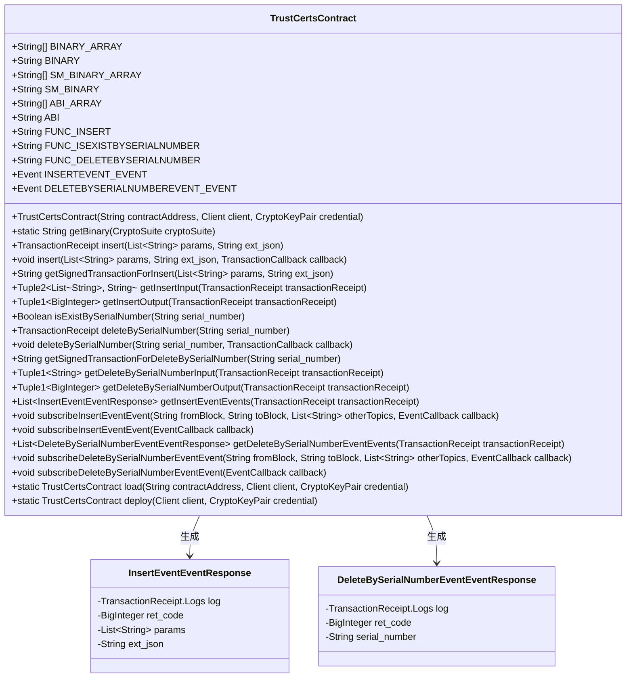
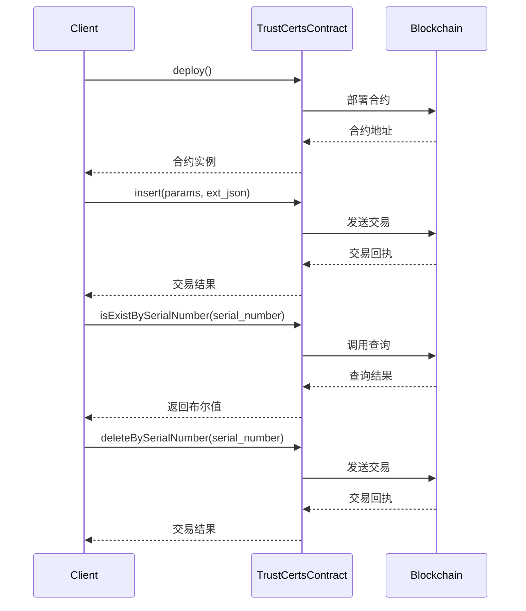

# 基础信息

|      |      |
|------|------|
| 名称 | TrustCertsContract |
| 编码语言 | .java |
| 代码路径 | WeFe/manager/manager-service/src/main/java/com/welab/wefe/manager/service/contract/TrustCertsContract.java |
| 包名 | com.welab.wefe.manager.service.contract |
| 依赖项 | ['java.math.BigInteger', 'java.util.ArrayList', 'java.util.Arrays', 'java.util.Collections', 'java.util.List', 'org.fisco.bcos.sdk.abi.FunctionReturnDecoder', 'org.fisco.bcos.sdk.abi.TypeReference', 'org.fisco.bcos.sdk.abi.datatypes.Bool', 'org.fisco.bcos.sdk.abi.datatypes.DynamicArray', 'org.fisco.bcos.sdk.abi.datatypes.Event', 'org.fisco.bcos.sdk.abi.datatypes.Function', 'org.fisco.bcos.sdk.abi.datatypes.Type', 'org.fisco.bcos.sdk.abi.datatypes.Utf8String', 'org.fisco.bcos.sdk.abi.datatypes.generated.Int256', 'org.fisco.bcos.sdk.abi.datatypes.generated.tuples.generated.Tuple1', 'org.fisco.bcos.sdk.abi.datatypes.generated.tuples.generated.Tuple2', 'org.fisco.bcos.sdk.client.Client', 'org.fisco.bcos.sdk.contract.Contract', 'org.fisco.bcos.sdk.crypto.CryptoSuite', 'org.fisco.bcos.sdk.crypto.keypair.CryptoKeyPair', 'org.fisco.bcos.sdk.eventsub.EventCallback', 'org.fisco.bcos.sdk.model.CryptoType', 'org.fisco.bcos.sdk.model.TransactionReceipt', 'org.fisco.bcos.sdk.model.callback.TransactionCallback', 'org.fisco.bcos.sdk.transaction.model.exception.ContractException'] |
| 概述说明 | TrustCertsContract是一个智能合约类，提供证书管理功能，包括插入、查询和删除证书。支持ECDSA和SM加密，包含事件监听和交易回调。关键方法：insert、isExistBySerialNumber、deleteBySerialNumber。 |

# 说明

TrustCertsContract是一个智能合约类，主要用于管理可信证书。它包含三个主要功能：插入证书、根据序列号查询证书是否存在、根据序列号删除证书。合约支持ECDSA和SM2两种加密算法，通过事件机制记录操作日志。关键信息包括合约二进制代码、ABI接口定义、功能函数和事件响应结构。合约部署后可通过指定地址加载，支持同步和异步交易执行，并提供事件订阅功能以便监听合约操作。

# 类列表 Class Summary

| 名称   | 类型  | 说明 |
|-------|------|-------------|
| TrustCertsContract | class | TrustCertsContract是一个智能合约类，提供证书管理功能，包括插入、查询和删除操作。主要功能有：1. 插入证书数据（insert方法）2. 按序列号查询证书是否存在（isExistBySerialNumber方法） 3. 按序列号删除证书（deleteBySerialNumber方法）合约包含两个事件：- insertEvent：记录插入操作- deleteBySerialNumberEvent：记录删除操作支持ECDSA和SM2两种加密算法，合约地址和ABI接口已预定义。可通过load方法加载已有合约或deploy方法部署新合约。 |

## 类 TrustCertsContract

|      |      |
|------|------|
| 访问范围 | @SuppressWarnings("unchecked");public |
| 类型 | class |
| 名称 | TrustCertsContract |
| 说明 | TrustCertsContract是一个智能合约类，提供证书管理功能，包括插入、查询和删除操作。主要功能有：1. 插入证书数据（insert方法）2. 按序列号查询证书是否存在（isExistBySerialNumber方法） 3. 按序列号删除证书（deleteBySerialNumber方法）合约包含两个事件：- insertEvent：记录插入操作- deleteBySerialNumberEvent：记录删除操作支持ECDSA和SM2两种加密算法，合约地址和ABI接口已预定义。可通过load方法加载已有合约或deploy方法部署新合约。 |

### UML类图

这段代码定义了一个名为TrustCertsContract的智能合约类，主要用于管理信任证书。它包含多个常量字符串数组（BINARY_ARRAY、SM_BINARY_ARRAY、ABI_ARRAY）和对应的连接字符串（BINARY、SM_BINARY、ABI），以及三个函数名常量（FUNC_INSERT、FUNC_ISEXISTBYSERIALNUMBER、FUNC_DELETEBYSERIALNUMBER）。合约提供了插入证书、检查证书是否存在和删除证书的功能，并通过事件（INSERTEVENT_EVENT和DELETEBYSERIALNUMBEREVENT_EVENT）来记录操作结果。此外，还包含两个内部类（InsertEventEventResponse和DeleteBySerialNumberEventEventResponse）用于封装事件响应数据。整体结构展示了智能合约的核心功能和事件处理机制。

### 内部方法调用关系图

```mermaid
graph TD
    A["类TrustCertsContract"]
    B["常量: BINARY_ARRAY, BINARY, SM_BINARY_ARRAY, SM_BINARY, ABI_ARRAY, ABI"]
    C["常量: FUNC_INSERT, FUNC_ISEXISTBYSERIALNUMBER, FUNC_DELETEBYSERIALNUMBER"]
    D["事件: INSERTEVENT_EVENT, DELETEBYSERIALNUMBEREVENT_EVENT"]
    E["构造方法: TrustCertsContract(String contractAddress, Client client, CryptoKeyPair credential)"]
    F["静态方法: getBinary(CryptoSuite cryptoSuite)"]
    G["方法: insert(List<String> params, String ext_json)"]
    H["方法: isExistBySerialNumber(String serial_number)"]
    I["方法: deleteBySerialNumber(String serial_number)"]
    J["方法: getInsertInput(TransactionReceipt transactionReceipt)"]
    K["方法: getInsertOutput(TransactionReceipt transactionReceipt)"]
    L["方法: getDeleteBySerialNumberInput(TransactionReceipt transactionReceipt)"]
    M["方法: getDeleteBySerialNumberOutput(TransactionReceipt transactionReceipt)"]
    N["方法: getInsertEventEvents(TransactionReceipt transactionReceipt)"]
    O["方法: getDeleteBySerialNumberEventEvents(TransactionReceipt transactionReceipt)"]
    P["静态方法: load(String contractAddress, Client client, CryptoKeyPair credential)"]
    Q["静态方法: deploy(Client client, CryptoKeyPair credential)"]
    R["内部类: InsertEventEventResponse, DeleteBySerialNumberEventEventResponse"]

    A --> B
    A --> C
    A --> D
    A --> E
    A --> F
    A --> G
    A --> H
    A --> I
    A --> J
    A --> K
    A --> L
    A --> M
    A --> N
    A --> O
    A --> P
    A --> Q
    A --> R
```

这段代码是一个智能合约类TrustCertsContract，主要用于管理数字证书的信任链。它提供了证书的插入、查询存在性和删除功能，并通过事件机制记录操作日志。合约支持两种加密算法(ECDSA/SM2)，包含完整的ABI定义和二进制代码。流程图展示了类结构和方法调用关系，时序图则描述了部署和主要方法的调用过程。该合约设计严谨，包含输入输出参数解析、事件订阅等完整功能，适用于需要建立证书信任关系的区块链场景。

### 字段列表 Field List

| 名称  | 类型  | 说明 |
|-------|-------|------|
| FUNC_INSERT = "insert" | String | 静态常量字符串FUNC_INSERT，值为"insert"。 |
| BINARY_ARRAY = {"60806040523480156200001157600080fd5b506110016000806101000a81548173ffffffffffffffffffffffffffffffffffffffff021916908373ffffffffffffffffffffffffffffffffffffffff1602179055506000809054906101000a900473ffffffffffffffffffffffffffffffffffffffff1673ffffffffffffffffffffffffffffffffffffffff166356004b6a6040805190810160405280600b81526020017f74727573745f63657274730000000000000000000000000000000000000000008152506040518263ffffffff167c0100000000000000000000000000000000000000000000000000000000028152600401620001019190620002e2565b602060405180830381600087803b1580156200011c57600080fd5b505af115801562000131573d6000803e3d6000fd5b505050506040513d601f19601f8201168201806040525062000157919081019062000174565b506200038c565b60006200016c82516200033b565b905092915050565b6000602082840312156200018757600080fd5b600062000197848285016200015e565b91505092915050565b6000620001ad8262000330565b808452620001c381602086016020860162000345565b620001ce816200037b565b602085010191505092915050565b6000600682527f6669785f696400000000000000000000000000000000000000000000000000006020830152604082019050919050565b6000609382527f636572745f69642c73657269616c5f6e756d6265722c636572745f636f6e746560208301527f6e742c705f636572745f69642c6973737565725f6f72672c6973737565725f6360408301527f6e2c7375626a6563745f6f72672c7375626a6563745f636e2c69735f63615f6360608301527f6572742c69735f726f6f745f636572742c637265617465645f74696d652c757060808301527f64617465645f74696d652c6578745f6a736f6e0000000000000000000000000060a083015260c082019050919050565b60006060820190508181036000830152620002fe8184620001a0565b905081810360208301526200031381620001dc565b90508181036040830152620003288162000213565b905092915050565b600081519050919050565b6000819050919050565b60005b838110156200036557808201518184015260208101905062000348565b8381111562000375576000848401525b50505050565b6000601f19601f8301169050919050565b6122c1806200039c6000396000f300608060405260043610610057576000357c0100000000000000000000000000000000000000000000000000000000900463ffffffff168063972911501461005c578063e332cfcc14610099578063e858eda2146100d6575b600080fd5b34801561006857600080fd5b50610083600480360361007e91908101906116c6565b610113565b6040516100909190611c73565b60405180910390f35b3480156100a557600080fd5b506100c060048036036100bb91908101906117ff565b610d7d565b6040516100cd9190611c58565b60405180910390f35b3480156100e257600080fd5b506100fd60048036036100f891908101906117ff565b611141565b60405161010a9190611c73565b60405180910390f35b600080600080600080935061013f87600181518110151561013057fe5b90602001906020020151610d7d565b156101ca577fffffffffffffffffffffffffffffffffffffffffffffffffffffffffffffffff93507f5157dc1ab0b55c7621be94a34b2ae4228f7d16e8271628060cc027b1a513b12f84888860405161019a93929190611c8e565b60405180910390a17fffffffffffffffffffffffffffffffffffffffffffffffffffffffffffffffff9450610d73565b6000809054906101000a900473ffffffffffffffffffffffffffffffffffffffff1673ffffffffffffffffffffffffffffffffffffffff1663f23f63c96040805190810160405280600b81526020017f74727573745f63657274730000000000000000000000000000000000000000008152506040518263ffffffff167c01000000000000000000000000000000000000000000000000000000000281526004016102759190611d03565b602060405180830381600087803b15801561028f57600080fd5b505af11580156102a3573d6000803e3d6000fd5b505050506040513d601f19601f820116820180604052506102c791908101906117ad565b92508273ffffffffffffffffffffffffffffffffffffffff166313db93466040518163ffffffff167c0100000000000000000000000000000000000000000000000000000000028152600401602060405180830381600087803b15801561032d57600080fd5b505af1158015610341573d6000803e3d6000fd5b505050506040513d601f19601f820116820180604052506103659190810190611784565b91508173ffffffffffffffffffffffffffffffffffffffff1663e942b5166040805190810160405280600b81526020017f74727573745f63657274730000000000000000000000000000000000000000008152506040518263ffffffff167c01000000000000000000000000000000000000000000000000000000000281526004016103f19190611e8e565b600060405180830381600087803b15801561040b57600080fd5b505af115801561041f573d6000803e3d6000fd5b505050508173ffffffffffffffffffffffffffffffffffffffff1663e942b51688600081518110151561044e57fe5b906020019060200201516040518263ffffffff167c01000000000000000000000000000000000000000000000000000000000281526004016104909190611f2d565b600060405180830381600087803b1580156104aa57600080fd5b505af11580156104be573d6000803e3d6000fd5b505050508173ffffffffffffffffffffffffffffffffffffffff1663e942b5168860018151811015156104ed57fe5b906020019060200201516040518263ffffffff167c010000000000000000000000000000000000000000000000000000000002815260040161052f9190611d85565b600060405180830381600087803b15801561054957600080fd5b505af115801561055d573d6000803e3d6000fd5b505050508173ffffffffffffffffffffffffffffffffffffffff1663e942b51688600281518110151561058c57fe5b906020019060200201516040518263ffffffff167c01000000000000000000000000000000000000000000000000000000000281526004016105ce9190611f97565b600060405180830381600087803b1580156105e857600080fd5b505af11580156105fc573d6000803e3d6000fd5b505050508173ffffffffffffffffffffffffffffffffffffffff1663e942b51688600381518110151561062b57fe5b906020019060200201516040518263ffffffff167c010000000000000000000000000000000000000000000000000000000002815260040161066d9190611e59565b600060405180830381600087803b15801561068757600080fd5b505af115801561069b573d6000803e3d6000fd5b505050508173ffffffffffffffffffffffffffffffffffffffff1663e942b5168860048151811015156106ca57fe5b906020019060200201516040518263ffffffff167c010000000000000000000000000000000000000000000000000000000002815260040161070c9190611def565b600060405180830381600087803b15801561072657600080fd5b505af115801561073a573d6000803e3d6000fd5b505050508173ffffffffffffffffffffffffffffffffffffffff1663e942b51688600581518110151561076957fe5b906020019060200201516040518263ffffffff167c01000000000000000000000000000000000000000000000000000000000281526004016107ab9190612001565b600060405180830381600087803b1580156107c557600080fd5b505af11580156107d9573d6000803e3d6000fd5b505050508173ffffffffffffffffffffffffffffffffffffffff1663e942b51688600681518110151561080857fe5b906020019060200201516040518263ffffffff167c010000000000000000000000000000000000000000000000000000000002815260040161084a9190611ec3565b600060405180830381600087803b15801561086457600080fd5b505af1158015610878573d6000803e3d6000fd5b505050508173ffffffffffffffffffffffffffffffffffffffff1663e942b5168860078151811015156108a757fe5b906020019060200201516040518263ffffffff167c01000000000000000000000000000000000000000000000000000000000281526004016108e99190612036565b600060405180830381600087803b15801561090357600080fd5b505af1158015610917573d6000803e3d6000fd5b505050508173ffffffffffffffffffffffffffffffffffffffff1663e942b51688600881518110151561094657fe5b906020019060200201516040518263ffffffff167c01000000000000000000000000000000000000000000000000000000000281526004016109889190611fcc565b600060405180830381600087803b1580156109a257600080fd5b505af11580156109b6573d6000803e3d6000fd5b505050508173ffffffffffffffffffffffffffffffffffffffff1663e942b5168860098151811015156109e557fe5b906020019060200201516040518263ffffffff167c0100000000000000000000000000000000000000000000000000000000028152600401610a279190611ef8565b600060405180830381600087803b158015610a4157600080fd5b505af1158015610a55573d6000803e3d6000fd5b505050508173ffffffffffffffffffffffffffffffffffffffff1663e942b51688600a815181101515610a8457fe5b906020019060200201516040518263ffffffff167c0100000000000000000000000000000000000000000000000000000000028152600401610ac6919061206b565b600060405180830381600087803b158015610ae057600080fd5b505af1158015610af4573d6000803e3d6000fd5b505050508173ffffffffffffffffffffffffffffffffffffffff1663e942b51688600b815181101515610b2357fe5b906020019060200201516040518263ffffffff167c0100000000000000000000000000000000000000000000000000000000028152600401610b659190611f62565b600060405180830381600087803b158015610b7f57600080fd5b505af1158015610b93573d6000803e3d6000fd5b505050508173ffffffffffffffffffffffffffffffffffffffff1663e942b516876040518263ffffffff167c0100000000000000000000000000000000000000000000000000000000028152600401610bec9190611e24565b600060405180830381600087803b158015610c0657600080fd5b505af1158015610c1a573d6000803e3d6000fd5b505050508273ffffffffffffffffffffffffffffffffffffffff166331afac366040805190810160405280600b81526020017f74727573745f63657274730000000000000000000000","00000000000000000000815250846040518363ffffffff167c0100000000000000000000000000000000000000000000000000000000028152600401610caa929190611d55565b602060405180830381600087803b158015610cc457600080fd5b505af1158015610cd8573d6000803e3d6000fd5b505050506040513d601f19601f82011682018060405250610cfc91908101906117d6565b90506001811415610d105760009350610d34565b7ffffffffffffffffffffffffffffffffffffffffffffffffffffffffffffffffe93505b7f5157dc1ab0b55c7621be94a34b2ae4228f7d16e8271628060cc027b1a513b12f848888604051610d6793929190611c8e565b60405180910390a18394505b5050505092915050565b6000806000806000809054906101000a900473ffffffffffffffffffffffffffffffffffffffff1673ffffffffffffffffffffffffffffffffffffffff1663f23f63c96040805190810160405280600b81526020017f74727573745f63657274730000000000000000000000000000000000000000008152506040518263ffffffff167c0100000000000000000000000000000000000000000000000000000000028152600401610e2e9190611d03565b602060405180830381600087803b158015610e4857600080fd5b505af1158015610e5c573d6000803e3d6000fd5b505050506040513d601f19601f82011682018060405250610e8091908101906117ad565b92508273ffffffffffffffffffffffffffffffffffffffff16637857d7c96040518163ffffffff167c0100000000000000000000000000000000000000000000000000000000028152600401602060405180830381600087803b158015610ee657600080fd5b505af1158015610efa573d6000803e3d6000fd5b505050506040513d601f19601f82011682018060405250610f1e9190810190611732565b91508173ffffffffffffffffffffffffffffffffffffffff1663cd30a1d1866040518263ffffffff167c0100000000000000000000000000000000000000000000000000000000028152600401610f759190611dba565b600060405180830381600087803b158015610f8f57600080fd5b505af1158015610fa3573d6000803e3d6000fd5b505050508273ffffffffffffffffffffffffffffffffffffffff1663e8434e396040805190810160405280600b81526020017f74727573745f6365727473000000000000000000000000000000000000000000815250846040518363ffffffff167c0100000000000000000000000000000000000000000000000000000000028152600401611033929190611d25565b602060405180830381600087803b15801561104d57600080fd5b505af1158015611061573d6000803e3d6000fd5b505050506040513d601f19601f82011682018060405250611085919081019061175b565b905060008173ffffffffffffffffffffffffffffffffffffffff1663949d225d6040518163ffffffff167c0100000000000000000000000000000000000000000000000000000000028152600401602060405180830381600087803b1580156110ed57600080fd5b505af1158015611101573d6000803e3d6000fd5b505050506040513d601f19601f8201168201806040525061112591908101906117d6565b11156111345760019350611139565b600093505b505050919050565b600080600080600080935061115586610d7d565b15156111bf577ffffffffffffffffffffffffffffffffffffffffffffffffffffffffffffffffd93507fab5c4c2b31ebe23a798a16e7190d255d5b2f2c55e4bf1c99c3c97e625923b04a84876040516111af929190611cd3565b60405180910390a1839450611537565b6000809054906101000a900473ffffffffffffffffffffffffffffffffffffffff1673ffffffffffffffffffffffffffffffffffffffff1663f23f63c96040805190810160405280600b81526020017f74727573745f63657274730000000000000000000000000000000000000000008152506040518263ffffffff167c010000000000000000000000000000000000000000000000000000000002815260040161126a9190611d03565b602060405180830381600087803b15801561128457600080fd5b505af1158015611298573d6000803e3d6000fd5b505050506040513d601f19601f820116820180604052506112bc91908101906117ad565b92508273ffffffffffffffffffffffffffffffffffffffff16637857d7c96040518163ffffffff167c0100000000000000000000000000000000000000000000000000000000028152600401602060405180830381600087803b15801561132257600080fd5b505af1158015611336573d6000803e3d6000fd5b505050506040513d601f19601f8201168201806040525061135a9190810190611732565b91508173ffffffffffffffffffffffffffffffffffffffff1663cd30a1d1876040518263ffffffff167c01000000000000000000000000000000000000000000000000000000000281526004016113b19190611dba565b600060405180830381600087803b1580156113cb57600080fd5b505af11580156113df573d6000803e3d6000fd5b505050508273ffffffffffffffffffffffffffffffffffffffff166328bb21176040805190810160405280600b81526020017f74727573745f6365727473000000000000000000000000000000000000000000815250846040518363ffffffff167c010000000000000000000000000000000000000000000000000000000002815260040161146f929190611d25565b602060405180830381600087803b15801561148957600080fd5b505af115801561149d573d6000803e3d6000fd5b505050506040513d601f19601f820116820180604052506114c191908101906117d6565b90506001811215156114d657600093506114fa565b7ffffffffffffffffffffffffffffffffffffffffffffffffffffffffffffffffe93505b7fab5c4c2b31ebe23a798a16e7190d255d5b2f2c55e4bf1c99c3c97e625923b04a848760405161152b929190611cd3565b60405180910390a18394505b50505050919050565b600082601f830112151561155357600080fd5b8135611566611561826120cd565b6120a0565b9150818183526020840193506020810190508360005b838110156115ac5781358601611592888261161a565b84526020840193506020830192505060018101905061157c565b5050505092915050565b60006115c282516121be565b905092915050565b60006115d682516121d0565b905092915050565b60006115ea82516121e2565b905092915050565b60006115fe82516121f4565b905092915050565b60006116128251612206565b905092915050565b600082601f830112151561162d57600080fd5b813561164061163b826120f5565b6120a0565b9150808252602083016020830185838301111561165c57600080fd5b611667838284612234565b50505092915050565b600082601f830112151561168357600080fd5b813561169661169182612121565b6120a0565b915080825260208301602083018583830111156116b257600080fd5b6116bd838284612234565b50505092915050565b600080604083850312156116d957600080fd5b600083013567ffffffffffffffff8111156116f357600080fd5b6116ff85828601611540565b925050602083013567ffffffffffffffff81111561171c57600080fd5b61172885828601611670565b9150509250929050565b60006020828403121561174457600080fd5b6000611752848285016115b6565b91505092915050565b60006020828403121561176d57600080fd5b600061177b848285016115ca565b91505092915050565b60006020828403121561179657600080fd5b60006117a4848285016115de565b91505092915050565b6000602082840312156117bf57600080fd5b60006117cd848285016115f2565b91505092915050565b6000602082840312156117e857600080fd5b60006117f684828501611606565b91505092915050565b60006020828403121561181157600080fd5b600082013567ffffffffffffffff81111561182b57600080fd5b61183784828501611670565b91505092915050565b600061184b8261215a565b808452602084019350836020820285016118648561214d565b60005b8481101561189d57838303885261187f838351611920565b925061188a8261217b565b9150602088019750600181019050611867565b508196508694505050505092915050565b6118b7816121a8565b82525050565b6118c681612210565b82525050565b6118d581612222565b82525050565b6118e4816121b4565b82525050565b60006118f582612170565b808452611909816020860160208601612243565b61191281612276565b602085010191505092915050565b600061192b82612165565b80845261193f816020860160208601612243565b61194881612276565b602085010191505092915050565b6000600d82527f73657269616c5f6e756d626572000000000000000000000000000000000000006020830152604082019050919050565b6000600a82527f6973737565725f6f7267000000000000000000000000000000000000000000006020830152604082019050919050565b6000600882527f6578745f6a736f6e0000000000000000000000000000000000000000000000006020830152604082019050919050565b6000600982527f705f636572745f696400000000000000000000000000000000000000000000006020830152604082019050919050565b6000600682527f6669785f696400000000000000000000000000000000000000000000000000006020830152604082019050919050565b6000600b82527f7375626a6563745f6f72670000000000000000000000000000000000000000006020830152604082019050919050565b6000600c82527f69735f726f6f745f6365727400000000000000000000000000000000000000006020830152604082019050919050565b6000600782527f636572745f6964000000000000000000000000000000000000000000000000006020830152604082019050919050565b6000600c82527f757064617465645f74696d6500000000000000000000000000000000000000006020830152604082019050919050565b6000600c82527f636572745f636f6e74656e7400000000000000000000000000000000000000006020830152604082019050919050565b6000600a82527f69735f63615f63657274000000000000000000000000000000000000000000006020830152604082019050919050565b6000600982527f6973737565725f636e00000000000000000000000000000000000000000000006020830152604082019050919050565b6000600a82527f7375626a6563745f636e000000000000000000000000000000000000000000006020830152604082019050919050565b6000600c82527f637265617465645f74696d6500000000000000000000000000000000000000006020830152604082019050919050565b6000602082019050611c6d","60008301846118ae565b92915050565b6000602082019050611c8860008301846118db565b92915050565b6000606082019050611ca360008301866118db565b8181036020830152611cb58185611840565b90508181036040830152611cc981846118ea565b9050949350505050565b6000604082019050611ce860008301856118db565b8181036020830152611cfa81846118ea565b90509392505050565b60006020820190508181036000830152611d1d8184611920565b905092915050565b60006040820190508181036000830152611d3f8185611920565b9050611d4e60208301846118bd565b9392505050565b60006040820190508181036000830152611d6f8185611920565b9050611d7e60208301846118cc565b9392505050565b60006040820190508181036000830152611d9e81611956565b90508181036020830152611db28184611920565b905092915050565b60006040820190508181036000830152611dd381611956565b90508181036020830152611de781846118ea565b905092915050565b60006040820190508181036000830152611e088161198d565b90508181036020830152611e1c8184611920565b905092915050565b60006040820190508181036000830152611e3d816119c4565b90508181036020830152611e5181846118ea565b905092915050565b60006040820190508181036000830152611e72816119fb565b90508181036020830152611e868184611920565b905092915050565b60006040820190508181036000830152611ea781611a32565b90508181036020830152611ebb8184611920565b905092915050565b60006040820190508181036000830152611edc81611a69565b90508181036020830152611ef08184611920565b905092915050565b60006040820190508181036000830152611f1181611aa0565b90508181036020830152611f258184611920565b905092915050565b60006040820190508181036000830152611f4681611ad7565b90508181036020830152611f5a8184611920565b905092915050565b60006040820190508181036000830152611f7b81611b0e565b90508181036020830152611f8f8184611920565b905092915050565b60006040820190508181036000830152611fb081611b45565b90508181036020830152611fc48184611920565b905092915050565b60006040820190508181036000830152611fe581611b7c565b90508181036020830152611ff98184611920565b905092915050565b6000604082019050818103600083015261201a81611bb3565b9050818103602083015261202e8184611920565b905092915050565b6000604082019050818103600083015261204f81611bea565b905081810360208301526120638184611920565b905092915050565b6000604082019050818103600083015261208481611c21565b905081810360208301526120988184611920565b905092915050565b6000604051905081810181811067ffffffffffffffff821117156120c357600080fd5b8060405250919050565b600067ffffffffffffffff8211156120e457600080fd5b602082029050602081019050919050565b600067ffffffffffffffff82111561210c57600080fd5b601f19601f8301169050602081019050919050565b600067ffffffffffffffff82111561213857600080fd5b601f19601f8301169050602081019050919050565b6000602082019050919050565b600081519050919050565b600081519050919050565b600081519050919050565b6000602082019050919050565b600073ffffffffffffffffffffffffffffffffffffffff82169050919050565b60008115159050919050565b6000819050919050565b60006121c982612188565b9050919050565b60006121db82612188565b9050919050565b60006121ed82612188565b9050919050565b60006121ff82612188565b9050919050565b6000819050919050565b600061221b82612188565b9050919050565b600061222d82612188565b9050919050565b82818337600083830152505050565b60005b83811015612261578082015181840152602081019050612246565b83811115612270576000848401525b50505050565b6000601f19601f83011690509190505600a265627a7a723058207851e82fcbb18600c4265d591da824c87f9f5ebad0e4158d2e7890ff0ee183126c6578706572696d656e74616cf50037"} | String[] | 这是一个名为BINARY_ARRAY的公共静态字符串数组，包含十六进制编码的智能合约字节码。 |
| SM_BINARY = String.join("", SM_BINARY_ARRAY) | String | 将字符串数组SM_BINARY_ARRAY拼接为静态常量SM_BINARY。 |
| DELETEBYSERIALNUMBEREVENT_EVENT = new Event("deleteBySerialNumberEvent",             Arrays.<TypeReference<?>>asList(new TypeReference<Int256>() {}, new TypeReference<Utf8String>() {})) | Event | 定义了一个名为DELETEBYSERIALNUMBEREVENT_EVENT的公共静态常量事件，包含Int256和Utf8String两个参数类型。 |
| FUNC_DELETEBYSERIALNUMBER = "deleteBySerialNumber" | String | 这是一个Java静态常量字符串，定义功能为按序列号删除，变量名为FUNC_DELETEBYSERIALNUMBER。 |
| SM_BINARY_ARRAY = {"60806040523480156200001157600080fd5b506110016000806101000a81548173ffffffffffffffffffffffffffffffffffffffff021916908373ffffffffffffffffffffffffffffffffffffffff1602179055506000809054906101000a900473ffffffffffffffffffffffffffffffffffffffff1673ffffffffffffffffffffffffffffffffffffffff1663c92a78016040805190810160405280600b81526020017f74727573745f63657274730000000000000000000000000000000000000000008152506040518263ffffffff167c0100000000000000000000000000000000000000000000000000000000028152600401620001019190620002e2565b602060405180830381600087803b1580156200011c57600080fd5b505af115801562000131573d6000803e3d6000fd5b505050506040513d601f19601f8201168201806040525062000157919081019062000174565b506200038c565b60006200016c82516200033b565b905092915050565b6000602082840312156200018757600080fd5b600062000197848285016200015e565b91505092915050565b6000620001ad8262000330565b808452620001c381602086016020860162000345565b620001ce816200037b565b602085010191505092915050565b6000600682527f6669785f696400000000000000000000000000000000000000000000000000006020830152604082019050919050565b6000609382527f636572745f69642c73657269616c5f6e756d6265722c636572745f636f6e746560208301527f6e742c705f636572745f69642c6973737565725f6f72672c6973737565725f6360408301527f6e2c7375626a6563745f6f72672c7375626a6563745f636e2c69735f63615f6360608301527f6572742c69735f726f6f745f636572742c637265617465645f74696d652c757060808301527f64617465645f74696d652c6578745f6a736f6e0000000000000000000000000060a083015260c082019050919050565b60006060820190508181036000830152620002fe8184620001a0565b905081810360208301526200031381620001dc565b90508181036040830152620003288162000213565b905092915050565b600081519050919050565b6000819050919050565b60005b838110156200036557808201518184015260208101905062000348565b8381111562000375576000848401525b50505050565b6000601f19601f8301169050919050565b6122c1806200039c6000396000f300608060405260043610610057576000357c0100000000000000000000000000000000000000000000000000000000900463ffffffff16806351cb56a91461005c5780637f02314d146100995780639eb03ade146100d6575b600080fd5b34801561006857600080fd5b50610083600480360361007e91908101906117ff565b610113565b6040516100909190611c58565b60405180910390f35b3480156100a557600080fd5b506100c060048036036100bb91908101906117ff565b6104d7565b6040516100cd9190611c73565b60405180910390f35b3480156100e257600080fd5b506100fd60048036036100f891908101906116c6565b6108d6565b60405161010a9190611c73565b60405180910390f35b6000806000806000809054906101000a900473ffffffffffffffffffffffffffffffffffffffff1673ffffffffffffffffffffffffffffffffffffffff166359a48b656040805190810160405280600b81526020017f74727573745f63657274730000000000000000000000000000000000000000008152506040518263ffffffff167c01000000000000000000000000000000000000000000000000000000000281526004016101c49190611d03565b602060405180830381600087803b1580156101de57600080fd5b505af11580156101f2573d6000803e3d6000fd5b505050506040513d601f19601f8201168201806040525061021691908101906117ad565b92508273ffffffffffffffffffffffffffffffffffffffff1663c74f8caf6040518163ffffffff167c0100000000000000000000000000000000000000000000000000000000028152600401602060405180830381600087803b15801561027c57600080fd5b505af1158015610290573d6000803e3d6000fd5b505050506040513d601f19601f820116820180604052506102b49190810190611732565b91508173ffffffffffffffffffffffffffffffffffffffff1663ae763db5866040518263ffffffff167c010000000000000000000000000000000000000000000000000000000002815260040161030b9190611f62565b600060405180830381600087803b15801561032557600080fd5b505af1158015610339573d6000803e3d6000fd5b505050508273ffffffffffffffffffffffffffffffffffffffff1663d8ac59576040805190810160405280600b81526020017f74727573745f6365727473000000000000000000000000000000000000000000815250846040518363ffffffff167c01000000000000000000000000000000000000000000000000000000000281526004016103c9929190611d25565b602060405180830381600087803b1580156103e357600080fd5b505af11580156103f7573d6000803e3d6000fd5b505050506040513d601f19601f8201168201806040525061041b919081019061175b565b905060008173ffffffffffffffffffffffffffffffffffffffff1663d3e9af5a6040518163ffffffff167c0100000000000000000000000000000000000000000000000000000000028152600401602060405180830381600087803b15801561048357600080fd5b505af1158015610497573d6000803e3d6000fd5b505050506040513d601f19601f820116820180604052506104bb91908101906117d6565b11156104ca57600193506104cf565b600093505b505050919050565b60008060008060008093506104eb86610113565b1515610555577ffffffffffffffffffffffffffffffffffffffffffffffffffffffffffffffffd93507fd79cdb3d95a935cc66f6548035697f1df53084a477864dae817102560b440ac08487604051610545929190611cd3565b60405180910390a18394506108cd565b6000809054906101000a900473ffffffffffffffffffffffffffffffffffffffff1673ffffffffffffffffffffffffffffffffffffffff166359a48b656040805190810160405280600b81526020017f74727573745f63657274730000000000000000000000000000000000000000008152506040518263ffffffff167c01000000000000000000000000000000000000000000000000000000000281526004016106009190611d03565b602060405180830381600087803b15801561061a57600080fd5b505af115801561062e573d6000803e3d6000fd5b505050506040513d601f19601f8201168201806040525061065291908101906117ad565b92508273ffffffffffffffffffffffffffffffffffffffff1663c74f8caf6040518163ffffffff167c0100000000000000000000000000000000000000000000000000000000028152600401602060405180830381600087803b1580156106b857600080fd5b505af11580156106cc573d6000803e3d6000fd5b505050506040513d601f19601f820116820180604052506106f09190810190611732565b91508173ffffffffffffffffffffffffffffffffffffffff1663ae763db5876040518263ffffffff167c01000000000000000000000000000000000000000000000000000000000281526004016107479190611f62565b600060405180830381600087803b15801561076157600080fd5b505af1158015610775573d6000803e3d6000fd5b505050508273ffffffffffffffffffffffffffffffffffffffff166309ff42f06040805190810160405280600b81526020017f74727573745f6365727473000000000000000000000000000000000000000000815250846040518363ffffffff167c0100000000000000000000000000000000000000000000000000000000028152600401610805929190611d25565b602060405180830381600087803b15801561081f57600080fd5b505af1158015610833573d6000803e3d6000fd5b505050506040513d601f19601f8201168201806040525061085791908101906117d6565b905060018112151561086c5760009350610890565b7ffffffffffffffffffffffffffffffffffffffffffffffffffffffffffffffffe93505b7fd79cdb3d95a935cc66f6548035697f1df53084a477864dae817102560b440ac084876040516108c1929190611cd3565b60405180910390a18394505b50505050919050565b60008060008060008093506109028760018151811015156108f357fe5b90602001906020020151610113565b1561098d577fffffffffffffffffffffffffffffffffffffffffffffffffffffffffffffffff93507fcb263a23d186eec891d55f1e0ba96ec8290af8c893d32d644c22dbff0953e51f84888860405161095d93929190611c8e565b60405180910390a17fffffffffffffffffffffffffffffffffffffffffffffffffffffffffffffffff9450611536565b6000809054906101000a900473ffffffffffffffffffffffffffffffffffffffff1673ffffffffffffffffffffffffffffffffffffffff166359a48b656040805190810160405280600b81526020017f74727573745f63657274730000000000000000000000000000000000000000008152506040518263ffffffff167c0100000000000000000000000000000000000000000000000000000000028152600401610a389190611d03565b602060405180830381600087803b158015610a5257600080fd5b505af1158015610a66573d6000803e3d6000fd5b505050506040513d601f19601f82011682018060405250610a8a91908101906117ad565b92508273ffffffffffffffffffffffffffffffffffffffff16635887ab246040518163ffffffff167c0100000000000000000000000000000000000000000000000000000000028152600401602060405180830381600087803b158015610af057600080fd5b505af1158015610b04573d6000803e3d6000fd5b505050506040513d601f19601f82011682018060405250610b289190810190611784565b91508173ffffffffffffffffffffffffffffffffffffffff16631a391cb46040805190810160405280600b81526020017f74727573745f63657274730000000000000000000000000000000000000000008152506040518263ffffffff167c0100000000000000000000000000000000000000000000000000000000028152600401610bb49190611fcc565b600060405180830381600087803b158015610bce57600080fd5b505af1158015610be2573d6000803e3d6000fd5b505050508173ffffffffffffffffffffffffffffffffffffffff16631a391cb4886000815181101515610c1157fe5b906020019060200201516040518263ffffffff167c0100000000000000000000000000000000000000000000000000000000028152600401610c539190611ec3565b600060405180830381600087803b1580","15610c6d57600080fd5b505af1158015610c81573d6000803e3d6000fd5b505050508173ffffffffffffffffffffffffffffffffffffffff16631a391cb4886001815181101515610cb057fe5b906020019060200201516040518263ffffffff167c0100000000000000000000000000000000000000000000000000000000028152600401610cf29190611f2d565b600060405180830381600087803b158015610d0c57600080fd5b505af1158015610d20573d6000803e3d6000fd5b505050508173ffffffffffffffffffffffffffffffffffffffff16631a391cb4886002815181101515610d4f57fe5b906020019060200201516040518263ffffffff167c0100000000000000000000000000000000000000000000000000000000028152600401610d919190611ef8565b600060405180830381600087803b158015610dab57600080fd5b505af1158015610dbf573d6000803e3d6000fd5b505050508173ffffffffffffffffffffffffffffffffffffffff16631a391cb4886003815181101515610dee57fe5b906020019060200201516040518263ffffffff167c0100000000000000000000000000000000000000000000000000000000028152600401610e309190611f97565b600060405180830381600087803b158015610e4a57600080fd5b505af1158015610e5e573d6000803e3d6000fd5b505050508173ffffffffffffffffffffffffffffffffffffffff16631a391cb4886004815181101515610e8d57fe5b906020019060200201516040518263ffffffff167c0100000000000000000000000000000000000000000000000000000000028152600401610ecf9190611dba565b600060405180830381600087803b158015610ee957600080fd5b505af1158015610efd573d6000803e3d6000fd5b505050508173ffffffffffffffffffffffffffffffffffffffff16631a391cb4886005815181101515610f2c57fe5b906020019060200201516040518263ffffffff167c0100000000000000000000000000000000000000000000000000000000028152600401610f6e9190612036565b600060405180830381600087803b158015610f8857600080fd5b505af1158015610f9c573d6000803e3d6000fd5b505050508173ffffffffffffffffffffffffffffffffffffffff16631a391cb4886006815181101515610fcb57fe5b906020019060200201516040518263ffffffff167c010000000000000000000000000000000000000000000000000000000002815260040161100d9190611e24565b600060405180830381600087803b15801561102757600080fd5b505af115801561103b573d6000803e3d6000fd5b505050508173ffffffffffffffffffffffffffffffffffffffff16631a391cb488600781518110151561106a57fe5b906020019060200201516040518263ffffffff167c01000000000000000000000000000000000000000000000000000000000281526004016110ac9190612001565b600060405180830381600087803b1580156110c657600080fd5b505af11580156110da573d6000803e3d6000fd5b505050508173ffffffffffffffffffffffffffffffffffffffff16631a391cb488600881518110151561110957fe5b906020019060200201516040518263ffffffff167c010000000000000000000000000000000000000000000000000000000002815260040161114b9190611e59565b600060405180830381600087803b15801561116557600080fd5b505af1158015611179573d6000803e3d6000fd5b505050508173ffffffffffffffffffffffffffffffffffffffff16631a391cb48860098151811015156111a857fe5b906020019060200201516040518263ffffffff167c01000000000000000000000000000000000000000000000000000000000281526004016111ea9190611d85565b600060405180830381600087803b15801561120457600080fd5b505af1158015611218573d6000803e3d6000fd5b505050508173ffffffffffffffffffffffffffffffffffffffff16631a391cb488600a81518110151561124757fe5b906020019060200201516040518263ffffffff167c01000000000000000000000000000000000000000000000000000000000281526004016112899190611e8e565b600060405180830381600087803b1580156112a357600080fd5b505af11580156112b7573d6000803e3d6000fd5b505050508173ffffffffffffffffffffffffffffffffffffffff16631a391cb488600b8151811015156112e657fe5b906020019060200201516040518263ffffffff167c01000000000000000000000000000000000000000000000000000000000281526004016113289190611def565b600060405180830381600087803b15801561134257600080fd5b505af1158015611356573d6000803e3d6000fd5b505050508173ffffffffffffffffffffffffffffffffffffffff16631a391cb4876040518263ffffffff167c01000000000000000000000000000000000000000000000000000000000281526004016113af919061206b565b600060405180830381600087803b1580156113c957600080fd5b505af11580156113dd573d6000803e3d6000fd5b505050508273ffffffffffffffffffffffffffffffffffffffff16634c6f30c06040805190810160405280600b81526020017f74727573745f6365727473000000000000000000000000000000000000000000815250846040518363ffffffff167c010000000000000000000000000000000000000000000000000000000002815260040161146d929190611d55565b602060405180830381600087803b15801561148757600080fd5b505af115801561149b573d6000803e3d6000fd5b505050506040513d601f19601f820116820180604052506114bf91908101906117d6565b905060018114156114d357600093506114f7565b7ffffffffffffffffffffffffffffffffffffffffffffffffffffffffffffffffe93505b7fcb263a23d186eec891d55f1e0ba96ec8290af8c893d32d644c22dbff0953e51f84888860405161152a93929190611c8e565b60405180910390a18394505b5050505092915050565b600082601f830112151561155357600080fd5b8135611566611561826120cd565b6120a0565b9150818183526020840193506020810190508360005b838110156115ac5781358601611592888261161a565b84526020840193506020830192505060018101905061157c565b5050505092915050565b60006115c282516121be565b905092915050565b60006115d682516121d0565b905092915050565b60006115ea82516121e2565b905092915050565b60006115fe82516121f4565b905092915050565b60006116128251612206565b905092915050565b600082601f830112151561162d57600080fd5b813561164061163b826120f5565b6120a0565b9150808252602083016020830185838301111561165c57600080fd5b611667838284612234565b50505092915050565b600082601f830112151561168357600080fd5b813561169661169182612121565b6120a0565b915080825260208301602083018583830111156116b257600080fd5b6116bd838284612234565b50505092915050565b600080604083850312156116d957600080fd5b600083013567ffffffffffffffff8111156116f357600080fd5b6116ff85828601611540565b925050602083013567ffffffffffffffff81111561171c57600080fd5b61172885828601611670565b9150509250929050565b60006020828403121561174457600080fd5b6000611752848285016115b6565b91505092915050565b60006020828403121561176d57600080fd5b600061177b848285016115ca565b91505092915050565b60006020828403121561179657600080fd5b60006117a4848285016115de565b91505092915050565b6000602082840312156117bf57600080fd5b60006117cd848285016115f2565b91505092915050565b6000602082840312156117e857600080fd5b60006117f684828501611606565b91505092915050565b60006020828403121561181157600080fd5b600082013567ffffffffffffffff81111561182b57600080fd5b61183784828501611670565b91505092915050565b600061184b8261215a565b808452602084019350836020820285016118648561214d565b60005b8481101561189d57838303885261187f838351611920565b925061188a8261217b565b9150602088019750600181019050611867565b508196508694505050505092915050565b6118b7816121a8565b82525050565b6118c681612210565b82525050565b6118d581612222565b82525050565b6118e4816121b4565b82525050565b60006118f582612170565b808452611909816020860160208601612243565b61191281612276565b602085010191505092915050565b600061192b82612165565b80845261193f816020860160208601612243565b61194881612276565b602085010191505092915050565b6000600c82527f69735f726f6f745f6365727400000000000000000000000000000000000000006020830152604082019050919050565b6000600a82527f6973737565725f6f7267000000000000000000000000000000000000000000006020830152604082019050919050565b6000600c82527f757064617465645f74696d6500000000000000000000000000000000000000006020830152604082019050919050565b6000600b82527f7375626a6563745f6f72670000000000000000000000000000000000000000006020830152604082019050919050565b6000600a82527f69735f63615f63657274000000000000000000000000000000000000000000006020830152604082019050919050565b6000600c82527f637265617465645f74696d6500000000000000000000000000000000000000006020830152604082019050919050565b6000600782527f636572745f6964000000000000000000000000000000000000000000000000006020830152604082019050919050565b6000600c82527f636572745f636f6e74656e7400000000000000000000000000000000000000006020830152604082019050919050565b6000600d82527f73657269616c5f6e756d626572000000000000000000000000000000000000006020830152604082019050919050565b6000600982527f705f636572745f696400000000000000000000000000000000000000000000006020830152604082019050919050565b6000600682527f6669785f696400000000000000000000000000000000000000000000000000006020830152604082019050919050565b6000600a82527f7375626a6563745f636e000000000000000000000000000000000000000000006020830152604082019050919050565b6000600982527f6973737565725f636e00000000000000000000000000000000000000000000006020830152604082019050919050565b6000600882527f6578745f6a736f6e0000000000000000000000000000000000000000000000006020830152604082019050919050565b6000602082019050611c6d","60008301846118ae565b92915050565b6000602082019050611c8860008301846118db565b92915050565b6000606082019050611ca360008301866118db565b8181036020830152611cb58185611840565b90508181036040830152611cc981846118ea565b9050949350505050565b6000604082019050611ce860008301856118db565b8181036020830152611cfa81846118ea565b90509392505050565b60006020820190508181036000830152611d1d8184611920565b905092915050565b60006040820190508181036000830152611d3f8185611920565b9050611d4e60208301846118bd565b9392505050565b60006040820190508181036000830152611d6f8185611920565b9050611d7e60208301846118cc565b9392505050565b60006040820190508181036000830152611d9e81611956565b90508181036020830152611db28184611920565b905092915050565b60006040820190508181036000830152611dd38161198d565b90508181036020830152611de78184611920565b905092915050565b60006040820190508181036000830152611e08816119c4565b90508181036020830152611e1c8184611920565b905092915050565b60006040820190508181036000830152611e3d816119fb565b90508181036020830152611e518184611920565b905092915050565b60006040820190508181036000830152611e7281611a32565b90508181036020830152611e868184611920565b905092915050565b60006040820190508181036000830152611ea781611a69565b90508181036020830152611ebb8184611920565b905092915050565b60006040820190508181036000830152611edc81611aa0565b90508181036020830152611ef08184611920565b905092915050565b60006040820190508181036000830152611f1181611ad7565b90508181036020830152611f258184611920565b905092915050565b60006040820190508181036000830152611f4681611b0e565b90508181036020830152611f5a8184611920565b905092915050565b60006040820190508181036000830152611f7b81611b0e565b90508181036020830152611f8f81846118ea565b905092915050565b60006040820190508181036000830152611fb081611b45565b90508181036020830152611fc48184611920565b905092915050565b60006040820190508181036000830152611fe581611b7c565b90508181036020830152611ff98184611920565b905092915050565b6000604082019050818103600083015261201a81611bb3565b9050818103602083015261202e8184611920565b905092915050565b6000604082019050818103600083015261204f81611bea565b905081810360208301526120638184611920565b905092915050565b6000604082019050818103600083015261208481611c21565b9050818103602083015261209881846118ea565b905092915050565b6000604051905081810181811067ffffffffffffffff821117156120c357600080fd5b8060405250919050565b600067ffffffffffffffff8211156120e457600080fd5b602082029050602081019050919050565b600067ffffffffffffffff82111561210c57600080fd5b601f19601f8301169050602081019050919050565b600067ffffffffffffffff82111561213857600080fd5b601f19601f8301169050602081019050919050565b6000602082019050919050565b600081519050919050565b600081519050919050565b600081519050919050565b6000602082019050919050565b600073ffffffffffffffffffffffffffffffffffffffff82169050919050565b60008115159050919050565b6000819050919050565b60006121c982612188565b9050919050565b60006121db82612188565b9050919050565b60006121ed82612188565b9050919050565b60006121ff82612188565b9050919050565b6000819050919050565b600061221b82612188565b9050919050565b600061222d82612188565b9050919050565b82818337600083830152505050565b60005b83811015612261578082015181840152602081019050612246565b83811115612270576000848401525b50505050565b6000601f19601f83011690509190505600a265627a7a7230582029423a24e7a5b3efbe4dc8955c0a881958e62cf421a97e4652073bae74e77b1f6c6578706572696d656e74616cf50037"} | String[] | SM_BINARY_ARRAY 是一个包含智能合约字节码的静态字符串数组，用于区块链开发。 |
| ABI_ARRAY = {"[{\"constant\":false,\"inputs\":[{\"name\":\"params\",\"type\":\"string[]\"},{\"name\":\"ext_json\",\"type\":\"string\"}],\"name\":\"insert\",\"outputs\":[{\"name\":\"\",\"type\":\"int256\"}],\"payable\":false,\"stateMutability\":\"nonpayable\",\"type\":\"function\"},{\"constant\":true,\"inputs\":[{\"name\":\"serial_number\",\"type\":\"string\"}],\"name\":\"isExistBySerialNumber\",\"outputs\":[{\"name\":\"\",\"type\":\"bool\"}],\"payable\":false,\"stateMutability\":\"view\",\"type\":\"function\"},{\"constant\":false,\"inputs\":[{\"name\":\"serial_number\",\"type\":\"string\"}],\"name\":\"deleteBySerialNumber\",\"outputs\":[{\"name\":\"\",\"type\":\"int256\"}],\"payable\":false,\"stateMutability\":\"nonpayable\",\"type\":\"function\"},{\"inputs\":[],\"payable\":false,\"stateMutability\":\"nonpayable\",\"type\":\"constructor\"},{\"anonymous\":false,\"inputs\":[{\"indexed\":false,\"name\":\"ret_code\",\"type\":\"int256\"},{\"indexed\":false,\"name\":\"params\",\"type\":\"string[]\"},{\"indexed\":false,\"name\":\"ext_json\",\"type\":\"string\"}],\"name\":\"insertEvent\",\"type\":\"event\"},{\"anonymous\":false,\"inputs\":[{\"indexed\":false,\"name\":\"ret_code\",\"type\":\"int256\"},{\"indexed\":false,\"name\":\"serial_number\",\"type\":\"string\"}],\"name\":\"deleteBySerialNumberEvent\",\"type\":\"event\"}]"} | String[] | ABI数组包含插入、查询存在性、删除功能及对应事件，用于智能合约交互。 |
| BINARY = String.join("", BINARY_ARRAY) | String | 将BINARY_ARRAY拼接为字符串并赋值给常量BINARY。 |
| ABI = String.join("", ABI_ARRAY) | String | 将ABI_ARRAY数组合并为字符串ABI。 |
| FUNC_ISEXISTBYSERIALNUMBER = "isExistBySerialNumber" | String | 静态常量字符串FUNC_ISEXISTBYSERIALNUMBER，值为"isExistBySerialNumber"。 |
| INSERTEVENT_EVENT = new Event("insertEvent",             Arrays.<TypeReference<?>>asList(new TypeReference<Int256>() {}, new TypeReference<DynamicArray<Utf8String>>() {}, new TypeReference<Utf8String>() {})) | Event | 定义静态常量INSERTEVENT_EVENT，类型为Event，包含事件名"insertEvent"和三个参数类型：Int256、DynamicArray<Utf8String>、Utf8String。 |

### 方法列表

| 名称  | 类型  | 说明 |
|-------|-------|------|
| subscribeDeleteBySerialNumberEventEvent | void | 订阅删除序列号事件的方法，通过编码主题并调用订阅事件函数实现回调。 |
| load | TrustCertsContract | 加载TrustCerts合约，需合约地址、客户端和密钥凭证。 |
| deploy | TrustCertsContract | 部署TrustCertsContract合约的静态方法，需传入客户端和密钥对参数，调用内部部署方法并返回合约实例。 |
| deleteBySerialNumber | void | 该方法通过序列号删除数据，使用异步事务处理回调。传入序列号和回调函数，构建Function对象后执行异步操作。 |
| subscribeInsertEventEvent | void | 订阅插入事件的方法，通过编码主题和回调函数实现事件监听。 |
| getBinary | String | 该方法根据加密套件类型返回对应的二进制字符串：若为ECDSA类型返回BINARY，否则返回SM_BINARY。 |
| insert | TransactionReceipt | Java方法：插入交易数据，接收字符串列表和JSON参数，构建函数对象后执行交易并返回回执。 |
| getDeleteBySerialNumberInput | Tuple1<String> | 方法getDeleteBySerialNumberInput接收交易回执，解析输入数据，解码后返回包含字符串的元组。 |
| getInsertEventEvents | List<InsertEventEventResponse> | 该方法从交易回执中提取INSERTEVENT_EVENT事件参数，遍历每个事件值并构建InsertEventEventResponse对象列表，包含日志、返回码、参数列表和扩展JSON，最后返回响应列表。 |
| getSignedTransactionForInsert | String | 方法生成带签名的插入交易，接收参数列表和JSON字符串，构建函数对象并调用签名交易创建方法。 |
| isExistBySerialNumber | Boolean | 检查指定序列号是否存在，返回布尔值。若存在返回true，否则false。方法可能抛出ContractException异常。 |
| subscribeInsertEventEvent | void | 订阅插入事件的方法，参数包括起始块、结束块、其他主题列表和回调函数，内部调用订阅事件功能。 |
| getDeleteBySerialNumberEventEvents | List<DeleteBySerialNumberEventEventResponse> | 该方法从交易收据中提取事件参数，生成包含返回码和序列号的响应列表。 |
| getInsertInput | Tuple2<List<String>, String> | 解析交易输入数据，解码并返回字符串列表和单个字符串。 |
| getSignedTransactionForDeleteBySerialNumber | String | 该方法生成并返回一个用于按序列号删除数据的签名交易。它创建一个函数对象，包含删除操作、序列号参数和空返回列表，最后调用createSignedTransaction生成签名交易。 |
| getInsertOutput | Tuple1<BigInteger> | 方法getInsertOutput解析交易回执输出数据，解码并返回BigInteger类型结果。 |
| getDeleteBySerialNumberOutput | Tuple1<BigInteger> | 该方法通过交易回执解析删除操作的输出，使用FunctionReturnDecoder解码返回数据，并返回包含BigInteger结果的Tuple1对象。 |
| insert | void | 方法insert接收参数列表、JSON字符串和回调，构建Function对象后异步执行交易。 |
| deleteBySerialNumber | TransactionReceipt | 该方法通过传入序列号调用智能合约函数删除记录，返回交易回执。核心步骤：构建函数对象并执行交易。 |
| subscribeDeleteBySerialNumberEventEvent | void | 订阅按序列号删除事件的方法，参数包括起始块、结束块、其他主题和回调函数，调用内部事件订阅功能。 |

