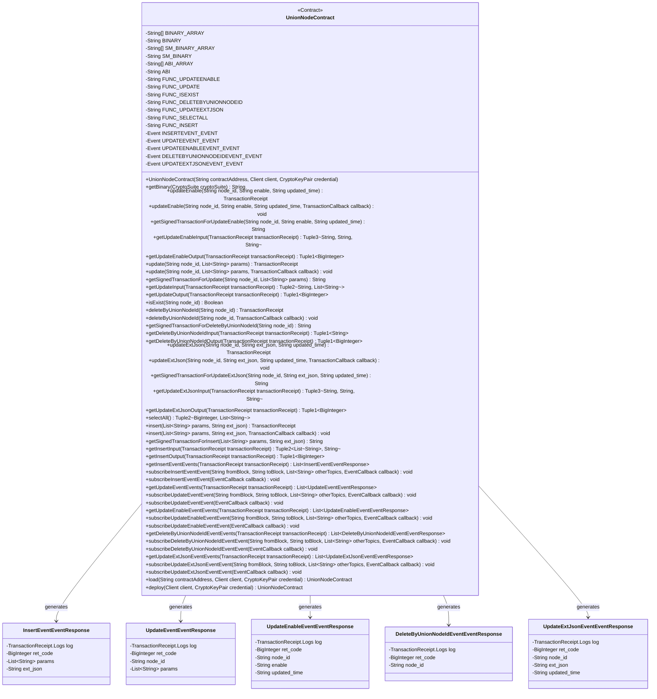
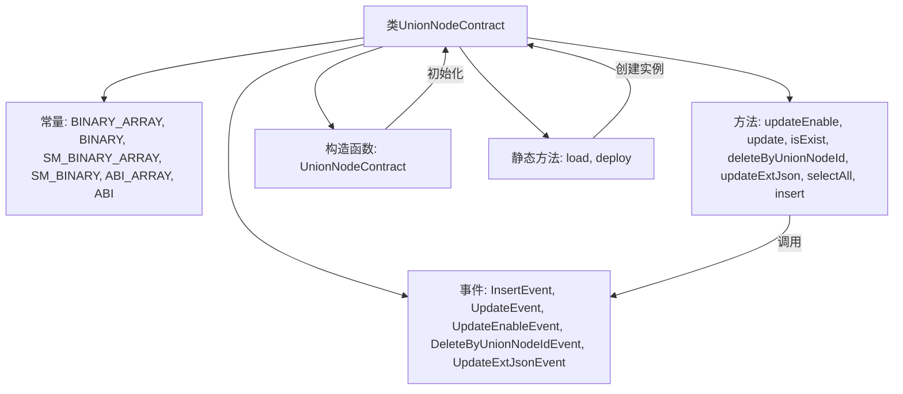

# 基础信息

|      |      |
|------|------|
| 名称 | UnionNodeContract |
| 编码语言 | .java |
| 代码路径 | WeFe/manager/manager-service/src/main/java/com/welab/wefe/manager/service/contract/UnionNodeContract.java |
| 包名 | com.welab.wefe.manager.service.contract |
| 依赖项 | ['org.fisco.bcos.sdk.abi.FunctionReturnDecoder', 'org.fisco.bcos.sdk.abi.TypeReference', 'org.fisco.bcos.sdk.abi.datatypes', 'org.fisco.bcos.sdk.abi.datatypes.generated.Int256', 'org.fisco.bcos.sdk.abi.datatypes.generated.tuples.generated.Tuple1', 'org.fisco.bcos.sdk.abi.datatypes.generated.tuples.generated.Tuple2', 'org.fisco.bcos.sdk.abi.datatypes.generated.tuples.generated.Tuple3', 'org.fisco.bcos.sdk.client.Client', 'org.fisco.bcos.sdk.contract.Contract', 'org.fisco.bcos.sdk.crypto.CryptoSuite', 'org.fisco.bcos.sdk.crypto.keypair.CryptoKeyPair', 'org.fisco.bcos.sdk.eventsub.EventCallback', 'org.fisco.bcos.sdk.model.CryptoType', 'org.fisco.bcos.sdk.model.TransactionReceipt', 'org.fisco.bcos.sdk.model.callback.TransactionCallback', 'org.fisco.bcos.sdk.transaction.model.exception.ContractException', 'java.math.BigInteger', 'java.util.ArrayList', 'java.util.Arrays', 'java.util.Collections', 'java.util.List'] |
| 概述说明 | UnionNodeContract是一个智能合约类，用于管理联盟节点信息。主要功能包括：1. 节点增删改查：   - 插入新节点(insert)   - 更新节点信息(update)   - 更新节点状态(updateEnable)   - 更新节点扩展JSON(updateExtJson)   - 删除节点(deleteByUnionNodeId)   - 查询所有节点(selectAll)   - 检查节点是否存在(isExist)2. 事件监听：   - 插入事件(insertEvent)   - 更新事件(updateEvent)   - 状态更新事件(updateEnableEvent)   - 删除事件(deleteByUnionNodeIdEvent)   - 扩展JSON更新事件(updateExtJsonEvent)3. 合约特性：   - 支持ECDSA和SM2两种加密算法   - 提供同步和异步两种调用方式   - 支持事件订阅功能该合约用于管理联盟链中的节点信息，包括节点基础信息、状态和扩展属性等。 |

# 说明

UnionNodeContract是一个智能合约类，用于管理联盟节点的相关操作。以下是该合约的详细描述：

1. 合约功能：
- 提供节点增删改查等基础CRUD操作
- 支持节点启用/禁用状态管理
- 支持节点扩展JSON属性的更新
- 提供全量节点查询接口

2. 主要方法：
- updateEnable(): 更新节点启用状态
- update(): 更新节点基础信息 
- isExist(): 检查节点是否存在
- deleteByUnionNodeId(): 删除指定节点
- updateExtJson(): 更新节点扩展JSON
- selectAll(): 查询所有节点
- insert(): 插入新节点

3. 事件通知：
- insertEvent: 节点新增事件
- updateEvent: 节点更新事件  
- updateEnableEvent: 节点状态变更事件
- deleteByUnionNodeIdEvent: 节点删除事件
- updateExtJsonEvent: 扩展属性更新事件

4. 技术特点：
- 同时支持普通和国密(SM)两种加密算法
- 提供同步和异步两种调用方式
- 包含完整的输入输出参数解析
- 支持事件订阅机制

5. 数据结构：
- 使用字符串数组存储节点属性
- 返回值包含操作状态码和结果数据
- 事件参数包含操作结果和相关数据

该合约设计用于联盟链环境中对节点信息进行统一管理，提供了完整的生命周期管理功能，并通过事件机制实现操作结果的实时通知。

# 类列表 Class Summary

| 名称   | 类型  | 说明 |
|-------|------|-------------|
| UnionNodeContract | class | 这是一个名为`UnionNodeContract`的智能合约Java封装类，用于与区块链上的`UnionNode`合约进行交互。以下是对其关键信息的概要描述：1. **合约功能**     - 提供节点管理功能，包括插入、更新、查询、删除节点等操作。   - 支持启用/禁用节点、更新扩展JSON数据等特定操作。2. **核心方法**     - `updateEnable()`: 更新节点启用状态     - `update()`: 更新节点信息     - `isExist()`: 检查节点是否存在     - `deleteByUnionNodeId()`: 删除节点     - `updateExtJson()`: 更新节点扩展数据     - `selectAll()`: 查询所有节点     - `insert()`: 插入新节点  3. **事件监听**     - 提供5种事件监听：节点插入、更新、状态变更、删除和扩展数据更新事件。4. **技术特性**     - 支持国密(SM)和非国密两种加密算法     - 包含完整的ABI和二进制代码     - 提供同步和异步交易执行方式     - 支持交易回执解析  5. **部署方式**     - 可通过`deploy()`方法部署新合约     - 可通过`load()`方法加载已有合约  6. **数据结构**     - 使用Tuple类型处理多返回值     - 定义专门的事件响应类  这个封装类简化了Java应用与区块链智能合约的交互，提供了类型安全的方法调用和事件处理机制。 |

## 类 UnionNodeContract

|      |      |
|------|------|
| 访问范围 | @SuppressWarnings("unchecked");public |
| 类型 | class |
| 名称 | UnionNodeContract |
| 说明 | 这是一个名为`UnionNodeContract`的智能合约Java封装类，用于与区块链上的`UnionNode`合约进行交互。以下是对其关键信息的概要描述：1. **合约功能**     - 提供节点管理功能，包括插入、更新、查询、删除节点等操作。   - 支持启用/禁用节点、更新扩展JSON数据等特定操作。2. **核心方法**     - `updateEnable()`: 更新节点启用状态     - `update()`: 更新节点信息     - `isExist()`: 检查节点是否存在     - `deleteByUnionNodeId()`: 删除节点     - `updateExtJson()`: 更新节点扩展数据     - `selectAll()`: 查询所有节点     - `insert()`: 插入新节点  3. **事件监听**     - 提供5种事件监听：节点插入、更新、状态变更、删除和扩展数据更新事件。4. **技术特性**     - 支持国密(SM)和非国密两种加密算法     - 包含完整的ABI和二进制代码     - 提供同步和异步交易执行方式     - 支持交易回执解析  5. **部署方式**     - 可通过`deploy()`方法部署新合约     - 可通过`load()`方法加载已有合约  6. **数据结构**     - 使用Tuple类型处理多返回值     - 定义专门的事件响应类  这个封装类简化了Java应用与区块链智能合约的交互，提供了类型安全的方法调用和事件处理机制。 |

### UML类图

这段代码定义了一个名为`UnionNodeContract`的智能合约类，包含了合约的二进制代码、ABI接口、各种功能函数和事件响应类。合约提供了节点管理功能，包括更新节点状态、查询节点存在性、删除节点等操作，并通过事件机制返回操作结果。类图展示了合约与各事件响应类之间的关系，以及合约的主要方法和属性结构。

### 内部方法调用关系图

这段代码是一个智能合约的Java封装类，主要功能包括：

1. 提供了与区块链智能合约交互的Java方法封装，包括updateEnable、update、isExist等核心业务方法
2. 定义了合约的事件响应类，用于处理合约事件回调
3. 包含了合约的ABI和二进制代码(包括普通和国密版本)
4. 支持合约的部署(load/deploy)和实例化
5. 提供了交易输入输出的编解码功能
6. 实现了事件订阅机制

该合约主要用于节点管理，包含节点启用/禁用、更新、查询、删除等操作，是一个典型的区块链节点管理合约的Java封装实现。

### 字段列表 Field List

| 名称  | 类型  | 说明 |
|-------|-------|------|
| UPDATEEXTJSONEVENT_EVENT = new Event("updateExtJsonEvent",             Arrays.<TypeReference<?>>asList(new TypeReference<Int256>() {}, new TypeReference<Utf8String>() {}, new TypeReference<Utf8String>() {}, new TypeReference<Utf8String>() {})) | Event | 定义了一个名为UPDATEEXTJSONEVENT_EVENT的公共静态常量事件，包含四个参数类型：Int256和三个Utf8String。 |
| BINARY = String.join("", BINARY_ARRAY) | String | 将BINARY_ARRAY拼接为字符串并赋值给常量BINARY。 |
| FUNC_UPDATE = "update" | String | 静态常量字符串FUNC_UPDATE，值为"update"。 |
| UPDATEENABLEEVENT_EVENT = new Event("updateEnableEvent",             Arrays.<TypeReference<?>>asList(new TypeReference<Int256>() {}, new TypeReference<Utf8String>() {}, new TypeReference<Utf8String>() {}, new TypeReference<Utf8String>() {})) | Event | 定义静态常量UPDATEENABLEEVENT_EVENT，类型为Event，包含事件名"updateEnableEvent"及四个参数类型：Int256和三个Utf8String。 |
| SM_BINARY = String.join("", SM_BINARY_ARRAY) | String | 代码将字符串数组SM_BINARY_ARRAY拼接成单个字符串SM_BINARY。 |
| FUNC_INSERT = "insert" | String | 定义字符串常量FUNC_INSERT，值为"insert"。 |
| ABI_ARRAY = {"[{\"constant\":false,\"inputs\":[{\"name\":\"node_id\",\"type\":\"string\"},{\"name\":\"enable\",\"type\":\"string\"},{\"name\":\"updated_time\",\"type\":\"string\"}],\"name\":\"updateEnable\",\"outputs\":[{\"name\":\"\",\"type\":\"int256\"}],\"payable\":false,\"stateMutability\":\"nonpayable\",\"type\":\"function\"},{\"constant\":false,\"inputs\":[{\"name\":\"node_id\",\"type\":\"string\"},{\"name\":\"params\",\"type\":\"string[]\"}],\"name\":\"update\",\"outputs\":[{\"name\":\"\",\"type\":\"int256\"}],\"payable\":false,\"stateMutability\":\"nonpayable\",\"type\":\"function\"},{\"constant\":true,\"inputs\":[{\"name\":\"node_id\",\"type\":\"string\"}],\"name\":\"isExist\",\"outputs\":[{\"name\":\"\",\"type\":\"bool\"}],\"payable\":false,\"stateMutability\":\"view\",\"type\":\"function\"},{\"constant\":false,\"inputs\":[{\"name\":\"node_id\",\"type\":\"string\"}],\"name\":\"deleteByUnionNodeId\",\"outputs\":[{\"name\":\"\",\"type\":\"int256\"}],\"payable\":false,\"stateMutability\":\"nonpayable\",\"type\":\"function\"},{\"constant\":false,\"inputs\":[{\"name\":\"node_id\",\"type\":\"string\"},{\"name\":\"ext_json\",\"type\":\"string\"},{\"name\":\"updated_time\",\"type\":\"string\"}],\"name\":\"updateExtJson\",\"outputs\":[{\"name\":\"\",\"type\":\"int256\"}],\"payable\":false,\"stateMutability\":\"nonpayable\",\"type\":\"function\"},{\"constant\":true,\"inputs\":[],\"name\":\"selectAll\",\"outputs\":[{\"name\":\"\",\"type\":\"int256\"},{\"name\":\"\",\"type\":\"string[]\"}],\"payable\":false,\"stateMutability\":\"view\",\"type\":\"function\"},{\"constant\":false,\"inputs\":[{\"name\":\"params\",\"type\":\"string[]\"},{\"name\":\"ext_json\",\"type\":\"string\"}],\"name\":\"insert\",\"outputs\":[{\"name\":\"\",\"type\":\"int256\"}],\"payable\":false,\"stateMutability\":\"nonpayable\",\"type\":\"function\"},{\"inputs\":[],\"payable\":false,\"stateMutability\":\"nonpayable\",\"type\":\"constructor\"},{\"anonymous\":false,\"inputs\":[{\"indexed\":false,\"name\":\"ret_code\",\"type\":\"int256\"},{\"indexed\":false,\"name\":\"params\",\"type\":\"string[]\"},{\"indexed\":false,\"name\":\"ext_json\",\"type\":\"string\"}],\"name\":\"insertEvent\",\"type\":\"event\"},{\"anonymous\":false,\"inputs\":[{\"indexed\":false,\"name\":\"ret_code\",\"type\":\"int256\"},{\"indexed\":false,\"name\":\"node_id\",\"type\":\"string\"},{\"indexed\":false,\"name\":\"params\",\"type\":\"string[]\"}],\"name\":\"updateEvent\",\"type\":\"event\"},{\"anonymous\":false,\"inputs\":[{\"indexed\":false,\"name\":\"ret_code\",\"type\":\"int256\"},{\"indexed\":false,\"name\":\"node_id\",\"type\":\"string\"},{\"indexed\":false,\"name\":\"enable\",\"type\":\"string\"},{\"indexed\":false,\"name\":\"updated_time\",\"type\":\"string\"}],\"name\":\"updateEnableEvent\",\"type\":\"event\"},{\"anonymous\":false,\"inputs\":[{\"indexed\":false,\"name\":\"ret_code\",\"type\":\"int256\"},{\"indexed\":false,\"name\":\"node_id\",\"type\":\"string\"}],\"name\":\"deleteByUnionNodeIdEvent\",\"type\":\"event\"},{\"anonymous\":false,\"inputs\":[{\"indexed\":false,\"name\":\"ret_code\",\"type\":\"int256\"},{\"indexed\":false,\"name\":\"node_id\",\"type\":\"string\"},{\"indexed\":false,\"name\":\"ext_json\",\"type\":\"string\"},{\"indexed\":false,\"name\":\"updated_time\",\"type\":\"string\"}],\"name\":\"updateExtJsonEvent\",\"type\":\"event\"}]"} | String[] | ABI_ARRAY定义智能合约接口，包含更新、查询、删除节点等功能及对应事件，参数含节点ID、状态、时间等。 |
| DELETEBYUNIONNODEIDEVENT_EVENT = new Event("deleteByUnionNodeIdEvent",             Arrays.<TypeReference<?>>asList(new TypeReference<Int256>() {}, new TypeReference<Utf8String>() {})) | Event | 定义静态常量DELETEBYUNIONNODEIDEVENT_EVENT，类型为Event，包含事件名"deleteByUnionNodeIdEvent"和两个参数类型Int256和Utf8String。 |
| FUNC_UPDATEEXTJSON = "updateExtJson" | String | 定义静态常量FUNC_UPDATEEXTJSON，值为"updateExtJson"。 |
| FUNC_SELECTALL = "selectAll" | String | 定义静态常量FUNC_SELECTALL，值为"selectAll"。 |
| UPDATEEVENT_EVENT = new Event("updateEvent",             Arrays.<TypeReference<?>>asList(new TypeReference<Int256>() {}, new TypeReference<Utf8String>() {}, new TypeReference<DynamicArray<Utf8String>>() {})) | Event | 定义静态常量UPDATEEVENT_EVENT，类型为Event，包含三个参数：Int256、Utf8String和DynamicArray<Utf8String>。 |
| FUNC_UPDATEENABLE = "updateEnable" | String | 定义静态常量FUNC_UPDATEENABLE，值为"updateEnable"。 |
| BINARY_ARRAY = {"60806040523480156200001157600080fd5b506110016000806101000a81548173ffffffffffffffffffffffffffffffffffffffff021916908373ffffffffffffffffffffffffffffffffffffffff1602179055506000809054906101000a900473ffffffffffffffffffffffffffffffffffffffff1673ffffffffffffffffffffffffffffffffffffffff166356004b6a6040805190810160405280600d81526020017f756e696f6e5f6e6f64655f7635000000000000000000000000000000000000008152506040518263ffffffff167c0100000000000000000000000000000000000000000000000000000000028152600401620001019190620002e2565b602060405180830381600087803b1580156200011c57600080fd5b505af115801562000131573d6000803e3d6000fd5b505050506040513d601f19601f8201168201806040525062000157919081019062000174565b506200038c565b60006200016c82516200033b565b905092915050565b6000602082840312156200018757600080fd5b600062000197848285016200015e565b91505092915050565b6000620001ad8262000330565b808452620001c381602086016020860162000345565b620001ce816200037b565b602085010191505092915050565b6000600682527f6669785f696400000000000000000000000000000000000000000000000000006020830152604082019050919050565b6000609182527f6e6f64655f69642c626c6f636b636861696e5f6e6f64655f69642c626173655f60208301527f75726c2c6f7267616e697a6174696f6e5f6e616d652c6c6f73745f636f6e746160408301527f63742c636f6e746163745f656d61696c2c7072696f726974795f6c6576656c2c60608301527f656e61626c652c76657273696f6e2c637265617465645f74696d652c7570646160808301527f7465645f74696d652c6578745f6a736f6e00000000000000000000000000000060a083015260c082019050919050565b60006060820190508181036000830152620002fe8184620001a0565b905081810360208301526200031381620001dc565b90508181036040830152620003288162000213565b905092915050565b600081519050919050565b6000819050919050565b60005b838110156200036557808201518184015260208101905062000348565b8381111562000375576000848401525b50505050565b6000601f19601f8301169050919050565b614dda806200039c6000396000f300608060405260043610610083576000357c0100000000000000000000000000000000000000000000000000000000900463ffffffff16806305a9bbe71461008857806311dad538146100c55780634d3d096b146101025780635c6d21861461013f57806363964aa31461017c578063857cb0eb146101b957806397291150146101e5575b600080fd5b34801561009457600080fd5b506100af60048036036100aa9190810190614002565b610222565b6040516100bc91906144cc565b60405180910390f35b3480156100d157600080fd5b506100ec60048036036100e79190810190613f96565b6107dc565b6040516100f991906144cc565b60405180910390f35b34801561010e57600080fd5b5061012960048036036101249190810190613f14565b610eff565b60405161013691906144b1565b60405180910390f35b34801561014b57600080fd5b5061016660048036036101619190810190613f14565b6112c3565b60405161017391906144cc565b60405180910390f35b34801561018857600080fd5b506101a3600480360361019e9190810190614002565b6116c2565b6040516101b091906144cc565b60405180910390f35b3480156101c557600080fd5b506101ce611c7c565b6040516101dc9291906144e7565b60405180910390f35b3480156101f157600080fd5b5061020c60048036036102079190810190613ddb565b612020565b60405161021991906144cc565b60405180910390f35b6000806000806000806000945061023889610eff565b15156102a6577ffffffffffffffffffffffffffffffffffffffffffffffffffffffffffffffffd94507f7d29950a0ae63eb067d4a746f4bfc4351fff7ffaa81e13a0c7f07a80aa4f529d858a8a8a60405161029694939291906145d1565b60405180910390a18495506107d0565b6000809054906101000a900473ffffffffffffffffffffffffffffffffffffffff1673ffffffffffffffffffffffffffffffffffffffff1663f23f63c96040805190810160405280600d81526020017f756e696f6e5f6e6f64655f7635000000000000000000000000000000000000008152506040518263ffffffff167c0100000000000000000000000000000000000000000000000000000000028152600401610351919061462b565b602060405180830381600087803b15801561036b57600080fd5b505af115801561037f573d6000803e3d6000fd5b505050506040513d601f19601f820116820180604052506103a39190810190613ec2565b93508373ffffffffffffffffffffffffffffffffffffffff16637857d7c96040518163ffffffff167c0100000000000000000000000000000000000000000000000000000000028152600401602060405180830381600087803b15801561040957600080fd5b505af115801561041d573d6000803e3d6000fd5b505050506040513d601f19601f820116820180604052506104419190810190613e47565b92508273ffffffffffffffffffffffffffffffffffffffff1663cd30a1d18a6040518263ffffffff167c010000000000000000000000000000000000000000000000000000000002815260040161049891906147ea565b600060405180830381600087803b1580156104b257600080fd5b505af11580156104c6573d6000803e3d6000fd5b505050508373ffffffffffffffffffffffffffffffffffffffff166313db93466040518163ffffffff167c0100000000000000000000000000000000000000000000000000000000028152600401602060405180830381600087803b15801561052e57600080fd5b505af1158015610542573d6000803e3d6000fd5b505050506040513d601f19601f820116820180604052506105669190810190613e99565b91508173ffffffffffffffffffffffffffffffffffffffff1663e942b516896040518263ffffffff167c01000000000000000000000000000000000000000000000000000000000281526004016105bd91906149fd565b600060405180830381600087803b1580156105d757600080fd5b505af11580156105eb573d6000803e3d6000fd5b505050508173ffffffffffffffffffffffffffffffffffffffff1663e942b516886040518263ffffffff167c010000000000000000000000000000000000000000000000000000000002815260040161064491906148fe565b600060405180830381600087803b15801561065e57600080fd5b505af1158015610672573d6000803e3d6000fd5b505050508373ffffffffffffffffffffffffffffffffffffffff1663bf2b70a16040805190810160405280600a81526020017f6669785f69645f3030350000000000000000000000000000000000000000000081525084866040518463ffffffff167c0100000000000000000000000000000000000000000000000000000000028152600401610704939291906146ad565b602060405180830381600087803b15801561071e57600080fd5b505af1158015610732573d6000803e3d6000fd5b505050506040513d601f19601f820116820180604052506107569190810190613eeb565b905060018112151561076b576000945061078f565b7ffffffffffffffffffffffffffffffffffffffffffffffffffffffffffffffffe94505b7f7d29950a0ae63eb067d4a746f4bfc4351fff7ffaa81e13a0c7f07a80aa4f529d858a8a8a6040516107c494939291906145d1565b60405180910390a18495505b50505050509392505050565b600080600080600080600094506107f288610eff565b151561085e577ffffffffffffffffffffffffffffffffffffffffffffffffffffffffffffffffd94507fef47f7042e8c83038d176a3f11687417b43c663a42baf9fdbf3c25061984ae9a85898960405161084e9392919061458c565b60405180910390a1849550610ef4565b6000809054906101000a900473ffffffffffffffffffffffffffffffffffffffff1673ffffffffffffffffffffffffffffffffffffffff1663f23f63c96040805190810160405280600d81526020017f756e696f6e5f6e6f64655f7635000000000000000000000000000000000000008152506040518263ffffffff167c0100000000000000000000000000000000000000000000000000000000028152600401610909919061462b565b602060405180830381600087803b15801561092357600080fd5b505af1158015610937573d6000803e3d6000fd5b505050506040513d601f19601f8201168201806040525061095b9190810190613ec2565b93508373ffffffffffffffffffffffffffffffffffffffff16637857d7c96040518163ffffffff167c0100000000000000000000000000000000000000000000000000000000028152600401602060405180830381600087803b1580156109c157600080fd5b505af11580156109d5573d6000803e3d6000fd5b505050506040513d601f19601f820116820180604052506109f99190810190613e47565b92508273ffffffffffffffffffffffffffffffffffffffff1663cd30a1d1896040518263ffffffff167c0100000000000000000000000000000000000000000000000000000000028152600401610a5091906147ea565b600060405180830381600087803b158015610a6a57600080fd5b505af1158015610a7e573d6000803e3d6000fd5b505050508373ffffffffffffffffffffffffffffffffffffffff166313db93466040518163ffffffff167c0100000000000000000000000000000000000000000000000000000000028152600401602060405180830381600087803b158015610ae657600080fd5b505af1158015610afa573d6000803e3d6000fd5b505050506040513d601f19601f82011682018060405250610b1e9190810190613e99565b91508173ffffffffffffffffffffffffffffffffffffffff1663e942b516886000815181101515610b4b57fe5b906020019060200201516040518263ffffffff167c0100000000000000000000000000000000000000000000000000000000028152600401610b8d91906149a8565b600060405180830381600087803b158015610ba757600080fd5b505af1158015610bbb573d6000803e3d6000fd5b505050508173ffffffffffffffffffffffffffffffffffffffff1663e942b516886001815181101515610bea57fe5b906020019060200201516040518263ffffffff167c0100000000000000000000000000000000000000000000000000000000028152600401610c2c9190614a85565b600060405180830381600087803b158015610c4657600080fd5b505af1158015610c5a573d6000803e3d6000fd5b505050508173ffffff", "ffffffffffffffffffffffffffffffffff1663e942b516886002815181101515610c8957fe5b906020019060200201516040518263ffffffff167c0100000000000000000000000000000000000000000000000000000000028152600401610ccb9190614874565b600060405180830381600087803b158015610ce557600080fd5b505af1158015610cf9573d6000803e3d6000fd5b505050508173ffffffffffffffffffffffffffffffffffffffff1663e942b516886003815181101515610d2857fe5b906020019060200201516040518263ffffffff167c0100000000000000000000000000000000000000000000000000000000028152600401610d6a91906148c9565b600060405180830381600087803b158015610d8457600080fd5b505af1158015610d98573d6000803e3d6000fd5b505050508373ffffffffffffffffffffffffffffffffffffffff1663bf2b70a16040805190810160405280600a81526020017f6669785f69645f3030350000000000000000000000000000000000000000000081525084866040518463ffffffff167c0100000000000000000000000000000000000000000000000000000000028152600401610e2a939291906146ad565b602060405180830381600087803b158015610e4457600080fd5b505af1158015610e58573d6000803e3d6000fd5b505050506040513d601f19601f82011682018060405250610e7c9190810190613eeb565b9050600181121515610e915760009450610eb5565b7ffffffffffffffffffffffffffffffffffffffffffffffffffffffffffffffffe94505b7fef47f7042e8c83038d176a3f11687417b43c663a42baf9fdbf3c25061984ae9a858989604051610ee89392919061458c565b60405180910390a18495505b505050505092915050565b6000806000806000809054906101000a900473ffffffffffffffffffffffffffffffffffffffff1673ffffffffffffffffffffffffffffffffffffffff1663f23f63c96040805190810160405280600d81526020017f756e696f6e5f6e6f64655f7635000000000000000000000000000000000000008152506040518263ffffffff167c0100000000000000000000000000000000000000000000000000000000028152600401610fb0919061462b565b602060405180830381600087803b158015610fca57600080fd5b505af1158015610fde573d6000803e3d6000fd5b505050506040513d601f19601f820116820180604052506110029190810190613ec2565b92508273ffffffffffffffffffffffffffffffffffffffff16637857d7c96040518163ffffffff167c0100000000000000000000000000000000000000000000000000000000028152600401602060405180830381600087803b15801561106857600080fd5b505af115801561107c573d6000803e3d6000fd5b505050506040513d601f19601f820116820180604052506110a09190810190613e47565b91508173ffffffffffffffffffffffffffffffffffffffff1663cd30a1d1866040518263ffffffff167c01000000000000000000000000000000000000000000000000000000000281526004016110f791906147ea565b600060405180830381600087803b15801561111157600080fd5b505af1158015611125573d6000803e3d6000fd5b505050508273ffffffffffffffffffffffffffffffffffffffff1663e8434e396040805190810160405280600a81526020017f6669785f69645f30303500000000000000000000000000000000000000000000815250846040518363ffffffff167c01000000000000000000000000000000000000000000000000000000000281526004016111b592919061464d565b602060405180830381600087803b1580156111cf57600080fd5b505af11580156111e3573d6000803e3d6000fd5b505050506040513d601f19601f820116820180604052506112079190810190613e70565b905060008173ffffffffffffffffffffffffffffffffffffffff1663949d225d6040518163ffffffff167c0100000000000000000000000000000000000000000000000000000000028152600401602060405180830381600087803b15801561126f57600080fd5b505af1158015611283573d6000803e3d6000fd5b505050506040513d601f19601f820116820180604052506112a79190810190613eeb565b11156112b657600193506112bb565b600093505b505050919050565b60008060008060008093506112d786610eff565b1515611341577ffffffffffffffffffffffffffffffffffffffffffffffffffffffffffffffffd93507f521d3afd9caf15cf70b25ebc2337882b442d473ad92dde97bd41550297b8a8f7848760405161133192919061455c565b60405180910390a18394506116b9565b6000809054906101000a900473ffffffffffffffffffffffffffffffffffffffff1673ffffffffffffffffffffffffffffffffffffffff1663f23f63c96040805190810160405280600d81526020017f756e696f6e5f6e6f64655f7635000000000000000000000000000000000000008152506040518263ffffffff167c01000000000000000000000000000000000000000000000000000000000281526004016113ec919061462b565b602060405180830381600087803b15801561140657600080fd5b505af115801561141a573d6000803e3d6000fd5b505050506040513d601f19601f8201168201806040525061143e9190810190613ec2565b92508273ffffffffffffffffffffffffffffffffffffffff16637857d7c96040518163ffffffff167c0100000000000000000000000000000000000000000000000000000000028152600401602060405180830381600087803b1580156114a457600080fd5b505af11580156114b8573d6000803e3d6000fd5b505050506040513d601f19601f820116820180604052506114dc9190810190613e47565b91508173ffffffffffffffffffffffffffffffffffffffff1663cd30a1d1876040518263ffffffff167c010000000000000000000000000000000000000000000000000000000002815260040161153391906147ea565b600060405180830381600087803b15801561154d57600080fd5b505af1158015611561573d6000803e3d6000fd5b505050508273ffffffffffffffffffffffffffffffffffffffff166328bb21176040805190810160405280600a81526020017f6669785f69645f30303500000000000000000000000000000000000000000000815250846040518363ffffffff167c01000000000000000000000000000000000000000000000000000000000281526004016115f192919061464d565b602060405180830381600087803b15801561160b57600080fd5b505af115801561161f573d6000803e3d6000fd5b505050506040513d601f19601f820116820180604052506116439190810190613eeb565b9050600181121515611658576000935061167c565b7ffffffffffffffffffffffffffffffffffffffffffffffffffffffffffffffffe93505b7f521d3afd9caf15cf70b25ebc2337882b442d473ad92dde97bd41550297b8a8f784876040516116ad92919061455c565b60405180910390a18394505b50505050919050565b600080600080600080600094506116d889610eff565b1515611746577ffffffffffffffffffffffffffffffffffffffffffffffffffffffffffffffffd94507f91fa9d6109b9b8b47733f98f4b6858346683ebdf73ba3c2f98b90c0d352f83e1858a8a8a60405161173694939291906145d1565b60405180910390a1849550611c70565b6000809054906101000a900473ffffffffffffffffffffffffffffffffffffffff1673ffffffffffffffffffffffffffffffffffffffff1663f23f63c96040805190810160405280600d81526020017f756e696f6e5f6e6f64655f7635000000000000000000000000000000000000008152506040518263ffffffff167c01000000000000000000000000000000000000000000000000000000000281526004016117f1919061462b565b602060405180830381600087803b15801561180b57600080fd5b505af115801561181f573d6000803e3d6000fd5b505050506040513d601f19601f820116820180604052506118439190810190613ec2565b93508373ffffffffffffffffffffffffffffffffffffffff16637857d7c96040518163ffffffff167c0100000000000000000000000000000000000000000000000000000000028152600401602060405180830381600087803b1580156118a957600080fd5b505af11580156118bd573d6000803e3d6000fd5b505050506040513d601f19601f820116820180604052506118e19190810190613e47565b92508273ffffffffffffffffffffffffffffffffffffffff1663cd30a1d18a6040518263ffffffff167c010000000000000000000000000000000000000000000000000000000002815260040161193891906147ea565b600060405180830381600087803b15801561195257600080fd5b505af1158015611966573d6000803e3d6000fd5b505050508373ffffffffffffffffffffffffffffffffffffffff166313db93466040518163ffffffff167c0100000000000000000000000000000000000000000000000000000000028152600401602060405180830381600087803b1580156119ce57600080fd5b505af11580156119e2573d6000803e3d6000fd5b505050506040513d601f19601f82011682018060405250611a069190810190613e99565b91508173ffffffffffffffffffffffffffffffffffffffff1663e942b516896040518263ffffffff167c0100000000000000000000000000000000000000000000000000000000028152600401611a5d919061470b565b600060405180830381600087803b158015611a7757600080fd5b505af1158015611a8b573d6000803e3d6000fd5b505050508173ffffffffffffffffffffffffffffffffffffffff1663e942b516886040518263ffffffff167c0100000000000000000000000000000000000000000000000000000000028152600401611ae491906148fe565b600060405180830381600087803b158015611afe57600080fd5b505af1158015611b12573d6000803e3d6000fd5b505050508373ffffffffffffffffffffffffffffffffffffffff1663bf2b70a16040805190810160405280600a81526020017f6669785f69645f3030350000000000000000000000000000000000000000000081525084866040518463ffffffff167c0100000000000000000000000000000000000000000000000000000000028152600401611ba4939291906146ad565b602060405180830381600087803b158015611bbe57600080fd5b505af1158015611bd2573d6000803e3d6000fd5b505050506040513d601f19601f82011682018060405250611bf69190810190613eeb565b9050600181121515611c0b5760009450611c2f565b7ffffffffffffffffffffffffffffffffffffffffffffffffffffffffffffffffe94505b7f91fa9d6109b9b8b47733f98f4b6858346683ebdf73ba3c2f98b90c0d352f83e1858a8a8a604051611c6494939291906145d156", "5b60405180910390a18495505b50505050509392505050565b600060606000806000809054906101000a900473ffffffffffffffffffffffffffffffffffffffff1673ffffffffffffffffffffffffffffffffffffffff1663f23f63c96040805190810160405280600d81526020017f756e696f6e5f6e6f64655f7635000000000000000000000000000000000000008152506040518263ffffffff167c0100000000000000000000000000000000000000000000000000000000028152600401611d2e919061462b565b602060405180830381600087803b158015611d4857600080fd5b505af1158015611d5c573d6000803e3d6000fd5b505050506040513d601f19601f82011682018060405250611d809190810190613ec2565b91508173ffffffffffffffffffffffffffffffffffffffff1663e8434e396040805190810160405280600a81526020017f6669785f69645f303035000000000000000000000000000000000000000000008152508473ffffffffffffffffffffffffffffffffffffffff16637857d7c96040518163ffffffff167c0100000000000000000000000000000000000000000000000000000000028152600401602060405180830381600087803b158015611e3857600080fd5b505af1158015611e4c573d6000803e3d6000fd5b505050506040513d601f19601f82011682018060405250611e709190810190613e47565b6040518363ffffffff167c0100000000000000000000000000000000000000000000000000000000028152600401611ea992919061464d565b602060405180830381600087803b158015611ec357600080fd5b505af1158015611ed7573d6000803e3d6000fd5b505050506040513d601f19601f82011682018060405250611efb9190810190613e70565b90508073ffffffffffffffffffffffffffffffffffffffff1663949d225d6040518163ffffffff167c0100000000000000000000000000000000000000000000000000000000028152600401602060405180830381600087803b158015611f6157600080fd5b505af1158015611f75573d6000803e3d6000fd5b505050506040513d601f19601f82011682018060405250611f999190810190613eeb565b60001415612007577ffffffffffffffffffffffffffffffffffffffffffffffffffffffffffffffffd6000604051908082528060200260200182016040528015611ff757816020015b6060815260200190600190039081611fe25790505b508191508090509350935061201a565b600061201282612bd1565b819150935093505b50509091565b600080600080600080935061204c87600081518110151561203d57fe5b90602001906020020151610eff565b156120d7577fffffffffffffffffffffffffffffffffffffffffffffffffffffffffffffffff93507f5157dc1ab0b55c7621be94a34b2ae4228f7d16e8271628060cc027b1a513b12f8488886040516120a793929190614517565b60405180910390a17fffffffffffffffffffffffffffffffffffffffffffffffffffffffffffffffff9450612bc7565b6000809054906101000a900473ffffffffffffffffffffffffffffffffffffffff1673ffffffffffffffffffffffffffffffffffffffff1663f23f63c96040805190810160405280600d81526020017f756e696f6e5f6e6f64655f7635000000000000000000000000000000000000008152506040518263ffffffff167c0100000000000000000000000000000000000000000000000000000000028152600401612182919061462b565b602060405180830381600087803b15801561219c57600080fd5b505af11580156121b0573d6000803e3d6000fd5b505050506040513d601f19601f820116820180604052506121d49190810190613ec2565b92508273ffffffffffffffffffffffffffffffffffffffff166313db93466040518163ffffffff167c0100000000000000000000000000000000000000000000000000000000028152600401602060405180830381600087803b15801561223a57600080fd5b505af115801561224e573d6000803e3d6000fd5b505050506040513d601f19601f820116820180604052506122729190810190613e99565b91508173ffffffffffffffffffffffffffffffffffffffff1663e942b5166040805190810160405280600a81526020017f6669785f69645f303035000000000000000000000000000000000000000000008152506040518263ffffffff167c01000000000000000000000000000000000000000000000000000000000281526004016122fe919061481f565b600060405180830381600087803b15801561231857600080fd5b505af115801561232c573d6000803e3d6000fd5b505050508173ffffffffffffffffffffffffffffffffffffffff1663e942b51688600081518110151561235b57fe5b906020019060200201516040518263ffffffff167c010000000000000000000000000000000000000000000000000000000002815260040161239d91906147b5565b600060405180830381600087803b1580156123b757600080fd5b505af11580156123cb573d6000803e3d6000fd5b505050508173ffffffffffffffffffffffffffffffffffffffff1663e942b5168860018151811015156123fa57fe5b906020019060200201516040518263ffffffff167c010000000000000000000000000000000000000000000000000000000002815260040161243c9190614953565b600060405180830381600087803b15801561245657600080fd5b505af115801561246a573d6000803e3d6000fd5b505050508173ffffffffffffffffffffffffffffffffffffffff1663e942b51688600281518110151561249957fe5b906020019060200201516040518263ffffffff167c01000000000000000000000000000000000000000000000000000000000281526004016124db91906149a8565b600060405180830381600087803b1580156124f557600080fd5b505af1158015612509573d6000803e3d6000fd5b505050508173ffffffffffffffffffffffffffffffffffffffff1663e942b51688600381518110151561253857fe5b906020019060200201516040518263ffffffff167c010000000000000000000000000000000000000000000000000000000002815260040161257a9190614a85565b600060405180830381600087803b15801561259457600080fd5b505af11580156125a8573d6000803e3d6000fd5b505050508173ffffffffffffffffffffffffffffffffffffffff1663e942b5168860048151811015156125d757fe5b906020019060200201516040518263ffffffff167c01000000000000000000000000000000000000000000000000000000000281526004016126199190614b84565b600060405180830381600087803b15801561263357600080fd5b505af1158015612647573d6000803e3d6000fd5b505050508173ffffffffffffffffffffffffffffffffffffffff1663e942b51688600581518110151561267657fe5b906020019060200201516040518263ffffffff167c01000000000000000000000000000000000000000000000000000000000281526004016126b89190614874565b600060405180830381600087803b1580156126d257600080fd5b505af11580156126e6573d6000803e3d6000fd5b505050508173ffffffffffffffffffffffffffffffffffffffff1663e942b51688600681518110151561271557fe5b906020019060200201516040518263ffffffff167c01000000000000000000000000000000000000000000000000000000000281526004016127579190614760565b600060405180830381600087803b15801561277157600080fd5b505af1158015612785573d6000803e3d6000fd5b505050508173ffffffffffffffffffffffffffffffffffffffff1663e942b5166040518163ffffffff167c01000000000000000000000000000000000000000000000000000000000281526004016127dc90614a32565b600060405180830381600087803b1580156127f657600080fd5b505af115801561280a573d6000803e3d6000fd5b505050508173ffffffffffffffffffffffffffffffffffffffff1663e942b51688600781518110151561283957fe5b906020019060200201516040518263ffffffff167c010000000000000000000000000000000000000000000000000000000002815260040161287b9190614ada565b600060405180830381600087803b15801561289557600080fd5b505af11580156128a9573d6000803e3d6000fd5b505050508173ffffffffffffffffffffffffffffffffffffffff1663e942b5168860088151811015156128d857fe5b906020019060200201516040518263ffffffff167c010000000000000000000000000000000000000000000000000000000002815260040161291a9190614b2f565b600060405180830381600087803b15801561293457600080fd5b505af1158015612948573d6000803e3d6000fd5b505050508173ffffffffffffffffffffffffffffffffffffffff1663e942b51688600981518110151561297757fe5b906020019060200201516040518263ffffffff167c01000000000000000000000000000000000000000000000000000000000281526004016129b991906148c9565b600060405180830381600087803b1580156129d357600080fd5b505af11580156129e7573d6000803e3d6000fd5b505050508173ffffffffffffffffffffffffffffffffffffffff1663e942b516876040518263ffffffff167c0100000000000000000000000000000000000000000000000000000000028152600401612a40919061470b565b600060405180830381600087803b158015612a5a57600080fd5b505af1158015612a6e573d6000803e3d6000fd5b505050508273ffffffffffffffffffffffffffffffffffffffff166331afac366040805190810160405280600a81526020017f6669785f69645f30303500000000000000000000000000000000000000000000815250846040518363ffffffff167c0100000000000000000000000000000000000000000000000000000000028152600401612afe92919061467d565b602060405180830381600087803b158015612b1857600080fd5b505af1158015612b2c573d6000803e3d6000fd5b505050506040513d601f19601f82011682018060405250612b509190810190613eeb565b90506001811415612b645760009350612b88565b7ffffffffffffffffffffffffffffffffffffffffffffffffffffffffffffffffe93505b7f5157dc1ab0b55c7621be94a34b2ae4228f7d16e8271628060cc027b1a513b12f848888604051612bbb93929190614517565b60405180910390a18394505b5050505092915050565b60608060008060608573ffffffffffffffffffffffffffffffffffffffff1663949d225d6040518163ffffffff167c0100000000000000000000000000000000000000000000000000000000028152600401602060405180830381600087803b158015612c3d57600080fd5b505af1158015612c51573d6000803e3d6000fd5b505050506040513d601f19601f8201168201", "8060405250612c759190810190613eeb565b604051908082528060200260200182016040528015612ca857816020015b6060815260200190600190039081612c935790505b509350600092505b8573ffffffffffffffffffffffffffffffffffffffff1663949d225d6040518163ffffffff167c0100000000000000000000000000000000000000000000000000000000028152600401602060405180830381600087803b158015612d1457600080fd5b505af1158015612d28573d6000803e3d6000fd5b505050506040513d601f19601f82011682018060405250612d4c9190810190613eeb565b8312156139be578573ffffffffffffffffffffffffffffffffffffffff1663846719e0846040518263ffffffff167c0100000000000000000000000000000000000000000000000000000000028152600401612da891906144cc565b602060405180830381600087803b158015612dc257600080fd5b505af1158015612dd6573d6000803e3d6000fd5b505050506040513d601f19601f82011682018060405250612dfa9190810190613e99565b9150612eec612eb18373ffffffffffffffffffffffffffffffffffffffff16639c981fcb6040518163ffffffff167c0100000000000000000000000000000000000000000000000000000000028152600401612e5590614795565b600060405180830381600087803b158015612e6f57600080fd5b505af1158015612e83573d6000803e3d6000fd5b505050506040513d6000823e3d601f19601f82011682018060405250612eac9190810190613f55565b6139ca565b6040805190810160405280600181526020017f7c00000000000000000000000000000000000000000000000000000000000000815250613a23565b9050612fa981612fa48473ffffffffffffffffffffffffffffffffffffffff16639c981fcb6040518163ffffffff167c0100000000000000000000000000000000000000000000000000000000028152600401612f4890614933565b600060405180830381600087803b158015612f6257600080fd5b505af1158015612f76573d6000803e3d6000fd5b505050506040513d6000823e3d601f19601f82011682018060405250612f9f9190810190613f55565b6139ca565b613a23565b9050612fea816040805190810160405280600181526020017f7c00000000000000000000000000000000000000000000000000000000000000815250613a23565b90506130a7816130a28473ffffffffffffffffffffffffffffffffffffffff16639c981fcb6040518163ffffffff167c010000000000000000000000000000000000000000000000000000000002815260040161304690614988565b600060405180830381600087803b15801561306057600080fd5b505af1158015613074573d6000803e3d6000fd5b505050506040513d6000823e3d601f19601f8201168201806040525061309d9190810190613f55565b6139ca565b613a23565b90506130e8816040805190810160405280600181526020017f7c00000000000000000000000000000000000000000000000000000000000000815250613a23565b90506131a5816131a08473ffffffffffffffffffffffffffffffffffffffff16639c981fcb6040518163ffffffff167c010000000000000000000000000000000000000000000000000000000002815260040161314490614a65565b600060405180830381600087803b15801561315e57600080fd5b505af1158015613172573d6000803e3d6000fd5b505050506040513d6000823e3d601f19601f8201168201806040525061319b9190810190613f55565b6139ca565b613a23565b90506131e6816040805190810160405280600181526020017f7c00000000000000000000000000000000000000000000000000000000000000815250613a23565b90506132a38161329e8473ffffffffffffffffffffffffffffffffffffffff16639c981fcb6040518163ffffffff167c010000000000000000000000000000000000000000000000000000000002815260040161324290614b64565b600060405180830381600087803b15801561325c57600080fd5b505af1158015613270573d6000803e3d6000fd5b505050506040513d6000823e3d601f19601f820116820180604052506132999190810190613f55565b6139ca565b613a23565b90506132e4816040805190810160405280600181526020017f7c00000000000000000000000000000000000000000000000000000000000000815250613a23565b90506133a18161339c8473ffffffffffffffffffffffffffffffffffffffff16639c981fcb6040518163ffffffff167c010000000000000000000000000000000000000000000000000000000002815260040161334090614854565b600060405180830381600087803b15801561335a57600080fd5b505af115801561336e573d6000803e3d6000fd5b505050506040513d6000823e3d601f19601f820116820180604052506133979190810190613f55565b6139ca565b613a23565b90506133e2816040805190810160405280600181526020017f7c00000000000000000000000000000000000000000000000000000000000000815250613a23565b905061349f8161349a8473ffffffffffffffffffffffffffffffffffffffff16639c981fcb6040518163ffffffff167c010000000000000000000000000000000000000000000000000000000002815260040161343e90614740565b600060405180830381600087803b15801561345857600080fd5b505af115801561346c573d6000803e3d6000fd5b505050506040513d6000823e3d601f19601f820116820180604052506134959190810190613f55565b6139ca565b613a23565b90506134e0816040805190810160405280600181526020017f7c00000000000000000000000000000000000000000000000000000000000000815250613a23565b905061359d816135988473ffffffffffffffffffffffffffffffffffffffff16639c981fcb6040518163ffffffff167c010000000000000000000000000000000000000000000000000000000002815260040161353c906149dd565b600060405180830381600087803b15801561355657600080fd5b505af115801561356a573d6000803e3d6000fd5b505050506040513d6000823e3d601f19601f820116820180604052506135939190810190613f55565b6139ca565b613a23565b90506135de816040805190810160405280600181526020017f7c00000000000000000000000000000000000000000000000000000000000000815250613a23565b905061369b816136968473ffffffffffffffffffffffffffffffffffffffff16639c981fcb6040518163ffffffff167c010000000000000000000000000000000000000000000000000000000002815260040161363a90614aba565b600060405180830381600087803b15801561365457600080fd5b505af1158015613668573d6000803e3d6000fd5b505050506040513d6000823e3d601f19601f820116820180604052506136919190810190613f55565b6139ca565b613a23565b90506136dc816040805190810160405280600181526020017f7c00000000000000000000000000000000000000000000000000000000000000815250613a23565b9050613799816137948473ffffffffffffffffffffffffffffffffffffffff16639c981fcb6040518163ffffffff167c010000000000000000000000000000000000000000000000000000000002815260040161373890614b0f565b600060405180830381600087803b15801561375257600080fd5b505af1158015613766573d6000803e3d6000fd5b505050506040513d6000823e3d601f19601f8201168201806040525061378f9190810190613f55565b6139ca565b613a23565b90506137da816040805190810160405280600181526020017f7c00000000000000000000000000000000000000000000000000000000000000815250613a23565b9050613897816138928473ffffffffffffffffffffffffffffffffffffffff16639c981fcb6040518163ffffffff167c0100000000000000000000000000000000000000000000000000000000028152600401613836906148a9565b600060405180830381600087803b15801561385057600080fd5b505af1158015613864573d6000803e3d6000fd5b505050506040513d6000823e3d601f19601f8201168201806040525061388d9190810190613f55565b6139ca565b613a23565b90506138d8816040805190810160405280600181526020017f7c00000000000000000000000000000000000000000000000000000000000000815250613a23565b9050613995816139908473ffffffffffffffffffffffffffffffffffffffff16639c981fcb6040518163ffffffff167c0100000000000000000000000000000000000000000000000000000000028152600401613934906146eb565b600060405180830381600087803b15801561394e57600080fd5b505af1158015613962573d6000803e3d6000fd5b505050506040513d6000823e3d601f19601f8201168201806040525061398b9190810190613f55565b6139ca565b613a23565b90508084848151811015156139a657fe5b90602001906020020181905250826001019250612cb0565b83945050505050919050565b606060006139d783613bf4565b1415613a1a576040805190810160405280600181526020017f20000000000000000000000000000000000000000000000000000000000000008152509050613a1e565b8190505b919050565b606080606080606060008088955087945084518651016040519080825280601f01601f191660200182016040528015613a6b5781602001602082028038833980820191505090505b50935083925060009150600090505b8551811015613b2d578581815181101515613a9157fe5b9060200101517f010000000000000000000000000000000000000000000000000000000000000090047f0100000000000000000000000000000000000000000000000000000000000000028383806001019450815181101515613af057fe5b9060200101907effffffffffffffffffffffffffffffffffffffffffffffffffffffffffffff1916908160001a9053508080600101915050613a7a565b600090505b8451811015613be5578481815181101515613b4957fe5b9060200101517f010000000000000000000000000000000000000000000000000000000000000090047f0100000000000000000000000000000000000000000000000000000000000000028383806001019450815181101515613ba857fe5b9060200101907effffffffffffffffffffffffffffffffffffffffffffffffffffffffffffff1916908160001a9053508080600101915050613b32565b83965050505050505092915050565b600081519050919050565b600082601f8301121515613c1257600080fd5b8135613c25613c2082614be6565b614bb9565b9150818183526020840193506020810190508360005b83811015613c6b5781358601613c518882613cd9565b845260208401935060208301925050600181", "019050613c3b565b5050505092915050565b6000613c818251614cd7565b905092915050565b6000613c958251614ce9565b905092915050565b6000613ca98251614cfb565b905092915050565b6000613cbd8251614d0d565b905092915050565b6000613cd18251614d1f565b905092915050565b600082601f8301121515613cec57600080fd5b8135613cff613cfa82614c0e565b614bb9565b91508082526020830160208301858383011115613d1b57600080fd5b613d26838284614d4d565b50505092915050565b600082601f8301121515613d4257600080fd5b8135613d55613d5082614c3a565b614bb9565b91508082526020830160208301858383011115613d7157600080fd5b613d7c838284614d4d565b50505092915050565b600082601f8301121515613d9857600080fd5b8151613dab613da682614c3a565b614bb9565b91508082526020830160208301858383011115613dc757600080fd5b613dd2838284614d5c565b50505092915050565b60008060408385031215613dee57600080fd5b600083013567ffffffffffffffff811115613e0857600080fd5b613e1485828601613bff565b925050602083013567ffffffffffffffff811115613e3157600080fd5b613e3d85828601613d2f565b9150509250929050565b600060208284031215613e5957600080fd5b6000613e6784828501613c75565b91505092915050565b600060208284031215613e8257600080fd5b6000613e9084828501613c89565b91505092915050565b600060208284031215613eab57600080fd5b6000613eb984828501613c9d565b91505092915050565b600060208284031215613ed457600080fd5b6000613ee284828501613cb1565b91505092915050565b600060208284031215613efd57600080fd5b6000613f0b84828501613cc5565b91505092915050565b600060208284031215613f2657600080fd5b600082013567ffffffffffffffff811115613f4057600080fd5b613f4c84828501613d2f565b91505092915050565b600060208284031215613f6757600080fd5b600082015167ffffffffffffffff811115613f8157600080fd5b613f8d84828501613d85565b91505092915050565b60008060408385031215613fa957600080fd5b600083013567ffffffffffffffff811115613fc357600080fd5b613fcf85828601613d2f565b925050602083013567ffffffffffffffff811115613fec57600080fd5b613ff885828601613bff565b9150509250929050565b60008060006060848603121561401757600080fd5b600084013567ffffffffffffffff81111561403157600080fd5b61403d86828701613d2f565b935050602084013567ffffffffffffffff81111561405a57600080fd5b61406686828701613d2f565b925050604084013567ffffffffffffffff81111561408357600080fd5b61408f86828701613d2f565b9150509250925092565b60006140a482614c73565b808452602084019350836020820285016140bd85614c66565b60005b848110156140f65783830388526140d8838351614179565b92506140e382614c94565b91506020880197506001810190506140c0565b508196508694505050505092915050565b61411081614cc1565b82525050565b61411f81614d29565b82525050565b61412e81614d3b565b82525050565b61413d81614ccd565b82525050565b600061414e82614c89565b808452614162816020860160208601614d5c565b61416b81614d8f565b602085010191505092915050565b600061418482614c7e565b808452614198816020860160208601614d5c565b6141a181614d8f565b602085010191505092915050565b6000600182527f30000000000000000000000000000000000000000000000000000000000000006020830152604082019050919050565b6000600882527f6578745f6a736f6e0000000000000000000000000000000000000000000000006020830152604082019050919050565b6000600e82527f7072696f726974795f6c6576656c0000000000000000000000000000000000006020830152604082019050919050565b6000600782527f6e6f64655f6964000000000000000000000000000000000000000000000000006020830152604082019050919050565b6000600682527f6669785f696400000000000000000000000000000000000000000000000000006020830152604082019050919050565b6000600d82527f636f6e746163745f656d61696c000000000000000000000000000000000000006020830152604082019050919050565b6000600c82527f757064617465645f74696d6500000000000000000000000000000000000000006020830152604082019050919050565b6000601282527f626c6f636b636861696e5f6e6f64655f696400000000000000000000000000006020830152604082019050919050565b6000600882527f626173655f75726c0000000000000000000000000000000000000000000000006020830152604082019050919050565b6000600682527f656e61626c6500000000000000000000000000000000000000000000000000006020830152604082019050919050565b6000601182527f6f7267616e697a6174696f6e5f6e616d650000000000000000000000000000006020830152604082019050919050565b6000600782527f76657273696f6e000000000000000000000000000000000000000000000000006020830152604082019050919050565b6000600c82527f637265617465645f74696d6500000000000000000000000000000000000000006020830152604082019050919050565b6000600c82527f6c6f73745f636f6e7461637400000000000000000000000000000000000000006020830152604082019050919050565b60006020820190506144c66000830184614107565b92915050565b60006020820190506144e16000830184614134565b92915050565b60006040820190506144fc6000830185614134565b818103602083015261450e8184614099565b90509392505050565b600060608201905061452c6000830186614134565b818103602083015261453e8185614099565b905081810360408301526145528184614143565b9050949350505050565b60006040820190506145716000830185614134565b81810360208301526145838184614143565b90509392505050565b60006060820190506145a16000830186614134565b81810360208301526145b38185614143565b905081810360408301526145c78184614099565b9050949350505050565b60006080820190506145e66000830187614134565b81810360208301526145f88186614143565b9050818103604083015261460c8185614143565b905081810360608301526146208184614143565b905095945050505050565b600060208201905081810360008301526146458184614179565b905092915050565b600060408201905081810360008301526146678185614179565b90506146766020830184614116565b9392505050565b600060408201905081810360008301526146978185614179565b90506146a66020830184614125565b9392505050565b600060608201905081810360008301526146c78186614179565b90506146d66020830185614125565b6146e36040830184614116565b949350505050565b60006020820190508181036000830152614704816141e6565b9050919050565b60006040820190508181036000830152614724816141e6565b905081810360208301526147388184614143565b905092915050565b600060208201905081810360008301526147598161421d565b9050919050565b600060408201905081810360008301526147798161421d565b9050818103602083015261478d8184614179565b905092915050565b600060208201905081810360008301526147ae81614254565b9050919050565b600060408201905081810360008301526147ce81614254565b905081810360208301526147e28184614179565b905092915050565b6000604082019050818103600083015261480381614254565b905081810360208301526148178184614143565b905092915050565b600060408201905081810360008301526148388161428b565b9050818103602083015261484c8184614179565b905092915050565b6000602082019050818103600083015261486d816142c2565b9050919050565b6000604082019050818103600083015261488d816142c2565b905081810360208301526148a18184614179565b905092915050565b600060208201905081810360008301526148c2816142f9565b9050919050565b600060408201905081810360008301526148e2816142f9565b905081810360208301526148f68184614179565b905092915050565b60006040820190508181036000830152614917816142f9565b9050818103602083015261492b8184614143565b905092915050565b6000602082019050818103600083015261494c81614330565b9050919050565b6000604082019050818103600083015261496c81614330565b905081810360208301526149808184614179565b905092915050565b600060208201905081810360008301526149a181614367565b9050919050565b600060408201905081810360008301526149c181614367565b905081810360208301526149d58184614179565b905092915050565b600060208201905081810360008301526149f68161439e565b9050919050565b60006040820190508181036000830152614a168161439e565b90508181036020830152614a2a8184614143565b905092915050565b60006040820190508181036000830152614a4b8161439e565b90508181036020830152614a5e816141af565b9050919050565b60006020820190508181036000830152614a7e816143d5565b9050919050565b60006040820190508181036000830152614a9e816143d5565b90508181036020830152614ab28184614179565b905092915050565b60006020820190508181036000830152614ad38161440c565b9050919050565b60006040820190508181036000830152614af38161440c565b90508181036020830152614b078184614179565b905092915050565b60006020820190508181036000830152614b2881614443565b9050919050565b60006040820190508181036000830152614b4881614443565b90508181036020830152614b5c8184614179565b905092915050565b60006020820190508181036000830152614b7d8161447a565b9050919050565b60006040820190508181036000830152614b9d8161447a565b90508181036020830152614bb18184614179565b905092915050565b6000604051905081810181811067ffffffffffffffff82111715614bdc57600080fd5b8060405250919050565b600067ffffffffffffffff821115614bfd57600080fd5b602082029050602081019050919050565b600067ffffffffffffffff821115614c2557600080fd5b601f19601f8301169050602081019050919050565b600067ffffffffffffffff821115614c5157600080fd5b601f19601f83011690506020810190509190", "50565b6000602082019050919050565b600081519050919050565b600081519050919050565b600081519050919050565b6000602082019050919050565b600073ffffffffffffffffffffffffffffffffffffffff82169050919050565b60008115159050919050565b6000819050919050565b6000614ce282614ca1565b9050919050565b6000614cf482614ca1565b9050919050565b6000614d0682614ca1565b9050919050565b6000614d1882614ca1565b9050919050565b6000819050919050565b6000614d3482614ca1565b9050919050565b6000614d4682614ca1565b9050919050565b82818337600083830152505050565b60005b83811015614d7a578082015181840152602081019050614d5f565b83811115614d89576000848401525b50505050565b6000601f19601f83011690509190505600a265627a7a72305820be01d72f47f64b7b68e998551b08767f655068ad3a4f4ac22d96899dff0239066c6578706572696d656e74616cf50037"} | String[] | 这是一个包含两个长十六进制字符串的Java静态常量数组BINARY_ARRAY，可能用于区块链智能合约或加密相关操作。 |
| ABI = String.join("", ABI_ARRAY) | String | 将ABI_ARRAY数组合并为ABI字符串常量。 |
| INSERTEVENT_EVENT = new Event("insertEvent",             Arrays.<TypeReference<?>>asList(new TypeReference<Int256>() {}, new TypeReference<DynamicArray<Utf8String>>() {}, new TypeReference<Utf8String>() {})) | Event | 定义静态常量INSERTEVENT_EVENT，类型为Event，包含事件名"insertEvent"及三个参数类型：Int256、动态数组Utf8String、Utf8String。 |
| SM_BINARY_ARRAY = {"60806040523480156200001157600080fd5b506110016000806101000a81548173ffffffffffffffffffffffffffffffffffffffff021916908373ffffffffffffffffffffffffffffffffffffffff1602179055506000809054906101000a900473ffffffffffffffffffffffffffffffffffffffff1673ffffffffffffffffffffffffffffffffffffffff1663c92a78016040805190810160405280600d81526020017f756e696f6e5f6e6f64655f7635000000000000000000000000000000000000008152506040518263ffffffff167c0100000000000000000000000000000000000000000000000000000000028152600401620001019190620002e2565b602060405180830381600087803b1580156200011c57600080fd5b505af115801562000131573d6000803e3d6000fd5b505050506040513d601f19601f8201168201806040525062000157919081019062000174565b506200038c565b60006200016c82516200033b565b905092915050565b6000602082840312156200018757600080fd5b600062000197848285016200015e565b91505092915050565b6000620001ad8262000330565b808452620001c381602086016020860162000345565b620001ce816200037b565b602085010191505092915050565b6000609182527f6e6f64655f69642c626c6f636b636861696e5f6e6f64655f69642c626173655f60208301527f75726c2c6f7267616e697a6174696f6e5f6e616d652c6c6f73745f636f6e746160408301527f63742c636f6e746163745f656d61696c2c7072696f726974795f6c6576656c2c60608301527f656e61626c652c76657273696f6e2c637265617465645f74696d652c7570646160808301527f7465645f74696d652c6578745f6a736f6e00000000000000000000000000000060a083015260c082019050919050565b6000600682527f6669785f696400000000000000000000000000000000000000000000000000006020830152604082019050919050565b60006060820190508181036000830152620002fe8184620001a0565b905081810360208301526200031381620002ab565b905081810360408301526200032881620001dc565b905092915050565b600081519050919050565b6000819050919050565b60005b838110156200036557808201518184015260208101905062000348565b8381111562000375576000848401525b50505050565b6000601f19601f8301169050919050565b614dda806200039c6000396000f300608060405260043610610083576000357c0100000000000000000000000000000000000000000000000000000000900463ffffffff16806315d0d62514610088578063568fe885146100c55780639eb03ade14610102578063b359ee071461013f578063c181ca361461017c578063d5fc5a53146101a8578063ed1cc08a146101e5575b600080fd5b34801561009457600080fd5b506100af60048036036100aa9190810190614002565b610222565b6040516100bc91906144cc565b60405180910390f35b3480156100d157600080fd5b506100ec60048036036100e79190810190613f14565b6107dc565b6040516100f991906144b1565b60405180910390f35b34801561010e57600080fd5b5061012960048036036101249190810190613ddb565b610ba0565b60405161013691906144cc565b60405180910390f35b34801561014b57600080fd5b5061016660048036036101619190810190613f14565b611751565b60405161017391906144cc565b60405180910390f35b34801561018857600080fd5b50610191611b50565b60405161019f9291906144e7565b60405180910390f35b3480156101b457600080fd5b506101cf60048036036101ca9190810190614002565b611ef4565b6040516101dc91906144cc565b60405180910390f35b3480156101f157600080fd5b5061020c60048036036102079190810190613f96565b6124ae565b60405161021991906144cc565b60405180910390f35b60008060008060008060009450610238896107dc565b15156102a6577ffffffffffffffffffffffffffffffffffffffffffffffffffffffffffffffffd94507fb36a4960db7128c065f905021bc6b7ab38c8106c359c6ac8dcd55ed9356c994c858a8a8a60405161029694939291906145d1565b60405180910390a18495506107d0565b6000809054906101000a900473ffffffffffffffffffffffffffffffffffffffff1673ffffffffffffffffffffffffffffffffffffffff166359a48b656040805190810160405280600d81526020017f756e696f6e5f6e6f64655f7635000000000000000000000000000000000000008152506040518263ffffffff167c0100000000000000000000000000000000000000000000000000000000028152600401610351919061462b565b602060405180830381600087803b15801561036b57600080fd5b505af115801561037f573d6000803e3d6000fd5b505050506040513d601f19601f820116820180604052506103a39190810190613ec2565b93508373ffffffffffffffffffffffffffffffffffffffff1663c74f8caf6040518163ffffffff167c0100000000000000000000000000000000000000000000000000000000028152600401602060405180830381600087803b15801561040957600080fd5b505af115801561041d573d6000803e3d6000fd5b505050506040513d601f19601f820116820180604052506104419190810190613e47565b92508273ffffffffffffffffffffffffffffffffffffffff1663ae763db58a6040518263ffffffff167c01000000000000000000000000000000000000000000000000000000000281526004016104989190614aa5565b600060405180830381600087803b1580156104b257600080fd5b505af11580156104c6573d6000803e3d6000fd5b505050508373ffffffffffffffffffffffffffffffffffffffff16635887ab246040518163ffffffff167c0100000000000000000000000000000000000000000000000000000000028152600401602060405180830381600087803b15801561052e57600080fd5b505af1158015610542573d6000803e3d6000fd5b505050506040513d601f19601f820116820180604052506105669190810190613e99565b91508173ffffffffffffffffffffffffffffffffffffffff16631a391cb4896040518263ffffffff167c01000000000000000000000000000000000000000000000000000000000281526004016105bd9190614b84565b600060405180830381600087803b1580156105d757600080fd5b505af11580156105eb573d6000803e3d6000fd5b505050508173ffffffffffffffffffffffffffffffffffffffff16631a391cb4886040518263ffffffff167c0100000000000000000000000000000000000000000000000000000000028152600401610644919061481d565b600060405180830381600087803b15801561065e57600080fd5b505af1158015610672573d6000803e3d6000fd5b505050508373ffffffffffffffffffffffffffffffffffffffff1663664b37d66040805190810160405280600a81526020017f6669785f69645f3030350000000000000000000000000000000000000000000081525084866040518463ffffffff167c0100000000000000000000000000000000000000000000000000000000028152600401610704939291906146ad565b602060405180830381600087803b15801561071e57600080fd5b505af1158015610732573d6000803e3d6000fd5b505050506040513d601f19601f820116820180604052506107569190810190613eeb565b905060018112151561076b576000945061078f565b7ffffffffffffffffffffffffffffffffffffffffffffffffffffffffffffffffe94505b7fb36a4960db7128c065f905021bc6b7ab38c8106c359c6ac8dcd55ed9356c994c858a8a8a6040516107c494939291906145d1565b60405180910390a18495505b50505050509392505050565b6000806000806000809054906101000a900473ffffffffffffffffffffffffffffffffffffffff1673ffffffffffffffffffffffffffffffffffffffff166359a48b656040805190810160405280600d81526020017f756e696f6e5f6e6f64655f7635000000000000000000000000000000000000008152506040518263ffffffff167c010000000000000000000000000000000000000000000000000000000002815260040161088d919061462b565b602060405180830381600087803b1580156108a757600080fd5b505af11580156108bb573d6000803e3d6000fd5b505050506040513d601f19601f820116820180604052506108df9190810190613ec2565b92508273ffffffffffffffffffffffffffffffffffffffff1663c74f8caf6040518163ffffffff167c0100000000000000000000000000000000000000000000000000000000028152600401602060405180830381600087803b15801561094557600080fd5b505af1158015610959573d6000803e3d6000fd5b505050506040513d601f19601f8201168201806040525061097d9190810190613e47565b91508173ffffffffffffffffffffffffffffffffffffffff1663ae763db5866040518263ffffffff167c01000000000000000000000000000000000000000000000000000000000281526004016109d49190614aa5565b600060405180830381600087803b1580156109ee57600080fd5b505af1158015610a02573d6000803e3d6000fd5b505050508273ffffffffffffffffffffffffffffffffffffffff1663d8ac59576040805190810160405280600a81526020017f6669785f69645f30303500000000000000000000000000000000000000000000815250846040518363ffffffff167c0100000000000000000000000000000000000000000000000000000000028152600401610a9292919061464d565b602060405180830381600087803b158015610aac57600080fd5b505af1158015610ac0573d6000803e3d6000fd5b505050506040513d601f19601f82011682018060405250610ae49190810190613e70565b905060008173ffffffffffffffffffffffffffffffffffffffff1663d3e9af5a6040518163ffffffff167c0100000000000000000000000000000000000000000000000000000000028152600401602060405180830381600087803b158015610b4c57600080fd5b505af1158015610b60573d6000803e3d6000fd5b505050506040513d601f19601f82011682018060405250610b849190810190613eeb565b1115610b935760019350610b98565b600093505b505050919050565b6000806000806000809350610bcc876000815181101515610bbd57fe5b906020019060200201516107dc565b15610c57577fffffffffffffffffffffffffffffffffffffffffffffffffffffffffffffffff93507fcb263a23d186eec891d55f1e0ba96ec8290af8c893d32d644c22dbff0953e51f848888604051610c2793929190614517565b60405180910390a17fffffffffffffffffffffffffffffffffffffffffffffffffffffffffffffffff9450611747565b6000809054906101000a9004", "73ffffffffffffffffffffffffffffffffffffffff1673ffffffffffffffffffffffffffffffffffffffff166359a48b656040805190810160405280600d81526020017f756e696f6e5f6e6f64655f7635000000000000000000000000000000000000008152506040518263ffffffff167c0100000000000000000000000000000000000000000000000000000000028152600401610d02919061462b565b602060405180830381600087803b158015610d1c57600080fd5b505af1158015610d30573d6000803e3d6000fd5b505050506040513d601f19601f82011682018060405250610d549190810190613ec2565b92508273ffffffffffffffffffffffffffffffffffffffff16635887ab246040518163ffffffff167c0100000000000000000000000000000000000000000000000000000000028152600401602060405180830381600087803b158015610dba57600080fd5b505af1158015610dce573d6000803e3d6000fd5b505050506040513d601f19601f82011682018060405250610df29190810190613e99565b91508173ffffffffffffffffffffffffffffffffffffffff16631a391cb46040805190810160405280600a81526020017f6669785f69645f303035000000000000000000000000000000000000000000008152506040518263ffffffff167c0100000000000000000000000000000000000000000000000000000000028152600401610e7e9190614b2f565b600060405180830381600087803b158015610e9857600080fd5b505af1158015610eac573d6000803e3d6000fd5b505050508173ffffffffffffffffffffffffffffffffffffffff16631a391cb4886000815181101515610edb57fe5b906020019060200201516040518263ffffffff167c0100000000000000000000000000000000000000000000000000000000028152600401610f1d9190614a70565b600060405180830381600087803b158015610f3757600080fd5b505af1158015610f4b573d6000803e3d6000fd5b505050508173ffffffffffffffffffffffffffffffffffffffff16631a391cb4886001815181101515610f7a57fe5b906020019060200201516040518263ffffffff167c0100000000000000000000000000000000000000000000000000000000028152600401610fbc919061470b565b600060405180830381600087803b158015610fd657600080fd5b505af1158015610fea573d6000803e3d6000fd5b505050508173ffffffffffffffffffffffffffffffffffffffff16631a391cb488600281518110151561101957fe5b906020019060200201516040518263ffffffff167c010000000000000000000000000000000000000000000000000000000002815260040161105b9190614971565b600060405180830381600087803b15801561107557600080fd5b505af1158015611089573d6000803e3d6000fd5b505050508173ffffffffffffffffffffffffffffffffffffffff16631a391cb48860038151811015156110b857fe5b906020019060200201516040518263ffffffff167c01000000000000000000000000000000000000000000000000000000000281526004016110fa91906149c6565b600060405180830381600087803b15801561111457600080fd5b505af1158015611128573d6000803e3d6000fd5b505050508173ffffffffffffffffffffffffffffffffffffffff16631a391cb488600481518110151561115757fe5b906020019060200201516040518263ffffffff167c01000000000000000000000000000000000000000000000000000000000281526004016111999190614a1b565b600060405180830381600087803b1580156111b357600080fd5b505af11580156111c7573d6000803e3d6000fd5b505050508173ffffffffffffffffffffffffffffffffffffffff16631a391cb48860058151811015156111f657fe5b906020019060200201516040518263ffffffff167c010000000000000000000000000000000000000000000000000000000002815260040161123891906148c7565b600060405180830381600087803b15801561125257600080fd5b505af1158015611266573d6000803e3d6000fd5b505050508173ffffffffffffffffffffffffffffffffffffffff16631a391cb488600681518110151561129557fe5b906020019060200201516040518263ffffffff167c01000000000000000000000000000000000000000000000000000000000281526004016112d79190614872565b600060405180830381600087803b1580156112f157600080fd5b505af1158015611305573d6000803e3d6000fd5b505050508173ffffffffffffffffffffffffffffffffffffffff16631a391cb46040518163ffffffff167c010000000000000000000000000000000000000000000000000000000002815260040161135c90614795565b600060405180830381600087803b15801561137657600080fd5b505af115801561138a573d6000803e3d6000fd5b505050508173ffffffffffffffffffffffffffffffffffffffff16631a391cb48860078151811015156113b957fe5b906020019060200201516040518263ffffffff167c01000000000000000000000000000000000000000000000000000000000281526004016113fb9190614afa565b600060405180830381600087803b15801561141557600080fd5b505af1158015611429573d6000803e3d6000fd5b505050508173ffffffffffffffffffffffffffffffffffffffff16631a391cb488600881518110151561145857fe5b906020019060200201516040518263ffffffff167c010000000000000000000000000000000000000000000000000000000002815260040161149a919061491c565b600060405180830381600087803b1580156114b457600080fd5b505af11580156114c8573d6000803e3d6000fd5b505050508173ffffffffffffffffffffffffffffffffffffffff16631a391cb48860098151811015156114f757fe5b906020019060200201516040518263ffffffff167c010000000000000000000000000000000000000000000000000000000002815260040161153991906147e8565b600060405180830381600087803b15801561155357600080fd5b505af1158015611567573d6000803e3d6000fd5b505050508173ffffffffffffffffffffffffffffffffffffffff16631a391cb4876040518263ffffffff167c01000000000000000000000000000000000000000000000000000000000281526004016115c09190614b84565b600060405180830381600087803b1580156115da57600080fd5b505af11580156115ee573d6000803e3d6000fd5b505050508273ffffffffffffffffffffffffffffffffffffffff16634c6f30c06040805190810160405280600a81526020017f6669785f69645f30303500000000000000000000000000000000000000000000815250846040518363ffffffff167c010000000000000000000000000000000000000000000000000000000002815260040161167e92919061467d565b602060405180830381600087803b15801561169857600080fd5b505af11580156116ac573d6000803e3d6000fd5b505050506040513d601f19601f820116820180604052506116d09190810190613eeb565b905060018114156116e45760009350611708565b7ffffffffffffffffffffffffffffffffffffffffffffffffffffffffffffffffe93505b7fcb263a23d186eec891d55f1e0ba96ec8290af8c893d32d644c22dbff0953e51f84888860405161173b93929190614517565b60405180910390a18394505b5050505092915050565b6000806000806000809350611765866107dc565b15156117cf577ffffffffffffffffffffffffffffffffffffffffffffffffffffffffffffffffd93507f79d370910f1e50a6a56f868b3da28b3749934e4660a9d48cb5e673bff3a01c3984876040516117bf92919061455c565b60405180910390a1839450611b47565b6000809054906101000a900473ffffffffffffffffffffffffffffffffffffffff1673ffffffffffffffffffffffffffffffffffffffff166359a48b656040805190810160405280600d81526020017f756e696f6e5f6e6f64655f7635000000000000000000000000000000000000008152506040518263ffffffff167c010000000000000000000000000000000000000000000000000000000002815260040161187a919061462b565b602060405180830381600087803b15801561189457600080fd5b505af11580156118a8573d6000803e3d6000fd5b505050506040513d601f19601f820116820180604052506118cc9190810190613ec2565b92508273ffffffffffffffffffffffffffffffffffffffff1663c74f8caf6040518163ffffffff167c0100000000000000000000000000000000000000000000000000000000028152600401602060405180830381600087803b15801561193257600080fd5b505af1158015611946573d6000803e3d6000fd5b505050506040513d601f19601f8201168201806040525061196a9190810190613e47565b91508173ffffffffffffffffffffffffffffffffffffffff1663ae763db5876040518263ffffffff167c01000000000000000000000000000000000000000000000000000000000281526004016119c19190614aa5565b600060405180830381600087803b1580156119db57600080fd5b505af11580156119ef573d6000803e3d6000fd5b505050508273ffffffffffffffffffffffffffffffffffffffff166309ff42f06040805190810160405280600a81526020017f6669785f69645f30303500000000000000000000000000000000000000000000815250846040518363ffffffff167c0100000000000000000000000000000000000000000000000000000000028152600401611a7f92919061464d565b602060405180830381600087803b158015611a9957600080fd5b505af1158015611aad573d6000803e3d6000fd5b505050506040513d601f19601f82011682018060405250611ad19190810190613eeb565b9050600181121515611ae65760009350611b0a565b7ffffffffffffffffffffffffffffffffffffffffffffffffffffffffffffffffe93505b7f79d370910f1e50a6a56f868b3da28b3749934e4660a9d48cb5e673bff3a01c398487604051611b3b92919061455c565b60405180910390a18394505b50505050919050565b600060606000806000809054906101000a900473ffffffffffffffffffffffffffffffffffffffff1673ffffffffffffffffffffffffffffffffffffffff166359a48b656040805190810160405280600d81526020017f756e696f6e5f6e6f64655f7635000000000000000000000000000000000000008152506040518263ffffffff167c0100000000000000000000000000000000000000000000000000000000028152600401611c02919061462b565b602060405180830381600087803b158015611c1c57600080fd5b505af1158015611c30573d6000803e3d6000fd5b505050506040513d601f19601f82011682018060405250611c549190810190613ec2565b91508173ffffffffffffffffffffff", "ffffffffffffffffff1663d8ac59576040805190810160405280600a81526020017f6669785f69645f303035000000000000000000000000000000000000000000008152508473ffffffffffffffffffffffffffffffffffffffff1663c74f8caf6040518163ffffffff167c0100000000000000000000000000000000000000000000000000000000028152600401602060405180830381600087803b158015611d0c57600080fd5b505af1158015611d20573d6000803e3d6000fd5b505050506040513d601f19601f82011682018060405250611d449190810190613e47565b6040518363ffffffff167c0100000000000000000000000000000000000000000000000000000000028152600401611d7d92919061464d565b602060405180830381600087803b158015611d9757600080fd5b505af1158015611dab573d6000803e3d6000fd5b505050506040513d601f19601f82011682018060405250611dcf9190810190613e70565b90508073ffffffffffffffffffffffffffffffffffffffff1663d3e9af5a6040518163ffffffff167c0100000000000000000000000000000000000000000000000000000000028152600401602060405180830381600087803b158015611e3557600080fd5b505af1158015611e49573d6000803e3d6000fd5b505050506040513d601f19601f82011682018060405250611e6d9190810190613eeb565b60001415611edb577ffffffffffffffffffffffffffffffffffffffffffffffffffffffffffffffffd6000604051908082528060200260200182016040528015611ecb57816020015b6060815260200190600190039081611eb65790505b5081915080905093509350611eee565b6000611ee682612bd1565b819150935093505b50509091565b60008060008060008060009450611f0a896107dc565b1515611f78577ffffffffffffffffffffffffffffffffffffffffffffffffffffffffffffffffd94507f6cbca64bfdd615f94babd25f1fed6a9d80607ed38c5e9cd592d1647e6de646a2858a8a8a604051611f6894939291906145d1565b60405180910390a18495506124a2565b6000809054906101000a900473ffffffffffffffffffffffffffffffffffffffff1673ffffffffffffffffffffffffffffffffffffffff166359a48b656040805190810160405280600d81526020017f756e696f6e5f6e6f64655f7635000000000000000000000000000000000000008152506040518263ffffffff167c0100000000000000000000000000000000000000000000000000000000028152600401612023919061462b565b602060405180830381600087803b15801561203d57600080fd5b505af1158015612051573d6000803e3d6000fd5b505050506040513d601f19601f820116820180604052506120759190810190613ec2565b93508373ffffffffffffffffffffffffffffffffffffffff1663c74f8caf6040518163ffffffff167c0100000000000000000000000000000000000000000000000000000000028152600401602060405180830381600087803b1580156120db57600080fd5b505af11580156120ef573d6000803e3d6000fd5b505050506040513d601f19601f820116820180604052506121139190810190613e47565b92508273ffffffffffffffffffffffffffffffffffffffff1663ae763db58a6040518263ffffffff167c010000000000000000000000000000000000000000000000000000000002815260040161216a9190614aa5565b600060405180830381600087803b15801561218457600080fd5b505af1158015612198573d6000803e3d6000fd5b505050508373ffffffffffffffffffffffffffffffffffffffff16635887ab246040518163ffffffff167c0100000000000000000000000000000000000000000000000000000000028152600401602060405180830381600087803b15801561220057600080fd5b505af1158015612214573d6000803e3d6000fd5b505050506040513d601f19601f820116820180604052506122389190810190613e99565b91508173ffffffffffffffffffffffffffffffffffffffff16631a391cb4896040518263ffffffff167c010000000000000000000000000000000000000000000000000000000002815260040161228f9190614760565b600060405180830381600087803b1580156122a957600080fd5b505af11580156122bd573d6000803e3d6000fd5b505050508173ffffffffffffffffffffffffffffffffffffffff16631a391cb4886040518263ffffffff167c0100000000000000000000000000000000000000000000000000000000028152600401612316919061481d565b600060405180830381600087803b15801561233057600080fd5b505af1158015612344573d6000803e3d6000fd5b505050508373ffffffffffffffffffffffffffffffffffffffff1663664b37d66040805190810160405280600a81526020017f6669785f69645f3030350000000000000000000000000000000000000000000081525084866040518463ffffffff167c01000000000000000000000000000000000000000000000000000000000281526004016123d6939291906146ad565b602060405180830381600087803b1580156123f057600080fd5b505af1158015612404573d6000803e3d6000fd5b505050506040513d601f19601f820116820180604052506124289190810190613eeb565b905060018112151561243d5760009450612461565b7ffffffffffffffffffffffffffffffffffffffffffffffffffffffffffffffffe94505b7f6cbca64bfdd615f94babd25f1fed6a9d80607ed38c5e9cd592d1647e6de646a2858a8a8a60405161249694939291906145d1565b60405180910390a18495505b50505050509392505050565b600080600080600080600094506124c4886107dc565b1515612530577ffffffffffffffffffffffffffffffffffffffffffffffffffffffffffffffffd94507f3de3e85fc76ad3887e4413d77e28e45a6384e5c445b2f041ae199c3f904a73048589896040516125209392919061458c565b60405180910390a1849550612bc6565b6000809054906101000a900473ffffffffffffffffffffffffffffffffffffffff1673ffffffffffffffffffffffffffffffffffffffff166359a48b656040805190810160405280600d81526020017f756e696f6e5f6e6f64655f7635000000000000000000000000000000000000008152506040518263ffffffff167c01000000000000000000000000000000000000000000000000000000000281526004016125db919061462b565b602060405180830381600087803b1580156125f557600080fd5b505af1158015612609573d6000803e3d6000fd5b505050506040513d601f19601f8201168201806040525061262d9190810190613ec2565b93508373ffffffffffffffffffffffffffffffffffffffff1663c74f8caf6040518163ffffffff167c0100000000000000000000000000000000000000000000000000000000028152600401602060405180830381600087803b15801561269357600080fd5b505af11580156126a7573d6000803e3d6000fd5b505050506040513d601f19601f820116820180604052506126cb9190810190613e47565b92508273ffffffffffffffffffffffffffffffffffffffff1663ae763db5896040518263ffffffff167c01000000000000000000000000000000000000000000000000000000000281526004016127229190614aa5565b600060405180830381600087803b15801561273c57600080fd5b505af1158015612750573d6000803e3d6000fd5b505050508373ffffffffffffffffffffffffffffffffffffffff16635887ab246040518163ffffffff167c0100000000000000000000000000000000000000000000000000000000028152600401602060405180830381600087803b1580156127b857600080fd5b505af11580156127cc573d6000803e3d6000fd5b505050506040513d601f19601f820116820180604052506127f09190810190613e99565b91508173ffffffffffffffffffffffffffffffffffffffff16631a391cb488600081518110151561281d57fe5b906020019060200201516040518263ffffffff167c010000000000000000000000000000000000000000000000000000000002815260040161285f9190614971565b600060405180830381600087803b15801561287957600080fd5b505af115801561288d573d6000803e3d6000fd5b505050508173ffffffffffffffffffffffffffffffffffffffff16631a391cb48860018151811015156128bc57fe5b906020019060200201516040518263ffffffff167c01000000000000000000000000000000000000000000000000000000000281526004016128fe91906149c6565b600060405180830381600087803b15801561291857600080fd5b505af115801561292c573d6000803e3d6000fd5b505050508173ffffffffffffffffffffffffffffffffffffffff16631a391cb488600281518110151561295b57fe5b906020019060200201516040518263ffffffff167c010000000000000000000000000000000000000000000000000000000002815260040161299d91906148c7565b600060405180830381600087803b1580156129b757600080fd5b505af11580156129cb573d6000803e3d6000fd5b505050508173ffffffffffffffffffffffffffffffffffffffff16631a391cb48860038151811015156129fa57fe5b906020019060200201516040518263ffffffff167c0100000000000000000000000000000000000000000000000000000000028152600401612a3c91906147e8565b600060405180830381600087803b158015612a5657600080fd5b505af1158015612a6a573d6000803e3d6000fd5b505050508373ffffffffffffffffffffffffffffffffffffffff1663664b37d66040805190810160405280600a81526020017f6669785f69645f3030350000000000000000000000000000000000000000000081525084866040518463ffffffff167c0100000000000000000000000000000000000000000000000000000000028152600401612afc939291906146ad565b602060405180830381600087803b158015612b1657600080fd5b505af1158015612b2a573d6000803e3d6000fd5b505050506040513d601f19601f82011682018060405250612b4e9190810190613eeb565b9050600181121515612b635760009450612b87565b7ffffffffffffffffffffffffffffffffffffffffffffffffffffffffffffffffe94505b7f3de3e85fc76ad3887e4413d77e28e45a6384e5c445b2f041ae199c3f904a7304858989604051612bba9392919061458c565b60405180910390a18495505b505050505092915050565b60608060008060608573ffffffffffffffffffffffffffffffffffffffff1663d3e9af5a6040518163ffffffff167c0100000000000000000000000000000000000000000000000000000000028152600401602060405180830381600087803b158015612c3d57600080fd5b505af1158015612c51573d6000803e3d6000fd5b505050506040513d601f19601f8201168201", "8060405250612c759190810190613eeb565b604051908082528060200260200182016040528015612ca857816020015b6060815260200190600190039081612c935790505b509350600092505b8573ffffffffffffffffffffffffffffffffffffffff1663d3e9af5a6040518163ffffffff167c0100000000000000000000000000000000000000000000000000000000028152600401602060405180830381600087803b158015612d1457600080fd5b505af1158015612d28573d6000803e3d6000fd5b505050506040513d601f19601f82011682018060405250612d4c9190810190613eeb565b8312156139be578573ffffffffffffffffffffffffffffffffffffffff16633dd2b614846040518263ffffffff167c0100000000000000000000000000000000000000000000000000000000028152600401612da891906144cc565b602060405180830381600087803b158015612dc257600080fd5b505af1158015612dd6573d6000803e3d6000fd5b505050506040513d601f19601f82011682018060405250612dfa9190810190613e99565b9150612eec612eb18373ffffffffffffffffffffffffffffffffffffffff16639bca41e86040518163ffffffff167c0100000000000000000000000000000000000000000000000000000000028152600401612e5590614a50565b600060405180830381600087803b158015612e6f57600080fd5b505af1158015612e83573d6000803e3d6000fd5b505050506040513d6000823e3d601f19601f82011682018060405250612eac9190810190613f55565b6139ca565b6040805190810160405280600181526020017f7c00000000000000000000000000000000000000000000000000000000000000815250613a23565b9050612fa981612fa48473ffffffffffffffffffffffffffffffffffffffff16639bca41e86040518163ffffffff167c0100000000000000000000000000000000000000000000000000000000028152600401612f48906146eb565b600060405180830381600087803b158015612f6257600080fd5b505af1158015612f76573d6000803e3d6000fd5b505050506040513d6000823e3d601f19601f82011682018060405250612f9f9190810190613f55565b6139ca565b613a23565b9050612fea816040805190810160405280600181526020017f7c00000000000000000000000000000000000000000000000000000000000000815250613a23565b90506130a7816130a28473ffffffffffffffffffffffffffffffffffffffff16639bca41e86040518163ffffffff167c010000000000000000000000000000000000000000000000000000000002815260040161304690614951565b600060405180830381600087803b15801561306057600080fd5b505af1158015613074573d6000803e3d6000fd5b505050506040513d6000823e3d601f19601f8201168201806040525061309d9190810190613f55565b6139ca565b613a23565b90506130e8816040805190810160405280600181526020017f7c00000000000000000000000000000000000000000000000000000000000000815250613a23565b90506131a5816131a08473ffffffffffffffffffffffffffffffffffffffff16639bca41e86040518163ffffffff167c0100000000000000000000000000000000000000000000000000000000028152600401613144906149a6565b600060405180830381600087803b15801561315e57600080fd5b505af1158015613172573d6000803e3d6000fd5b505050506040513d6000823e3d601f19601f8201168201806040525061319b9190810190613f55565b6139ca565b613a23565b90506131e6816040805190810160405280600181526020017f7c00000000000000000000000000000000000000000000000000000000000000815250613a23565b90506132a38161329e8473ffffffffffffffffffffffffffffffffffffffff16639bca41e86040518163ffffffff167c0100000000000000000000000000000000000000000000000000000000028152600401613242906149fb565b600060405180830381600087803b15801561325c57600080fd5b505af1158015613270573d6000803e3d6000fd5b505050506040513d6000823e3d601f19601f820116820180604052506132999190810190613f55565b6139ca565b613a23565b90506132e4816040805190810160405280600181526020017f7c00000000000000000000000000000000000000000000000000000000000000815250613a23565b90506133a18161339c8473ffffffffffffffffffffffffffffffffffffffff16639bca41e86040518163ffffffff167c0100000000000000000000000000000000000000000000000000000000028152600401613340906148a7565b600060405180830381600087803b15801561335a57600080fd5b505af115801561336e573d6000803e3d6000fd5b505050506040513d6000823e3d601f19601f820116820180604052506133979190810190613f55565b6139ca565b613a23565b90506133e2816040805190810160405280600181526020017f7c00000000000000000000000000000000000000000000000000000000000000815250613a23565b905061349f8161349a8473ffffffffffffffffffffffffffffffffffffffff16639bca41e86040518163ffffffff167c010000000000000000000000000000000000000000000000000000000002815260040161343e90614852565b600060405180830381600087803b15801561345857600080fd5b505af115801561346c573d6000803e3d6000fd5b505050506040513d6000823e3d601f19601f820116820180604052506134959190810190613f55565b6139ca565b613a23565b90506134e0816040805190810160405280600181526020017f7c00000000000000000000000000000000000000000000000000000000000000815250613a23565b905061359d816135988473ffffffffffffffffffffffffffffffffffffffff16639bca41e86040518163ffffffff167c010000000000000000000000000000000000000000000000000000000002815260040161353c90614740565b600060405180830381600087803b15801561355657600080fd5b505af115801561356a573d6000803e3d6000fd5b505050506040513d6000823e3d601f19601f820116820180604052506135939190810190613f55565b6139ca565b613a23565b90506135de816040805190810160405280600181526020017f7c00000000000000000000000000000000000000000000000000000000000000815250613a23565b905061369b816136968473ffffffffffffffffffffffffffffffffffffffff16639bca41e86040518163ffffffff167c010000000000000000000000000000000000000000000000000000000002815260040161363a90614ada565b600060405180830381600087803b15801561365457600080fd5b505af1158015613668573d6000803e3d6000fd5b505050506040513d6000823e3d601f19601f820116820180604052506136919190810190613f55565b6139ca565b613a23565b90506136dc816040805190810160405280600181526020017f7c00000000000000000000000000000000000000000000000000000000000000815250613a23565b9050613799816137948473ffffffffffffffffffffffffffffffffffffffff16639bca41e86040518163ffffffff167c0100000000000000000000000000000000000000000000000000000000028152600401613738906148fc565b600060405180830381600087803b15801561375257600080fd5b505af1158015613766573d6000803e3d6000fd5b505050506040513d6000823e3d601f19601f8201168201806040525061378f9190810190613f55565b6139ca565b613a23565b90506137da816040805190810160405280600181526020017f7c00000000000000000000000000000000000000000000000000000000000000815250613a23565b9050613897816138928473ffffffffffffffffffffffffffffffffffffffff16639bca41e86040518163ffffffff167c0100000000000000000000000000000000000000000000000000000000028152600401613836906147c8565b600060405180830381600087803b15801561385057600080fd5b505af1158015613864573d6000803e3d6000fd5b505050506040513d6000823e3d601f19601f8201168201806040525061388d9190810190613f55565b6139ca565b613a23565b90506138d8816040805190810160405280600181526020017f7c00000000000000000000000000000000000000000000000000000000000000815250613a23565b9050613995816139908473ffffffffffffffffffffffffffffffffffffffff16639bca41e86040518163ffffffff167c010000000000000000000000000000000000000000000000000000000002815260040161393490614b64565b600060405180830381600087803b15801561394e57600080fd5b505af1158015613962573d6000803e3d6000fd5b505050506040513d6000823e3d601f19601f8201168201806040525061398b9190810190613f55565b6139ca565b613a23565b90508084848151811015156139a657fe5b90602001906020020181905250826001019250612cb0565b83945050505050919050565b606060006139d783613bf4565b1415613a1a576040805190810160405280600181526020017f20000000000000000000000000000000000000000000000000000000000000008152509050613a1e565b8190505b919050565b606080606080606060008088955087945084518651016040519080825280601f01601f191660200182016040528015613a6b5781602001602082028038833980820191505090505b50935083925060009150600090505b8551811015613b2d578581815181101515613a9157fe5b9060200101517f010000000000000000000000000000000000000000000000000000000000000090047f0100000000000000000000000000000000000000000000000000000000000000028383806001019450815181101515613af057fe5b9060200101907effffffffffffffffffffffffffffffffffffffffffffffffffffffffffffff1916908160001a9053508080600101915050613a7a565b600090505b8451811015613be5578481815181101515613b4957fe5b9060200101517f010000000000000000000000000000000000000000000000000000000000000090047f0100000000000000000000000000000000000000000000000000000000000000028383806001019450815181101515613ba857fe5b9060200101907effffffffffffffffffffffffffffffffffffffffffffffffffffffffffffff1916908160001a9053508080600101915050613b32565b83965050505050505092915050565b600081519050919050565b600082601f8301121515613c1257600080fd5b8135613c25613c2082614be6565b614bb9565b9150818183526020840193506020810190508360005b83811015613c6b5781358601613c518882613cd9565b845260208401935060208301925050600181", "019050613c3b565b5050505092915050565b6000613c818251614cd7565b905092915050565b6000613c958251614ce9565b905092915050565b6000613ca98251614cfb565b905092915050565b6000613cbd8251614d0d565b905092915050565b6000613cd18251614d1f565b905092915050565b600082601f8301121515613cec57600080fd5b8135613cff613cfa82614c0e565b614bb9565b91508082526020830160208301858383011115613d1b57600080fd5b613d26838284614d4d565b50505092915050565b600082601f8301121515613d4257600080fd5b8135613d55613d5082614c3a565b614bb9565b91508082526020830160208301858383011115613d7157600080fd5b613d7c838284614d4d565b50505092915050565b600082601f8301121515613d9857600080fd5b8151613dab613da682614c3a565b614bb9565b91508082526020830160208301858383011115613dc757600080fd5b613dd2838284614d5c565b50505092915050565b60008060408385031215613dee57600080fd5b600083013567ffffffffffffffff811115613e0857600080fd5b613e1485828601613bff565b925050602083013567ffffffffffffffff811115613e3157600080fd5b613e3d85828601613d2f565b9150509250929050565b600060208284031215613e5957600080fd5b6000613e6784828501613c75565b91505092915050565b600060208284031215613e8257600080fd5b6000613e9084828501613c89565b91505092915050565b600060208284031215613eab57600080fd5b6000613eb984828501613c9d565b91505092915050565b600060208284031215613ed457600080fd5b6000613ee284828501613cb1565b91505092915050565b600060208284031215613efd57600080fd5b6000613f0b84828501613cc5565b91505092915050565b600060208284031215613f2657600080fd5b600082013567ffffffffffffffff811115613f4057600080fd5b613f4c84828501613d2f565b91505092915050565b600060208284031215613f6757600080fd5b600082015167ffffffffffffffff811115613f8157600080fd5b613f8d84828501613d85565b91505092915050565b60008060408385031215613fa957600080fd5b600083013567ffffffffffffffff811115613fc357600080fd5b613fcf85828601613d2f565b925050602083013567ffffffffffffffff811115613fec57600080fd5b613ff885828601613bff565b9150509250929050565b60008060006060848603121561401757600080fd5b600084013567ffffffffffffffff81111561403157600080fd5b61403d86828701613d2f565b935050602084013567ffffffffffffffff81111561405a57600080fd5b61406686828701613d2f565b925050604084013567ffffffffffffffff81111561408357600080fd5b61408f86828701613d2f565b9150509250925092565b60006140a482614c73565b808452602084019350836020820285016140bd85614c66565b60005b848110156140f65783830388526140d8838351614179565b92506140e382614c94565b91506020880197506001810190506140c0565b508196508694505050505092915050565b61411081614cc1565b82525050565b61411f81614d29565b82525050565b61412e81614d3b565b82525050565b61413d81614ccd565b82525050565b600061414e82614c89565b808452614162816020860160208601614d5c565b61416b81614d8f565b602085010191505092915050565b600061418482614c7e565b808452614198816020860160208601614d5c565b6141a181614d8f565b602085010191505092915050565b6000600182527f30000000000000000000000000000000000000000000000000000000000000006020830152604082019050919050565b6000601282527f626c6f636b636861696e5f6e6f64655f696400000000000000000000000000006020830152604082019050919050565b6000600682527f656e61626c6500000000000000000000000000000000000000000000000000006020830152604082019050919050565b6000600c82527f757064617465645f74696d6500000000000000000000000000000000000000006020830152604082019050919050565b6000600e82527f7072696f726974795f6c6576656c0000000000000000000000000000000000006020830152604082019050919050565b6000600d82527f636f6e746163745f656d61696c000000000000000000000000000000000000006020830152604082019050919050565b6000600c82527f637265617465645f74696d6500000000000000000000000000000000000000006020830152604082019050919050565b6000600882527f626173655f75726c0000000000000000000000000000000000000000000000006020830152604082019050919050565b6000601182527f6f7267616e697a6174696f6e5f6e616d650000000000000000000000000000006020830152604082019050919050565b6000600c82527f6c6f73745f636f6e7461637400000000000000000000000000000000000000006020830152604082019050919050565b6000600782527f6e6f64655f6964000000000000000000000000000000000000000000000000006020830152604082019050919050565b6000600782527f76657273696f6e000000000000000000000000000000000000000000000000006020830152604082019050919050565b6000600682527f6669785f696400000000000000000000000000000000000000000000000000006020830152604082019050919050565b6000600882527f6578745f6a736f6e0000000000000000000000000000000000000000000000006020830152604082019050919050565b60006020820190506144c66000830184614107565b92915050565b60006020820190506144e16000830184614134565b92915050565b60006040820190506144fc6000830185614134565b818103602083015261450e8184614099565b90509392505050565b600060608201905061452c6000830186614134565b818103602083015261453e8185614099565b905081810360408301526145528184614143565b9050949350505050565b60006040820190506145716000830185614134565b81810360208301526145838184614143565b90509392505050565b60006060820190506145a16000830186614134565b81810360208301526145b38185614143565b905081810360408301526145c78184614099565b9050949350505050565b60006080820190506145e66000830187614134565b81810360208301526145f88186614143565b9050818103604083015261460c8185614143565b905081810360608301526146208184614143565b905095945050505050565b600060208201905081810360008301526146458184614179565b905092915050565b600060408201905081810360008301526146678185614179565b90506146766020830184614116565b9392505050565b600060408201905081810360008301526146978185614179565b90506146a66020830184614125565b9392505050565b600060608201905081810360008301526146c78186614179565b90506146d66020830185614125565b6146e36040830184614116565b949350505050565b60006020820190508181036000830152614704816141e6565b9050919050565b60006040820190508181036000830152614724816141e6565b905081810360208301526147388184614179565b905092915050565b600060208201905081810360008301526147598161421d565b9050919050565b600060408201905081810360008301526147798161421d565b9050818103602083015261478d8184614143565b905092915050565b600060408201905081810360008301526147ae8161421d565b905081810360208301526147c1816141af565b9050919050565b600060208201905081810360008301526147e181614254565b9050919050565b6000604082019050818103600083015261480181614254565b905081810360208301526148158184614179565b905092915050565b6000604082019050818103600083015261483681614254565b9050818103602083015261484a8184614143565b905092915050565b6000602082019050818103600083015261486b8161428b565b9050919050565b6000604082019050818103600083015261488b8161428b565b9050818103602083015261489f8184614179565b905092915050565b600060208201905081810360008301526148c0816142c2565b9050919050565b600060408201905081810360008301526148e0816142c2565b905081810360208301526148f48184614179565b905092915050565b60006020820190508181036000830152614915816142f9565b9050919050565b60006040820190508181036000830152614935816142f9565b905081810360208301526149498184614179565b905092915050565b6000602082019050818103600083015261496a81614330565b9050919050565b6000604082019050818103600083015261498a81614330565b9050818103602083015261499e8184614179565b905092915050565b600060208201905081810360008301526149bf81614367565b9050919050565b600060408201905081810360008301526149df81614367565b905081810360208301526149f38184614179565b905092915050565b60006020820190508181036000830152614a148161439e565b9050919050565b60006040820190508181036000830152614a348161439e565b90508181036020830152614a488184614179565b905092915050565b60006020820190508181036000830152614a69816143d5565b9050919050565b60006040820190508181036000830152614a89816143d5565b90508181036020830152614a9d8184614179565b905092915050565b60006040820190508181036000830152614abe816143d5565b90508181036020830152614ad28184614143565b905092915050565b60006020820190508181036000830152614af38161440c565b9050919050565b60006040820190508181036000830152614b138161440c565b90508181036020830152614b278184614179565b905092915050565b60006040820190508181036000830152614b4881614443565b90508181036020830152614b5c8184614179565b905092915050565b60006020820190508181036000830152614b7d8161447a565b9050919050565b60006040820190508181036000830152614b9d8161447a565b90508181036020830152614bb18184614143565b905092915050565b6000604051905081810181811067ffffffffffffffff82111715614bdc57600080fd5b8060405250919050565b600067ffffffffffffffff821115614bfd57600080fd5b602082029050602081019050919050565b600067ffffffffffffffff821115614c2557600080fd5b601f19601f8301169050602081019050919050565b600067ffffffffffffffff821115614c5157600080fd5b601f19601f83011690506020810190509190", "50565b6000602082019050919050565b600081519050919050565b600081519050919050565b600081519050919050565b6000602082019050919050565b600073ffffffffffffffffffffffffffffffffffffffff82169050919050565b60008115159050919050565b6000819050919050565b6000614ce282614ca1565b9050919050565b6000614cf482614ca1565b9050919050565b6000614d0682614ca1565b9050919050565b6000614d1882614ca1565b9050919050565b6000819050919050565b6000614d3482614ca1565b9050919050565b6000614d4682614ca1565b9050919050565b82818337600083830152505050565b60005b83811015614d7a578082015181840152602081019050614d5f565b83811115614d89576000848401525b50505050565b6000601f19601f83011690509190505600a265627a7a72305820521a5af457edd6b3582b99628b6bc4f63f59ad3dc1495b47629633beb2c68b2f6c6578706572696d656e74616cf50037"} | String[] | 这是一个名为SM_BINARY_ARRAY的公共静态字符串数组，包含多个十六进制编码的智能合约字节码片段，用于区块链开发。 |
| FUNC_ISEXIST = "isExist" | String | 静态常量字符串FUNC_ISEXIST，值为"isExist"。 |
| FUNC_DELETEBYUNIONNODEID = "deleteByUnionNodeId" | String | 定义静态常量字符串FUNC_DELETEBYUNIONNODEID，值为"deleteByUnionNodeId"。 |

### 方法列表

| 名称  | 类型  | 说明 |
|-------|-------|------|
| subscribeUpdateEventEvent | void | 订阅更新事件的方法，参数包括起始块、结束块、其他主题列表和回调函数，调用内部订阅事件功能。 |
| getBinary | String | 该方法根据加密套件类型返回对应二进制字符串：若配置为ECDSA类型返回BINARY，否则返回SM_BINARY。 |
| isExist | Boolean | 检查节点是否存在，输入节点ID，返回布尔值，可能抛出合约异常。 |
| insert | TransactionReceipt | 该方法定义了一个插入交易函数，接收字符串列表和JSON参数，构造智能合约调用并返回交易回执。 |
| getSignedTransactionForDeleteByUnionNodeId | String | 该方法生成并返回一个用于通过联合节点ID删除数据的签名交易，接收节点ID作为参数，调用内部函数创建签名交易。 |
| deleteByUnionNodeId | TransactionReceipt | 该方法通过节点ID删除关联交易记录，调用函数并执行交易。 |
| getSignedTransactionForUpdateExtJson | String | 该方法生成用于更新外部JSON的签名交易，接收节点ID、JSON内容和更新时间作为参数，通过函数对象创建并返回签名交易。 |
| updateExtJson | TransactionReceipt | 方法updateExtJson通过传入节点ID、扩展JSON和更新时间，构造交易函数并执行，返回交易回执。 |
| getSignedTransactionForUpdate | String | 该方法生成用于更新的签名交易，接收节点ID和参数列表，构建函数对象后调用签名交易创建方法。 |
| getUpdateExtJsonOutput | Tuple1<BigInteger> | 解析交易收据输出，解码并返回BigInteger类型结果。 |
| getUpdateInput | Tuple2<String, List<String>> | 方法getUpdateInput解析交易回执，解码输入数据并返回字符串和字符串列表的元组。 |
| updateEnable | void | Java方法updateEnable通过异步交易更新节点启用状态，参数包括节点ID、启用标志、更新时间及回调函数。 |
| getDeleteByUnionNodeIdOutput | Tuple1<BigInteger> | 方法解析交易收据输出，解码并返回删除联合节点ID的结果，类型为BigInteger。 |
| subscribeUpdateEnableEventEvent | void | 订阅更新启用事件的方法，参数包括起始块、结束块、其他主题和回调函数，调用内部订阅事件功能。 |
| subscribeUpdateEventEvent | void | 订阅更新事件的方法，通过编码主题并调用订阅事件函数，传入ABI、二进制数据、主题和回调函数。 |
| subscribeInsertEventEvent | void | 订阅插入事件的方法，通过编码主题和回调函数实现事件监听。 |
| getUpdateExtJsonInput | Tuple3<String, String, String> | 该方法从交易回执中解码输入数据，返回包含三个字符串的元组。使用FunctionReturnDecoder解码，提取三个Utf8String类型结果并封装为Tuple3返回。 |
| getUpdateEnableOutput | Tuple1<BigInteger> | 解析交易收据输出，解码并返回BigInteger类型的更新启用结果。 |
| insert | void | 该方法定义了一个插入函数，接收参数列表、扩展JSON和回调函数，构造动态数组后异步执行交易。 |
| getUpdateEnableEventEvents | List<UpdateEnableEventEventResponse> | 从交易回执中提取UPDATEENABLEEVENT事件，生成包含返回码、节点ID、启用状态和更新时间的事件响应列表。 |
| deleteByUnionNodeId | void | 删除指定节点ID的联合节点数据，通过异步事务执行回调函数。 |
| getInsertOutput | Tuple1<BigInteger> | 该方法从交易回执中解码输出数据，返回一个包含BigInteger值的元组。使用FunctionReturnDecoder解码数据，提取第一个结果作为返回值。 |
| selectAll | Tuple2<BigInteger, List<String>> | 该方法定义了一个名为selectAll的函数，返回包含BigInteger和字符串列表的元组。通过调用智能合约函数FUNC_SELECTALL获取结果，并将返回的数据转换为原生类型。 |
| getSignedTransactionForInsert | String | 方法生成带签名的插入交易，接收参数列表和JSON字符串，构建函数对象后调用签名方法返回结果。 |
| update | void | Java方法update通过异步交易更新节点数据，接收节点ID、参数列表和回调函数，构造Function对象后执行异步交易。 |
| getInsertEventEvents | List<InsertEventEventResponse> | 该方法从交易收据中提取事件参数，生成包含返回码、参数列表和扩展JSON的响应对象列表。 |
| subscribeInsertEventEvent | void | 订阅插入事件方法，参数包括起始块、结束块、其他主题列表和回调函数，调用内部订阅事件方法。 |
| getDeleteByUnionNodeIdInput | Tuple1<String> | 该方法从交易回执中提取输入数据，解码后返回一个包含字符串的元组。输入参数为交易回执，输出为解码后的字符串结果。 |
| getUpdateOutput | Tuple1<BigInteger> | 该方法解码交易回执输出数据，提取并返回BigInteger类型的更新结果。 |
| getInsertInput | Tuple2<List<String>, String> | 方法getInsertInput解析交易输入数据，解码后返回字符串列表和字符串的元组。输入参数为TransactionReceipt，处理过程包括数据截取、函数解码和类型转换。 |
| updateExtJson | void | 方法updateExtJson通过异步交易更新节点扩展JSON数据，参数包括节点ID、扩展JSON和更新时间，使用回调处理结果。 |
| getUpdateEventEvents | List<UpdateEventEventResponse> | 该方法从交易收据中提取事件参数，生成包含返回码、节点ID和参数列表的响应对象列表。 |
| updateEnable | TransactionReceipt | 该方法用于更新节点启用状态，接收节点ID、启用标志和更新时间参数，构造交易函数并执行，返回交易回执。 |
| update | TransactionReceipt | Java方法update通过传入节点ID和参数列表，构造Function对象并执行交易，返回交易回执。 |
| getUpdateEnableInput | Tuple3<String, String, String> | 方法getUpdateEnableInput解析交易回执输入数据，解码后返回包含三个字符串的元组。 |
| getSignedTransactionForUpdateEnable | String | Java方法：生成更新节点启用状态的签名交易，参数为节点ID、启用标志和更新时间，调用智能合约函数UPDATEENABLE并返回签名交易。 |
| subscribeUpdateEnableEventEvent | void | 订阅更新启用事件的方法，通过编码主题并调用订阅事件函数实现回调。 |
| getDeleteByUnionNodeIdEventEvents | List<DeleteByUnionNodeIdEventEventResponse> | 该方法从交易收据中提取特定事件参数，生成包含返回码和节点ID的响应列表。 |
| subscribeDeleteByUnionNodeIdEventEvent | void | 订阅删除节点事件的方法，参数包括区块范围、其他主题和回调函数，调用内部订阅事件功能。 |
| subscribeDeleteByUnionNodeIdEventEvent | void | 订阅删除节点事件，通过编码主题调用回调函数。 |
| getUpdateExtJsonEventEvents | List<UpdateExtJsonEventEventResponse> | 该方法从交易回执中提取事件参数，生成包含日志、返回码、节点ID、扩展JSON和更新时间的事件响应列表。 |
| subscribeUpdateExtJsonEventEvent | void | 订阅更新JSON扩展事件的方法，参数包括起始块、结束块、其他主题列表和回调函数。调用内部订阅事件方法，传递ABI、二进制、主题0等参数。 |
| subscribeUpdateExtJsonEventEvent | void | 订阅更新扩展JSON事件的方法，通过编码事件主题并调用订阅事件函数实现。 |
| load | UnionNodeContract | 加载UnionNodeContract合约，需提供合约地址、客户端实例和密钥凭证。 |
| deploy | UnionNodeContract | 部署UnionNodeContract合约的静态方法，需传入客户端和密钥凭证，调用内部部署方法并返回合约实例。 |

