# 基础信息

|      |      |
|------|------|
| 名称 | contract |
| 编码语言 | .java |
| 代码路径 | WeFe/manager/manager-service/src/main/java/com/welab/wefe/manager/service/contract |
| 包名 | docs.manager.manager-service.src.main.java.com.welab.wefe.manager.service.contract |
| 概述说明 | MemberAuthTypeContract管理成员认证类型，提供增删改查功能，支持ECDSA/SM2加密和事件监听。DataSetContract操作数据集，支持增删改查和两种加密算法。TrustCertsContract管理可信证书，支持插入、查询和删除操作。MemberContract管理成员信息，提供增删改查和事件订阅功能。DataSetDefaultTagContract管理数据集标签，支持增删改查和事件监听。DataResourceContract管理数据资源，提供增删改查和事件订阅。RealnameAuthAgreementTemplateContract管理实名认证模板，支持增删改查和状态更新。UnionNodeContract管理联盟节点，提供增删改查和事件监听。DataResourceDefaultTagContract管理数据资源标签，支持增删改查和事件订阅。DataSetMemberPermissionContract管理数据集成员权限，提供增删改查功能。MemberFileInfoContract管理成员文件信息，支持增删改查和事件监听。 |

# 说明

## 概述  
该模块是一组基于FISCO BCOS的智能合约Java封装类，核心职责是管理联盟链中的成员、数据集、证书等实体及其权限关系，类似企业级RBAC系统。接口规范统一提供CRUD操作、事件订阅和状态查询，支持同步/异步交易和ECDSA/SM2双算法。关键数据结构包括事件响应类（如InsertEventResponse）、Tuple多返回值及扩展JSON字段。外部依赖主要为FISCO BCOS Java SDK和国密算法库。例如MemberContract管理成员公钥/活动时间，DataSetContract处理数据集分页查询。  

## 主要业务场景  
模块支持联盟链成员全生命周期管理，典型流程为：成员注册（MemberContract.insert）→上传数据（DataSetContract.update）→设置权限（DataSetMemberPermissionContract.update）。交互模式采用事件驱动，如文件上传触发MemberFileInfoContract.insertEvent通知。功能完整性体现在各实体（成员/数据/证书）均具备状态管理（如updateEnable）、扩展属性（updateExtJson）和链下监听能力。典型应用包括多方数据协作，例如通过DataResourceContract.selectById验证数据权限后，UnionNodeContract同步节点状态。API类型涵盖事务型（如deleteByTagId）和查询型（isExist）。

### 包内部结构视图

```mermaid
graph TD
    contract --> MemberAuthTypeContract.java
    contract --> DataSetContract.java
    contract --> TrustCertsContract.java
    contract --> MemberContract.java
    contract --> DataSetDefaultTagContract.java
    contract --> DataResourceContract.java
    contract --> RealnameAuthAgreementTemplateContract.java
    contract --> UnionNodeContract.java
    contract --> DataResourceDefaultTagContract.java
    contract --> DataSetMemberPermissionContract.java
    contract --> MemberFileInfoContract.java
```

该流程图展示了manager-service模块下contract目录中的11个合约文件层级关系。所有Java文件均直接隶属于contract节点，包含成员授权、数据集、证书管理等多种业务合约类型，反映了服务层对外提供的核心契约接口。每个叶子节点对应一个具体的合约实现类，结构清晰无嵌套。

# 文件列表

| 名称   | 类型  | 说明 |
|-------|------|-------------|
| [MemberAuthTypeContract.java](MemberAuthTypeContract.md) | file | MemberAuthTypeContract是一个智能合约类，用于管理成员认证类型。主要功能包括：1. 合约核心功能：- 更新认证类型信息(update)- 检查类型是否存在(isExist)- 更新扩展JSON数据(updateExtJson) - 查询所有类型(selectAll)- 添加新类型(insert)- 删除类型(deleteByTypeId)2. 事件监听：- 插入事件(InsertEvent)- 更新事件(UpdateEvent)- 删除事件(DeleteByTypeIdEvent)- 更新JSON事件(UpdateExtJsonEvent)3. 技术特性：- 支持ECDSA和SM2加密算法- 提供同步/异步交易方式- 支持事件订阅功能- 包含完整的ABI和二进制代码4. 数据结构：- 使用字符串存储类型ID、名称和时间- 支持动态数组和JSON扩展数据该合约适用于需要管理多种认证类型的区块链应用场景。 |
| [DataSetContract.java](DataSetContract.md) | file | DataSetContract是一个智能合约类，继承自Contract，用于处理数据集相关操作。包含以下关键功能：1. 提供数据集增删改查功能，如insert、update、deleteByDataSetId、selectById等。2. 支持分页查询selectByPage和全量查询selectAll。3. 包含扩展JSON更新功能updateExtJson。4. 定义多个事件用于操作结果通知，如insertEvent、updateEvent等。5. 同时支持普通和国密两种加密算法。6. 提供完整的ABI接口定义和事件订阅机制。该类封装了数据集管理的核心业务逻辑，可通过区块链客户端进行部署和调用。 |
| [TrustCertsContract.java](TrustCertsContract.md) | file | TrustCertsContract是一个智能合约类，提供证书管理功能，包括插入、查询和删除证书。支持ECDSA和SM加密，包含事件监听和交易回调。关键方法：insert、isExistBySerialNumber、deleteBySerialNumber。 |
| [MemberContract.java](MemberContract.md) | file | MemberContract是一个智能合约类，继承自Contract类，提供成员管理功能。主要功能包括更新成员信息、查询成员、删除成员等操作。支持事件监听，如插入、更新、删除等操作的事件回调。合约包含ABI和二进制代码，支持ECDSA和SM加密算法。关键方法包括updateExtJson、selectById、deleteById等，用于管理成员数据和触发事件。 |
| [DataSetDefaultTagContract.java](DataSetDefaultTagContract.md) | file | DataSetDefaultTagContract是一个智能合约类，用于管理数据集默认标签。主要功能包括：检查标签是否存在、更新标签扩展JSON、删除标签、查询所有标签、插入新标签和更新标签信息。合约支持事件监听，如插入、更新、删除等操作的事件响应。适用于区块链环境，使用ECDSA或SM加密算法。 |
| [DataResourceContract.java](DataResourceContract.md) | file | DataResourceContract是一个智能合约类，提供了数据资源管理的功能，包括增删改查等操作。关键点包括：1. 支持数据资源的创建、更新、删除和查询；2. 提供启用/禁用数据资源的功能；3. 支持扩展JSON字段的更新；4. 包含多个事件监听功能；5. 同时支持ECDSA和SM加密算法。 |
| [RealnameAuthAgreementTemplateContract.java](RealnameAuthAgreementTemplateContract.md) | file | 这是一个名为`RealnameAuthAgreementTemplateContract`的智能合约Java封装类，主要功能如下：1. **合约基本信息**：   - 包含合约的二进制代码(BINARY/SM_BINARY)和ABI接口定义   - 定义了5个合约函数和4个事件2. **核心功能**：   - `updateEnable()`: 更新模板启用状态   - `isExist()`: 检查模板是否存在   - `updateExtJson()`: 更新模板扩展JSON   - `selectAll()`: 查询所有模板   - `insert()`: 插入新模板3. **事件监听**：   - 提供4个事件的订阅和响应处理方法   - 包括插入、更新、启用状态变更和扩展JSON变更事件4. **辅助功能**：   - 支持普通交易和异步交易   - 提供交易输入/输出解析方法   - 支持ECDSA和国密两种加密方式5. **部署方式**：   - 提供合约加载(load)和部署(deploy)静态方法这个封装类主要用于Java应用与区块链上的实名认证协议模板智能合约进行交互，简化了合约调用和事件处理流程。 |
| [UnionNodeContract.java](UnionNodeContract.md) | file | UnionNodeContract是一个智能合约类，用于管理联盟节点信息。主要功能包括：1. 节点增删改查：   - 插入新节点(insert)   - 更新节点信息(update)   - 更新节点状态(updateEnable)   - 更新节点扩展JSON(updateExtJson)   - 删除节点(deleteByUnionNodeId)   - 查询所有节点(selectAll)   - 检查节点是否存在(isExist)2. 事件监听：   - 插入事件(insertEvent)   - 更新事件(updateEvent)   - 状态更新事件(updateEnableEvent)   - 删除事件(deleteByUnionNodeIdEvent)   - 扩展JSON更新事件(updateExtJsonEvent)3. 合约特性：   - 支持ECDSA和SM2两种加密算法   - 提供同步和异步两种调用方式   - 支持事件订阅功能该合约用于管理联盟链中的节点信息，包括节点基础信息、状态和扩展属性等。 |
| [DataResourceDefaultTagContract.java](DataResourceDefaultTagContract.md) | file | DataResourceDefaultTagContract 是一个智能合约类，提供数据资源默认标签的管理功能，包括增删改查操作。主要功能有：检查标签是否存在、更新标签扩展JSON、删除标签、查询所有标签、插入新标签等。合约支持事件监听，如插入、更新、删除等操作的事件回调。适用于需要管理数据资源标签的场景。 |
| [DataSetMemberPermissionContract.java](DataSetMemberPermissionContract.md) | file | DataSetMemberPermissionContract是一个智能合约类，用于管理数据集成员权限。主要功能包括：查询成员权限、更新扩展JSON、检查权限存在性、分页查询、插入和更新权限记录、删除数据集权限等。合约包含多个事件如插入、更新、删除事件，支持权限记录的增删改查操作。通过ABI和二进制代码定义合约接口，提供Java封装方法调用。 |
| [MemberFileInfoContract.java](MemberFileInfoContract.md) | file | MemberFileInfoContract是一个智能合约类，继承自Contract基类，提供成员文件信息管理功能。主要功能包括：1. 合约常量：包含BINARY_ARRAY、BINARY、SM_BINARY_ARRAY、SM_BINARY等字节码常量，以及ABI_ARRAY合约接口定义。2. 合约方法：   - updateEnable：更新文件启用状态   - isExist：检查文件是否存在    - updateExtJson：更新文件扩展JSON   - insert：插入新文件记录   - selectByFileId：按文件ID查询3. 事件定义：   - insertEvent：插入事件   - updateEvent：更新事件   - updateEnableEvent：启用状态更新事件   - updateExtJsonEvent：扩展JSON更新事件4. 工具方法：提供部署、加载合约、事件订阅等功能。该合约用于管理成员文件信息，支持文件增删改查操作，并通过事件通知状态变更。 |

