# 基础信息

|      |      |
|------|------|
| 名称 | dto |
| 编码语言 | .java |
| 代码路径 | WeFe/manager/manager-service/src/main/java/com/welab/wefe/manager/service/dto |
| 包名 | docs.manager.manager-service.src.main.java.com.welab.wefe.manager.service.dto |
| 概述说明 | 1. 信任证书管理模块：负责证书生命周期管理，支持CRUD操作，包含证书基础信息和层级关系。  2. 账户管理模块：处理注册、登录、密码重置等操作，采用标准DTO模式，支持权限控制。  3. 成员认证类型模块：管理认证类型的增删改查，通过DTO校验必填字段。  4. 数据资源模块：统一管理多种数据类型，支持分页查询和详情获取。  5. 标签管理模块：处理标签的CRUD操作，支持分页查询和统计。  6. 文件管理模块：处理文件上传和查询，通过POJO封装输入参数。  7. 数据集模块：管理数据集元信息，支持分页查询和扩展属性更新。  8. 区块链节点模块：管理节点信息，支持查询、启用/禁用等操作。  9. 操作日志模块：提供日志查询功能，支持分页和条件筛选。  10. 实名认证协议模块：管理模板启用与输出数据，支持状态变更。  11. 成员信息模块：管理成员信息，支持更新、查询和实名认证。  12. 基础输入模块：提供成员ID管理、状态查询和分页控制。 |

# 说明

## 概述  
该模块是综合管理平台的核心服务层，核心职责包括信任证书生命周期管理、账户控制、数据资源/标签操作等，类似企业级后台系统的服务聚合体。接口规范统一采用DTO模式，继承BaseInput/PageInput基类，通过@Check注解实现必填校验，例如TrustCertsAddInput强制certContent非空，RegisterInput校验手机号格式。关键数据结构涵盖证书属性（issuerOrg）、账户信息（AccountId）、数据资源元数据（ExtraData）等。外部依赖包括Java基础库、验证码服务和Welab框架组件。实现案例丰富，如MemberQueryOutput扩展网关URI，ApiImageDataSetQueryOutput存储图像标注状态。

## 主要业务场景  
模块支持多领域业务流：1）证书链维护（通过pCertId构建层级），2）账户全周期管理（注册→权限变更），3）数据资源标签化（类似Git标签系统）。交互模式均为DTO驱动，如LoginOutput返回令牌和角色信息，UnionNodeEnableInput切换节点状态。典型应用包括CA证书树形管理、管理员分页查询操作日志（继承PageInput）、数据集扩展属性更新等。API类型覆盖CRUD操作和复合查询，例如分页查询（ApiDataSetQueryInput）与详情获取（DataSetDetailInput）链式调用，形成完整业务闭环。

### 包内部结构视图

```mermaid
graph TD
    dto --> cert
    dto --> account
    dto --> authtype
    dto --> dataresource
    dto --> tag
    dto --> common
    dto --> dataset
    dto --> union
    dto --> operation
    dto --> agreement
    dto --> member
    dto --> base
    cert --> TrustCertsQueryOutput.java
    cert --> TrustCertsAddInput.java
    account --> ResetPasswordInput.java
    account --> AccountEnableInput.java
    account --> UpdatePasswordInput.java
    account --> LoginOutput.java
    account --> LoginInput.java
    account --> AccountRoleChangeInput.java
    account --> QueryAccountInput.java
    account --> QueryAccountOutput.java
    account --> RegisterInput.java
    account --> UpdateInput.java
    authtype --> MemberAuthTypeDeleteInput.java
    authtype --> MemberAuthTypeAddInput.java
    authtype --> MemberAuthTypeUpdateInput.java
    dataresource --> ApiTableDataSetQueryOutput.java
    dataresource --> ApiBloomFilterQueryOutput.java
    dataresource --> ApiDataResourceQueryOutput.java
    dataresource --> ApiDataResourceDetailInput.java
    dataresource --> ApiImageDataSetQueryOutput.java
    dataresource --> ApiDataResourceQueryInput.java
    tag --> DataSetTagsQueryInput.java
    tag --> DataResourceDefaultTagUpdateInput.java
    tag --> ApiDataResourceDefaultTagQueryOutput.java
    tag --> DataResourceDefaultTagAddInput.java
    tag --> DataResourceDefaultTagDeleteInput.java
    tag --> ApiDataSetTagsQueryOutput.java
    tag --> TagsDTO.java
    common --> UploadFileInput.java
    common --> QueryFileInput.java
    dataset --> ApiDataSetQueryOutput.java
    dataset --> DataSetDetailInput.java
    dataset --> DataSetUpdateExtJsonInput.java
    dataset --> ApiDataSetQueryInput.java
    union --> UnionNodeQueryOutput.java
    union --> UnionNodeEnableInput.java
    union --> UnionNodeAddInput.java
    union --> UnionNodeUpdateInput.java
    union --> UnionNodeDeleteInput.java
    operation --> OperationLogQueryOutput.java
    operation --> OperationLogQueryInput.java
    agreement --> RealnameAuthAgreementTemplateEnableInput.java
    agreement --> RealnameAuthAgreementTemplateOutput.java
    member --> MemberUpdateInput.java
    member --> RealNameAuthInfoQueryInput.java
    member --> MemberQueryInput.java
    member --> MemberQueryOutput.java
    member --> RealNameAuthInput.java
    base --> BaseInput.java
    base --> BaseQueryInput.java
    base --> PageInput.java
```

该流程图展示了WeFe管理服务中DTO层的完整结构，以dto作为根节点，下分12个子模块（如cert、account等），每个子模块包含若干具体DTO类文件。层级关系清晰体现了业务功能的分类，例如账号管理、认证类型、数据资源等领域的输入输出对象，共包含46个文件节点，完整覆盖了管理服务的所有数据传输对象定义。

# 文件列表

| 名称   | 类型  | 说明 |
|-------|------|-------------|
| [dataset](dataset/_module.md) | package | ApiDataSetQueryOutput类表示数据集查询结果，包含ID、名称、行列数等属性。DataSetDetailInput类封装数据集详情查询输入，id必填。DataSetUpdateExtJsonInput类用于更新数据集扩展JSON，含id和extJson属性。ApiDataSetQueryInput类封装数据集查询输入参数，支持分页。 |
| [base](base/_module.md) | package | BaseInput类继承AbstractApiInput，含curMemberId字符串变量，需非空校验。BaseQueryInput继承PageInput，含布尔status变量，默认false。PageInput继承AbstractApiInput，含pageIndex和pageSize整型变量，默认0和20。 |
| [member](member/_module.md) | package | MemberUpdateInput类继承BaseInput，含id、freezed、lostContact字段，id必填。RealNameAuthInfoQueryInput类继承BaseInput，仅含必填id字段。MemberQueryInput类继承PageInput，含id、name等字段，支持分页查询。MemberQueryOutput类继承AbstractTimedApiOutput，含成员基本信息和状态等字段。RealNameAuthInput类继承BaseInput，含id、realNameAuthStatus等字段。 |
| [agreement](agreement/_module.md) | package | RealnameAuthAgreementTemplateEnableInput类继承BaseInput，含必填属性templateFileId及对应方法。RealnameAuthAgreementTemplateOutput类包含模板ID、签名、状态等字段及访问方法。 |
| [operation](operation/_module.md) | package | OperationLogQueryOutput类继承AbstractApiOutput，记录API操作日志查询输出，包含接口名、调用者、请求参数、响应信息等字段。OperationLogQueryInput类继承PageInput，用于查询操作日志，含接口名、调用者名、时间范围等字段。 |
| [union](union/_module.md) | package | UnionNodeQueryOutput封装节点查询结果，包含ID、URL等属性。UnionNodeEnableInput处理节点启用状态，含nodeId和enable字段。UnionNodeAddInput用于添加节点，含必填ID和URL。UnionNodeUpdateInput更新节点信息，nodeId必填。UnionNodeDeleteInput处理节点删除，需nodeId。 |
| [common](common/_module.md) | package | UploadFileInput类继承AbstractWithFilesApiInput，含必填filename属性及get/set方法，用于文件上传输入。QueryFileInput类继承AbstractApiInput，含必填fileId属性及get/set方法，用于文件查询输入。 |
| [tag](tag/_module.md) | package | DataSetTagsQueryInput类含memberId和tagName属性。DataResourceDefaultTagUpdateInput类含必填tagId、tagName和可选extJson。ApiDataResourceDefaultTagQueryOutput类含id、tagName等属性。DataResourceDefaultTagAddInput类含必填tagName和dataResourceType。DataResourceDefaultTagDeleteInput类含必填tagId。ApiDataSetTagsQueryOutput类含tagList属性。TagsDTO类存储tagName和count信息。 |
| [dataresource](dataresource/_module.md) | package | ApiTableDataSetQueryOutput继承ApiDataResourceQueryOutput，含ExtraData类记录列和特征信息。ApiBloomFilterQueryOutput继承同类，ExtraData存储哈希函数。ApiDataResourceQueryOutput包含资源基础信息。ApiDataResourceDetailInput需资源ID和类型。ApiImageDataSetQueryOutput继承同类，ExtraData存图像数据集信息。ApiDataResourceQueryInput继承PageInput，含多查询条件。 |
| [authtype](authtype/_module.md) | package | MemberAuthTypeDeleteInput类继承BaseInput，含必填typeId字段及getter/setter。MemberAuthTypeAddInput类继承BaseInput，含必填typeName字段及getter/setter。MemberAuthTypeUpdateInput类继承BaseInput，含必填typeId和typeName字段及getter/setter。 |
| [account](account/_module.md) | package | ResetPasswordInput处理重置密码输入，含accountId和operatorPassword。AccountEnableInput处理账户启用状态，含accountId和enable字段。UpdatePasswordInput处理密码更新，含旧新密码字段。LoginOutput封装登录返回数据，含账户信息和权限标识。LoginInput处理登录输入，含手机号密码验证码等。AccountRoleChangeInput处理角色变更，含accountId和adminRole。QueryAccountInput封装查询参数，含电话昵称等。QueryAccountOutput返回账户信息，含掩码处理敏感数据。RegisterInput处理注册，含手机号密码等验证。UpdateInput处理更新，含昵称和邮箱字段。 |
| [cert](cert/_module.md) | package | TrustCertsQueryOutput类继承AbstractTimedApiOutput，包含证书ID、序列号、内容等字段及getter/setter。TrustCertsAddInput类继承BaseInput，含必填和可选字段，用于证书添加操作。 |

