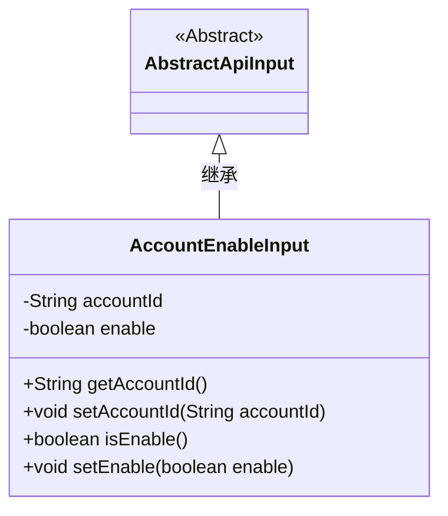
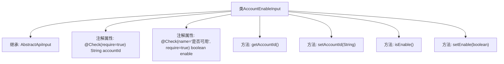

# 基础信息

|      |      |
|------|------|
| 名称 | AccountEnableInput |
| 编码语言 | .java |
| 代码路径 | WeFe/manager/manager-service/src/main/java/com/welab/wefe/manager/service/dto/account/AccountEnableInput.java |
| 包名 | com.welab.wefe.manager.service.dto.account |
| 依赖项 | ['com.welab.wefe.common.fieldvalidate.annotation.Check', 'com.welab.wefe.common.web.dto.AbstractApiInput'] |
| 概述说明 | AccountEnableInput类继承AbstractApiInput，包含必填字段accountId和enable，提供getter和setter方法。 |

# 说明

这是一个名为AccountEnableInput的Java类，继承自AbstractApiInput。类中包含两个关键字段：accountId和enable，分别表示账户ID和启用状态。accountId字段被标记为必填项，enable字段同样必填且标注了中文名"是否可用"。类提供了这两个字段的标准getter和setter方法，用于获取和设置对应的值。整个类用于处理账户启用或禁用的输入参数。

# 类列表 Class Summary

| 名称   | 类型  | 说明 |
|-------|------|-------------|
| AccountEnableInput | class | AccountEnableInput类继承AbstractApiInput，包含必填字段accountId和enable，提供getter和setter方法。 |

## 类 AccountEnableInput

|      |      |
|------|------|
| 访问范围 | public |
| 类型 | class |
| 名称 | AccountEnableInput |
| 说明 | AccountEnableInput类继承AbstractApiInput，包含必填字段accountId和enable，提供getter和setter方法。 |

### UML类图

这段类图展示了AccountEnableInput类继承自AbstractApiInput抽象类。AccountEnableInput包含两个私有字段accountId和enable，分别用于存储账户ID和启用状态，并提供了对应的getter和setter方法。类中的字段通过@Check注解进行校验，表明accountId为必填字段，enable字段需要校验且必须提供。该设计用于处理账户启用/禁用的输入参数，继承了基础API输入类的特性。

### 内部方法调用关系图

该流程图展示了AccountEnableInput类的结构，它继承自AbstractApiInput类，包含两个带校验注解的私有属性（accountId和enable），以及对应的getter和setter方法。注解@Check用于标记字段的必填约束，其中enable字段还包含自定义提示文本。类结构清晰体现了Java Bean的封装特性，通过方法控制对敏感属性的访问。

### 字段列表 Field List

| 名称  | 类型  | 说明 |
|-------|-------|------|
| enable | boolean | 类成员变量enable，布尔类型，标注@Check检查其是否可用，且为必填项。 |
| accountId | String | 必填字段accountId |

### 方法列表

| 名称  | 类型  | 说明 |
|-------|-------|------|
| setAccountId | void | 设置账户ID的方法，将参数accountId赋值给当前对象的accountId属性。 |
| getAccountId | String | 这是一个Java方法，返回字符串类型的accountId成员变量值。 |
| isEnable | boolean | 方法isEnable返回布尔值enable的状态。 |
| setEnable | void | 方法setEnable设置布尔值enable，用于控制启用或禁用状态。 |

