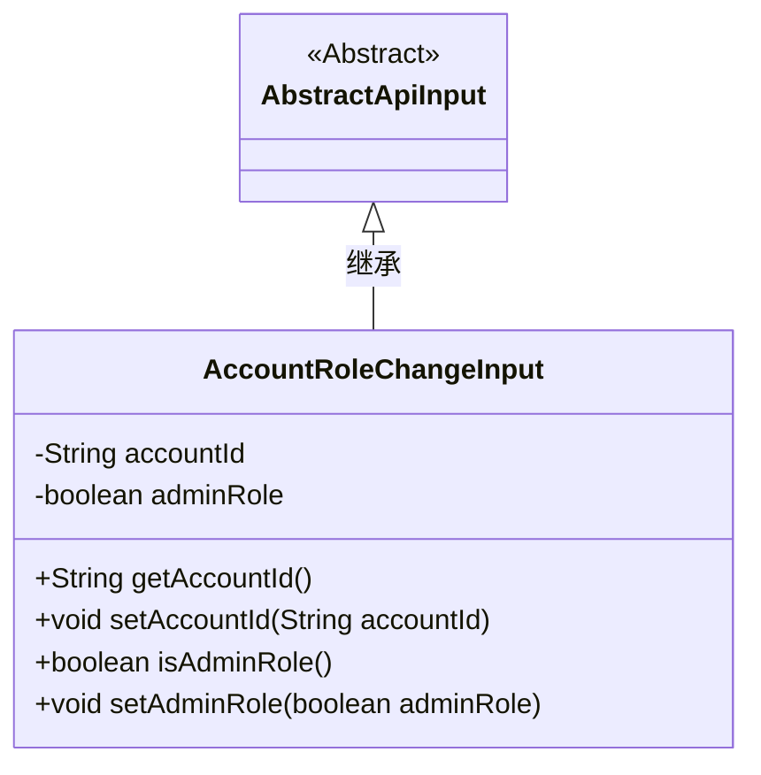
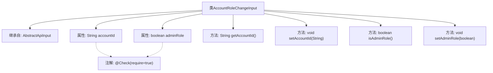

# 基础信息

|      |      |
|------|------|
| 名称 | AccountRoleChangeInput |
| 编码语言 | .java |
| 代码路径 | WeFe/manager/manager-service/src/main/java/com/welab/wefe/manager/service/dto/account/AccountRoleChangeInput.java |
| 包名 | com.welab.wefe.manager.service.dto.account |
| 依赖项 | ['com.welab.wefe.common.fieldvalidate.annotation.Check', 'com.welab.wefe.common.web.dto.AbstractApiInput'] |
| 概述说明 | 定义账户角色变更输入类，包含必填账户ID和管理员角色标识，提供getter和setter方法。 |

# 说明

AccountRoleChangeInput类继承自AbstractApiInput，包含两个必填字段：accountId（字符串类型）和adminRole（布尔类型）。提供了getter和setter方法用于访问和修改这两个字段的值。accountId用于标识账户，adminRole表示账户的管理员角色状态。

# 类列表 Class Summary

| 名称   | 类型  | 说明 |
|-------|------|-------------|
| AccountRoleChangeInput | class | AccountRoleChangeInput类继承AbstractApiInput，包含必填字段accountId和adminRole，提供getter和setter方法。 |

## 类 AccountRoleChangeInput

|      |      |
|------|------|
| 访问范围 | public |
| 类型 | class |
| 名称 | AccountRoleChangeInput |
| 说明 | AccountRoleChangeInput类继承AbstractApiInput，包含必填字段accountId和adminRole，提供getter和setter方法。 |

### UML类图

这段代码展示了一个账户角色变更输入类`AccountRoleChangeInput`，它继承自抽象基类`AbstractApiInput`。该类包含两个私有字段：`accountId`（账户ID）和`adminRole`（管理员角色标识），以及对应的getter和setter方法。通过`@Check`注解标记这两个字段为必填项，体现了输入参数的验证机制。类图清晰地显示了继承关系和类成员结构，适用于处理账户角色变更的API请求数据。

### 内部方法调用关系图

该流程图展示了AccountRoleChangeInput类的结构，包括其继承关系、属性和方法。类继承自AbstractApiInput，包含两个带有@Check注解的属性accountId和adminRole，以及对应的getter和setter方法。属性通过注解实现必填校验，方法用于访问和修改属性值，整体构成一个典型的Java Bean结构。

### 字段列表 Field List

| 名称  | 类型  | 说明 |
|-------|-------|------|
| adminRole | boolean | 代码定义了一个私有布尔变量adminRole，并通过@Check注解标记为必填项。 |
| accountId | String | 代码片段定义了一个私有字符串变量accountId，并标记为必须校验（@Check(require = true)）。 |

### 方法列表

| 名称  | 类型  | 说明 |
|-------|-------|------|
| setAccountId | void | 设置账户ID的方法，将参数accountId赋值给当前对象的accountId属性。 |
| isAdminRole | boolean | 检查是否为管理员角色，返回布尔值adminRole。 |
| getAccountId | String | 这是一个Java方法，返回字符串类型的accountId成员变量值。 |
| setAdminRole | void | 设置管理员角色的方法，通过布尔参数控制角色状态。 |

