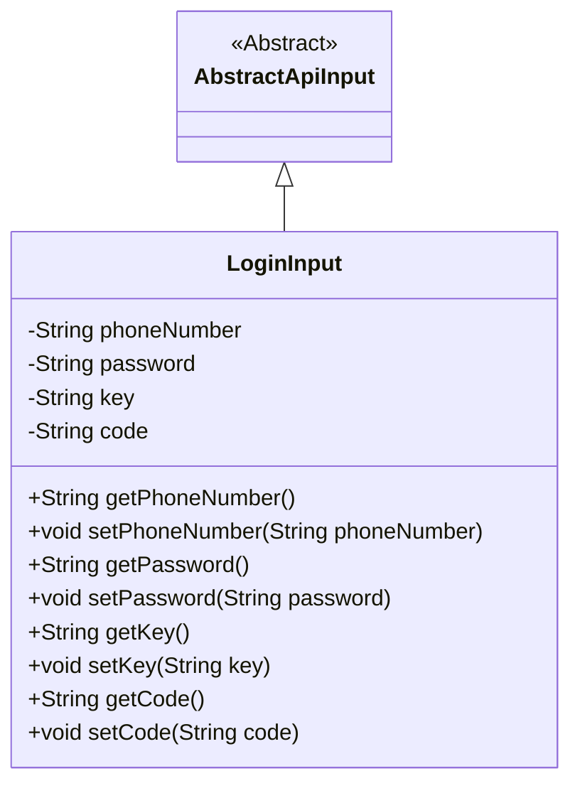

# 基础信息

|      |      |
|------|------|
| 名称 | LoginInput |
| 编码语言 | .java |
| 代码路径 | WeFe/manager/manager-service/src/main/java/com/welab/wefe/manager/service/dto/account/LoginInput.java |
| 包名 | com.welab.wefe.manager.service.dto.account |
| 依赖项 | ['com.welab.wefe.common.fieldvalidate.annotation.Check', 'com.welab.wefe.common.web.dto.AbstractApiInput'] |
| 概述说明 | 登录输入类，包含必填的手机号、密码、验证码标识和验证码字段，提供各属性的getter和setter方法。 |

# 说明

这是一个名为LoginInput的Java类，继承自AbstractApiInput，用于处理登录输入数据。类中包含四个必填字段：phoneNumber表示手机号，password表示密码，key作为验证码标识，code表示验证码。每个字段都有对应的getter和setter方法，并通过@Check注解标记为必填项，其中key和code字段还包含描述信息。

# 类列表 Class Summary

| 名称   | 类型  | 说明 |
|-------|------|-------------|
| LoginInput | class | 登录输入类，包含必填的手机号、密码、验证码标识和验证码字段，提供getter和setter方法。 |

## 类 LoginInput

|      |      |
|------|------|
| 访问范围 | public |
| 类型 | class |
| 名称 | LoginInput |
| 说明 | 登录输入类，包含必填的手机号、密码、验证码标识和验证码字段，提供getter和setter方法。 |

### UML类图

这段代码展示了一个登录输入类`LoginInput`继承自抽象类`AbstractApiInput`。`LoginInput`包含四个私有字段：`phoneNumber`、`password`、`key`和`code`，每个字段都有对应的getter和setter方法。类中的字段使用了`@Check`注解进行校验标记，表明这些字段在登录时都是必填项。该设计用于封装用户登录时所需的验证信息，体现了面向对象编程中的封装性和继承特性。

### 内部方法调用关系图

```mermaid
graph TD
    A["类LoginInput"]
    B["继承: AbstractApiInput"]
    C["属性: @Check String phoneNumber"]
    D["属性: @Check String password"]
    E["属性: @Check String key"]
    F["属性: @Check String code"]
    G["方法: getPhoneNumber()"]
    H["方法: setPhoneNumber(String)"]
    I["方法: getPassword()"]
    J["方法: setPassword(String)"]
    K["方法: getKey()"]
    L["方法: setKey(String)"]
    M["方法: getCode()"]
    N["方法: setCode(String)"]

    A --> B
    A --> C
    A --> D
    A --> E
    A --> F
    A --> G
    A --> H
    A --> I
    A --> J
    A --> K
    A --> L
    A --> M
    A --> N
```

该流程图展示了LoginInput类的完整结构，该类继承自AbstractApiInput基类。类中包含四个用@Check注解标记的必填字段：phoneNumber（电话号码）、password（密码）、key（验证码标识）和code（验证码）。每个私有字段都配有标准的getter和setter方法，用于字段的读写操作。注解中的require=true表示这些字段在验证时是必须的，desc属性则提供了字段的说明文字。整个类结构清晰地体现了JavaBean的设计规范，适合用作API的输入参数封装。

### 字段列表 Field List

| 名称  | 类型  | 说明 |
|-------|-------|------|
| password | String | 代码片段定义了一个私有字符串变量password，并使用了@Check注解标记为必填项。 |
| phoneNumber | String | 代码片段定义了一个私有字符串变量phoneNumber，并使用了@Check(require=true)注解，表示该字段必须进行校验且为必填项。 |
| code | String | 验证码字段，必填项。 |
| key | String | 验证码标识字段key，必填项。 |

### 方法列表

| 名称  | 类型  | 说明 |
|-------|-------|------|
| getKey | String | 获取key值的公开方法，返回成员变量key。 |
| setPassword | void | 这是一个Java方法，用于设置密码字段的值。方法接受一个字符串参数password，并将其赋值给类的成员变量password。 |
| setPhoneNumber | void | 这是一个Java方法，用于设置类的phoneNumber属性值。方法接收一个字符串参数phoneNumber，并将其赋值给类的同名成员变量。 |
| getPassword | String | 这是一个Java方法，返回字符串类型的password变量值。 |
| getPhoneNumber | String | 获取电话号码的方法，返回字符串phoneNumber。 |
| setCode | void | 这是一个Java方法，用于设置类中的code属性值。方法接收一个字符串参数code，并将其赋值给类的成员变量this.code。 |
| setKey | void | 设置键值方法，将输入字符串赋值给成员变量key。 |
| getCode | String | 获取code值的公共方法。 |

