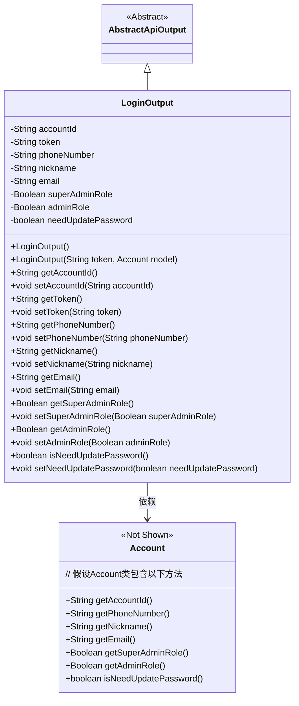

# 基础信息

|      |      |
|------|------|
| 名称 | LoginOutput |
| 编码语言 | .java |
| 代码路径 | WeFe/manager/manager-service/src/main/java/com/welab/wefe/manager/service/dto/account/LoginOutput.java |
| 包名 | com.welab.wefe.manager.service.dto.account |
| 依赖项 | ['com.welab.wefe.common.data.mongodb.entity.manager.Account', 'com.welab.wefe.common.web.dto.AbstractApiOutput'] |
| 概述说明 | LoginOutput类继承AbstractApiOutput，包含账号ID、令牌、电话、昵称、邮箱、管理员角色标识及需更新密码标识等字段，提供构造方法和getter/setter。 |

# 说明

LoginOutput类继承自AbstractApiOutput，用于封装登录后的返回数据。包含账户ID、令牌、电话号码、昵称、邮箱等基本信息，以及超级管理员角色、管理员角色标识和是否需要更新密码的布尔值。提供无参构造方法和基于Account模型初始化数据的构造方法，同时为所有字段生成getter和setter方法以实现数据访问和修改。

# 类列表 Class Summary

| 名称   | 类型  | 说明 |
|-------|------|-------------|
| LoginOutput | class | LoginOutput类继承AbstractApiOutput，包含账号ID、令牌、电话、昵称、邮箱、管理员角色标识及密码更新标识字段，提供构造方法和getter/setter。 |

## 类 LoginOutput

|      |      |
|------|------|
| 访问范围 | public |
| 类型 | class |
| 名称 | LoginOutput |
| 说明 | LoginOutput类继承AbstractApiOutput，包含账号ID、令牌、电话、昵称、邮箱、管理员角色标识及密码更新标识字段，提供构造方法和getter/setter。 |

### UML类图

这段代码展示了一个登录输出类`LoginOutput`，它继承自抽象类`AbstractApiOutput`，并包含用户账户信息、令牌、角色标识等字段。该类通过构造函数从`Account`模型对象初始化数据，提供完整的getter/setter方法。类图清晰地展示了继承关系和与`Account`类的依赖关系，体现了用户登录成功后返回的数据结构。

### 内部方法调用关系图

```mermaid
graph TD
    A["类LoginOutput继承AbstractApiOutput"]
    B["属性: String accountId"]
    C["属性: String token"]
    D["属性: String phoneNumber"]
    E["属性: String nickname"]
    F["属性: String email"]
    G["属性: Boolean superAdminRole"]
    H["属性: Boolean adminRole"]
    I["属性: boolean needUpdatePassword"]
    J["构造方法: LoginOutput()"]
    K["构造方法: LoginOutput(String token, Account model)"]
    L["方法: getAccountId/setAccountId"]
    M["方法: getToken/setToken"]
    N["方法: getPhoneNumber/setPhoneNumber"]
    O["方法: getNickname/setNickname"]
    P["方法: getEmail/setEmail"]
    Q["方法: getSuperAdminRole/setSuperAdminRole"]
    R["方法: getAdminRole/setAdminRole"]
    S["方法: isNeedUpdatePassword/setNeedUpdatePassword"]

    A --> B
    A --> C
    A --> D
    A --> E
    A --> F
    A --> G
    A --> H
    A --> I
    A --> J
    A --> K
    A --> L
    A --> M
    A --> N
    A --> O
    A --> P
    A --> Q
    A --> R
    A --> S
    K -->|调用| B
    K -->|调用| C
    K -->|调用| D
    K -->|调用| E
    K -->|调用| F
    K -->|调用| G
    K -->|调用| H
    K -->|调用| I
```

这段流程图展示了LoginOutput类的完整结构，该类继承自AbstractApiOutput，包含8个私有属性和12个方法。重点展示了两个构造方法（无参构造和带参构造）与属性之间的赋值关系，其中带参构造方法会通过Account模型对象初始化所有属性。所有属性都配有对应的getter/setter方法，包括账号ID、令牌、联系方式、角色标识等登录相关信息的封装。流程图清晰呈现了类成员间的层级关系和构造方法对属性的初始化路径。

### 字段列表 Field List

| 名称  | 类型  | 说明 |
|-------|-------|------|
| needUpdatePassword | boolean | 布尔变量needUpdatePassword，表示是否需要更新密码。 |
| superAdminRole | Boolean | 私有布尔类型变量，标识是否为超级管理员角色。 |
| token | String | 私有字符串类型变量token。 |
| phoneNumber | String | 定义私有字符串变量phoneNumber。 |
| adminRole | Boolean | 布尔类型字段，标识是否为管理员角色。 |
| email | String | 声明一个私有字符串变量email。 |
| nickname | String | 私有字符串类型变量nickname，用于存储昵称信息。 |
| accountId | String | 声明一个私有字符串变量accountId。 |

### 方法列表

| 名称  | 类型  | 说明 |
|-------|-------|------|
| setSuperAdminRole | void | 设置超级管理员角色的方法，参数为布尔值，用于更新成员变量superAdminRole。 |
| setAccountId | void | 这是一个Java方法，用于设置类的accountId属性值。方法接收一个字符串参数accountId，并将其赋值给类的成员变量this.accountId。 |
| getToken | String | 该方法返回字符串类型的token值。 |
| setToken | void | 设置token字符串值的方法。 |
| setNickname | void | 方法setNickname用于设置成员变量nickname的值，参数为字符串类型。 |
| getNickname | String | 这是一个Java方法，返回字符串类型的昵称变量nickname。 |
| getAdminRole | Boolean | 获取管理员角色状态的方法，返回布尔值表示是否为管理员。 |
| setAdminRole | void | 设置管理员角色的方法，参数为布尔值adminRole，用于更新对象的adminRole属性。 |
| isNeedUpdatePassword | boolean | 方法返回是否需要更新密码的布尔值。 |
| setNeedUpdatePassword | void | 该方法用于设置是否需要更新密码，参数为布尔值，直接赋值给类成员变量needUpdatePassword。 |
| setPhoneNumber | void | 设置电话号码的方法，将输入参数赋值给类的phoneNumber变量。 |
| setEmail | void | 这是一个Java方法，用于设置对象的email属性。方法接收一个字符串参数email，并将其赋值给当前对象的email字段。 |
| getSuperAdminRole | Boolean | 获取超级管理员角色状态的方法，返回布尔值表示是否为超级管理员。 |
| getPhoneNumber | String | 获取电话号码的方法，返回字符串类型的phoneNumber。 |
| getAccountId | String | 这是一个Java方法，返回字符串类型的accountId成员变量值。 |
| getEmail | String | 获取email字符串的方法。 |

