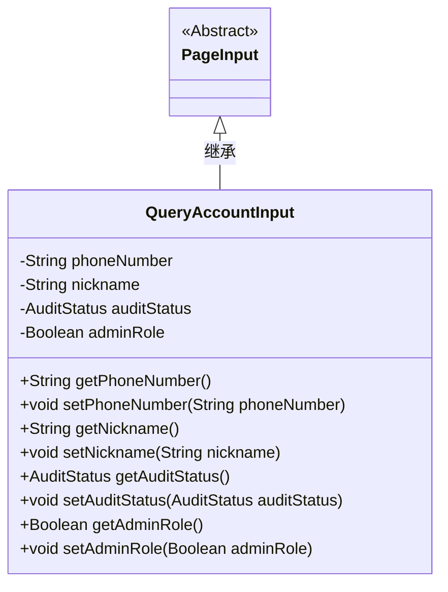

# 基础信息

|      |      |
|------|------|
| 名称 | QueryAccountInput |
| 编码语言 | .java |
| 代码路径 | WeFe/manager/manager-service/src/main/java/com/welab/wefe/manager/service/dto/account/QueryAccountInput.java |
| 包名 | com.welab.wefe.manager.service.dto.account |
| 依赖项 | ['com.welab.wefe.common.wefe.enums.AuditStatus', 'com.welab.wefe.manager.service.dto.base.PageInput'] |
| 概述说明 | QueryAccountInput类继承PageInput，包含电话号码、昵称、审核状态和管理员角色字段及其getter和setter方法。 |

# 说明

QueryAccountInput类继承自PageInput，用于封装查询账户的输入参数。包含四个属性：phoneNumber表示电话号码，nickname表示昵称，auditStatus表示审核状态枚举，adminRole表示是否管理员角色。每个属性都有对应的getter和setter方法用于访问和修改属性值。

# 类列表 Class Summary

| 名称   | 类型  | 说明 |
|-------|------|-------------|
| QueryAccountInput | class | QueryAccountInput类继承PageInput，包含电话号码、昵称、审核状态和管理员角色字段及其getter/setter方法。 |

## 类 QueryAccountInput

|      |      |
|------|------|
| 访问范围 | public |
| 类型 | class |
| 名称 | QueryAccountInput |
| 说明 | QueryAccountInput类继承PageInput，包含电话号码、昵称、审核状态和管理员角色字段及其getter/setter方法。 |

### UML类图

这段类图展示了QueryAccountInput类继承自抽象类PageInput的结构。QueryAccountInput包含四个私有字段：phoneNumber、nickname、auditStatus和adminRole，每个字段都有对应的getter和setter方法。AuditStatus是一个枚举类型，表示审核状态。该类主要用于封装查询账户时的输入参数，通过继承PageInput获得了分页查询的基础功能。类图清晰地呈现了类之间的继承关系和成员方法的访问权限。

### 内部方法调用关系图

```mermaid
graph TD
    A["类QueryAccountInput"]
    B["继承自: PageInput"]
    C["属性: String phoneNumber"]
    D["属性: String nickname"]
    E["属性: AuditStatus auditStatus"]
    F["属性: Boolean adminRole"]
    G["方法: getPhoneNumber()"]
    H["方法: setPhoneNumber(String)"]
    I["方法: getNickname()"]
    J["方法: setNickname(String)"]
    K["方法: getAuditStatus()"]
    L["方法: setAuditStatus(AuditStatus)"]
    M["方法: getAdminRole()"]
    N["方法: setAdminRole(Boolean)"]

    A --> B
    A --> C
    A --> D
    A --> E
    A --> F
    A --> G
    A --> H
    A --> I
    A --> J
    A --> K
    A --> L
    A --> M
    A --> N
```

这段代码定义了一个名为QueryAccountInput的类，该类继承自PageInput。它包含四个私有属性：phoneNumber（电话号码）、nickname（昵称）、auditStatus（审核状态）和adminRole（管理员角色）。每个属性都有对应的getter和setter方法，用于获取和设置属性的值。这个类主要用于封装查询账户时的输入参数，便于在系统中传递和处理账户查询相关的数据。

### 字段列表 Field List

| 名称  | 类型  | 说明 |
|-------|-------|------|
| phoneNumber | String | 定义私有字符串变量phoneNumber。 |
| auditStatus | AuditStatus | 私有审计状态变量auditStatus。 |
| nickname | String | 私有字符串变量nickname，用于存储昵称信息。 |
| adminRole | Boolean | 私有布尔类型变量，标识管理员角色。 |

### 方法列表

| 名称  | 类型  | 说明 |
|-------|-------|------|
| getNickname | String | 获取昵称的方法，返回字符串类型变量nickname。 |
| setNickname | void | 设置用户昵称的方法，将输入参数赋值给成员变量nickname。 |
| setPhoneNumber | void | 这是一个Java方法，用于设置类的phoneNumber属性值。方法接收一个字符串参数phoneNumber，并将其赋值给类的同名成员变量。 |
| getPhoneNumber | String | 获取电话号码的方法，返回字符串phoneNumber。 |
| getAuditStatus | AuditStatus | 获取审核状态的方法，返回auditStatus值。 |
| setAuditStatus | void | 设置审计状态的方法，将传入的auditStatus赋值给当前对象的auditStatus属性。 |
| getAdminRole | Boolean | 获取管理员角色状态的方法，返回布尔值表示是否为管理员。 |
| setAdminRole | void | 定义方法setAdminRole，用于设置adminRole布尔值属性。 |

