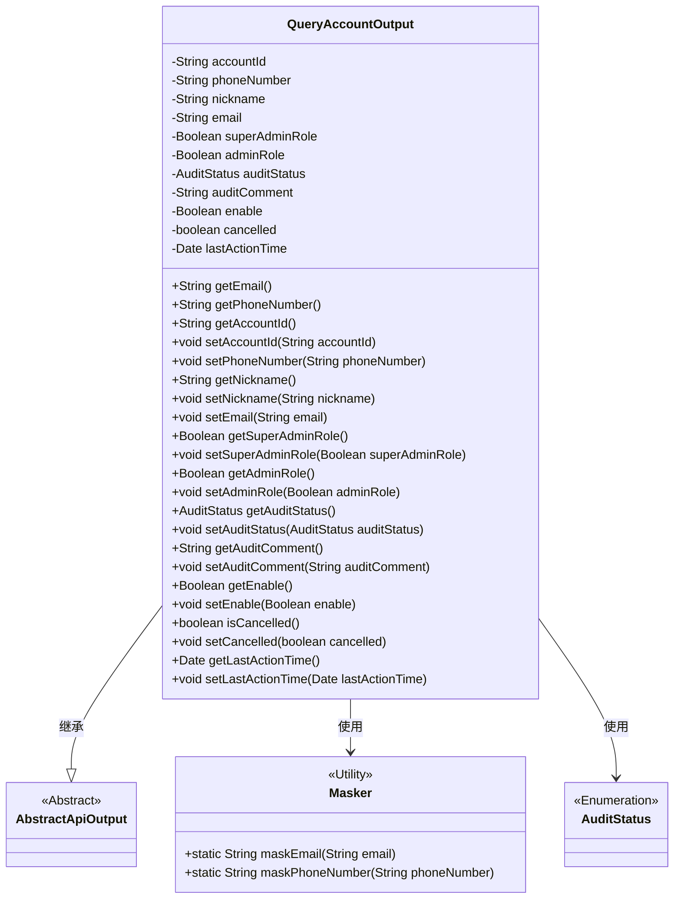

# 基础信息

|      |      |
|------|------|
| 名称 | QueryAccountOutput |
| 编码语言 | .java |
| 代码路径 | WeFe/manager/manager-service/src/main/java/com/welab/wefe/manager/service/dto/account/QueryAccountOutput.java |
| 包名 | com.welab.wefe.manager.service.dto.account |
| 依赖项 | ['com.welab.wefe.common.fieldvalidate.annotation.Check', 'com.welab.wefe.common.util.Masker', 'com.welab.wefe.common.web.dto.AbstractApiOutput', 'com.welab.wefe.common.wefe.enums.AuditStatus', 'java.util.Date'] |
| 概述说明 | QueryAccountOutput类包含账户信息，如ID、手机号、昵称、邮箱、管理员角色、审核状态和意见、可用性、注销状态及最后活动时间。提供getter/setter方法，部分敏感信息通过掩码处理。 |

# 说明

QueryAccountOutput类继承自AbstractApiOutput，包含账户相关属性：accountId、经过掩码处理的phoneNumber和email、nickname、superAdminRole标识超级管理员、adminRole标识管理员权限、auditStatus记录审核状态、auditComment存储审核意见、enable控制账户可用性、cancelled标记注销状态、lastActionTime记录最后活动时间。所有字段均通过getter/setter方法访问，敏感信息通过Masker工具进行掩码处理。

# 类列表 Class Summary

| 名称   | 类型  | 说明 |
|-------|------|-------------|
| QueryAccountOutput | class | QueryAccountOutput类包含账户ID、手机号、昵称、邮箱、管理员角色、审核状态、可用性等属性，并提供getter/setter方法。部分敏感信息通过Masker类进行脱敏处理。 |

## 类 QueryAccountOutput

|      |      |
|------|------|
| 访问范围 | public |
| 类型 | class |
| 名称 | QueryAccountOutput |
| 说明 | QueryAccountOutput类包含账户ID、手机号、昵称、邮箱、管理员角色、审核状态、可用性等属性，并提供getter/setter方法。部分敏感信息通过Masker类进行脱敏处理。 |

### UML类图

这段代码展示了一个`QueryAccountOutput`类，它继承自`AbstractApiOutput`，用于封装账户查询的输出信息。该类包含账户ID、电话号码、昵称、邮箱等属性，并通过`@Check`注解进行校验标记。其中电话号码和邮箱通过`Masker`工具类进行脱敏处理。类中还定义了管理员角色、审核状态、账户状态等业务相关字段，提供了完整的getter/setter方法。整体设计体现了账户信息的封装和安全性处理。

### 内部方法调用关系图

```mermaid
graph TD
    A["类QueryAccountOutput"]
    B["继承: AbstractApiOutput"]
    C["属性: String accountId"]
    D["属性: @Check String phoneNumber"]
    E["属性: @Check String nickname"]
    F["属性: @Check String email"]
    G["属性: @Check Boolean superAdminRole"]
    H["属性: @Check Boolean adminRole"]
    I["属性: @Check AuditStatus auditStatus"]
    J["属性: @Check String auditComment"]
    K["属性: @Check Boolean enable"]
    L["属性: boolean cancelled"]
    M["属性: Date lastActionTime"]
    N["方法: getEmail()调用Masker.maskEmail"]
    O["方法: getPhoneNumber()调用Masker.maskPhoneNumber"]
    P["Getter/Setter方法组"]

    A --> B
    A --> C
    A --> D
    A --> E
    A --> F
    A --> G
    A --> H
    A --> I
    A --> J
    A --> K
    A --> L
    A --> M
    A --> N
    A --> O
    A --> P
```

这段代码展示了一个账户查询输出类QueryAccountOutput，继承自AbstractApiOutput。类中包含多个带@Check注解的属性，用于账户信息存储和验证，如手机号、邮箱、管理员角色等。特别提供了敏感信息掩码处理方法(getEmail/getPhoneNumber)，以及完整的Getter/Setter方法组。类设计体现了数据封装、安全处理和扩展性考虑，适合作为API响应数据结构使用。

### 字段列表 Field List

| 名称  | 类型  | 说明 |
|-------|-------|------|
| adminRole | Boolean | 字段adminRole表示是否为管理员，管理员拥有更多权限如设置成员对外可见。 |
| superAdminRole | Boolean | 检查是否为超级管理员，即系统初始创建者。 |
| auditStatus | AuditStatus | 类私有字段auditStatus，标注为审核状态，类型为AuditStatus。 |
| nickname | String | 代码定义了一个私有字符串变量nickname，并使用了@Check注解进行昵称校验。 |
| email | String | 定义私有字符串变量email，使用@Check注解校验邮箱格式。 |
| accountId | String | 声明一个私有字符串变量accountId。 |
| phoneNumber | String | 字段phoneNumber使用@Check注解校验手机号格式。 |
| auditComment | String | 实体类字段：审核意见，类型为字符串，用于存储审核相关备注信息。 |
| enable | Boolean | 私有布尔类型变量enable，使用@Check注解标记为"是否可用"。 |
| lastActionTime | Date | 最后操作时间记录字段。 |
| cancelled | boolean | 布尔变量cancelled，表示取消状态。 |

### 方法列表

| 名称  | 类型  | 说明 |
|-------|-------|------|
| setAdminRole | void | 定义了一个公共方法setAdminRole，用于设置adminRole属性的布尔值。 |
| setNickname | void | 设置用户昵称的方法，将输入参数赋值给成员变量nickname。 |
| setSuperAdminRole | void | 设置超级管理员角色的方法，参数为布尔值。 |
| setCancelled | void | 方法setCancelled用于设置布尔值cancelled的状态，参数为cancelled。 |
| setLastActionTime | void | 设置对象最后操作时间的方法，参数为Date类型。 |
| getLastActionTime | Date | 获取最后操作时间的日期对象。 |
| setAuditStatus | void | 设置审核状态的方法，将传入的auditStatus赋值给当前对象的auditStatus属性。 |
| setAccountId | void | 设置账户ID的方法，将参数accountId赋值给类的同名成员变量。 |
| getAdminRole | Boolean | 方法getAdminRole返回布尔值adminRole，表示管理员角色状态。 |
| setAuditComment | void | 方法setAuditComment用于设置auditComment属性的值。 |
| getNickname | String | 获取昵称的方法，返回字符串类型的nickname。 |
| setPhoneNumber | void | 设置电话号码的方法，将输入参数赋值给类成员变量phoneNumber。 |
| getAccountId | String | 方法返回字符串类型的账户ID。 |
| setEmail | void | 这是一个Java方法，用于设置对象的email属性。方法接收一个字符串参数email，并将其赋值给当前对象的email字段。 |
| getSuperAdminRole | Boolean | 这是一个Java方法，返回布尔类型的superAdminRole值，表示是否为超级管理员角色。 |
| getAuditComment | String | 获取审计评语的方法，返回auditComment字符串。 |
| getEmail | String | 该方法返回经过掩码处理的邮箱字符串，保护用户隐私。 |
| getAuditStatus | AuditStatus | 方法返回审计状态auditStatus的值。 |
| getPhoneNumber | String | 该方法返回经过掩码处理的电话号码字符串，隐藏部分信息以保护隐私。 |
| getEnable | Boolean | 这是一个Java方法，返回布尔类型的enable变量值。 |
| setEnable | void | 这是一个Java方法，用于设置布尔类型的enable属性值。方法接受一个Boolean参数，并将其赋值给类的成员变量enable。 |
| isCancelled | boolean | 检查任务是否已取消，返回布尔值cancelled的状态。 |

