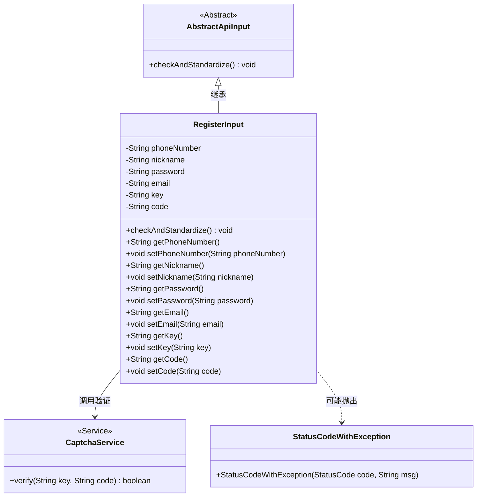

# 基础信息

|      |      |
|------|------|
| 名称 | RegisterInput |
| 编码语言 | .java |
| 代码路径 | WeFe/manager/manager-service/src/main/java/com/welab/wefe/manager/service/dto/account/RegisterInput.java |
| 包名 | com.welab.wefe.manager.service.dto.account |
| 依赖项 | ['com.welab.wefe.common.StatusCode', 'com.welab.wefe.common.exception.StatusCodeWithException', 'com.welab.wefe.common.fieldvalidate.StandardFieldType', 'com.welab.wefe.common.fieldvalidate.annotation.Check', 'com.welab.wefe.common.web.dto.AbstractApiInput', 'com.welab.wefe.common.web.service.CaptchaService'] |
| 概述说明 | 注册输入类，包含手机号、昵称、密码、邮箱、验证码标识和验证码字段，进行格式校验和验证码验证。 |

# 说明

RegisterInput类继承AbstractApiInput，包含手机号、昵称、密码、邮箱、验证码标识和验证码字段。各字段均需校验：手机号需符合标准格式，昵称长度2-15位，密码长度6-128位，邮箱需标准格式，验证码标识和验证码必填。重写checkAndStandardize方法时会额外校验验证码有效性，无效则抛出异常。提供各字段的getter和setter方法。

# 类列表 Class Summary

| 名称   | 类型  | 说明 |
|-------|------|-------------|
| RegisterInput | class | 注册输入类，包含手机号、昵称、密码、邮箱、验证码标识和验证码字段，进行格式校验和验证码验证。 |

## 类 RegisterInput

|      |      |
|------|------|
| 访问范围 | public |
| 类型 | class |
| 名称 | RegisterInput |
| 说明 | 注册输入类，包含手机号、昵称、密码、邮箱、验证码标识和验证码字段，进行格式校验和验证码验证。 |

### UML类图

该类图展示了注册输入数据模型的结构与关联关系。RegisterInput继承自抽象类AbstractApiInput，包含6个经过注解校验的私有字段及其getter/setter方法。核心方法checkAndStandardize()会调用父类校验逻辑，并通过CaptchaService验证验证码有效性，失败时抛出StatusCodeWithException异常。图中清晰呈现了类继承、服务依赖和异常处理关系，体现了注册参数校验的完整流程控制。

### 内部方法调用关系图

```mermaid
graph TD
    A["类RegisterInput"]
    B["继承: AbstractApiInput"]
    C["属性: String phoneNumber"]
    D["属性: String nickname"]
    E["属性: String password"]
    F["属性: String email"]
    G["属性: String key"]
    H["属性: String code"]
    I["方法: checkAndStandardize()"]
    J["方法: getPhoneNumber()"]
    K["方法: setPhoneNumber()"]
    L["方法: getNickname()"]
    M["方法: setNickname()"]
    N["方法: getPassword()"]
    O["方法: setPassword()"]
    P["方法: getEmail()"]
    Q["方法: setEmail()"]
    R["方法: getKey()"]
    S["方法: setKey()"]
    T["方法: getCode()"]
    U["方法: setCode()"]
    V["调用: super.checkAndStandardize()"]
    W["调用: CaptchaService.verify()"]
    X["抛出异常: StatusCodeWithException"]

    A --> B
    A --> C
    A --> D
    A --> E
    A --> F
    A --> G
    A --> H
    A --> I
    A --> J
    A --> K
    A --> L
    A --> M
    A --> N
    A --> O
    A --> P
    A --> Q
    A --> R
    A --> S
    A --> T
    A --> U
    I --> V
    I --> W
    W -->|false| X
```

流程图描述：该流程图展示了RegisterInput类的结构，它继承自AbstractApiInput类，包含多个带有校验注解的私有属性（如手机号、昵称、密码等）以及对应的getter和setter方法。核心方法是checkAndStandardize()，该方法首先调用父类的校验逻辑，然后通过CaptchaService验证验证码的有效性，若验证失败则抛出StatusCodeWithException异常。整个流程清晰地反映了数据校验和标准化的过程。

### 字段列表 Field List

| 名称  | 类型  | 说明 |
|-------|-------|------|
| email | String | 代码定义了一个私有字符串变量email，并通过@Check注解要求该字段必填且类型必须符合标准电子邮件格式。 |
| code | String | 验证码字段，必填校验。 |
| password | String | 代码定义了一个私有字符串变量password，要求非空且长度在6到128字符之间。 |
| phoneNumber | String | 代码定义了一个私有字符串变量phoneNumber，使用@Check注解标记为必填字段，并指定校验类型为电话号码标准格式。 |
| key | String | 验证码标识字段，必填项。 |
| nickname | String | Java字段校验：昵称必填，长度2-15字符。 |

### 方法列表

| 名称  | 类型  | 说明 |
|-------|-------|------|
| setPassword | void | 设置密码方法，将输入字符串赋值给类成员变量password。 |
| getNickname | String | 方法返回用户昵称字符串。 |
| checkAndStandardize | void | 该方法检查并标准化输入，首先调用父类方法，然后验证验证码。若验证码无效，抛出参数无效异常并提示错误。 |
| getPassword | String | 获取密码的方法，返回字符串类型的密码值。 |
| getEmail | String | 获取email字符串的方法。 |
| setPhoneNumber | void | 这是一个Java方法，用于设置类的phoneNumber属性值。方法接收一个字符串参数phoneNumber，并将其赋值给类的同名成员变量。 |
| getPhoneNumber | String | 获取电话号码的方法，返回字符串类型的phoneNumber。 |
| setNickname | void | 设置用户昵称的方法，将输入参数赋值给成员变量nickname。 |
| setEmail | void | 设置email属性的方法，将参数值赋给当前对象的email字段。 |
| getKey | String | 这是一个Java方法，返回字符串类型的成员变量key的值。 |
| setKey | void | 设置键值方法，将输入字符串赋值给成员变量key。 |
| getCode | String | 获取code值的公共方法。 |
| setCode | void | 设置字符串类型的code值。 |

