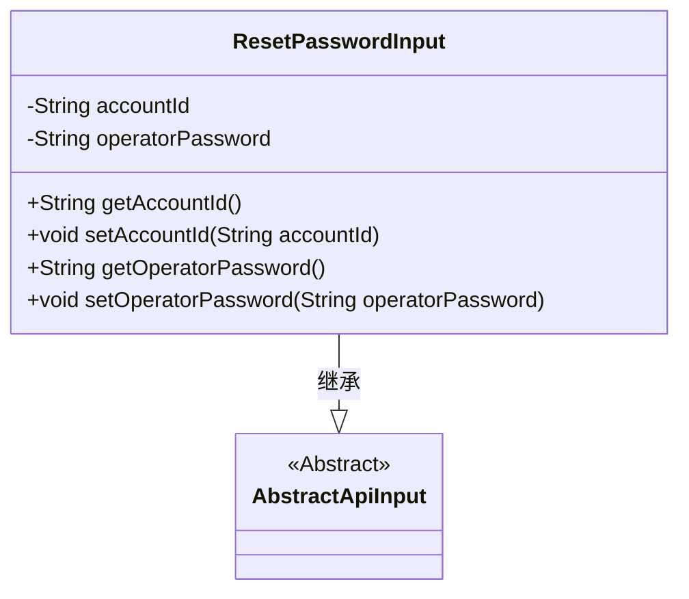
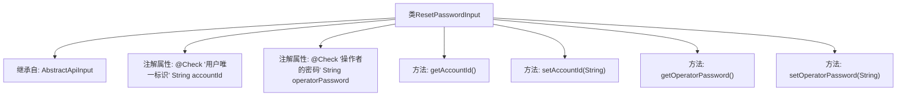

# 基础信息

|      |      |
|------|------|
| 名称 | ResetPasswordInput |
| 编码语言 | .java |
| 代码路径 | WeFe/manager/manager-service/src/main/java/com/welab/wefe/manager/service/dto/account/ResetPasswordInput.java |
| 包名 | com.welab.wefe.manager.service.dto.account |
| 依赖项 | ['com.welab.wefe.common.fieldvalidate.annotation.Check', 'com.welab.wefe.common.web.dto.AbstractApiInput'] |
| 概述说明 | 重置密码输入类，包含用户ID和操作者密码两个必填字段，提供getter和setter方法。 |

# 说明

ResetPasswordInput类继承自AbstractApiInput，用于处理重置密码的输入数据。包含两个必填字段：accountId表示用户唯一标识，operatorPassword表示操作者的密码。两个字段均有getter和setter方法，并通过注解进行非空校验。

# 类列表 Class Summary

| 名称   | 类型  | 说明 |
|-------|------|-------------|
| ResetPasswordInput | class | 重置密码输入类，包含用户ID和操作者密码两个必填字段，提供getter和setter方法。 |

## 类 ResetPasswordInput

|      |      |
|------|------|
| 访问范围 | public |
| 类型 | class |
| 名称 | ResetPasswordInput |
| 说明 | 重置密码输入类，包含用户ID和操作者密码两个必填字段，提供getter和setter方法。 |

### UML类图

类图描述：ResetPasswordInput类继承自抽象类AbstractApiInput，包含两个私有字符串类型属性accountId和operatorPassword，分别表示用户唯一标识和操作者密码。提供了这四个属性的getter和setter方法，用于属性的访问和修改。该类主要用于处理重置密码的输入数据，继承了AbstractApiInput的基本API输入特性。

### 内部方法调用关系图

这段代码描述了一个用于重置密码的输入类ResetPasswordInput，它继承自AbstractApiInput基类。类中包含两个带有@Check注解的必填字段：accountId表示用户唯一标识，operatorPassword表示操作者密码。同时提供了这四个字段的标准getter和setter方法。流程图清晰地展示了类的继承关系、属性定义和方法结构，体现了数据验证和封装的设计意图。

### 字段列表 Field List

| 名称  | 类型  | 说明 |
|-------|-------|------|
| accountId | String | 字段accountId需满足用户唯一标识校验且必填。 |
| operatorPassword | String | 检查操作者密码，必填字段。 |

### 方法列表

| 名称  | 类型  | 说明 |
|-------|-------|------|
| getAccountId | String | 方法返回accountId字符串。 |
| setAccountId | void | 设置账户ID的方法，将参数accountId赋值给当前对象的accountId属性。 |
| getOperatorPassword | String | 获取操作员密码的方法，返回字符串类型operatorPassword。 |
| setOperatorPassword | void | 设置操作员密码的方法，将输入参数赋值给类成员变量operatorPassword。 |

