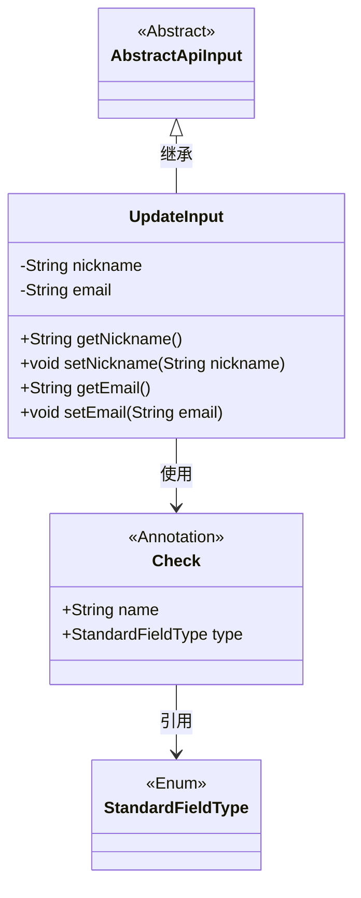
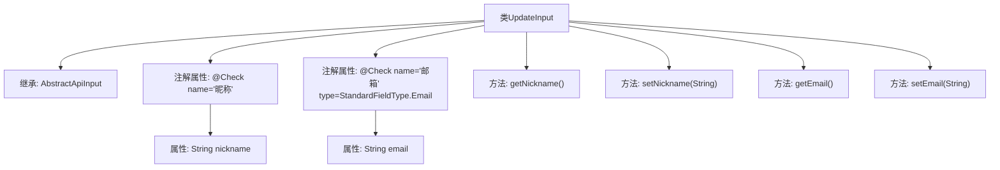

# 基础信息

|      |      |
|------|------|
| 名称 | UpdateInput |
| 编码语言 | .java |
| 代码路径 | WeFe/manager/manager-service/src/main/java/com/welab/wefe/manager/service/dto/account/UpdateInput.java |
| 包名 | com.welab.wefe.manager.service.dto.account |
| 依赖项 | ['com.welab.wefe.common.fieldvalidate.StandardFieldType', 'com.welab.wefe.common.fieldvalidate.annotation.Check', 'com.welab.wefe.common.web.dto.AbstractApiInput'] |
| 概述说明 | UpdateInput类继承AbstractApiInput，包含昵称和邮箱字段，邮箱有格式校验，提供getter和setter方法。 |

# 说明

这是一个名为UpdateInput的Java类，继承自AbstractApiInput。类中包含两个私有字段：nickname和email，分别代表昵称和邮箱。nickname字段使用@Check注解标注名称为"昵称"，email字段同样使用@Check注解标注名称为"邮箱"，并指定字段类型为StandardFieldType.Email。类中提供了这两个字段的getter和setter方法，用于获取和设置字段值。

# 类列表 Class Summary

| 名称   | 类型  | 说明 |
|-------|------|-------------|
| UpdateInput | class | UpdateInput类继承AbstractApiInput，包含昵称和邮箱字段，邮箱需符合标准格式，提供getter和setter方法。 |

## 类 UpdateInput

|      |      |
|------|------|
| 访问范围 | public |
| 类型 | class |
| 名称 | UpdateInput |
| 说明 | UpdateInput类继承AbstractApiInput，包含昵称和邮箱字段，邮箱需符合标准格式，提供getter和setter方法。 |

### UML类图

这段类图展示了UpdateInput类继承自抽象类AbstractApiInput，并包含两个私有字段nickname和email，以及对应的getter和setter方法。UpdateInput类使用了Check注解来验证字段，Check注解包含name和type属性，其中type属性引用StandardFieldType枚举。该结构主要用于实现API输入参数的验证功能，通过注解方式对字段进行标准化校验。

### 内部方法调用关系图

这段代码定义了一个继承自AbstractApiInput的UpdateInput类，包含两个带有@Check注解的属性（nickname和email）及其对应的getter和setter方法。流程图清晰地展示了类的继承关系、属性注解配置以及方法结构，其中nickname字段使用基础校验，email字段则额外指定了Email类型的标准字段校验。整个类设计用于处理带有验证逻辑的更新输入数据。

### 字段列表 Field List

| 名称  | 类型  | 说明 |
|-------|-------|------|
| email | String | 定义私有字符串字段email，使用@Check注解校验其格式为邮箱类型。 |
| nickname | String | Java字段注解：检查昵称的字符串变量。 |

### 方法列表

| 名称  | 类型  | 说明 |
|-------|-------|------|
| getEmail | String | 获取email的字符串方法。 |
| getNickname | String | 获取昵称的方法，返回字符串类型的nickname。 |
| setNickname | void | 设置用户昵称的方法，将输入参数赋值给对象的nickname属性。 |
| setEmail | void | 这是一个Java方法，用于设置对象的email属性。方法接收一个字符串参数email，并将其赋值给当前对象的email字段。 |

