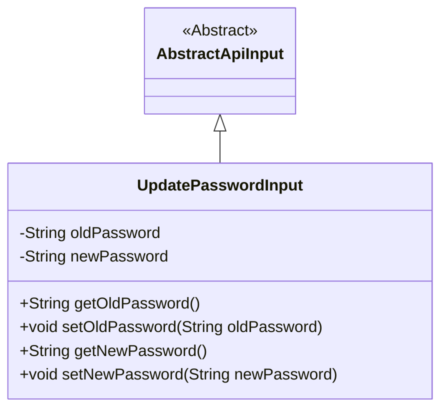
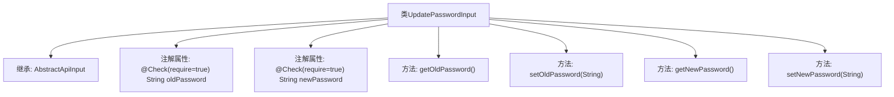

# 基础信息

|      |      |
|------|------|
| 名称 | UpdatePasswordInput |
| 编码语言 | .java |
| 代码路径 | WeFe/manager/manager-service/src/main/java/com/welab/wefe/manager/service/dto/account/UpdatePasswordInput.java |
| 包名 | com.welab.wefe.manager.service.dto.account |
| 依赖项 | ['com.welab.wefe.common.fieldvalidate.annotation.Check', 'com.welab.wefe.common.web.dto.AbstractApiInput'] |
| 概述说明 | 更新密码输入类，包含必须的旧密码和新密码字段及其getter和setter方法。 |

# 说明

这是一个用于更新密码的输入类，继承自抽象API输入基类。类中包含两个必填字段：旧密码和新密码，分别通过注解标记为必须提供。类提供了获取和设置这两个密码字段的方法，确保数据的封装和访问控制。

# 类列表 Class Summary

| 名称   | 类型  | 说明 |
|-------|------|-------------|
| UpdatePasswordInput | class | 更新密码输入类，包含必填的旧密码和新密码字段及其getter和setter方法。 |

## 类 UpdatePasswordInput

|      |      |
|------|------|
| 访问范围 | public |
| 类型 | class |
| 名称 | UpdatePasswordInput |
| 说明 | 更新密码输入类，包含必填的旧密码和新密码字段及其getter和setter方法。 |

### UML类图

这段类图展示了UpdatePasswordInput继承自抽象类AbstractApiInput的结构。UpdatePasswordInput包含两个私有字符串属性oldPassword和newPassword，分别有对应的getter和setter方法。类通过@Check注解标记这两个字段为必填项，体现了密码更新时对输入验证的要求。继承关系表明UpdatePasswordInput遵循了父类定义的API输入基础规范。

### 内部方法调用关系图

这段代码定义了一个用于更新密码的输入类UpdatePasswordInput，继承自AbstractApiInput基类。类中包含两个带有@Check注解的必填字段：oldPassword和newPassword，分别表示旧密码和新密码。同时提供了这四个属性的标准getter和setter方法。流程图清晰地展示了类的继承关系、属性声明和方法结构，体现了Java Bean的标准设计模式。

### 字段列表 Field List

| 名称  | 类型  | 说明 |
|-------|-------|------|
| newPassword | String | 代码片段定义了一个私有字符串变量newPassword，并标记为必须校验（@Check(require = true)）。 |
| oldPassword | String | 强制校验字段oldPassword，不可为空。 |

### 方法列表

| 名称  | 类型  | 说明 |
|-------|-------|------|
| setOldPassword | void | 设置旧密码的方法，将输入参数赋值给类的oldPassword成员变量。 |
| getOldPassword | String | 获取旧密码的方法，返回字符串类型值oldPassword。 |
| getNewPassword | String | 获取新密码的方法，返回字符串类型的新密码值。 |
| setNewPassword | void | 方法setNewPassword用于设置新密码，参数为字符串newPassword。 |

