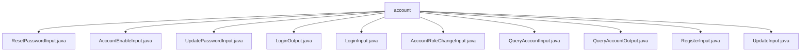

# 基础信息

|      |      |
|------|------|
| 名称 | account |
| 编码语言 | .java |
| 代码路径 | WeFe/manager/manager-service/src/main/java/com/welab/wefe/manager/service/dto/account |
| 包名 | docs.manager.manager-service.src.main.java.com.welab.wefe.manager.service.dto.account |
| 概述说明 | ResetPasswordInput处理重置密码输入，含accountId和operatorPassword。AccountEnableInput处理账户启用状态，含accountId和enable字段。UpdatePasswordInput处理密码更新，含旧新密码字段。LoginOutput封装登录返回数据，含账户信息和权限标识。LoginInput处理登录输入，含手机号密码验证码等。AccountRoleChangeInput处理角色变更，含accountId和adminRole。QueryAccountInput封装查询参数，含电话昵称等。QueryAccountOutput返回账户信息，含掩码处理敏感数据。RegisterInput处理注册，含手机号密码等验证。UpdateInput处理更新，含昵称和邮箱字段。 |

# 说明

## 概述  
该模块核心职责是管理账户生命周期操作，包括注册、登录、密码重置、角色变更等，类似账户控制中心。接口规范统一继承AbstractApiInput/Output基类，必填字段通过@Check注解校验。关键数据结构包含AccountId、密码字段、角色标识等，例如ResetPasswordInput处理密码重置，LoginOutput封装登录响应。外部依赖包括验证码服务、Masker工具等。实现案例丰富，例如RegisterInput严格校验手机号格式，QueryAccountOutput对敏感信息掩码处理。

## 主要业务场景  
模块支持完整账户管理流程：注册（RegisterInput）→登录（LoginInput）→信息更新（UpdateInput）→权限变更（AccountRoleChangeInput）。交互模式类似CRUD操作，例如QueryAccountInput分页查询账户，AccountEnableInput控制账户状态。典型应用包括管理员通过AccountRoleChangeInput调整权限，用户通过UpdatePasswordInput修改密码。API类型涵盖输入输出DTO，集成案例如LoginOutput返回令牌和角色信息，支持前端权限控制。

### 包内部结构视图

该流程图展示了manager-service模块中account目录下的DTO类结构。所有11个输入输出类都直接隶属于account节点，包括密码重置(ResetPasswordInput)、账户启用(AccountEnableInput)、密码更新(UpdatePasswordInput)等核心功能相关的数据传输对象，清晰地反映了账户管理模块的数据交互结构。

# 文件列表

| 名称   | 类型  | 说明 |
|-------|------|-------------|
| [ResetPasswordInput.java](ResetPasswordInput.md) | file | 重置密码输入类，包含用户ID和操作者密码两个必填字段，提供getter和setter方法。 |
| [AccountEnableInput.java](AccountEnableInput.md) | file | AccountEnableInput类继承AbstractApiInput，包含必填字段accountId和enable，提供getter和setter方法。 |
| [UpdatePasswordInput.java](UpdatePasswordInput.md) | file | 更新密码输入类，包含必须的旧密码和新密码字段及其getter和setter方法。 |
| [LoginOutput.java](LoginOutput.md) | file | LoginOutput类继承AbstractApiOutput，包含账号ID、令牌、电话、昵称、邮箱、管理员角色标识及需更新密码标识等字段，提供构造方法和getter/setter。 |
| [LoginInput.java](LoginInput.md) | file | 登录输入类，包含必填的手机号、密码、验证码标识和验证码字段，提供各属性的getter和setter方法。 |
| [AccountRoleChangeInput.java](AccountRoleChangeInput.md) | file | 定义账户角色变更输入类，包含必填账户ID和管理员角色标识，提供getter和setter方法。 |
| [QueryAccountInput.java](QueryAccountInput.md) | file | QueryAccountInput类继承PageInput，包含电话号码、昵称、审核状态和管理员角色字段及其getter和setter方法。 |
| [QueryAccountOutput.java](QueryAccountOutput.md) | file | QueryAccountOutput类包含账户信息，如ID、手机号、昵称、邮箱、管理员角色、审核状态和意见、可用性、注销状态及最后活动时间。提供getter/setter方法，部分敏感信息通过掩码处理。 |
| [RegisterInput.java](RegisterInput.md) | file | 注册输入类，包含手机号、昵称、密码、邮箱、验证码标识和验证码字段，进行格式校验和验证码验证。 |
| [UpdateInput.java](UpdateInput.md) | file | UpdateInput类继承AbstractApiInput，包含昵称和邮箱字段，邮箱有格式校验，提供getter和setter方法。 |

