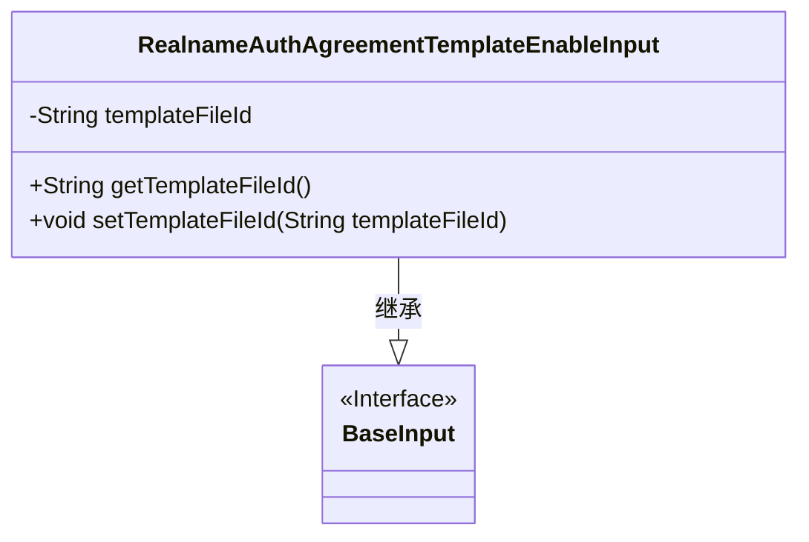
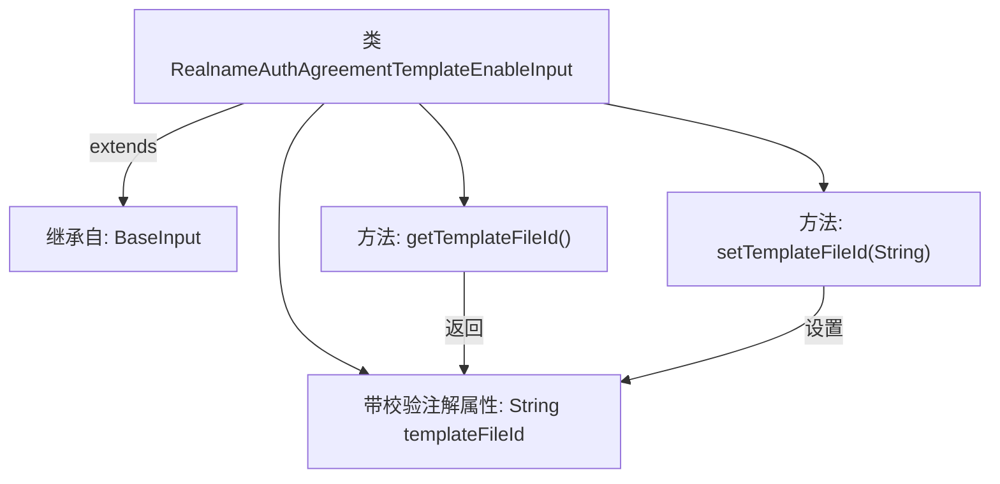

# 基础信息

|      |      |
|------|------|
| 名称 | RealnameAuthAgreementTemplateEnableInput |
| 编码语言 | .java |
| 代码路径 | WeFe/manager/manager-service/src/main/java/com/welab/wefe/manager/service/dto/agreement/RealnameAuthAgreementTemplateEnableInput.java |
| 包名 | com.welab.wefe.manager.service.dto.agreement |
| 依赖项 | ['com.welab.wefe.common.fieldvalidate.annotation.Check', 'com.welab.wefe.manager.service.dto.base.BaseInput'] |
| 概述说明 | Java类RealnameAuthAgreementTemplateEnableInput继承BaseInput，包含必填字段templateFileId及其getter/setter方法。 |

# 说明

该内容定义了一个名为RealnameAuthAgreementTemplateEnableInput的Java类，继承自BaseInput类。该类包含一个私有字符串属性templateFileId，并通过注解@Check标记该属性为必填项。提供了获取和设置该属性的公共方法getTemplateFileId和setTemplateFileId。整体结构用于处理实名认证协议模板启用时的输入数据。

# 类列表 Class Summary

| 名称   | 类型  | 说明 |
|-------|------|-------------|
| RealnameAuthAgreementTemplateEnableInput | class | 定义实名认证协议模板启用输入类，包含必填模板文件ID及其getter/setter方法。 |

## 类 RealnameAuthAgreementTemplateEnableInput

|      |      |
|------|------|
| 访问范围 | public |
| 类型 | class |
| 名称 | RealnameAuthAgreementTemplateEnableInput |
| 说明 | 定义实名认证协议模板启用输入类，包含必填模板文件ID及其getter/setter方法。 |

### UML类图

这段类图展示了RealnameAuthAgreementTemplateEnableInput类继承自BaseInput接口的结构。该类包含一个私有字符串属性templateFileId，以及对应的getter和setter方法。通过@Check注解标记该字段为必填项，体现了数据验证的设计意图。类图清晰地反映了实体与接口的层级关系，符合Java Bean的典型设计模式。

### 内部方法调用关系图

这段代码描述了一个实名认证协议模板启用输入类，继承自基础输入类BaseInput。核心是包含一个必须校验的模板文件ID属性，通过getter/setter方法进行访问控制。流程图清晰展示了类继承关系、属性校验注解以及方法对属性的操作路径，整体结构简洁但完整覆盖了数据封装的核心要素。

### 字段列表 Field List

| 名称  | 类型  | 说明 |
|-------|-------|------|
| templateFileId | String | 必填字段：templateFileId |

### 方法列表

| 名称  | 类型  | 说明 |
|-------|-------|------|
| getTemplateFileId | String | 获取模板文件ID的方法，返回字符串类型的templateFileId。 |
| setTemplateFileId | void | 设置模板文件ID的方法，将输入参数赋值给类的成员变量templateFileId。 |

