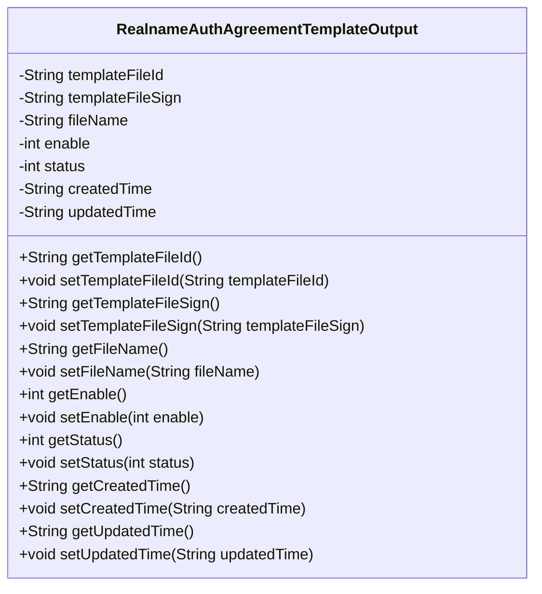

# 基础信息

|      |      |
|------|------|
| 名称 | RealnameAuthAgreementTemplateOutput |
| 编码语言 | .java |
| 代码路径 | WeFe/manager/manager-service/src/main/java/com/welab/wefe/manager/service/dto/agreement/RealnameAuthAgreementTemplateOutput.java |
| 包名 | com.welab.wefe.manager.service.dto.agreement |
| 依赖项 | [] |
| 概述说明 | 实名认证协议模板输出类，包含文件ID、签名、名称、启用状态、状态及创建更新时间等字段及其getter/setter方法。 |

# 说明

该Java类RealnameAuthAgreementTemplateOutput定义了实名认证协议模板的输出数据结构，包含模板文件ID、文件签名、文件名、启用状态、状态标志、创建时间和更新时间等字段，并提供对应的getter和setter方法用于访问和修改这些属性。

# 类列表 Class Summary

| 名称   | 类型  | 说明 |
|-------|------|-------------|
| RealnameAuthAgreementTemplateOutput | class | 实名认证协议模板类，包含文件ID、签名、名称、启用状态、状态码及创建更新时间，提供各字段的getter和setter方法。 |

## 类 RealnameAuthAgreementTemplateOutput

|      |      |
|------|------|
| 访问范围 | public |
| 类型 | class |
| 名称 | RealnameAuthAgreementTemplateOutput |
| 说明 | 实名认证协议模板类，包含文件ID、签名、名称、启用状态、状态码及创建更新时间，提供各字段的getter和setter方法。 |

### UML类图

这段代码定义了一个名为RealnameAuthAgreementTemplateOutput的类，主要用于存储和管理实名认证协议模板的相关信息。该类包含7个私有字段，分别表示模板文件ID、文件签名、文件名、启用状态、状态码、创建时间和更新时间，并为每个字段提供了对应的getter和setter方法。这是一个典型的数据传输对象(DTO)，用于封装和传输协议模板的元数据信息，适用于实名认证系统中协议模板的管理场景。

### 内部方法调用关系图

```mermaid
graph TD
    A["类RealnameAuthAgreementTemplateOutput"]
    B["属性: String templateFileId"]
    C["属性: String templateFileSign"]
    D["属性: String fileName"]
    E["属性: int enable"]
    F["属性: int status"]
    G["属性: String createdTime"]
    H["属性: String updatedTime"]
    I["方法: getTemplateFileId()"]
    J["方法: setTemplateFileId(String)"]
    K["方法: getTemplateFileSign()"]
    L["方法: setTemplateFileSign(String)"]
    M["方法: getFileName()"]
    N["方法: setFileName(String)"]
    O["方法: getEnable()"]
    P["方法: setEnable(int)"]
    Q["方法: getStatus()"]
    R["方法: setStatus(int)"]
    S["方法: getCreatedTime()"]
    T["方法: setCreatedTime(String)"]
    U["方法: getUpdatedTime()"]
    V["方法: setUpdatedTime(String)"]

    A --> B
    A --> C
    A --> D
    A --> E
    A --> F
    A --> G
    A --> H
    A --> I
    A --> J
    A --> K
    A --> L
    A --> M
    A --> N
    A --> O
    A --> P
    A --> Q
    A --> R
    A --> S
    A --> T
    A --> U
    A --> V
```

这段代码定义了一个名为RealnameAuthAgreementTemplateOutput的类，主要用于存储和管理实名认证协议模板的相关信息。类中包含8个私有属性，分别表示模板文件ID、模板文件签名、文件名、启用状态、状态码、创建时间和更新时间。同时为每个属性提供了对应的getter和setter方法，用于获取和设置这些属性的值。这是一个典型的数据传输对象（DTO）设计，用于封装和传递实名认证协议模板的相关数据。

### 字段列表 Field List

| 名称  | 类型  | 说明 |
|-------|-------|------|
| templateFileSign | String | 私有字符串变量templateFileSign，用于存储模板文件签名。 |
| createdTime | String | 定义字符串类型变量createdTime，用于记录创建时间。 |
| templateFileId | String | 私有字符串变量templateFileId，用于存储模板文件ID。 |
| status | int | 私有整型变量status，用于存储状态信息。 |
| enable | int | 私有整型变量enable，用于控制启用状态。 |
| fileName | String | 私有字符串变量fileName，用于存储文件名。 |
| updatedTime | String | 私有字符串变量，记录更新时间。 |

### 方法列表

| 名称  | 类型  | 说明 |
|-------|-------|------|
| getCreatedTime | String | 获取创建时间的方法，返回字符串类型的createdTime变量值。 |
| getEnable | int | 方法getEnable返回整型变量enable的值。 |
| setCreatedTime | void | 这是一个Java方法，用于设置对象的创建时间属性。方法接收字符串参数createdTime，并将其赋值给对象的同名成员变量。 |
| setEnable | void | 设置启用状态的函数，参数为整型enable，赋值给成员变量enable。 |
| getFileName | String | 获取文件名的公共方法，返回字符串类型的fileName变量值。 |
| getUpdatedTime | String | 获取updatedTime值的公共方法。 |
| setStatus | void | 这是一个Java方法，用于设置对象的status属性值。方法接受一个整数参数status，并将其赋值给当前对象的status字段。 |
| getTemplateFileId | String | 获取模板文件ID的方法，返回值为templateFileId。 |
| setTemplateFileId | void | 设置模板文件ID的方法，将传入的templateFileId赋值给当前对象的同名属性。 |
| setFileName | void | 设置文件名的方法，将输入参数fileName赋值给类的成员变量fileName。 |
| getStatus | int | 获取当前状态值的方法，返回整型变量status。 |
| getTemplateFileSign | String | 这是一个Java方法，返回字符串类型的templateFileSign成员变量值。 |
| setTemplateFileSign | void | 设置模板文件签名的公共方法，参数为字符串类型。 |
| setUpdatedTime | void | 设置更新时间的方法，将输入字符串赋值给对象的updatedTime属性。 |

