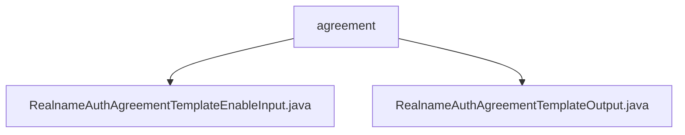

# 基础信息

|      |      |
|------|------|
| 名称 | agreement |
| 编码语言 | .java |
| 代码路径 | WeFe/manager/manager-service/src/main/java/com/welab/wefe/manager/service/dto/agreement |
| 包名 | docs.manager.manager-service.src.main.java.com.welab.wefe.manager.service.dto.agreement |
| 概述说明 | RealnameAuthAgreementTemplateEnableInput类继承BaseInput，含必填属性templateFileId及对应方法。RealnameAuthAgreementTemplateOutput类包含模板ID、签名、状态等字段及访问方法。 |

# 说明

## 概述  
该模块核心职责是处理实名认证协议模板的启用与输出数据管理，包含输入参数校验和输出数据结构封装。接口规范包括必填字段校验（例如@Check标记templateFileId）和标准Getter/Setter方法。关键数据结构涉及模板文件ID、签名、状态标志等元信息。外部依赖仅为Java基础注解库。例如RealnameAuthAgreementTemplateEnableInput实现输入校验，RealnameAuthAgreementTemplateOutput封装七种模板属性。

## 主要业务场景  
业务流程围绕协议模板生命周期管理，类似配置中心模式。交互模式采用标准DTO对象传输，例如通过templateFileID启用指定模板。功能完整性体现在覆盖模板状态（启用/禁用）、元数据（签名/时间戳）等管理维度。典型应用包括控制台操作触发模板状态变更。API类型为纯Java对象交互，例如输入校验与输出数据解耦设计。

### 包内部结构视图

该流程图展示了agreement目录下的两个Java文件：RealnameAuthAgreementTemplateEnableInput.java和RealnameAuthAgreementTemplateOutput.java。这两个文件都直接隶属于agreement目录，没有更深层次的嵌套结构。图中清晰地呈现了agreement作为父节点与两个模板类文件之间的层级关系，符合给定的路径信息要求。

# 文件列表

| 名称   | 类型  | 说明 |
|-------|------|-------------|
| [RealnameAuthAgreementTemplateEnableInput.java](RealnameAuthAgreementTemplateEnableInput.md) | file | Java类RealnameAuthAgreementTemplateEnableInput继承BaseInput，包含必填字段templateFileId及其getter/setter方法。 |
| [RealnameAuthAgreementTemplateOutput.java](RealnameAuthAgreementTemplateOutput.md) | file | 实名认证协议模板输出类，包含文件ID、签名、名称、启用状态、状态及创建更新时间等字段及其getter/setter方法。 |

