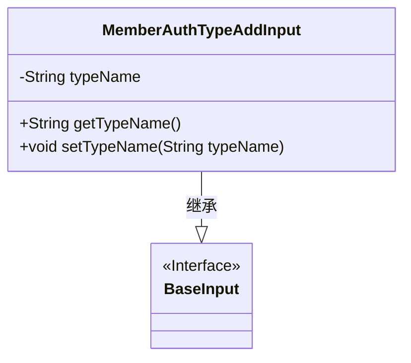
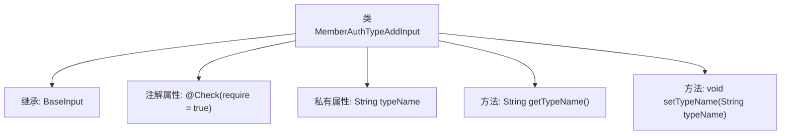

# 基础信息

|      |      |
|------|------|
| 名称 | MemberAuthTypeAddInput |
| 编码语言 | .java |
| 代码路径 | WeFe/manager/manager-service/src/main/java/com/welab/wefe/manager/service/dto/authtype/MemberAuthTypeAddInput.java |
| 包名 | com.welab.wefe.manager.service.dto.authtype |
| 依赖项 | ['com.welab.wefe.common.data.mongodb.entity.union.ext.MemberAuthTypeExtJSON', 'com.welab.wefe.common.fieldvalidate.annotation.Check', 'com.welab.wefe.manager.service.dto.base.BaseInput'] |
| 概述说明 | MemberAuthTypeAddInput类继承BaseInput，包含必填字段typeName及其getter/setter方法。 |

# 说明

这是一个名为MemberAuthTypeAddInput的Java类，继承自BaseInput类。该类包含一个私有字符串字段typeName，该字段通过@Check注解标记为必填项。提供了getTypeName和setTypeName两个公共方法用于获取和设置typeName字段的值。这个类主要用于处理成员认证类型添加的输入数据。

# 类列表 Class Summary

| 名称   | 类型  | 说明 |
|-------|------|-------------|
| MemberAuthTypeAddInput | class | 成员认证类型添加输入类，包含必填字段typeName及其getter/setter方法。 |

## 类 MemberAuthTypeAddInput

|      |      |
|------|------|
| 访问范围 | public |
| 类型 | class |
| 名称 | MemberAuthTypeAddInput |
| 说明 | 成员认证类型添加输入类，包含必填字段typeName及其getter/setter方法。 |

### UML类图

这段类图展示了MemberAuthTypeAddInput类继承自BaseInput接口的结构。MemberAuthTypeAddInput包含一个私有字段typeName和对应的getter/setter方法，通过@Check注解标记该字段为必填项。BaseInput作为接口（用<<Interface>>标注）是MemberAuthTypeAddInput的父类，体现了输入参数的基类设计模式。整个结构清晰地呈现了类之间的继承关系和成员属性封装特点。

### 内部方法调用关系图

该流程图展示了MemberAuthTypeAddInput类的结构，它是一个继承自BaseInput的Java类。类中包含一个带有@Check注解的私有属性typeName，以及对应的getter和setter方法。注解表明该属性是必填项，流程图清晰地呈现了类的继承关系和成员结构，突出了数据校验和封装特性，符合JavaBean规范的设计模式。

### 字段列表 Field List

| 名称  | 类型  | 说明 |
|-------|-------|------|
| typeName | String | 代码片段定义了一个私有字符串变量typeName，并使用了@Check注解标记该字段为必填项。 |

### 方法列表

| 名称  | 类型  | 说明 |
|-------|-------|------|
| getTypeName | String | 方法返回字符串类型名称。 |
| setTypeName | void | 这是一个Java方法，用于设置类成员变量typeName的值。方法接收一个字符串参数typeName，并将其赋值给当前对象的typeName属性。 |

