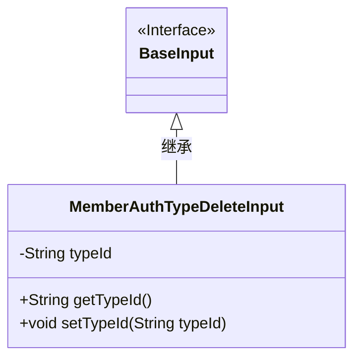
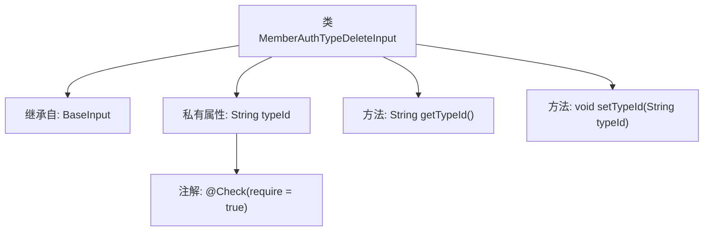

# 基础信息

|      |      |
|------|------|
| 名称 | MemberAuthTypeDeleteInput |
| 编码语言 | .java |
| 代码路径 | WeFe/manager/manager-service/src/main/java/com/welab/wefe/manager/service/dto/authtype/MemberAuthTypeDeleteInput.java |
| 包名 | com.welab.wefe.manager.service.dto.authtype |
| 依赖项 | ['com.welab.wefe.common.fieldvalidate.annotation.Check', 'com.welab.wefe.manager.service.dto.base.BaseInput'] |
| 概述说明 | 类MemberAuthTypeDeleteInput继承BaseInput，包含必填字段typeId及其getter/setter方法。 |

# 说明

该内容描述了一个名为MemberAuthTypeDeleteInput的Java类，继承自BaseInput类。该类包含一个私有字符串属性typeId，并通过注解@Check标记为必填字段。提供了getTypeId和setTypeId方法用于获取和设置该属性的值。这个类主要用于处理成员认证类型删除操作的输入数据。

# 类列表 Class Summary

| 名称   | 类型  | 说明 |
|-------|------|-------------|
| MemberAuthTypeDeleteInput | class | MemberAuthTypeDeleteInput类继承BaseInput，包含必填字段typeId及其getter/setter方法。 |

## 类 MemberAuthTypeDeleteInput

|      |      |
|------|------|
| 访问范围 | public |
| 类型 | class |
| 名称 | MemberAuthTypeDeleteInput |
| 说明 | MemberAuthTypeDeleteInput类继承BaseInput，包含必填字段typeId及其getter/setter方法。 |

### UML类图

这段类图展示了`MemberAuthTypeDeleteInput`类继承自`BaseInput`接口的结构。`MemberAuthTypeDeleteInput`包含私有字段`typeId`及其公有访问方法，并通过`@Check`注解实现参数校验。图中清晰体现了接口与实现类的层级关系，符合Java类继承规范，字段封装性良好，注解标注了关键约束条件。

### 内部方法调用关系图

该流程图描述了`MemberAuthTypeDeleteInput`类的结构，该类继承自`BaseInput`，包含一个带有`@Check`注解的私有属性`typeId`，以及对应的getter和setter方法。类图展示了属性与方法的层级关系，并明确了注解与属性的关联性，整体结构清晰体现了Java类的封装特性。

### 字段列表 Field List

| 名称  | 类型  | 说明 |
|-------|-------|------|
| typeId | String | 必填字段typeId，类型为String。 |

### 方法列表

| 名称  | 类型  | 说明 |
|-------|-------|------|
| getTypeId | String | 获取typeId的公共方法，返回字符串类型的typeId值。 |
| setTypeId | void | 这是一个Java方法，用于设置对象的typeId属性值。方法接收一个字符串参数typeId，并将其赋值给当前对象的同名成员变量。 |

