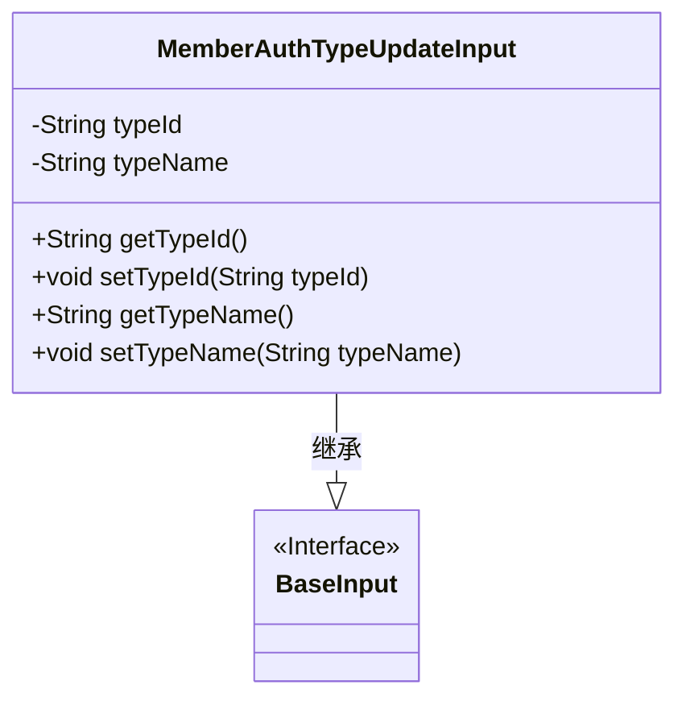
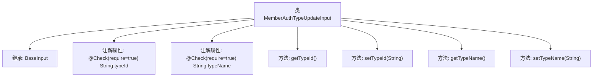

# 基础信息

|      |      |
|------|------|
| 名称 | MemberAuthTypeUpdateInput |
| 编码语言 | .java |
| 代码路径 | WeFe/manager/manager-service/src/main/java/com/welab/wefe/manager/service/dto/authtype/MemberAuthTypeUpdateInput.java |
| 包名 | com.welab.wefe.manager.service.dto.authtype |
| 依赖项 | ['com.welab.wefe.common.fieldvalidate.annotation.Check', 'com.welab.wefe.manager.service.dto.base.BaseInput'] |
| 概述说明 | MemberAuthTypeUpdateInput类继承BaseInput，包含必填字段typeId和typeName及其getter/setter方法。 |

# 说明

该代码定义了一个名为MemberAuthTypeUpdateInput的类，继承自BaseInput类。该类包含两个必填字段：typeId和typeName，分别用于存储类型ID和类型名称。每个字段都配有getter和setter方法，用于获取和设置字段值。类中的字段通过@Check注解标记为必填项。

# 类列表 Class Summary

| 名称   | 类型  | 说明 |
|-------|------|-------------|
| MemberAuthTypeUpdateInput | class | MemberAuthTypeUpdateInput类继承BaseInput，包含必填字段typeId和typeName及其getter和setter方法。 |

## 类 MemberAuthTypeUpdateInput

|      |      |
|------|------|
| 访问范围 | public |
| 类型 | class |
| 名称 | MemberAuthTypeUpdateInput |
| 说明 | MemberAuthTypeUpdateInput类继承BaseInput，包含必填字段typeId和typeName及其getter和setter方法。 |

### UML类图

类图描述：MemberAuthTypeUpdateInput类继承自BaseInput接口，包含两个私有属性typeId和typeName，分别提供对应的getter和setter方法。该类用于处理成员认证类型更新的输入数据，通过注解@Check标记必填字段，确保数据完整性。BaseInput作为基础输入接口，可能定义了通用的输入验证规范。

### 内部方法调用关系图

该流程图展示了MemberAuthTypeUpdateInput类的结构，它是一个继承自BaseInput的输入参数类。包含两个带校验注解的必填字段typeId和typeName，以及对应的getter和setter方法。类设计用于封装身份认证类型更新操作的输入参数，通过注解实现基础校验功能，符合JavaBean规范的数据封装模式。

### 字段列表 Field List

| 名称  | 类型  | 说明 |
|-------|-------|------|
| typeName | String | 必填字段 typeName 的类型检查。 |
| typeId | String | 必填字段typeId，类型为String。 |

### 方法列表

| 名称  | 类型  | 说明 |
|-------|-------|------|
| getTypeName | String | 方法返回类型名称字符串。 |
| getTypeId | String | 获取类型ID的方法，返回字符串typeId。 |
| setTypeId | void | 设置类型ID的方法，将参数typeId赋值给当前对象的typeId属性。 |
| setTypeName | void | 这是一个Java方法，用于设置类成员变量typeName的值。方法接收一个字符串参数typeName，并将其赋值给当前对象的同名属性。 |

