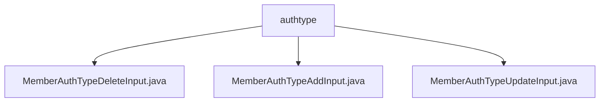

# 基础信息

|      |      |
|------|------|
| 名称 | authtype |
| 编码语言 | .java |
| 代码路径 | WeFe/manager/manager-service/src/main/java/com/welab/wefe/manager/service/dto/authtype |
| 包名 | docs.manager.manager-service.src.main.java.com.welab.wefe.manager.service.dto.authtype |
| 概述说明 | MemberAuthTypeDeleteInput类继承BaseInput，含必填typeId字段及getter/setter。MemberAuthTypeAddInput类继承BaseInput，含必填typeName字段及getter/setter。MemberAuthTypeUpdateInput类继承BaseInput，含必填typeId和typeName字段及getter/setter。 |

# 说明

## 概述  
该模块核心职责是处理成员认证类型的增删改操作，通过DTO类封装输入数据并验证必填字段。接口规范统一采用继承BaseInput的Java类，包含@Check注解标记的必填字段及配套getter/setter方法。关键数据结构为typeId（标识类型）和typeName（类型名称）。无外部依赖项。例如MemberAuthTypeAddInput处理添加操作，MemberAuthTypeUpdateInput同时需要typeId和typeName。  

## 主要业务场景  
模块支持成员认证类型的全生命周期管理，类似CRUD模式。业务流程包括：添加（需typeName）、删除（需typeId）、更新（需typeId+typeName）。交互模式为通过标准DTO接收参数并校验必填项。例如删除操作通过MemberAuthTypeDeleteInput的typeId定位目标，更新操作通过MemberAuthTypeUpdateInput同步修改ID和名称。

### 包内部结构视图

该流程图展示了WeFe项目中manager-service模块下authtype目录的层级结构，包含三个DTO类文件：MemberAuthTypeDeleteInput、MemberAuthTypeAddInput和MemberAuthTypeUpdateInput，这些文件均直接隶属于authtype目录，用于处理成员认证类型的增删改操作。

# 文件列表

| 名称   | 类型  | 说明 |
|-------|------|-------------|
| [MemberAuthTypeDeleteInput.java](MemberAuthTypeDeleteInput.md) | file | 类MemberAuthTypeDeleteInput继承BaseInput，包含必填字段typeId及其getter/setter方法。 |
| [MemberAuthTypeAddInput.java](MemberAuthTypeAddInput.md) | file | MemberAuthTypeAddInput类继承BaseInput，包含必填字段typeName及其getter/setter方法。 |
| [MemberAuthTypeUpdateInput.java](MemberAuthTypeUpdateInput.md) | file | MemberAuthTypeUpdateInput类继承BaseInput，包含必填字段typeId和typeName及其getter/setter方法。 |

