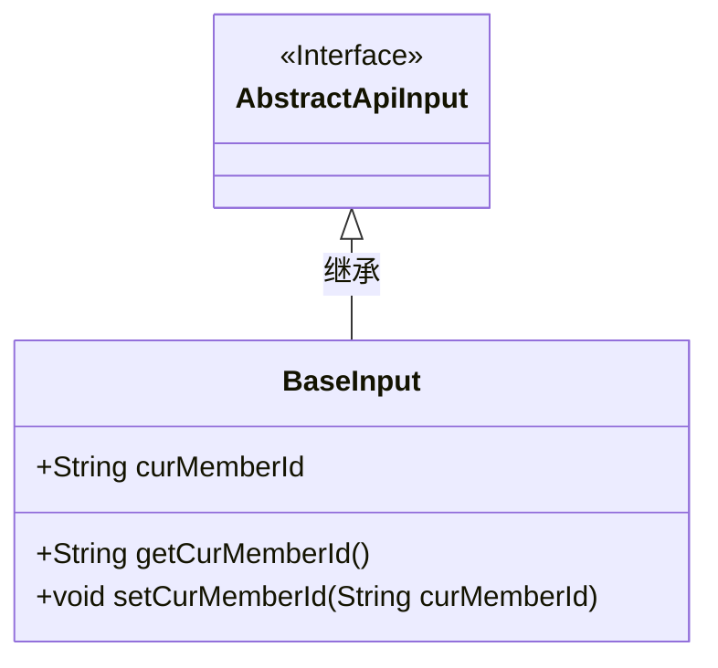
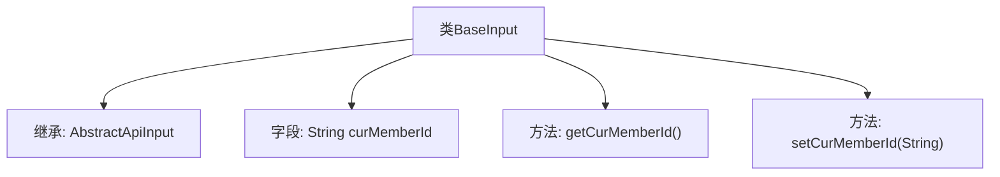

# 基础信息

|      |      |
|------|------|
| 名称 | BaseInput |
| 编码语言 | .java |
| 代码路径 | WeFe/manager/manager-service/src/main/java/com/welab/wefe/manager/service/dto/base/BaseInput.java |
| 包名 | com.welab.wefe.manager.service.dto.base |
| 依赖项 | ['com.welab.wefe.common.web.dto.AbstractApiInput'] |
| 概述说明 | BaseInput类继承AbstractApiInput，包含必填字段curMemberId及其getter和setter方法。 |

# 说明

BaseInput类继承自AbstractApiInput，包含一个字符串类型的curMemberId成员变量。该类提供了getCurMemberId和setCurMemberId方法用于获取和设置该变量的值。注释显示该变量可能需要非空校验。

# 类列表 Class Summary

| 名称   | 类型  | 说明 |
|-------|------|-------------|
| BaseInput | class | BaseInput类继承AbstractApiInput，包含必填字段curMemberId及其getter和setter方法。 |

## 类 BaseInput

|      |      |
|------|------|
| 访问范围 | public |
| 类型 | class |
| 名称 | BaseInput |
| 说明 | BaseInput类继承AbstractApiInput，包含必填字段curMemberId及其getter和setter方法。 |

### UML类图

这段类图展示了BaseInput类继承自AbstractApiInput接口的结构。BaseInput包含一个公有字符串字段curMemberId，以及对应的getter和setter方法。通过继承关系，BaseInput实现了AbstractApiInput接口定义的规范，用于处理基础输入数据，其中curMemberId字段可能用于存储当前成员标识信息。

### 内部方法调用关系图

该流程图展示了BaseInput类的结构，它继承自AbstractApiInput类，包含一个字符串类型的curMemberId字段，以及对应的getter和setter方法。类图清晰地呈现了继承关系和成员方法，其中getCurMemberId()用于获取当前成员ID，setCurMemberId(String)用于设置该值。这种结构是典型的Java Bean模式，适用于数据封装和属性访问控制。

### 字段列表 Field List

| 名称  | 类型  | 说明 |
|-------|-------|------|
| curMemberId | String | 声明一个公共字符串变量curMemberId，用于存储当前成员ID。 |

### 方法列表

| 名称  | 类型  | 说明 |
|-------|-------|------|
| getCurMemberId | String | 获取当前成员ID的方法，返回成员ID字符串。 |
| setCurMemberId | void | 设置当前成员ID的方法，参数为字符串类型。 |

