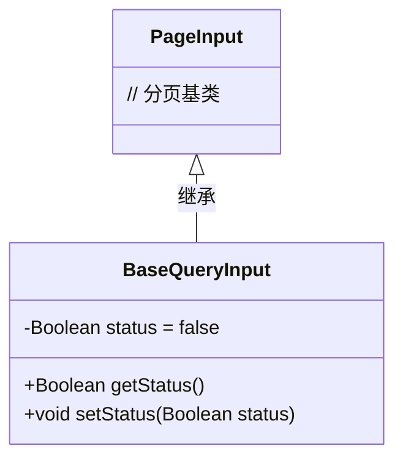
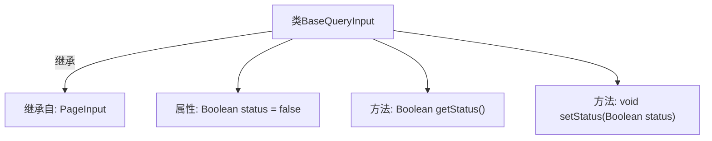

# 基础信息

|      |      |
|------|------|
| 名称 | BaseQueryInput |
| 编码语言 | .java |
| 代码路径 | WeFe/manager/manager-service/src/main/java/com/welab/wefe/manager/service/dto/base/BaseQueryInput.java |
| 包名 | com.welab.wefe.manager.service.dto.base |
| 依赖项 | [] |
| 概述说明 | BaseQueryInput继承PageInput，包含布尔类型status属性及其getter和setter方法。 |

# 说明

BaseQueryInput类继承自PageInput类，包含一个私有布尔类型属性status，默认值为false。提供了获取status值的getStatus方法和设置status值的setStatus方法。

# 类列表 Class Summary

| 名称   | 类型  | 说明 |
|-------|------|-------------|
| BaseQueryInput | class | BaseQueryInput继承PageInput，包含布尔类型status属性及其getter和setter方法。 |

## 类 BaseQueryInput

|      |      |
|------|------|
| 访问范围 | public |
| 类型 | class |
| 名称 | BaseQueryInput |
| 说明 | BaseQueryInput继承PageInput，包含布尔类型status属性及其getter和setter方法。 |

### UML类图

这段类图展示了BaseQueryInput继承自PageInput的关系。BaseQueryInput作为子类，新增了一个私有布尔类型字段status（默认值为false），并提供了对应的公有getter和setter方法。PageInput作为父类，在此图中仅表示基类存在，未展开其具体成员。该设计实现了分页查询基础功能的扩展，允许通过status字段附加状态过滤条件。

### 内部方法调用关系图

该流程图展示了BaseQueryInput类的结构，它继承自PageInput类，包含一个Boolean类型的status属性和两个方法：getStatus()用于获取status值，setStatus()用于设置status值。属性默认初始化为false，体现了类的基本数据封装特性。

### 字段列表 Field List

| 名称  | 类型  | 说明 |
|-------|-------|------|
| status = false | Boolean | 私有布尔变量status初始值为false。 |

### 方法列表

| 名称  | 类型  | 说明 |
|-------|-------|------|
| getStatus | Boolean | 这是一个Java方法，返回布尔类型的status变量值。 |
| setStatus | void | 设置布尔状态值的方法，将输入参数赋值给对象的状态属性。 |

