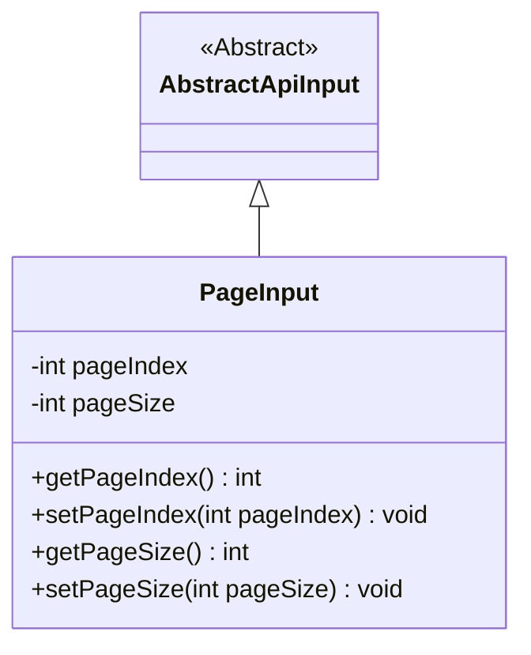
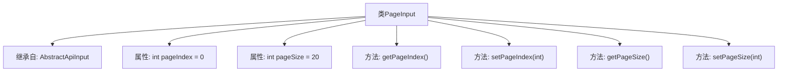

# 基础信息

|      |      |
|------|------|
| 名称 | PageInput |
| 编码语言 | .java |
| 代码路径 | WeFe/manager/manager-service/src/main/java/com/welab/wefe/manager/service/dto/base/PageInput.java |
| 包名 | com.welab.wefe.manager.service.dto.base |
| 依赖项 | ['com.welab.wefe.common.web.dto.AbstractApiInput'] |
| 概述说明 | 分页输入类，包含页码和页大小属性及对应getter/setter方法。 |

# 说明

PageInput类继承自AbstractApiInput，用于封装分页查询参数。该类包含两个私有整型字段：pageIndex表示当前页码，默认值为0；pageSize表示每页记录数，默认值为20。提供了getPageIndex和setPageIndex方法用于获取和设置页码，getPageSize和setPageSize方法用于获取和设置每页记录数。

# 类列表 Class Summary

| 名称   | 类型  | 说明 |
|-------|------|-------------|
| PageInput | class | 分页输入类，包含页码和页大小属性及对应getter/setter方法。 |

## 类 PageInput

|      |      |
|------|------|
| 访问范围 | public |
| 类型 | class |
| 名称 | PageInput |
| 说明 | 分页输入类，包含页码和页大小属性及对应getter/setter方法。 |

### UML类图

这段代码展示了一个分页输入类`PageInput`继承自抽象类`AbstractApiInput`的结构。`PageInput`包含两个私有字段`pageIndex`和`pageSize`，分别表示页码和每页大小，默认值为0和20。类中提供了四个公有方法用于获取和设置这两个字段的值。类图清晰地体现了继承关系，展示了`PageInput`作为`AbstractApiInput`子类的层级结构，以及其封装的分页相关属性和访问方法。

### 内部方法调用关系图

这段代码定义了一个`PageInput`类，继承自`AbstractApiInput`，用于处理分页参数。类中包含两个私有属性`pageIndex`和`pageSize`，分别表示当前页码和每页大小，默认值为0和20。提供了四个公共方法用于获取和设置这两个属性的值。该类的设计简洁，主要用于封装分页查询时的输入参数。

### 字段列表 Field List

| 名称  | 类型  | 说明 |
|-------|-------|------|
| pageIndex = 0 | int | 私有整型变量pageIndex初始化为0。 |
| pageSize = 20 | int | 定义私有整型变量pageSize，初始值为20。 |

### 方法列表

| 名称  | 类型  | 说明 |
|-------|-------|------|
| setPageIndex | void | 设置当前页码为指定值。 |
| getPageSize | int | 获取当前页面大小的方法，返回整型值pageSize。 |
| setPageSize | void | 设置每页显示数量的方法，参数为pageSize。 |
| getPageIndex | int | 获取当前页码值的方法，返回整型变量pageIndex。 |

