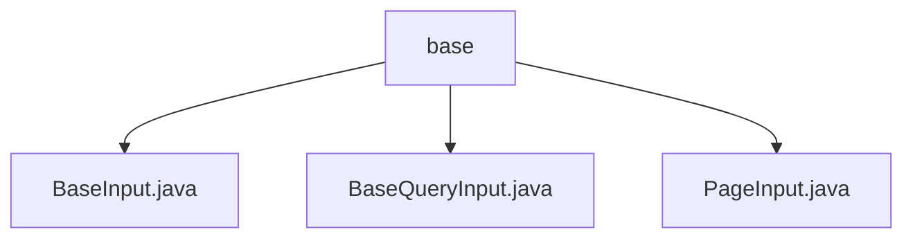

# 基础信息

|      |      |
|------|------|
| 名称 | base |
| 编码语言 | .java |
| 代码路径 | WeFe/manager/manager-service/src/main/java/com/welab/wefe/manager/service/dto/base |
| 包名 | docs.manager.manager-service.src.main.java.com.welab.wefe.manager.service.dto.base |
| 概述说明 | BaseInput类继承AbstractApiInput，含curMemberId字符串变量，需非空校验。BaseQueryInput继承PageInput，含布尔status变量，默认false。PageInput继承AbstractApiInput，含pageIndex和pageSize整型变量，默认0和20。 |

# 说明

## 概述  
该模块核心职责是提供基础输入参数封装，支持成员ID管理、状态查询和分页控制。接口规范包含三类：BaseInput提供成员ID存取（需非空校验），BaseQueryInput管理布尔状态字段（默认false），PageInput标准化分页参数（默认pageIndex=0/pageSize=20）。关键数据结构包括字符串curMemberId、布尔status及整型pageIndex/pageSize。无外部依赖项。例如PageInput通过继承链实现分页参数默认值托管。

## 主要业务场景  
模块适用于分页查询与成员数据处理的组合场景，类似DTO工厂模式。典型流程为：通过PageInput设置分页参数，BaseQueryInput附加状态过滤条件，BaseInput携带成员身份标识。例如查询某成员的分页数据时，三者可协同构建完整查询参数。所有API均通过Getter/Setter暴露字段，保持POJO规范。

### 包内部结构视图

该流程图展示了WeFe项目中manager-service模块下的base包结构。base包包含三个DTO类：BaseInput.java、BaseQueryInput.java和PageInput.java，它们都是基础输入类的实现。这种结构体现了项目中基础数据传输对象的组织方式，为其他业务模块提供统一的输入规范。

# 文件列表

| 名称   | 类型  | 说明 |
|-------|------|-------------|
| [BaseInput.java](BaseInput.md) | file | BaseInput类继承AbstractApiInput，包含必填字段curMemberId及其getter和setter方法。 |
| [BaseQueryInput.java](BaseQueryInput.md) | file | BaseQueryInput继承PageInput，包含布尔类型status属性及其getter和setter方法。 |
| [PageInput.java](PageInput.md) | file | 分页输入类，包含页码和页大小属性及对应getter/setter方法。 |

