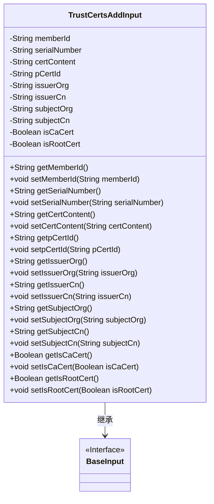
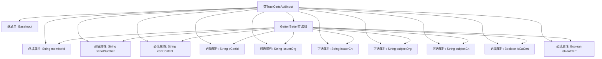

# 基础信息

|      |      |
|------|------|
| 名称 | TrustCertsAddInput |
| 编码语言 | .java |
| 代码路径 | WeFe/manager/manager-service/src/main/java/com/welab/wefe/manager/service/dto/cert/TrustCertsAddInput.java |
| 包名 | com.welab.wefe.manager.service.dto.cert |
| 依赖项 | ['com.welab.wefe.common.fieldvalidate.annotation.Check', 'com.welab.wefe.manager.service.dto.base.BaseInput'] |
| 概述说明 | TrustCertsAddInput类继承BaseInput，包含必填字段memberId、serialNumber、certContent、pCertId、isCaCert、isRootCert，以及可选字段issuerOrg、issuerCn、subjectOrg、subjectCn。 |

# 说明

TrustCertsAddInput类继承自BaseInput，包含多个成员变量和对应的getter/setter方法。必填字段有memberId、serialNumber、certContent、pCertId、isCaCert和isRootCert，通过@Check注解标记。可选字段包括issuerOrg、issuerCn、subjectOrg和subjectCn。该类用于处理信任证书的添加操作，包含证书内容、序列号、颁发者和主题信息等属性。

# 类列表 Class Summary

| 名称   | 类型  | 说明 |
|-------|------|-------------|
| TrustCertsAddInput | class | TrustCertsAddInput类包含成员ID、序列号、证书内容等必填字段，以及颁发者、主题等可选字段，用于添加信任证书。 |

## 类 TrustCertsAddInput

|      |      |
|------|------|
| 访问范围 | public |
| 类型 | class |
| 名称 | TrustCertsAddInput |
| 说明 | TrustCertsAddInput类包含成员ID、序列号、证书内容等必填字段，以及颁发者、主题等可选字段，用于添加信任证书。 |

### UML类图

类图描述：
TrustCertsAddInput类继承自BaseInput接口，主要用于管理信任证书的添加操作。该类包含多个私有字段，包括memberId、serialNumber、certContent等，并通过公有getter和setter方法进行访问和修改。其中部分字段通过@Check注解标记为必填项，如memberId、serialNumber等。该类设计用于处理证书相关的数据输入和验证。

### 内部方法调用关系图

这段代码定义了一个名为TrustCertsAddInput的类，继承自BaseInput类。该类主要用于处理信任证书的添加操作，包含多个属性，其中memberId、serialNumber、certContent、pCertId、isCaCert和isRootCert是必填字段，其他如issuerOrg、issuerCn等为可选字段。每个属性都有对应的getter和setter方法，用于属性的访问和修改。该类结构清晰，通过注解标注必填字段，适合用于表单数据验证和证书管理场景。

### 字段列表 Field List

| 名称  | 类型  | 说明 |
|-------|-------|------|
| issuerOrg | String | 声明一个私有字符串变量issuerOrg，用于存储发行方机构信息。 |
| isCaCert | Boolean | 代码片段定义了一个私有布尔变量isCaCert，并标注了必须检查的注解。 |
| serialNumber | String | 必填字段：serialNumber。 |
| certContent | String | 代码片段定义了一个私有字符串变量certContent，并使用了@Check注解标记该字段为必填项。 |
| subjectCn | String | 私有字符串变量subjectCn，用于存储中文主题信息。 |
| memberId | String | 代码片段定义了一个私有字符串变量memberId，并使用了@Check注解标记该字段为必填项。 |
| pCertId | String | 代码定义了一个私有字符串变量pCertId，并标记为必须校验。 |
| issuerCn | String | 声明一个私有字符串变量issuerCn，用于存储证书颁发者的通用名称。 |
| isRootCert | Boolean | 代码片段定义了一个私有布尔变量isRootCert，并通过@Check注解标记为必填项。 |
| subjectOrg | String | 私有字符串变量subjectOrg，用于存储组织主题信息。 |

### 方法列表

| 名称  | 类型  | 说明 |
|-------|-------|------|
| getCertContent | String | 方法getCertContent返回字符串certContent的值。 |
| getMemberId | String | 这是一个Java方法，返回成员ID字符串。方法名为getMemberId，无参数，直接返回成员变量memberId的值。 |
| getSubjectOrg | String | 获取subjectOrg字符串的方法。 |
| setSerialNumber | void | 这是一个Java方法，用于设置对象的序列号属性。方法接收一个字符串参数serialNumber，并将其赋值给对象的serialNumber字段。 |
| getSerialNumber | String | 获取序列号的方法，返回字符串类型的serialNumber。 |
| getSubjectCn | String | 获取中文主题名称的方法，返回变量subjectCn的值。 |
| getIsCaCert | Boolean | 这是一个Java方法，返回布尔类型的isCaCert值，表示是否为CA证书。 |
| setSubjectCn | void | 这是一个Java方法，用于设置对象的中文主题属性。方法名为setSubjectCn，接受一个String类型参数subjectCn，并将其赋值给对象的subjectCn成员变量。 |
| setSubjectOrg | void | 设置主题组织字符串的方法。 |
| setpCertId | void | 这是一个Java方法，用于设置对象的pCertId属性值。方法接收一个字符串参数pCertId，并将其赋值给当前对象的同名属性。 |
| getpCertId | String | 方法返回字符串类型的pCertId字段值。 |
| getIssuerOrg | String | 获取发行者组织的字符串方法。 |
| setCertContent | void | 设置证书内容的方法，将输入字符串赋值给类成员变量certContent。 |
| setIssuerOrg | void | 设置发证机构的字符串值方法。 |
| setMemberId | void | 设置成员ID的方法，将传入的字符串参数赋值给类的成员变量memberId。 |
| setIssuerCn | void | Java方法：设置证书颁发者通用名（issuerCn）的字符串值。 |
| getIssuerCn | String | 获取颁发者通用名的方法，返回字符串issuerCn。 |
| setIsCaCert | void | 设置证书是否为CA证书的方法，参数为布尔值。 |
| getIsRootCert | Boolean | 获取根证书状态的布尔值方法。 |
| setIsRootCert | void | 设置根证书状态的方法，参数为布尔值。 |

