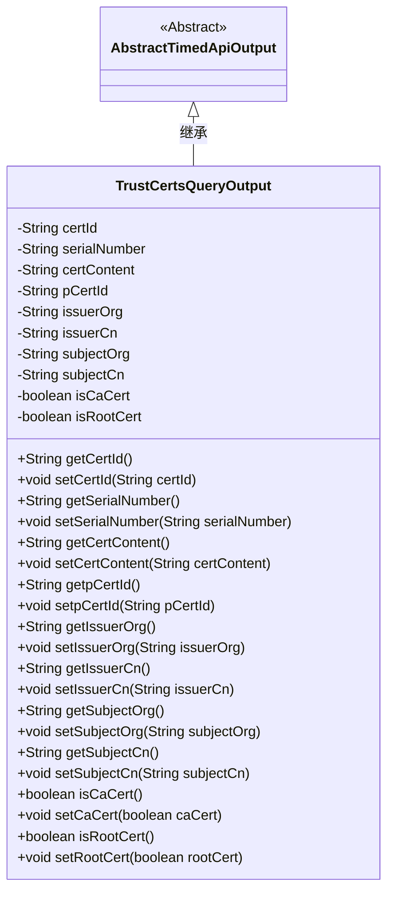

# 基础信息

|      |      |
|------|------|
| 名称 | TrustCertsQueryOutput |
| 编码语言 | .java |
| 代码路径 | WeFe/manager/manager-service/src/main/java/com/welab/wefe/manager/service/dto/cert/TrustCertsQueryOutput.java |
| 包名 | com.welab.wefe.manager.service.dto.cert |
| 依赖项 | ['com.welab.wefe.common.web.dto.AbstractTimedApiOutput'] |
| 概述说明 | TrustCertsQueryOutput类继承AbstractTimedApiOutput，包含证书ID、序列号、内容、父证书ID、颁发者和主题信息及CA/根证书标识。 |

# 说明

TrustCertsQueryOutput类继承自AbstractTimedApiOutput，用于表示信任证书查询的输出结果。该类包含多个字段，包括证书ID、序列号、证书内容、父证书ID、颁发者组织、颁发者通用名称、主体组织和主体通用名称。此外，还包含两个布尔类型字段，用于标识是否为CA证书和根证书。每个字段都有对应的getter和setter方法，用于获取和设置字段值。

# 类列表 Class Summary

| 名称   | 类型  | 说明 |
|-------|------|-------------|
| TrustCertsQueryOutput | class | TrustCertsQueryOutput类继承AbstractTimedApiOutput，包含证书ID、序列号、内容、颁发者、主题及CA/根标识等字段及对应getter/setter方法。 |

## 类 TrustCertsQueryOutput

|      |      |
|------|------|
| 访问范围 | public |
| 类型 | class |
| 名称 | TrustCertsQueryOutput |
| 说明 | TrustCertsQueryOutput类继承AbstractTimedApiOutput，包含证书ID、序列号、内容、颁发者、主题及CA/根标识等字段及对应getter/setter方法。 |

### UML类图

这段代码定义了一个名为TrustCertsQueryOutput的类，它继承自AbstractTimedApiOutput抽象类。该类主要用于表示信任证书查询的输出结果，包含证书ID、序列号、证书内容、父证书ID、颁发者组织、颁发者通用名称、主题组织、主题通用名称等属性，以及标识是否为CA证书和根证书的布尔值。所有属性均为私有，通过公有getter和setter方法进行访问和修改。

### 内部方法调用关系图

```mermaid
graph TD
    A["类TrustCertsQueryOutput"]
    B["继承自: AbstractTimedApiOutput"]
    C["属性: String certId"]
    D["属性: String serialNumber"]
    E["属性: String certContent"]
    F["属性: String pCertId"]
    G["属性: String issuerOrg"]
    H["属性: String issuerCn"]
    I["属性: String subjectOrg"]
    J["属性: String subjectCn"]
    K["属性: boolean isCaCert"]
    L["属性: boolean isRootCert"]
    M["方法: getCertId/setCertId"]
    N["方法: getSerialNumber/setSerialNumber"]
    O["方法: getCertContent/setCertContent"]
    P["方法: getpCertId/setpCertId"]
    Q["方法: getIssuerOrg/setIssuerOrg"]
    R["方法: getIssuerCn/setIssuerCn"]
    S["方法: getSubjectOrg/setSubjectOrg"]
    T["方法: getSubjectCn/setSubjectCn"]
    U["方法: isCaCert/setCaCert"]
    V["方法: isRootCert/setRootCert"]

    A --> B
    A --> C
    A --> D
    A --> E
    A --> F
    A --> G
    A --> H
    A --> I
    A --> J
    A --> K
    A --> L
    A --> M
    A --> N
    A --> O
    A --> P
    A --> Q
    A --> R
    A --> S
    A --> T
    A --> U
    A --> V
```

这段代码定义了一个名为TrustCertsQueryOutput的类，继承自AbstractTimedApiOutput，主要用于存储和查询数字证书的相关信息。类中包含10个私有属性，分别表示证书ID、序列号、证书内容、父证书ID、颁发者组织、颁发者通用名、主体组织、主体通用名、是否为CA证书以及是否为根证书。同时为每个属性提供了对应的getter和setter方法，用于属性的读取和修改。该类是一个典型的数据传输对象(DTO)，用于在系统间传递证书查询结果。

### 字段列表 Field List

| 名称  | 类型  | 说明 |
|-------|-------|------|
| subjectCn | String | 私有字符串类型变量subjectCn，用于存储中文主题信息。 |
| pCertId | String | 私有字符串变量pCertId，用于存储证书ID。 |
| serialNumber | String | 私有字符串类型变量serialNumber。 |
| issuerCn | String | 声明一个私有字符串变量issuerCn，用于存储证书颁发者的通用名称。 |
| issuerOrg | String | 声明一个私有字符串变量issuerOrg，用于存储发行机构信息。 |
| certContent | String | 私有字符串变量certContent，用于存储证书内容。 |
| certId | String | 私有字符串变量certId，用于存储证书ID。 |
| isRootCert | boolean | 字段isRootCert表示是否为根证书。 |
| isCaCert | boolean | 声明一个布尔变量isCaCert，表示是否为CA证书。 |
| subjectOrg | String | 声明一个私有字符串变量subjectOrg。 |

### 方法列表

| 名称  | 类型  | 说明 |
|-------|-------|------|
| isRootCert | boolean | 该方法返回一个布尔值，表示当前证书是否为根证书。 |
| setCertContent | void | 设置证书内容的方法，将输入字符串赋值给类的certContent成员变量。 |
| setSubjectOrg | void | 这是一个Java方法，用于设置对象的subjectOrg属性值。方法接收一个字符串参数，并将其赋值给对象的成员变量subjectOrg。 |
| setpCertId | void | 这是一个Java方法，用于设置类成员变量pCertId的值。方法接收一个字符串参数pCertId，并将其赋值给当前对象的同名成员变量。 |
| getSerialNumber | String | 获取序列号的方法，返回字符串类型的serialNumber变量值。 |
| setCertId | void | 设置证书ID的方法，将参数certId赋值给当前对象的certId属性。 |
| getpCertId | String | 这是一个Java方法，返回私有变量pCertId的值。方法名为getpCertId，无参数，返回类型为String。 |
| setRootCert | void | 设置根证书状态的方法，参数rootCert决定是否为根证书。 |
| getCertContent | String | 获取证书内容的公开方法，返回字符串类型变量certContent。 |
| setSubjectCn | void | 这是一个Java方法，用于设置对象的中文主题属性。方法名为setSubjectCn，接受一个String类型参数subjectCn，并将其赋值给对象的同名成员变量。 |
| setIssuerCn | void | 方法setIssuerCn用于设置issuerCn字段的值，参数为String类型。 |
| isCaCert | boolean | 这是一个Java方法，返回布尔值表示是否为CA证书。 |
| setSerialNumber | void | 这是一个Java方法，用于设置对象的序列号属性。方法接收一个字符串参数serialNumber，并将其赋值给对象的serialNumber成员变量。 |
| getCertId | String | 方法getCertId返回certId字符串。 |
| getSubjectOrg | String | 获取subjectOrg字符串值的方法。 |
| getIssuerCn | String | 获取颁发者通用名称的方法，返回issuerCn字符串。 |
| setIssuerOrg | void | 设置证书颁发机构名称的方法，将输入字符串赋值给类成员变量issuerOrg。 |
| getIssuerOrg | String | 该方法返回issuerOrg字符串，无参数。 |
| getSubjectCn | String | 该方法返回一个名为subjectCn的字符串变量值。 |
| setCaCert | void | 设置证书是否为CA证书的方法，参数caCert决定状态。 |

