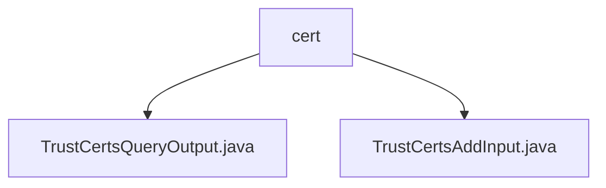

# 基础信息

|      |      |
|------|------|
| 名称 | cert |
| 编码语言 | .java |
| 代码路径 | WeFe/manager/manager-service/src/main/java/com/welab/wefe/manager/service/dto/cert |
| 包名 | docs.manager.manager-service.src.main.java.com.welab.wefe.manager.service.dto.cert |
| 概述说明 | TrustCertsQueryOutput类继承AbstractTimedApiOutput，包含证书ID、序列号、内容等字段及getter/setter。TrustCertsAddInput类继承BaseInput，含必填和可选字段，用于证书添加操作。 |

# 说明

## 概述  
该模块核心职责是管理信任证书的生命周期，包括证书查询和添加操作。接口规范遵循标准DTO模式，提供证书基础信息（如ID、序列号、内容）和层级关系（父证书ID、CA/根标识）的读写能力。关键数据结构包含证书实体属性（例如issuerOrg/subjectOrg）和验证标记（isCaCert/isRootCert）。外部依赖仅为Java基础注解（如@Check）。例如TrustCertsQueryOutput支持时间戳继承，TrustCertsAddInput实现必填校验。

## 主要业务场景  
模块支持证书全流程管理，类似PKI体系的轻量级实现。业务流程涵盖证书注册（必填字段校验）和查询（层级关系解析）。交互模式采用标准输入输出DTO，例如添加时强制校验memberId和certContent。典型应用包括CA证书链维护，通过pCertId字段构建树形结构。API类型聚焦CRUD操作，如TrustCertsAddInput对应创建场景。

### 包内部结构视图

该流程图展示了manager-service项目中cert目录下的两个DTO文件：TrustCertsQueryOutput.java和TrustCertsAddInput.java。这两个文件都位于cert目录下，属于同一层级，用于处理证书相关的数据传输操作。图中清晰地呈现了文件与目录之间的从属关系，符合Java项目标准目录结构。

# 文件列表

| 名称   | 类型  | 说明 |
|-------|------|-------------|
| [TrustCertsQueryOutput.java](TrustCertsQueryOutput.md) | file | TrustCertsQueryOutput类继承AbstractTimedApiOutput，包含证书ID、序列号、内容、父证书ID、颁发者和主题信息及CA/根证书标识。 |
| [TrustCertsAddInput.java](TrustCertsAddInput.md) | file | TrustCertsAddInput类继承BaseInput，包含必填字段memberId、serialNumber、certContent、pCertId、isCaCert、isRootCert，以及可选字段issuerOrg、issuerCn、subjectOrg、subjectCn。 |

