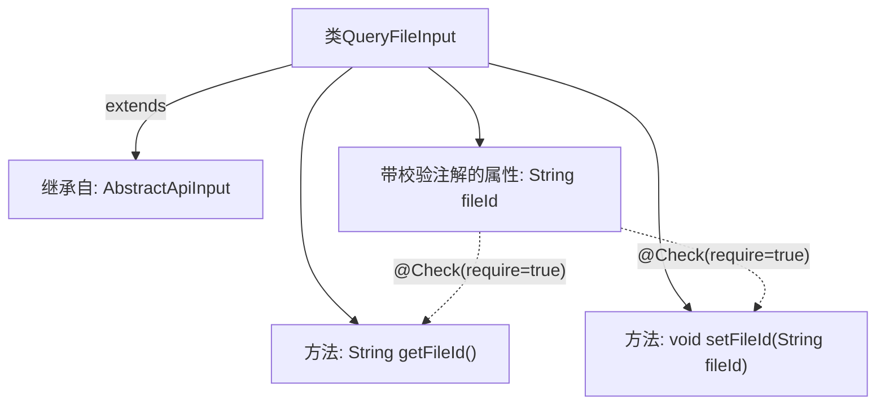

# 基础信息

|      |      |
|------|------|
| 名称 | QueryFileInput |
| 编码语言 | .java |
| 代码路径 | WeFe/manager/manager-service/src/main/java/com/welab/wefe/manager/service/dto/common/QueryFileInput.java |
| 包名 | com.welab.wefe.manager.service.dto.common |
| 依赖项 | ['com.welab.wefe.common.fieldvalidate.annotation.Check', 'com.welab.wefe.common.web.dto.AbstractApiInput'] |
| 概述说明 | QueryFileInput类继承AbstractApiInput，包含必须的fileId字段及其getter和setter方法。 |

# 说明

这段代码定义了一个名为QueryFileInput的Java类，继承自AbstractApiInput类。该类包含一个私有字符串属性fileId，并通过注解@Check标记该属性为必填项。提供了getFileId和setFileId两个公共方法用于获取和设置fileId属性的值。这个类主要用于处理文件查询的输入参数。

# 类列表 Class Summary

| 名称   | 类型  | 说明 |
|-------|------|-------------|
| QueryFileInput | class | QueryFileInput类继承AbstractApiInput，包含必须的fileId字段及其getter和setter方法。 |


## 类 QueryFileInput

|      |      |
|------|------|
| 访问范围 | public |
| 类型 | class |
| 名称 | QueryFileInput |
| 说明 | QueryFileInput类继承AbstractApiInput，包含必须的fileId字段及其getter和setter方法。 |


### UML类图

```mermaid
classDiagram
    class AbstractApiInput {
        <<Abstract>>
    }
    class QueryFileInput {
        -String fileId
        +String getFileId()
        +void setFileId(String fileId)
    }
    AbstractApiInput <|-- QueryFileInput // 继承关系
```

这段类图展示了QueryFileInput类继承自抽象类AbstractApiInput的结构。QueryFileInput包含一个私有字符串属性fileId（带有@Check校验注解），以及对应的公有getter/setter方法。通过<|--箭头明确表示了继承关系，符合面向对象设计中子类扩展父类的模式。类图清晰地反映了代码中定义的核心数据结构和层级关系。


### 内部方法调用关系图



这段代码展示了一个继承自AbstractApiInput的QueryFileInput类，核心功能是管理带校验的文件ID属性。类中包含一个必须非空的fileId字段（通过@Check注解强制校验），以及标准的getter/setter方法。流程图清晰呈现了继承关系、属性校验与方法调用之间的关联，体现了Java Bean的典型设计模式。

### 字段列表 Field List

| 名称  | 类型  | 说明 |
|-------|-------|------|
| fileId | String | 代码片段定义了一个私有字符串变量fileId，并标注了必填检查注解@Check(require = true)。 |

### 方法列表

| 名称  | 类型  | 说明 |
|-------|-------|------|
| getFileId | String | 这是一个Java方法，返回字符串类型的fileId变量值。 |
| setFileId | void | 方法setFileId用于设置文件ID，将传入的fileId赋值给当前对象的fileId属性。 |


